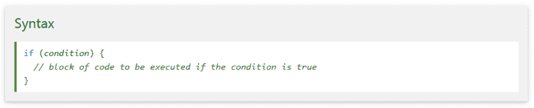
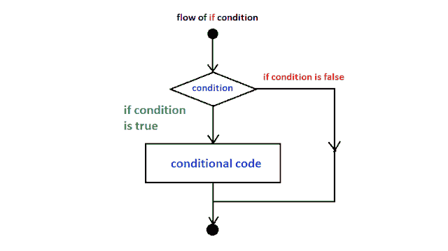
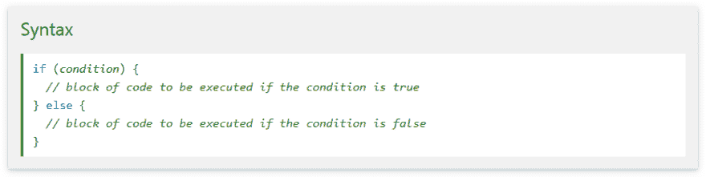
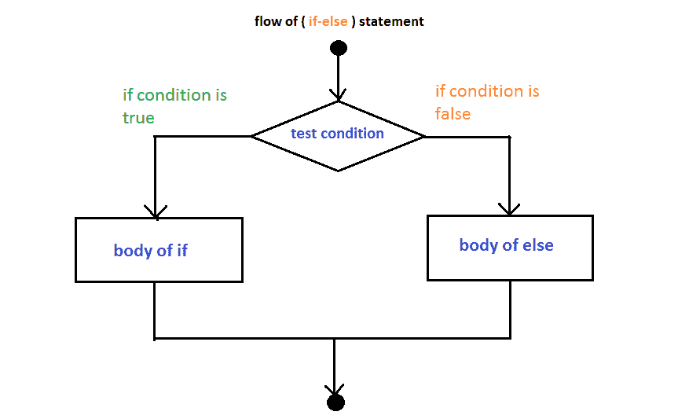
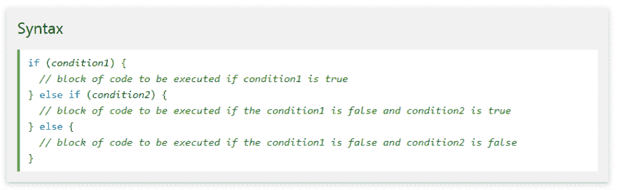
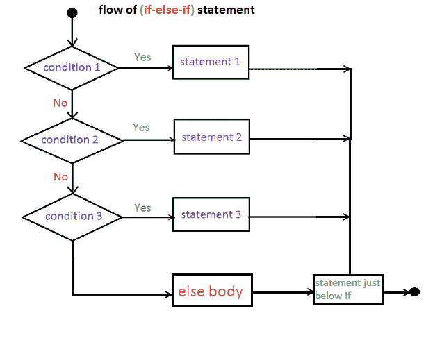
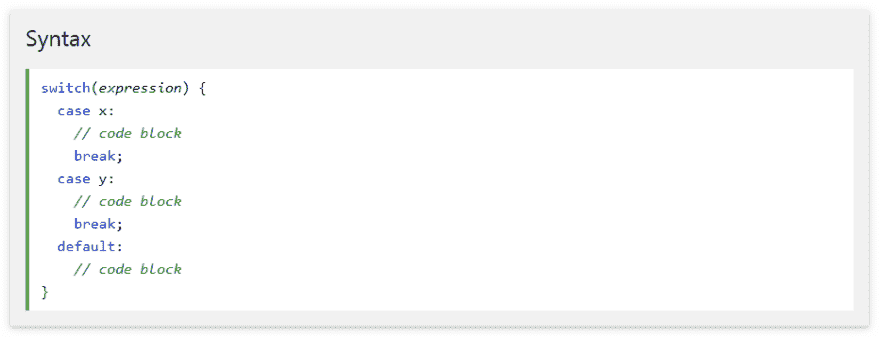

# 第 7 课:Java 控制语句(第 1 部分) :

> 原文：<https://dev.to/hamid842/lesson-7-java-control-statements-part-1-681>

一个程序通常从上到下执行，除非我们使用控制语句，我们可以根据逻辑和值控制程序的执行顺序。
在 Java 中，控制语句可以分为以下三类:

## 1-选择或条件语句:

选择语句允许我们根据表达式的结果来控制程序执行的流程:

(if，if - else，if - else - if，嵌套 if - else，switch)

**if :**
if 语句是最简单的决策语句。它用于决定是否执行某个语句或语句块，即如果某个条件为真，则执行某个语句块，否则不执行。

你可以在这里尝试例子[。](https://www.w3schools.com/java/java_conditions.asp)

**if-else :**

if 语句本身告诉我们，如果条件为真，它将执行一组语句，如果条件为假，则不会执行。但是如果条件为假，我们想做别的事情呢。else 语句来了。当条件为假时，我们可以将 else 语句与 if 语句一起使用来执行代码块。
 

你可以在这里尝试例子[。](https://www.w3schools.com/java/java_conditions.asp)

**if-else-if :**

在这里，用户可以在多个选项中做出决定。if 语句自上而下执行。一旦控制 if 的条件之一为真，就执行与该 if 相关的语句，并绕过阶梯的其余部分。如果没有一个条件为真，那么将执行最后的 else 语句。

你可以在这里尝试例子[。](https://www.w3schools.com/java/java_conditions.asp)

**嵌套 if-else :**

在嵌套 if-else 中，我们可以在另一个 if 或 else if 语句中使用一个 if 语句。

**开关:**

switch 语句是多路分支语句。它定义了程序执行的多条路径。它提供了比一大串 if-else-if 语句更好的选择。
[T3】](https://res.cloudinary.com/practicaldev/image/fetch/s--yP6D0t1V--/c_limit%2Cf_auto%2Cfl_progressive%2Cq_auto%2Cw_880/https://1.bp.blogspot.com/-03UknxUZ_L0/XQ0acpwCw-I/AAAAAAAAITY/Uc_WgNCFjtweSTj4CjWrK3O9fhJbNuDkwCLcBGAs/s1600/3.png)

你可以在这里尝试例子[。](https://www.w3schools.com/java/java_switch.asp)