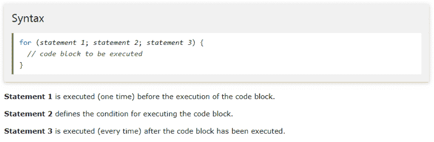
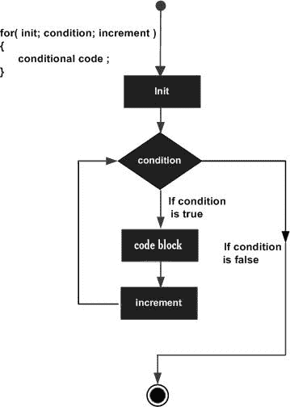
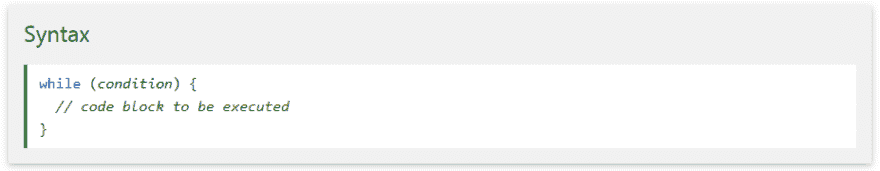
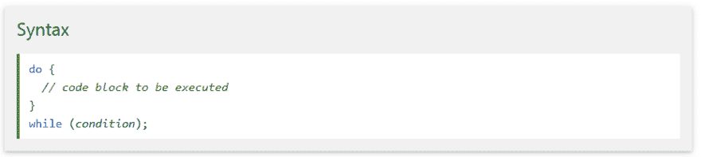
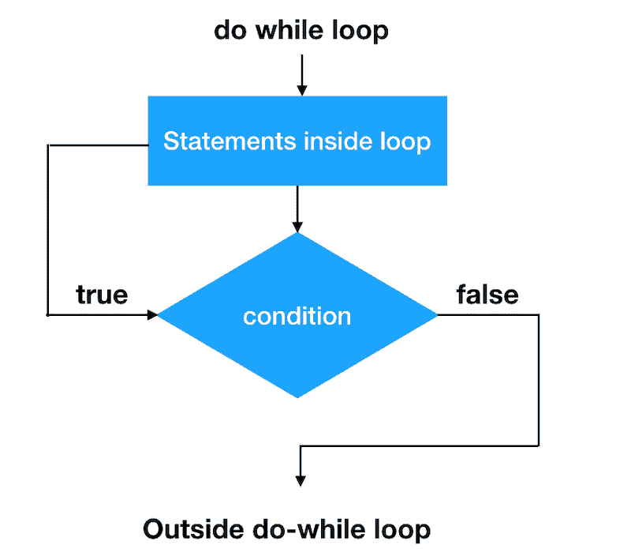

# 第 8 课:Java 控制语句(第 2 部分) :

> 原文：<https://dev.to/hamid842/lesson-8-java-control-statements-part-2-59b4>

我们在上一篇文章中讨论了“选择或条件语句”。现在，我们继续:
Java 语句中的第二类是:

# 2-迭代或循环语句:

(for，while，do-while)

在迭代语句中，相同的代码片段执行多次，直到满足特定的条件。迭代语句执行同一组指令，直到满足终止条件。
**for :**
A *for 循环*只要布尔条件求值为真，就执行一条语句(通常是一个块)。for 循环是三个元素初始化语句的组合(或者它可以是任何有效的 java 语句、布尔表达式和递增或递减语句)。

 
 
你可以试试这里的例子。

**while:**
Java 编程语言中的一个 *while 循环*语句，只要给定的条件为真，就会重复执行一条目标语句。

 
 
你可以试试这里的例子。

**do-while 循环:**
一 *do...while 循环*类似于 while 循环，除了 do...while 循环保证至少执行一次。

 
 
你可以试试这里的例子。

# 3-跳转语句:

在 Java 中*跳转语句*主要用于根据条件将控制转移到程序的另一部分。从程序员的角度来看，这些语句非常有用，因为这些语句允许改变程序的执行流程。这些语句可用于直接跳转到其他语句，跳过特定语句等等。在 Java 中，我们有以下三个跳转语句:

***1-中断(简单加标签)***
***2-继续***
***3-返回***

**break 语句:**
如果我们想跳出一个循环，那么我们使用 break 语句。如果我们在循环中使用 break 语句，那么将继续执行循环外的下一条语句。在中断之后，循环中所有剩余的语句都被跳过。break 语句可用于 while 循环、for 循环、do-while 循环以及 switch 情况。
语法:
if(条件)
{
break；
}

**continue 语句:**
continue 关键字主要用于循环。当我们不想执行某些语句时，我们使用 continue 语句来跳过那些要执行的语句。如果在程序中遇到 continue 语句，那么它将开始下一次迭代。它不会终止循环，只是跳过循环的某个部分。再次从循环的顶部开始执行。在某些方面，它类似于 break 语句。
语法:
if(条件)
{
继续；
}

**返回语句:**
返回语句是最后一条跳转语句。return 语句用于结束特定方法的执行，然后返回值。当我们在程序中使用 return 语句时，它会将程序控制发送给方法调用方。返回值的数据类型应该总是等于方法声明的返回值的数据类型。
语法:
if(条件)
{
return；
}