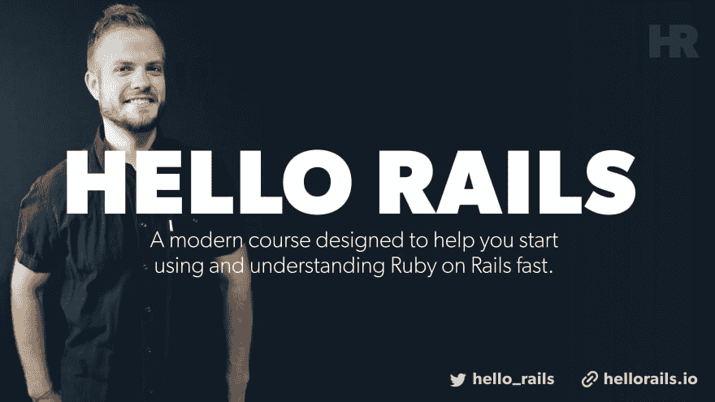

# 让我们用 Ruby on Rails 构建:扩展设计系列-确认邮件

> 原文：<https://dev.to/justalever/let-s-build-with-ruby-on-rails-extending-devise-series-confirmation-emails-egf>

继续我的“让我们用 Ruby on Rails 构建——扩展 Devise”系列，我将看看如何向给定的 Ruby on Rails 应用程序添加确认电子邮件。

[下载源代码](https://github.com/justalever/devise_confirmable_example.git)

下载我在本教程中引用的启动顺风模板(可选):

【https://github.com/justalever/kickoff\_tailwind T2】

[https://www.youtube.com/embed/D_50cO1TO0A](https://www.youtube.com/embed/D_50cO1TO0A)

在本指南中，您将学习如何安装[设计](https://github.com/plataformatec/devise)，用默认设置配置它，然后扩展它以包含一个名为`:confirmable`的特性。

总而言之，`:confirmable`向数据库中的`User`表(或您选择用来初始化 Devise 的任何模型)追加三个新字段。在那里，一旦新用户注册了应用程序，他们就会收到一封确认电子邮件。然后，该电子邮件包含一个带有唯一令牌的链接，单击该链接会向您的应用程序发出信号，要求创建新的用户帐户。这样做的好处是增加了安全性。注册的人可能会输入自己的电子邮件地址。这样，他们可以成功地访问他们的收件箱，以查看新的确认电子邮件，这是他们自己的电子邮件和应用程序内的会话所特有的。

#### 本地测试邮件

使用 Ruby on Rails 在本地测试电子邮件传递附带了一些配置工作区。我使用了一个名为 [mailcatcher.me](http://mailcatcher.me) 的 gem，它在一个单独的端口上充当一个缓冲区，拦截在你给定的 Ruby on Rails 应用程序中本地发送的任何电子邮件。Devise 也有一个`config/environments/development.rb`文件所需的配置。最终这些设置如下:

```
# config/environments/development.rb

Rails.application.configure do
  ...
  config.action_mailer.default_url_options = { host: 'localhost', port: 3000 }
  config.action_mailer.delivery_method = :smtp
  config.action_mailer.smtp_settings = { :address => "localhost", :port => 1025 }
end 
```

Enter fullscreen mode Exit fullscreen mode

Mailcacher 是一个后台运行的守护进程。安装完成后，您可以运行`$ mailcatcher`来启动并运行它。如果您没有安装它，您可以通过运行`$ gem install mailcatcher`来安装。

在配置之上，我们需要安装设计好 gem:

```
# Gemfile

gem 'devise', '~> 4.6', '>= 4.6.2' 
```

Enter fullscreen mode Exit fullscreen mode

然后运行:

```
$ bundle install 
```

Enter fullscreen mode Exit fullscreen mode

安装了 Devise 之后，我们可以运行 gem 提供的发电机

```
$ rails generate devise:install 
```

Enter fullscreen mode Exit fullscreen mode

这在`config/initializers`中创建了一个新的初始化文件。我将更改该文件中的两个选项。

```
# config/initializers/devise.rb

Devise.setup do |config|
  ...

  # ==> Mailer Configuration
  # Configure the e-mail address which will be shown in Devise::Mailer,
  # note that it will be overwritten if you use your own mailer class
  # with default "from" parameter.
  config.mailer_sender = 'andy@example.com'

  ...

  # If true, requires any email changes to be confirmed (exactly the same way as
  # initial account confirmation) to be applied. Requires additional unconfirmed_email
  # db field (see migrations). Until confirmed, new email is stored in
  # unconfirmed_email column, and copied to email column on successful confirmation.
  config.reconfirmable = false

  ...

end 
```

Enter fullscreen mode Exit fullscreen mode

有了这些保存的设置，我们就可以生成 Devise 将附加其逻辑的资源(模型)。在大多数情况下，这通常是`User`模型，但是任何模型都足够了。想想`Account`、`Admin`、`Profile`等等……

```
$ rails generate devise User 
```

Enter fullscreen mode Exit fullscreen mode

这将在`app/models/user.rb`中创建一个默认包含一些逻辑的`user.rb`文件。这个生成器还在我们的 routes 文件中创建了一个新的路由机制，供 devise 挂接。

需要注意的主要事情是这个命令在`db/migrate/`中生成的迁移文件。我的看起来如下。

```
# db/migrate/20190622200524_devise_create_users.rb

# frozen_string_literal: true

class DeviseCreateUsers < ActiveRecord::Migration[6.0]
  def change
    create_table :users do |t|
      ## Database authenticatable
      t.string :email, null: false, default: ""
      t.string :encrypted_password, null: false, default: ""

      ## Recoverable
      t.string :reset_password_token
      t.datetime :reset_password_sent_at

      ## Rememberable
      t.datetime :remember_created_at

      ## Trackable
      # t.integer :sign_in_count, default: 0, null: false
      # t.datetime :current_sign_in_at
      # t.datetime :last_sign_in_at
      # t.string :current_sign_in_ip
      # t.string :last_sign_in_ip

      ## Confirmable
      # t.string :confirmation_token
      # t.datetime :confirmed_at
      # t.datetime :confirmation_sent_at
      # t.string :unconfirmed_email # Only if using reconfirmable

      ## Lockable
      # t.integer :failed_attempts, default: 0, null: false # Only if lock strategy is :failed_attempts
      # t.string :unlock_token # Only if unlock strategy is :email or :both
      # t.datetime :locked_at

      t.timestamps null: false
    end

    add_index :users, :email, unique: true
    add_index :users, :reset_password_token, unique: true
    # add_index :users, :confirmation_token, unique: true
    # add_index :users, :unlock_token, unique: true
  end
end 
```

Enter fullscreen mode Exit fullscreen mode

请注意注释掉的声明。默认情况下，如果您刚刚创建了一个新的 gem 安装，那么就设计好这些产品。您可以简单地取消那些您需要的字段的注释，然后运行`rails db:migrate`。在我们的具体例子中，我们只需要`confirmable`字段。所以除了最后一个，我将取消所有的注释。我的文件现在看起来如下:

```
# db/migrate/20190622200524_devise_create_users.rb

# frozen_string_literal: true

class DeviseCreateUsers < ActiveRecord::Migration[6.0]
  def change
    create_table :users do |t|
      ## Database authenticatable
      t.string :email, null: false, default: ""
      t.string :encrypted_password, null: false, default: ""

      ## Recoverable
      t.string :reset_password_token
      t.datetime :reset_password_sent_at

      ## Rememberable
      t.datetime :remember_created_at

      ## Trackable
      # t.integer :sign_in_count, default: 0, null: false
      # t.datetime :current_sign_in_at
      # t.datetime :last_sign_in_at
      # t.string :current_sign_in_ip
      # t.string :last_sign_in_ip

      ## Confirmable
      t.string :confirmation_token
      t.datetime :confirmed_at
      t.datetime :confirmation_sent_at
      # t.string :unconfirmed_email # Only if using reconfirmable

      ## Lockable
      # t.integer :failed_attempts, default: 0, null: false # Only if lock strategy is :failed_attempts
      # t.string :unlock_token # Only if unlock strategy is :email or :both
      # t.datetime :locked_at

      t.timestamps null: false
    end

    add_index :users, :email, unique: true
    add_index :users, :reset_password_token, unique: true
    # add_index :users, :confirmation_token, unique: true
    # add_index :users, :unlock_token, unique: true
  end
end 
```

Enter fullscreen mode Exit fullscreen mode

确保保存该文件，然后运行:

```
$ rails db:migrate 
```

Enter fullscreen mode Exit fullscreen mode

有了这些，我们可以参考`db/`目录中的`schema.rb`文件，以了解我们的数据库当前有哪些内容:

这里是“我的”。

```
# This file is auto-generated from the current state of the database. Instead
# of editing this file, please use the migrations feature of Active Record to
# incrementally modify your database, and then regenerate this schema definition.
#
# This file is the source Rails uses to define your schema when running `rails
# db:schema:load`. When creating a new database, `rails db:schema:load` tends to
# be faster and is potentially less error prone than running all of your
# migrations from scratch. Old migrations may fail to apply correctly if those
# migrations use external dependencies or application code.
#
# It's strongly recommended that you check this file into your version control system.

ActiveRecord::Schema.define(version: 2019_06_22_200524) do

  create_table "users", force: :cascade do |t|
    t.string "email", default: "", null: false
    t.string "encrypted_password", default: "", null: false
    t.string "reset_password_token"
    t.datetime "reset_password_sent_at"
    t.datetime "remember_created_at"
    t.string "confirmation_token"
    t.datetime "confirmed_at"
    t.datetime "confirmation_sent_at"
    t.datetime "created_at", precision: 6, null: false
    t.datetime "updated_at", precision: 6, null: false
    t.index ["email"], name: "index_users_on_email", unique: true
    t.index ["reset_password_token"], name: "index_users_on_reset_password_token", unique: true
  end

end 
```

Enter fullscreen mode Exit fullscreen mode

有了这个迁移，我们现在可以挂钩到默认情况下不会出现的`users`数据库表上的`confirmation_token`、`confirmation_sent_at`和`confirmed_at`字段。

最后一个添加在你的主布局文件中。我给`app/views/layouts/application.html.erb`
加上以下内容

```
<!DOCTYPE html>
<html>
  <head>
    DeviseConfirmableExample
    <%= csrf_meta_tags %>
    <%= csp_meta_tag %>

    <%= stylesheet_link_tag 'application', media: 'all', 'data-turbolinks-track': 'reload' %>
    <%= javascript_pack_tag 'application', 'data-turbolinks-track': 'reload' %>
  </head>

  <body>
    <%= notice %>
    <%= alert %>
    <%= yield %>
  </body>
</html> 
```

Enter fullscreen mode Exit fullscreen mode

我添加了`<%= notice %>`和`<%= alert %>`行来显示我们的应用程序拥有的任何反馈设备。

### 创建认证路由

即使我们接近完成，我们仍然需要一种方法来限制用户在登录之前的一些路径。我将创建两个新的控制器，它们具有基本的索引操作和视图。这些只是为了举例，并不提供真正的动态数据，但是您可以使用我在这里使用的代码来学习如何锁定更高级的场景。

```
$ rails g controller home index
$ rails g controller dashboard index 
```

Enter fullscreen mode Exit fullscreen mode

这两个控制器背后的想法是，`home`控制器将是一个面向公众的页面，任何人都可以查看，无论他们是否登录，仪表板控制器只供登录用户使用。

#### 路由

到目前为止，我们在`config/routes.rb`内部只有基本的路由。我更喜欢在将来我们想要扩展到比`dashboard`或`home`控制器的`index`动作更多的情况下，让它更具可扩展性。这样做的时候，我已经把我的 routes 文件更新到了下面:

```
# config/routes.rb

Rails.application.routes.draw do devise_for :users
  resources :dashboard, only: [:index]
  resources :home, only: [:index]
  root to: "home#index"
end 
```

Enter fullscreen mode Exit fullscreen mode

在这里，我为`dashboard`和`home`路线定义了一个`resources`声明。如果我们将来需要的话，这是一种生成完全 RESTful 路由的简便方法。为了避免生成过多不必要的路由，我们可以传递一个`only: [:index]`选项来通知框架只为给定资源的动作创建 URL/路径帮助器。您可以通过运行`rails routes`或前往`localhost:3000/rails/info/routes`(如果您运行了`rails server`)来查看您的所有路线。

我们还创建了一个新的`root`路径，它告诉我们的应用程序哪个页面才是真正的入口点`root to: "home#index`将家庭控制器上的索引操作声明为我们的入口点。

最后,`devise_for :users`是另一个方便的方法，可以生成设计 gem 所需的所有必要的路径。

### 制作可确认的作品

我将更新我们的通用控制器来反映我们正在构建的特性。`home_controller.rb`文件将保持不变，但以这段代码为特色。

```
# app/controllers/home_controller.rb

class HomeController < ApplicationController
  def index
  end
end 
```

Enter fullscreen mode Exit fullscreen mode

除了一个例外，`dashboard_controller.rb`文件将类似于`home_controller.rb`文件。我将添加一个来自设计宝石`authenticate_user!`的动作。这对于那些访问 controller 中特定操作的未登录用户来说，起到了看门人的作用。在仪表板的例子中，我不希望任何注销的用户看到页面，所以我们可以简单地编写`before_action :autheticate_user!`。如果我们只想阻止一些动作，而不是每个动作，你可以写一些像`before_action :authenticate_user!, only:[:edit, :destroy]`这样的例子。

```
class DashboardController < ApplicationController
  before_action :authenticate_user! 

  def index
  end
end 
```

Enter fullscreen mode Exit fullscreen mode

除了我们之前修改的迁移文件，Rails 应用程序上的普通 Devise 安装并没有什么真正的改变。我们需要一种方法来连接到`confirmable`选项，告诉我们的应用程序并设计下一步该做什么。这意味着从 devise gem 继承一些控制器逻辑，并在运行时传递一些选项。

为此，我们可以从稍微修改我们的路线开始:

```
Rails.application.routes.draw do
  devise_for :users, controllers: {
    confirmations: 'confirmations'
  }
  resources :dashboard, only: [:index]
  resources :home, only: [:index]
  root to: "home#index"
end 
```

Enter fullscreen mode Exit fullscreen mode

`devise_for`方法接受相当多的选项。其中之一是控制器的散列，您可以向 gem 发送信号，表明您也有 Devise 需要使用的控制器逻辑。

因为我们正在扩展确认逻辑，所以我们可以在这里传递我们自己的`confirmations`控制器作为一个选项。这意味着 Devise 将为一个`confirmations_controller.rb`文件在`app/controllers`中寻找一个控制器。命名在这里很重要。您在路由中作为字符串传递的名称必须与`app/controllers/`中的控制器名称相匹配。

所以我们可以创建那个文件。在里面你会注意到一点不同的语法。

```
class ConfirmationsController < Devise::ConfirmationsController

  private
    def after_confirmation_path_for(resource_name, resource)
      sign_in(resource)
      dashboard_path
    end
end 
```

Enter fullscreen mode Exit fullscreen mode

我们创建的确认控制器需要从 Devise gem 继承父确认控制器。可以把这个看作是子类的子类。在类内部，我创建了一个 Devise 理解的私有方法，名为`after_confirmation_path_for`。我们可以传入 resource_name 和 resource 来获取最近确认其帐户的人的信息。如果他们创建了一个帐户，访问了他们的电子邮件，并点击了链接，以确认我们可以使用令牌找到给定的资源，并正式授予他们访问应用程序的权限。他们签到后，我们可以告诉候任者他们下一步要去哪里。我添加了`dashboard_path`作为我想带用户去的地方。

### 测试我们的工作

此时，您需要同时运行`rails server`和`mailcatcher`。假设应用程序一切正常，你可以通过前往`localhost:3000/users/sign_up`创建一个新用户。将会有一个新的表格(真的很丑)，你可以在上面提供你的电子邮件、密码和密码确认。一旦你点击注册，你应该会看到一个新的电子邮件出现在 mailcatcher。在电子邮件中，您可以访问链接来激活您的帐户。

恭喜你能走到这一步！可确认的应该运作良好。在您的生产环境中，您显然不会使用 mailcatcher，而是使用第三方电子邮件服务提供商，如邮戳、Sendgrid 等。这些配置可以添加到`config/environments/production.rb`中，就像我们对开发配置所做的那样。Ruby on Rails 使得与其他服务挂钩变得非常容易，几乎不用花时间在配置上，而是花更多的时间在重要的地方，在您的特性和产品上。

### 到目前为止的级数

*   [让我们构建:使用 Ruby on Rails——扩展 Devise 系列——添加定制字段](https://web-crunch.com/extending-devise-custom-fields)

### 无耻的塞时间

[](http://hellorails.io)

我有一门新课程叫做 [Hello Rails](https://hellorails.io) 。Hello Rails 是一门现代课程，旨在帮助您快速开始使用和理解 Ruby on Rails。如果你是 Ruby 或 Ruby on Rails 的新手，我邀请你去看看这个网站。该课程将与这些构建非常相似，但是是一个超级深入的版本，具有更现实的目标和可交付成果。[报名今天得到通知](https://hellorails.io/)！

在推特上关注 [@hello_rails](https://twitter.com/hello_rails) 和[本人@justalever](https://twitter.com/justalever) 。

帖子[延伸设计系列-确认邮件](https://web-crunch.com/extending-devise-confirmation-emails/)最先出现在[网络危机](https://web-crunch.com)上。