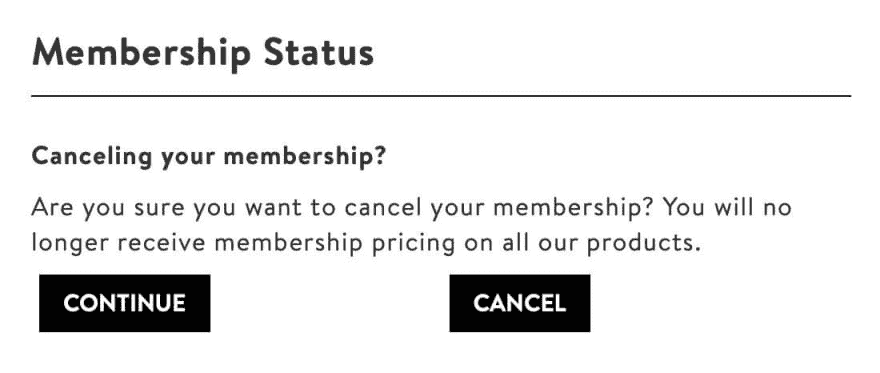
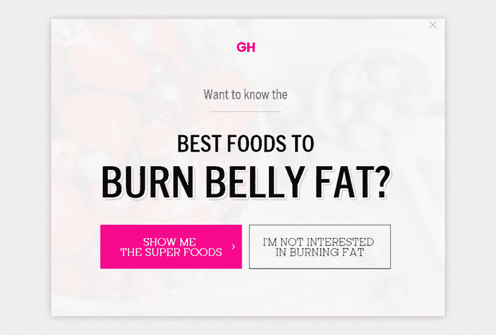
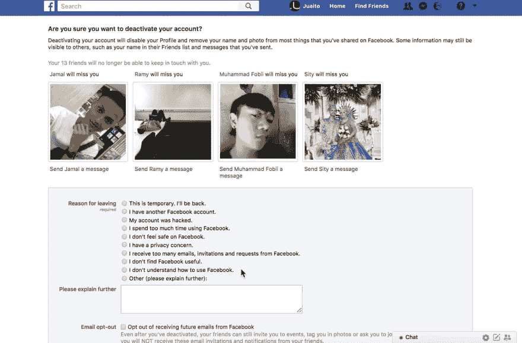

# 让我们用手电筒探索黑暗的图案

> 原文：<https://dev.to/harlessmark/let-s-explore-dark-patterns-with-flashlights-3gm5>

2016 年的某个时候，我决定创建一个 LinkedIn 账户，为我带来更多的职业机会。我注册了，给我所有的联系人发了电子邮件邀请，并开始填写所有必要的信息。我可以在网上吹嘘我的成就，而不会被称为自恋者，我心想，*太棒了！*在几个星期的时间里，我联系了左右两边的人，找到了一些强有力的、可能的线索。比预期的要好得多！所以，事实上，我决定告诉我的妻子，她也应该创造一个。

我坐在她旁边，看着她报名。她填写了自己的姓名、电子邮件地址、行业和当前职业。下一页的像素中包含了我第一次与...深色图案。这是一份清单，上面列有她曾经发送或接收过的、已经拥有 LinkedIn 账户的所有人的电子邮件。“与你的联系人联系，”该网页说。现在，当我说“每一个人”时，我指的是自从她在 2004 年 13 岁时建立电子邮件账户以来的每一个联系人。名单很长，非常长。“呃，这部分我以后再做，”她坚持道。她点击了一个变灰的“继续”按钮——在我使用互联网的这些年里，她告诉我它不应该被点击——实际上做了一些事情。“你确定？”一个弹出窗口询问。她再次点击另一个关闭窗口的灰色按钮，进入下一个屏幕。

<figure> 

<figcaption>你点击哪个按钮取消会员资格？</figcaption>

</figure>

下一页的像素中包含了我第二次接触到的...好吧，你懂了。这次是没有 LinkedIn 账户的联系人列表。“邀请你的联系人加入 LinkedIn，”页面上方用大字写道。与本页相比，上一页对清单长度的强调就相形见绌了。这是不朽的。同样，*她发送或接收过电子邮件的每一个*联系人，没有 LinkedIn 账户，都在这个页面上。名单很长，很长。“我也要跳过这个，”她明显地说。她点击了灰色的按钮，这次你可能没猜到，她什么也没做。“我现在不想做这个，”她又说。

我从她手里抢过鼠标，这就是我一整天从好变坏的地方。

我点击了所有看起来合适的方式来继续前进。*咔嚓咔嚓咔嚓*。除了勾选和取消勾选邀请人们加入 LinkedIn 的复选框之外，什么也没做。

“我不想那么做。”

“是的...我知道，我亲爱的爱人。我在努力跳出这一页。”

在一片混乱中，我点击了“全选”,它就出现了。我的好日子随着数百封电子邮件邀请函一起飞出了窗外，这些邀请函分别发给了她的朋友、同事、熟人、前朋友和前男友，她的前模特经纪人，他骗了她几千美元，她的生父在她 16 岁时把她赶出了家门，从那以后就再也没有说过话。你知道，完全错误的**他妈的**人收到这封电子邮件，这封邮件将向每个人展示她在过去几年的职业生涯。

<figure> 

<figcaption>暗格的例子。</figcaption>

</figure>

但这真的是我的错吗？当然，我做了点击，但这不是我想要它做的。在每次注册过程中，都会出现一个弹出窗口，询问我们是否确定要这样做。LinkedIn 只在我们做了它不希望我们做的事情时才会问。但有一次我点击了它喜欢的东西，在这种情况下是“全选”，它毫不犹豫地再次猜测我，并继续发送了所有这些电子邮件，没有给我确认的机会。感觉它在引导我做我不想做的事。这一点，以及变灰的按钮，都是深色图案的一个很好的例子。

2010 年 7 月 28 日，哈利·布里格诺尔在创造了[darkpatterns.org](http://darkpatterns.org)之后创造了黑暗模式，这是一种故意欺骗用户做他们可能不想做的事情的界面设计，同时也有利于相关业务。这包括使一些不清楚或难以访问，如关闭帐户或取消订阅。一些网站(我们都在看着你，脸书)甚至利用你的朋友让你内疚，从而取消你的账户！

[在这个关于黑暗模式的视频](https://www.youtube.com/watch?v=kxkrdLI6e6M)中，Nerdwriter1 表明，你认为你会关闭亚马逊账户的每个地方，实际上都不会让你看到“关闭你的账户”选项。相反，在许多页面后面，会出现一个下拉菜单，但只显示非常一般的问题。选择“登录和安全”后，会出现第二个下拉菜单，您可以在其中关闭您的帐户。终于？没有。你必须加入与亚马逊代表的聊天，他们会列出删除你的账户是个坏主意的所有理由。一旦你通过了所有这一切，他们必须进去，手动删除你的帐户。这被称为蟑螂汽车旅馆——这种设计让你很容易进入某个地方，但很难或不可能出去。

这里有一个来自 darkpattern.org 的列表，列出了你可能会遇到的不同种类:

填写表格时，你回答了一个问题，这个问题诱使你给出了一个你并不想要的答案。当快速浏览时，这个问题似乎是在问一件事，但当仔细阅读时，它完全是在问另一件事。

**潜入购物篮**
你试图购买一些东西，但在购买过程中的某个地方，该网站偷偷将一件额外的物品放入你的购物篮，通常是通过使用前一页上的选择退出单选按钮或复选框。

隐私篡改
你被骗公开分享了比你真正想分享的更多的个人信息。以脸书首席执行官马克·扎克伯格命名。

**防止价格比较**
零售商让你很难比较一件商品和另一件商品的价格，因此你无法做出明智的决定。

误导
这种设计有目的地将你的注意力集中在一件事情上，以转移你对另一件事情的注意力。

**隐性成本**
你到了结账流程的最后一步，却发现出现了一些意想不到的费用，如送货费、税等。

你开始做一件事，但是一件不同的、不受欢迎的事情发生了。

使用户产生选择某物的负罪感的行为。拒绝选项的措辞方式让用户感到羞愧而顺从。

伪装广告伪装成其他内容或导航的广告，目的是让你点击它们。

当你的免费试用服务结束时，你的信用卡在没有任何警告的情况下开始被扣费。在某些情况下，取消会员资格会变得更加困难。

**好友垃圾邮件**
该产品要求获得你的电子邮件或社交媒体权限，假装这些信息将被用于理想的结果(例如，寻找朋友)，但随后会在一条声称是你发来的消息中向你的所有联系人发送垃圾邮件。

我们已经变得如此习惯于黑暗的模式，以至于我们每天都可以看到它们，并且不会对此进行第二次思考。必须登录你的帐户才能取消订阅，用“以后提醒我”链接替换取消链接，以及违反常识设计——比如灰显按钮以阻止用户做网站不希望他们做的事情——都是常见的黑暗模式，旨在误导你做一些违背你的意图或同意的事情。作为网站开发者，我们应该把用户放在业务之前，关注这些糟糕的设计。

在我的 LinkedIn 事故之后，那天我一直处于水深火热之中。显然，这些年来，LinkedIn 和你访问的许多热门网站一样，充满了黑暗模式。不过，事实证明它确实带来了一些好的东西。我妻子的父亲实际上在几周后联系了她，他们明天要一起吃晚饭！所有生我的气都是徒劳的:)