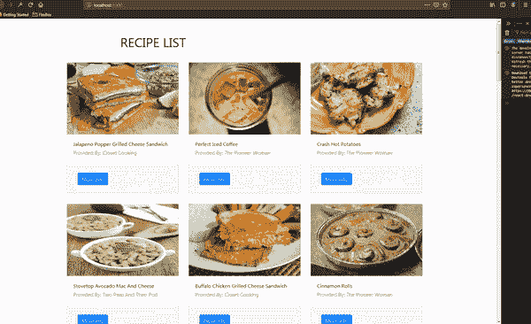
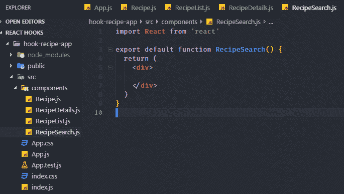

# 让我们通过构建一个食谱搜索应用程序来学习 React 钩子和上下文 API

> 原文：<https://dev.to/mongopark/let-s-learn-react-hooks-and-context-api-by-building-a-recipe-search-app-39pc>

这是一个理解`React Hooks`和`Context API`的初学者教程。实际上，这更多的是试图向我自己和感兴趣的读者解释这些概念。这将分为两部分，第一部分集中在`hooks`的基础知识。另一部分将更关注更高级的用例以及`Context API`。我们将实现搜索功能，并转换为使用`Context API`来管理状态和避免`props drilling`。

**更新** : Part 2 正在直播[这里](https://dev.to/mongopark/learn-react-hooks-and-context-api-by-building-a-recipe-search-app-2-1g3o)

## 我们要怎么学？

我们将看看用类组件和用`React Hooks`处理相同状态逻辑的一些对比。我们将构建一个食谱搜索应用程序来巩固概念，然后我们将有一瓶红酒来庆祝😃。我相信弄乱代码是最好的学习方式。

# 我们将构建的最终版本

我们将构建一个 food2fork 网站的简单克隆。这不会是一个完全成熟的版本，但我们将使用他们的 API 和前 30 名食谱。添加一些我们自己的 UI 逻辑来扰乱状态，看看我们如何用`hooks`来处理它们。

[](https://res.cloudinary.com/practicaldev/image/fetch/s--Z5mrzBUO--/c_limit%2Cf_auto%2Cfl_progressive%2Cq_66%2Cw_880/https://cdn.hashnode.com/res/hashnode/image/upload/v1561757356255/kgOo1cmfl.gif)

## 先决条件

*   React 的基础知识
*   Javascript ES6 基础[数组方法、析构等]

## 那么什么是 React 钩子呢？

首先，什么是 React Hook？来自[文档](https://reactjs.org/docs/hooks-state.html)

> **什么是钩子？**挂钩是一个特殊的功能，可以让你**【挂钩】**进入 React 功能。例如，useState 是一个钩子，它允许您向函数组件添加 React 状态。

[](https://res.cloudinary.com/practicaldev/image/fetch/s--UI8HP1fv--/c_limit%2Cf_auto%2Cfl_progressive%2Cq_auto%2Cw_880/https://cdn.hashnode.com/res/hashnode/image/upload/v1561758534907/eg-bho7_D.jpeg)

简单地说，钩子允许我们“挂钩”到特定的 React 特性。例如,`useState`顾名思义，帮助我们在 React 中使用状态特性，否则我们将无法使用它，例如在函数组件内部。我们将通过构建菜谱搜索应用程序来详细解释语法用法等。

## 设置

我们将使用 create-react-app 来引导应用程序。我用一个准系统 create react 应用程序创建了一个回购，我们可以快速上手。简单地克隆跟随。运行下面的命令:

> git clone[https://github . com/OLA John-aji boye/Blog-React-Hook-Tutorial . git](https://github.com/olajohn-ajiboye/Blog-React-Hook-Tutorial.git)
> CD Blog-React-Hook-Tutorial

回到我们将要构建的应用程序。我们将使用 food2fork API 来获取和搜索 30 个顶级食谱的列表。然而，该 API 每天只能进行有限的查询。在本教程中，我已经根据它们创建了确切的 JSON 响应。这将从这里[这里](https://api.myjson.com/bins/t7szj)提供，这样我们就不会过于频繁地访问他们的服务器。

让我们在`src`文件夹中创建一个组件文件夹来存放我们的应用程序可能拥有的不同组件。花点时间想想，将会有一个组件显示每个`Recipe`、一个`RecipeList`组件呈现食谱列表、一个`RecipeSearch`组件和一个`RecipeDetails`组件显示每个`Recipe`的附加细节。所有的组件都是功能组件，因为使用钩子是本教程的重点。

如果你做的一切都正确，你应该有一个如下所示的文件夹结构。你也可以在这里克隆回购

[](https://res.cloudinary.com/practicaldev/image/fetch/s--JNo4arcy--/c_limit%2Cf_auto%2Cfl_progressive%2Cq_auto%2Cw_880/https://cdn.hashnode.com/res/hashnode/image/upload/v1561582276567/x5RzZLgNz.png)

如果你还没有，我推荐安装的一个扩展是`ES7 React/Redux/GraphQL/React-Native snippets`。它通过允许您键入缩写来获得一些 React 片段，从而加快了 React 的开发。你可以在这里找到更多

## 所以让我们得到`Hooked`

为什么还要钩子？

[](https://res.cloudinary.com/practicaldev/image/fetch/s--U0DzNkwZ--/c_limit%2Cf_auto%2Cfl_progressive%2Cq_66%2Cw_880/https://cdn.hashnode.com/res/hashnode/image/upload/v1561588938878/yhBMIOEyV.gif)

在任何前端应用程序中，最常见的事情之一就是获取和显示数据，并为大 UX 操作显示。React 也没什么不同。**状态**的一个常见用例是存储来自 API 调用的数据。在`hooks`之前，如果你需要在你的应用中有一个任何类型的`state`，你绝对必须使用一个类组件。您还需要在`componentDidMount`生命周期内异步获取数据。对于许多人来说，这不是一个很大的问题，但是 React 团队认为它引起了组件逻辑的紧密耦合。此外，在更复杂的应用程序中，很难重用有状态逻辑。不要相信我的话，只要在这里阅读钩子的动机[就可以了](https://reactjs.org/docs/hooks-intro.html)

让我们看看我们将如何处理从我在一个经典组件中创建的 REST API 获取数据，然后再讨论我们将如何用`hooks`
处理它

```
 import React, { Component } from 'react'
import RecipeList from './components/RecipeList

export default class test extends Component {
  constructor(props) {
    super(props)
    this.state = {
      apiResponse: [],
    }
  }
  componentDidMount() {
    fetch(`https://api.myjson.com/bins/t7szj`)
      .then(data => data.json)
      .then(apiResponse => this.setState({ apiResponse }))
  }
  render() {
    return (
      <div>
          <RecipeList recipes={this.state.recipes}>
      </div>
    )
  }
} 
```

> 让我们看一下带有钩子和效果的相同代码，后面有一个解释

```
 import React, { useState, useEffect } from 'react';
import RecipeList from './components/RecipeList

function App() {
  const url = useState(`https://api.myjson.com/bins/t7szj`)
  const [recipes, setRecipes] = useState([])

  const fetchRecipe = async () => {
    const recipeData = await fetch(url)
    const { recipes } = await recipeData.json()
    setRecipes(recipes)
  }

  useEffect(() => {
    fetchRecipe()
  })

  return (
    <div className="App">
      <RecipeList recipes={recipes}>
    </div>
  );
}

export default App; 
```

有几件事情是显而易见的，我们从`react`中导入了 useState 和 useEffect。这些是暴露给我们的 API，使我们能够使用`React Hooks`。`useState`钩子接受初始状态。在上面的例子中，我们已经将它初始化为一个空数组。我们希望用来自 API 调用的数据填充数组。这相当于我们的类组件中的 below。

```
 this.state = {
      apiResponse: [],
    } 
```

此外，`useState`向我们返回一对值。它们是当前状态和更新它的函数。所以我们从使用状态返回`[currentState, setStateFunction]`。这就是我们在申请中写下`const [recipes, setRecipes] = useState([])`的原因。其中`recipes`是保存食谱数据的数组。`setRecipe`是使我们能够更新状态的函数，这相当于类组件中的`this.setState`。

以防语法看起来混乱，这些不是 **React** 特定的语法，而是普通的 ES6 Javascript。这就是所谓的解构。由于`useState`返回一对值，我们已经将其析构为一个数组。我们为它们选择的名字并不影响它们的行为，将它们命名为`[name of your state, set+name of state]`是一个简单的好习惯，因此我们有:

```
const [recipes, setRecipes] = useState([]) 
```

如果你需要一些关于析构的复习或入门，我已经在这里写了一些。

为了全面理解这里发生的事情，我们需要注意的另一个 Javascript 特性是`closures`。由于`Javascript closure`，我们可以在函数中的任何地方从`useState`访问被析构的变量。因此，在`fecthRecipe`函数内和`component`内的任何地方，我们都可以使用`setRecipe`或任何其他变量，而不必调用它`this.setRecipe`等。

> 对于本教程来说。`closures`的一个简单定义是，它让我们能够访问外部(封闭)函数的变量——作用域链，以及它们的返回值。

你可以在这里阅读更多[、在这里](https://www.codingame.com/playgrounds/6516/closures-in-javascript-for-beginners)以及在这里观看

让我们快速地将道具传递给我们的组件，并设置它们来显示食谱列表。因为这不是一个`Hook`特有的功能。我打算跳过它。你可以在这里找到最新的回购协议。我还增加了样式来加快速度。更新后的回购在[回购](https://github.com/olajohn-ajiboye/Blog-React-Hook-Tutorial)中的`third/hook-in-app.js`分支。

## 使用`useState`

此时，您的`App.js`应该如下所示，我们已经简单地将状态中的食谱数组作为`recipes props`传递给了`RecipeList`组件。注意，我还用`useState`添加了一个加载状态，并在数据完全取出后将其设置回`false`。这是使用多个状态的第一个例子。

```
 import React, { useState, useEffect } from 'react';
import RecipeList from './components/RecipeList'
import RecipeDetails from './components/RecipeDetails'

function App() {
  const url = `https://api.myjson.com/bins/t7szj`
  const [recipes, setRecipes] = useState([])
  const [loading, setLoading] = useState(true)
  const fetchRecipe = async () => {
    const recipeData = await fetch(url)
    const { recipes } = await recipeData.json()
    setRecipes(recipes)
    setLoading(false)
  }
  useEffect(() => {
    fetchRecipe()
  })
  return (
    <div>
      {loading ? <h1 className="text-center">...loading</h1> : <RecipeList recipes={recipes} />}
      <RecipeDetails></RecipeDetails>
    </div>
  );
}

export default App; 
```

接下来，让我们转到`RecipeList`组件，看看我们有什么。

在这里，我们简单地接收了从父`App`组件作为`prop`传递的`recipes`，并立即`destructured`它——见第 **5** 行。然后我们对它进行映射，将每个食谱作为`prop`传递给`Recipe`组件。这里没什么特别有趣的。

```
import React from 'react'
import Recipe from './Recipe'
import RecipeSearch from './RecipeSearch'

export default function RecipeList({ recipes }) {

  return (
    <>
      <RecipeSearch></RecipeSearch>
      <div className="container my-5">
        <div className="row">
          <div className="col-10-mx-auto  col-md-6 text-center text-uppercase mb-3">
            <h1 className="text-slaned text-center">Recipe List</h1>
          </div>
        </div>
        <div className="row">
          {recipes.map(recipe => {
            return <Recipe key={recipe.recipe_id} recipe={recipe} />
          })}
        </div>
      </div>
    </>
  )
} 
```

## 现在到了有趣的部分。

在`Recipe`组件内部，我添加了一些简单到足以完全理解的人为`states`。我们将尝试一行一行地进行，试图理解我们正在做什么，以及我们如何用`useState hook`处理有状态逻辑。在您的`Recipe`组件中应该有下面的内容。

```
import React, { useState } from 'react'

export default function Recipe({ recipe }) {
  const { image_url, publisher, title, recipe_id } = recipe
  const [showInfo, setShowInfo] = useState(false)
  const [recipeDetails, setRecipeDetails] = useState([])
  const { ingredients, social_rank } = recipeDetails

  const handleShowInfo = async (e) => {
    const { id } = e.target.dataset
    const response = await fetch(`https://www.food2fork.com/api/get?key=7cdab426afc366070dab735500555521&rId=${id}`)
    const { recipe } = await response.json()
    setRecipeDetails(recipe)
    setShowInfo(!showInfo)
  }
  return (
    <>
      <div className="col-10 mx-auto col-md-6 col-lg-4 my-3">
        <div className="card">
          
          <div className="card-body text-capitalize">
            <h6>{title}</h6>
            <h6 className="text-warning">
              Provided by: {publisher}
            </h6>
          </div>
          <div className="card-footer">
            <button type="button" style={{ margin: `13px` }} className="btn btn-primary text-center" data-id={recipe_id} onClick={handleShowInfo}>More Info</button>
            {showInfo &&
              <button key={recipe_id} type="button" style={{ margin: `13px` }} className="btn btn-success text-center font-weight-bold" >{social_rank}</button>}
            {showInfo ?
              ingredients.map((i, index) => {
                return <ul key={index} className="list-group">
                  <li className="list-group-item" >{i}</li>
                </ul>
              })
              : null}
          </div>
        </div>
      </div>
    </>
  )
} 
```

我们来理解一下上面的代码。像以前一样，我们从它的父组件`RecipeList`接收了`recipe`作为`prop`，然后我们立即在函数参数中对它进行了析构。然后我们继续进一步从`recipe`对象中析构我们打算使用的部分。我知道`recipe`对象包含什么，因为我测试过 API，所以这不是什么魔术。这相当于下面的

```
export default function Recipe(props) {
    const recipe = this.props.recipe
    const { image_url, publisher, title, recipe_id } = recipe

} 
```

现在到一些有用的状态。如果你检查了申请。你会意识到，当我们点击**更多**细节按钮时，我们会得到与该食谱相关的额外信息，特别是`list of ingredient`和`social rating`。看一眼顶部的 gif 图，复习一下。所以我们需要某种状态来处理期望的用户交互。

想一想，我们需要一种方法来切换是否应该显示更多信息。我们还需要一种方法来获取特定食谱的信息。期望的结果将被存储在某种状态中。维奥拉，我们已经确认了至少两个州。因此，在我们的应用程序中，我们有一个`showInfo`和一个`recipeDetails`状态。

有了这些信息，让我们使用`useState Hook`来处理它。

*   首先，我们声明`showInfo`状态和函数来设置 showInfo `setShowInfo`(相当于`this.SetState`)。我们将该值设置为`false`
*   其次，我们声明了`recipeDetails`和`setRecipeDetails`。我们将值设置为一个空数组`[]`。

这很简单，我们已经建立了初始状态。并准备用`setShowInfo`和`setRecipeDetails`处理状态变化。

移至`handleShowInfo`功能。这是一个`async`函数，主要帮助获取数据。以及处理状态变化以显示或不显示信息。让我们一行一行地把它拆开。
因为我们打算通过点击按钮来调用`handleShowInfo`，所以我们可以访问事件对象。在按钮内部，我们将`recipe_id`设置为`data-attribute`。这使我们能够抓取特定配方的`id`。在`handleShowInfo,`中，我们通过从`event.target`属性中提取出`id`来获得它。因为我们需要获得额外的信息，所以需要用`id`发出一个`HTTP`请求。这就是我们下一步要做的，等待回应。然后，我们将该值转换为一个`json`并将该值存储在`const recipe`中。

> * *注意:** 您可能需要从 [food2fork](https://www.food2fork.com/) 获取 API 密匙。当前键可能会超出限制。

我们作为响应得到的`recipe`是在`setRecipeDetails`中的槽，作为`recipeDetails`的更新器。此时，我们已经简单地将`recipeDetails`的状态设置为数组响应变量`recipe`。这相当于

```
this.setState{
recipedDetails: recipe
} 
```

另一件事是，我们将`showInfo`的值设置为它原来的相反值。这就是每当点击按钮时产生切换效果的原因。这相当于。

```
this.setState{
showInfo: !showInfo
} 
```

就这样，在返回的`jsx`中，我们根据按钮被点击时`showInfo`的状态有条件地呈现信息。此外，我们还映射了一系列配料，将它们显示为附加信息。

这是对`hooks`的最基本介绍的结束，也许是一种过度简化。在本系列的下一次迭代中，我们将更详细地检查钩子，然后学习`Context API`。

希望你喜欢这个介绍。欢迎反馈。敬请关注下一次更新，很快再见。谢谢大家！

[](https://res.cloudinary.com/practicaldev/image/fetch/s--C8axBK0H--/c_limit%2Cf_auto%2Cfl_progressive%2Cq_auto%2Cw_880/https://cdn.hashnode.com/res/hashnode/image/upload/v1561763819140/b8txZnUyU.jpeg)