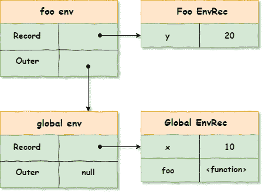
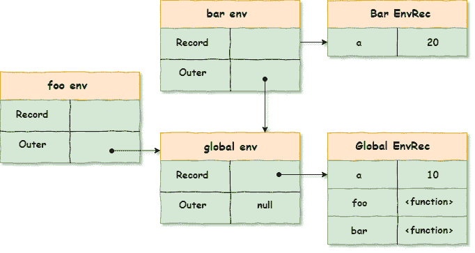
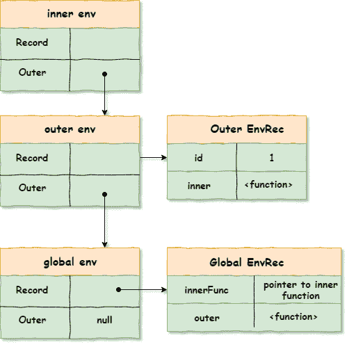

# 词汇环境——理解闭包的隐藏部分

> 原文：<https://dev.to/aman_singh/lexical-environment-the-hidden-part-to-understand-closures-4cc6>

当你刚接触 JavaScript 世界时，闭包可能是一个令人畏惧的概念。搜索互联网会给你很多关于什么是*关闭*的定义。但是我觉得这些定义大多是模糊的，不能解释它们存在的根本原因。

今天，我们将试图揭开这些概念的神秘面纱，它们是 ECMAScript 262 规范的一部分，包括 t 2 执行、T4 上下文、词汇环境和标识符解析。此外，我们将了解到由于这些机制，ECMAScript 中的所有*函数*都是*闭包*。

我将首先解释术语，然后向您展示一些代码示例，解释所有这些部分如何协同工作。这将有助于巩固你的理解。

## 执行上下文

每当 JavaScript 解释器要执行我们编写的函数或脚本时，它都会创建一个新的上下文。每个脚本/代码都从一个称为全局执行上下文的执行上下文开始。并且每次我们调用一个函数，一个新的执行上下文被创建并被放在执行堆栈的顶部。当您调用嵌套函数时，会遵循相同的模式，该嵌套函数会调用另一个嵌套函数:

[](https://res.cloudinary.com/practicaldev/image/fetch/s--pPo4hdy9--/c_limit%2Cf_auto%2Cfl_progressive%2Cq_auto%2Cw_880/https://thepracticaldev.s3.amazonaws.com/i/ttxfknmndl6hozijk0gj.png)

让我们看看如上图所示执行我们的代码时会发生什么:

*   全局执行上下文被创建并放置在执行堆栈的底部。
*   当 bar 被调用时，一个新的 bar 执行上下文被创建，并被置于全局执行上下文之上。
*   当 bar 调用嵌套函数 foo 时，会创建一个新的 foo 执行上下文，并将其置于 bar 执行上下文之上。
*   当 foo 返回时，它的上下文被弹出堆栈，流程返回到 bar 上下文。
*   一旦 bar 执行完成，流程返回到全局上下文，最后清空堆栈。

执行堆栈以 LIFO 数据结构的方式工作。在执行下面的上下文之前，它等待最上面的执行上下文返回。

从概念上讲，执行上下文的结构如下:

```
 // Execution context in ES5
ExecutionContext = {
  ThisBinding: <this value>,
  VariableEnvironment: { ... },
  LexicalEnvironment: { ... }
} 
```

如果结构看起来吓人，也不要担心。我们很快就会看到这些组件。需要记住的关键点是，每次调用执行上下文都有两个阶段:**创建阶段**和**执行阶段**。创建阶段是指上下文已创建但尚未调用的阶段。

在*创作*阶段会发生一些事情:

*   **VariableEnvironment** 组件用于变量、自变量和函数声明的初始存储。var 声明的变量用 undefined 值初始化。
*   确定这个的值*。*
*   词汇环境只是现阶段可变环境的翻版。

在*执行*阶段:

*   赋值。
*   词汇环境用于解析绑定。

现在，让我们试着理解什么是词汇环境。

## 词汇环境

根据 ECMAScript 规范 262 (8.1):

> 词法环境是一种规范类型，用于根据 ECMAScript 代码的词法嵌套结构定义[标识符](https://tc39.github.io/ecma262/#prod-Identifier)与特定变量和函数的关联。

这里让我们试着简化一些事情。一个词法环境由两个主要部分组成:一个是**环境**记录，另一个是对外部(父)词法环境
的**引用**

```
var x = 10;

function foo(){
  var y = 20;
 console.log(x+y); // 30
}

// Environment technically consists of two main components:
// environmentRecord, and a reference to the outer environment

// Environment of the global context
globalEnvironment = {
  environmentRecord: {
    // built-ins
    // our bindings:
    x: 10
  },
  outer: null // no parent environment
};

// Environment of the "foo" function
fooEnvironment = {
  environmentRecord: {
    y: 20
  },

  outer: globalEnvironment
}; 
```

从视觉上看，它会是这样的:

[](https://res.cloudinary.com/practicaldev/image/fetch/s--VCv-xygg--/c_limit%2Cf_auto%2Cfl_progressive%2Cq_auto%2Cw_880/https://thepracticaldev.s3.amazonaws.com/i/drbm1oooovq9apv5fyn3.png)

正如您所看到的，当试图在 foo 上下文中解析标识符" *y* "时，外部环境(全局)被触及。这个过程称为标识符解析，发生在运行的执行上下文中。

现在，有了这些环境知识，让我们回到执行上下文的结构，看看那里发生了什么:

*   **VariableEnvironment** :其 *environmentRecord* 用于变量、自变量和函数声明的初始存储，稍后在进入上下文激活阶段时填充。

```
function foo(a) {
  var b = 20;
}
foo(10);

// The VariableEnvironment component of the foo function
//context at creation stage
fooContext.VariableEnvironment = {
  environmentRecord: {
    arguments: { 0: 10, length: 1, callee: foo },
    a: 10,
    b: undefined
  },
  outer: globalEnvironment
};

// After the execution stage, the VE envRec
// table is filled in with the value
fooContext.VariableEnvironment = {
  environmentRecord: {
    arguments: { 0: 10, length: 1, callee: foo },
    a: 10,
    b: 20
  },
  outer: globalEnvironment
}; 
```

*   最初，它只是可变环境的一个副本。在运行上下文中，它用于确定上下文中出现的标识符的绑定。

*VE* 和 *LE* 本质上都是词法环境，也就是说，两者都静态地(在创建阶段)捕获在上下文中创建的内部函数的外部绑定。这种机制导致了闭包。

> 静态捕获内部函数的外部绑定会导致闭包的形成。

## 标识符解析又名范围链查找

在理解闭包之前，让我们理解范围链是如何在我们的执行上下文中创建的。正如我们前面看到的，每个执行上下文都有用于标识符解析的*词汇环境*。上下文的所有本地绑定都存储在环境记录表中。如果在当前环境记录中没有解析标识符，则解析过程将继续到外部(父)环境记录表。这种模式将持续到标识符被解析。如果没有找到，抛出一个*引用错误*。

这与原型查找链非常相似。现在，这里要记住的关键是*词汇环境*在上下文创建阶段(静态地)捕获外部绑定**，并在运行上下文(执行阶段)中使用。**

## 关闭

正如我们在上一节中看到的，在函数创建阶段，在内部上下文的*词汇环境*中静态保存外部绑定会导致闭包，而不管函数是否会在以后被激活。让我们看一个例子:

### 例 1:

```
var a = 10;
function foo(){
  console.log(a);
};
function bar(){
  var a = 20;
  foo();
};
bar(); // will print "10" 
```

foo 的*词汇环境*在创建时捕获绑定“ *a* ，为 10。因此，当稍后调用 *foo* 时(在执行阶段)， *a* 标识符被解析为值 *10* 而不是 *20* 。

从概念上来说，标识符解析过程看起来会像这样:

```
// check for binding "a" in the env record of "foo"
-- foo.[[LexicalEnvironment]].[[Record]] --> not found

// if not found, check for its outer environment

--- global[[LexicalEnvironment]][[Record]] --> found 10
// resolve the identifier with a value of 1 
```

[](https://res.cloudinary.com/practicaldev/image/fetch/s--mOI8BS2G--/c_limit%2Cf_auto%2Cfl_progressive%2Cq_auto%2Cw_880/https://thepracticaldev.s3.amazonaws.com/i/dhz0iwu01xecfftd3dj3.png)

### 例 2

```
function outer() {
 let id = 1;

 // creating a function would statically captures
 // the value of 'id' here
 return function inner(){
  console.log(id);
  }
};

const innerFunc = outer();
innerFunc(); // prints 1; 
```

当*外部*函数返回时，其执行上下文从执行堆栈中弹出。但是当我们稍后调用 *innerFunc()* 时，它仍然能够打印出正确的值，因为内部函数的*词汇环境*在它被创建时静态捕获了其外部(父)环境的" *id* "绑定。

```
// check for binding "id" in the env record of "inner"
-- inner.[[LexicalEnvironment]].[[Record]] --> not found
// if not found, check for its outer environment (outer)
--- outer[[LexicalEnvironment]][[Record]] --> found 1
// resolve the identifier with a value of 1 
```

[](https://res.cloudinary.com/practicaldev/image/fetch/s--OyAS6Fiz--/c_limit%2Cf_auto%2Cfl_progressive%2Cq_auto%2Cw_880/https://thepracticaldev.s3.amazonaws.com/i/b9sleb9ywpegmziv9oxb.png)

* * *

## 结论

*   执行上下文堆栈遵循 **LIFO** 数据结构。
*   我们的代码/脚本在一个全局环境中执行。
*   对函数的调用创建了一个新的执行上下文。如果它有一个嵌套的函数调用，就会创建一个新的上下文，并放在它的父上下文之上。当函数完成执行时，它从堆栈中弹出，流程返回到堆栈中下面的上下文。
*   词汇环境有两个主要组成部分:**环境记录**和**引用**外部环境。
*   **VariableEnvironment** 和 **LexicalEnvironment** 都静态地捕获了在上下文中创建的内部函数的外部绑定。所有在**创建**阶段的函数都静态地(词汇上)捕获它们的父环境的外部绑定。这允许嵌套函数访问外部绑定，即使父上下文已从执行堆栈中清除。这种机制是 JavaScript 中闭包的基础。

我希望这篇文章读起来有趣，不要让人不知所措。如果你喜欢这篇文章，几个❤️肯定会让我笑。快乐编码😊。