# 线性回归使用梯度下降初学者-直觉，数学和代码

> 原文：<https://dev.to/devkhadka/linear-regression-gradient-descent-intuition-math-and-code-586e>

# 线性回归使用梯度下降适合初学者——直觉、数学和代码

在这篇博客中，我们将首先尝试直观地理解线性回归和梯度下降，然后我们将看到算法背后的数学，然后用 python 做一个基本的实现。本博客的结构如下

*   我们将设置一个使用线性回归的假设问题。
*   我们将逐渐发展对算法每一步的直觉。我们将回答为什么我们使用这个步骤以及它有什么作用。
*   然后我们会看看每一步背后的数学，并用数学表达式来表示
*   我们将使用 python 导出的数学表达式来实现该算法。

## 先决条件

即使你没有任何先验知识，你也可以对使用梯度下降的线性回归的工作原理有一些直觉，但是如果你知道就更好了

*   微积分中导数的一些概念
*   矩阵乘法如何工作
*   基本的 python 编程知识

## 问题设置

让我们假设一个实验，在这个实验中，农业科学的学生多年来从不同的农场/温室收集了一些数据。收集的数据结构如下

我们想做的是在给定平均温度和土壤中平均亚硝酸盐的情况下，预测不同农场/温室的收成。为此，我们基于对数据的初步分析做出了一些假设
温度和土壤中平均亚硝酸盐的关系与产量呈线性关系

为简单起见，我们还假设其他因素，如土壤中的水分、光照等。要么不影响产量，要么在所有农场中保持相当相似

让我们将平均温度(C)表示为 x <sub>1</sub> 土壤中的平均亚硝酸盐(ppm)表示为 x <sub>2</sub> 和收获产量(kg/sq。m)为 y
那么基于上述假设，我们可以说存在一个线性方程

[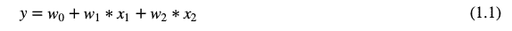](https://res.cloudinary.com/practicaldev/image/fetch/s--eUl_lawJ--/c_limit%2Cf_auto%2Cfl_progressive%2Cq_auto%2Cw_880/https://thepracticaldev.s3.amazonaws.com/i/i5aeevclaruzdyxilv3c.png)

这将很好地描述我们的自变量和因变量 x <sub>1</sub> ，x <sub>2</sub> 和 y 之间的关系。这种关系也称为假设方程。我们也称之为模型。
其中 w <sub>0</sub> 是一个偏差项，w <sub>1</sub> 和 w <sub>2</sub> 分别是 x <sub>1</sub> 和 x <sub>2</sub> 的权重
现在我们的目标是找到 w <sub>0</sub> ，w <sub>1</sub> 和 w <sub>2</sub> 的值，它们将最好地描述这种关系

## 成本函数

现在让我们找到衡量模型有多好的方法。一个直接的方法是测量模型在预测中的误差。比方说

[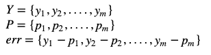](https://res.cloudinary.com/practicaldev/image/fetch/s--dZStHBB_--/c_limit%2Cf_auto%2Cfl_progressive%2Cq_auto%2Cw_880/https://thepracticaldev.s3.amazonaws.com/i/24ckl9bzdc8cp7xyt41h.png)

**其中**
**Y** 是我们示例中已知数据的目标值
**P** 是相应的预测值
**err** 是每次预测中产生的误差

这里 err 是数组值，我们需要一个单一的数值来比较哪个模型更好。

我们需要将误差值组合起来给出一个单一的值，直接求和或平均是行不通的，因为正负误差会相互抵消。

所以我们取个体误差的平方的平均值。我们取平均值，因为我们不希望该指标依赖于训练数据的项目数量。这个值称为均方误差(MSE)，这是我们需要最小化的成本函数。

[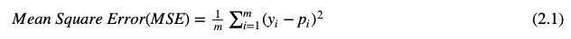](https://res.cloudinary.com/practicaldev/image/fetch/s--r4fxHK4z--/c_limit%2Cf_auto%2Cfl_progressive%2Cq_auto%2Cw_880/https://thepracticaldev.s3.amazonaws.com/i/2y19pl00vp7aqycj1y4q.png)

用我们的假设函数替换上述等式中的 p <sub>i</sub> ,我们得到

[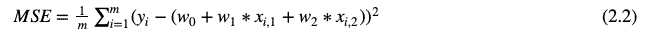](https://res.cloudinary.com/practicaldev/image/fetch/s--sowqKSIl--/c_limit%2Cf_auto%2Cfl_progressive%2Cq_auto%2Cw_880/https://thepracticaldev.s3.amazonaws.com/i/jjzqvgml1ijt8yrocuog.png)

我们添加了下标 I 来表示第 i <sup>行数据。因此，x <sub>(i，1)</sub> 意味着训练数据的第 i <sup>行</sup>的第一个特征
显然，另一个有效的成本函数将是个体误差的绝对值的平均值，也称为平均绝对误差(MAE ),但是由于其简单性，我们现在将使用 MSE。</sup>

## 寻找最优模型(偏差和权重)

现在我们得到了上面等式(2.2)中的成本函数，让我们仔细看看它

*   MSE=MSE(w <sub>0</sub> ，w <sub>1</sub> ，w <sub>2</sub> )是三个变量 w <sub>0</sub> ，w <sub>1</sub> ，w <sub>2</sub> 为未知值的方程。而 x 和 y 是来自训练数据的常数
*   我们想要找到 w <sub>0</sub> ，w <sub>1</sub> 和 w <sub>2</sub> ，它们将给出 MSE 的最小值

我们会怎么做？

> 旁注有一个直接的方法，用微积分来做，需要找到函数的偏导数，并把它们等同于？零。在导数连续的函数的最低点，正切将等于零(即在这一点正切从正变到负，反之亦然)。然后通过解方程组求变量值。但是由于以下原因，这种方法并不总是实用的
> 
> *   对于不同类型的方程，过程将是不同的
> *   如果成本函数非常复杂，那么很难找到符号偏导数或求解偏导数方程

## 渐变下降

有一个通用的算法来最小化任何函数(* *函数必须是凸的，否则它只会找到局部极小值)，称为梯度下降。我们可以将梯度下降算法总结为

*   选择任意一点，比如说 W <sub>a</sub> ，即 w <sub>0</sub> ，w <sub>1</sub> 和 w <sub>2</sub> 的任意值
*   找出 w <sub>0</sub> 、w <sub>1</sub> 和 w <sub>2</sub> 的小变化，这将导致 MSE 的最快减少/下降。
*   为了找到小的变化，我们将分别找到 w <sub>0</sub> ，w <sub>1</sub> 和 w <sub>2</sub> 方向的 MSE 变化率，这些被称为偏导数。每个方向上变化率的组合矢量称为梯度。然后我们将梯度乘以一个小数字。

[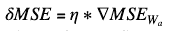](https://res.cloudinary.com/practicaldev/image/fetch/s--tg-Dafha--/c_limit%2Cf_auto%2Cfl_progressive%2Cq_auto%2Cw_880/https://thepracticaldev.s3.amazonaws.com/i/gu3gzvdopvwh3tf3dgfl.png)

*   其中η是小步长，∇MSE 是点 W <sub>a</sub> 处 MSE 的梯度。∇MSE 代表 MSE 在点 W <sub>a</sub> 变化最快的方向，其大小给出了该方向上成本的变化率。
*   现在用下面的等式找到新的点

[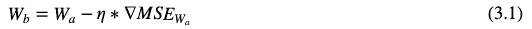](https://res.cloudinary.com/practicaldev/image/fetch/s--5E27pwLM--/c_limit%2Cf_auto%2Cfl_progressive%2Cq_auto%2Cw_880/https://thepracticaldev.s3.amazonaws.com/i/0m55mg2isa0664o4ga1l.png)

其将具有较低的 MSE 值。然后用 W <sub>b</sub> 替换 W <sub>a</sub> ，从步骤 2 开始重复指定次数，或者直到每一步中的 MSE 变化变得非常小

### 思想实验

为了直观地理解算法，我们来做一个思维实验。假设你正在一个温度场中操作一个纳米机器人(温度在三维空间中变化，并且是位置的函数),你的目标是让机器人尽可能快地达到最低温度，否则你有损坏它的危险。

你可以向机器人询问其当前位置的温度，并在三维空间中向任意方向移动机器人，你将如何引导机器人达到最低温度？

**一些注意事项**

*   这里温度类似于成本，机器人的位置类似于点 w <sub>0</sub> ，w <sub>1</sub> ，w <sub>2</sub> 你的目标是找到成本最低的点。
*   假设 w <sub>0</sub> ，w_1 和 w <sub>2</sub> 代表左右、上下和前后轴
*   不可能一次相对于 w <sub>0</sub> ，w <sub>1</sub> ，w <sub>2</sub> 绘制 MSE，因为它将在 4D 平面中。因此，我们需要通过绘制 MSE 与 w <sub>0</sub> 、w <sub>1</sub> 、w <sub>2</sub> 的关系来可视化。
*   如果我们只绘制温度与 w <sub>0</sub> 的关系，保持 w <sub>1</sub> 和 w <sub>2</sub> 在某个固定值，我们会看到如下曲线。该曲线是具有凸形的二次曲线。

[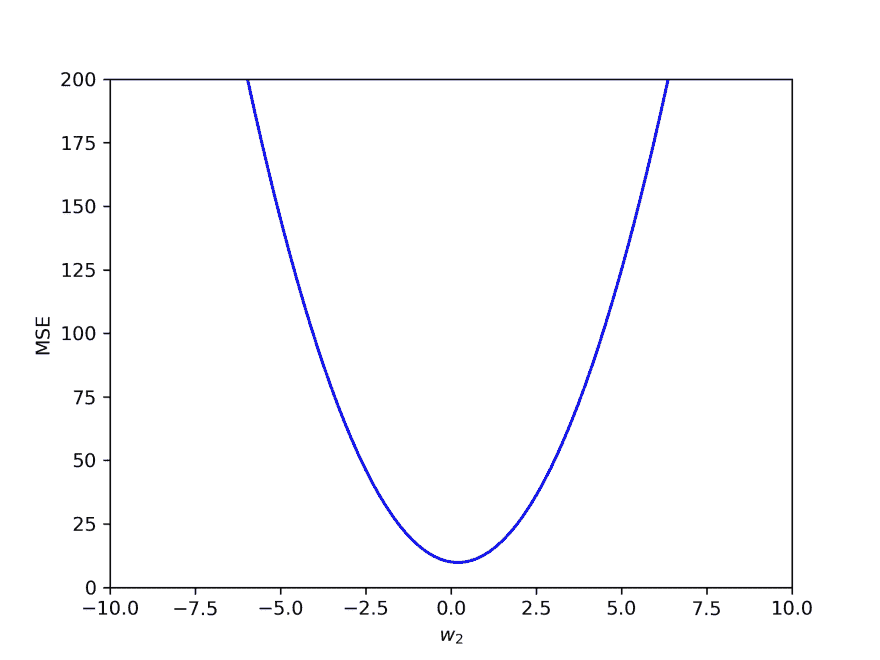](https://res.cloudinary.com/practicaldev/image/fetch/s--_PhzRebq--/c_limit%2Cf_auto%2Cfl_progressive%2Cq_auto%2Cw_880/https://thepracticaldev.s3.amazonaws.com/i/pc1iwoy5eqpbjf6x3vc6.jpg)

**您可以遵循以下步骤**

*   假设机器人从当前位置 W_a 开始
*   求左右方向的温度变化率

1.  将机器人向右移动一点，获得温度，然后回到原来的位置。
2.  温度变化率是温度的变化除以移动的距离。
3.  当移动的距离趋于零时，它被称为对 w <sub>0</sub> 的偏导数，因为我们保持 w <sub>1</sub> 和 w <sub>2</sub> 不变

*   同样，你可以找到上下和前后方向的温度变化率
*   将所有三个方向上的变化率组合成矢量，给出了场中的温度梯度。它是一个矢量，有温度变化最快的方向，它的大小给出了变化率。让我们用∇T 来代表它
*   现在我们需要将机器人向∇T 相反的方向移动一步，这样每一步我们都移动到更低的温度。步长应该足够小，这样就不会跳到温度可能更高的曲线的另一边(见上面的曲线)。所以机器人的新位置将会是

[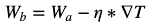](https://res.cloudinary.com/practicaldev/image/fetch/s--VjgpztNi--/c_limit%2Cf_auto%2Cfl_progressive%2Cq_auto%2Cw_880/https://thepracticaldev.s3.amazonaws.com/i/a8y1621v7h8zn52z52e3.png)

*   现在重复从 2 开始的步骤，直到你达到一个满意的温度点或者电池耗尽(即步骤)

### 偏导数

如果我们对等式(1.1) w.r.t w <sub>j</sub> 取偏导数，其中 j 是系数指数

[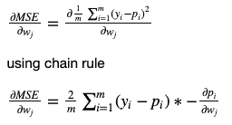](https://res.cloudinary.com/practicaldev/image/fetch/s--Q-FLjIib--/c_limit%2Cf_auto%2Cfl_progressive%2Cq_auto%2Cw_880/https://thepracticaldev.s3.amazonaws.com/i/28sobbssanunw6izmefo.png)

从等式(1.1)我们知道

[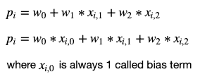](https://res.cloudinary.com/practicaldev/image/fetch/s--D5njiEsB--/c_limit%2Cf_auto%2Cfl_progressive%2Cq_auto%2Cw_880/https://thepracticaldev.s3.amazonaws.com/i/fk7bd0rtqz549wvhwl2a.png)

那么如果我们对 p <sub>i</sub> w.r.t w <sub>j</sub> 取偏导数，除了 w <sub>j</sub> 其他各项都是常数。所以结果会是

[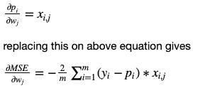](https://res.cloudinary.com/practicaldev/image/fetch/s--8DOm0ZMG--/c_limit%2Cf_auto%2Cfl_progressive%2Cq_auto%2Cw_880/https://thepracticaldev.s3.amazonaws.com/i/kcdd21a2fav02hc5r3bi.png)

重新安排

[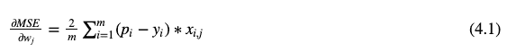](https://res.cloudinary.com/practicaldev/image/fetch/s--JOIhbuoY--/c_limit%2Cf_auto%2Cfl_progressive%2Cq_auto%2Cw_880/https://thepracticaldev.s3.amazonaws.com/i/jscf08t9j19x8gghomom.png)

## 矩阵表示法

矩阵乘法等矩阵运算经过优化，比简单的数组计算更高效。矩阵表示也使方程更具可读性。所以我们将把上述方程转换成矩阵运算

### 利用矩阵乘法进行预测

我们可以将公式 1.1 表示为使用矩阵运算来预测一个实例的值，以同时预测所有实例，如下所示

[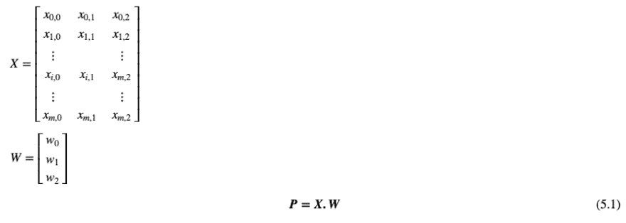](https://res.cloudinary.com/practicaldev/image/fetch/s--xJeJLU2J--/c_limit%2Cf_auto%2Cfl_progressive%2Cq_auto%2Cw_880/https://thepracticaldev.s3.amazonaws.com/i/n630w1brg114vh2pagd4.png)

**这里:**
**P** 是预测，它是长度为 m 的列向量
**X** 是具有 m 行和 n 列的矩阵，m 是数据点数和 n 个特征加上一个总是为 1 的偏置项
**W** 是长度为 n 的列向量

### 使用矩阵运算渐变

在等式(4.1)中，我们发现 MSE w.r.t w_j 的偏导数是回归模型的第 j 个系数，它是梯度向量的第 j 个分量。基于等式(4.1)，整个梯度可以使用矩阵运算来表示，例如

[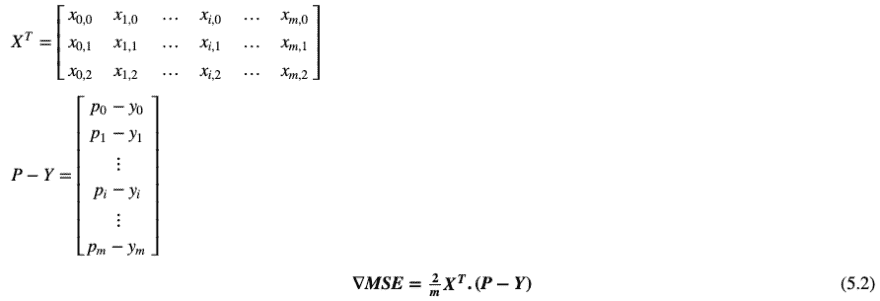](https://res.cloudinary.com/practicaldev/image/fetch/s--ZJljjZZq--/c_limit%2Cf_auto%2Cfl_progressive%2Cq_auto%2Cw_880/https://thepracticaldev.s3.amazonaws.com/i/jyffrqalsjedcfo8o2w3.png)

这里:
X <sup>T</sup> 是矩阵 X 的转置。它将有 n 行和 m 列

### 训练步骤

[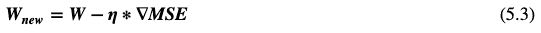](https://res.cloudinary.com/practicaldev/image/fetch/s--aXNJ4skD--/c_limit%2Cf_auto%2Cfl_progressive%2Cq_auto%2Cw_880/https://thepracticaldev.s3.amazonaws.com/i/d709dgbsfu4up56u3skd.png)

## 编码时间

在这一部分，我们将使用基本的 python 和 numpy 库实现线性回归。numpy 库是 python 中科学计算的基础包。它使得对大量数据的计算变得简单而有效。
Numpy 简介
请不要被 Numpy 弄得不知所措，我们只会用到它的一些基本功能。将在注释中解释每个函数的作用。
安装 Numpy 如果你已经使用 conda 或 miniconda 安装了 python，那么它应该已经安装好了。如果您的系统中没有安装它，您可以使用 pip 来安装它

`pip install numpy`

然后你可以导入你的笔记本或者 python 文件中的 numpy 库，如下

`import numpy as np`

Numpy 数组操作 Numpy 提供了在数组上执行算术运算的简写符号，一些例子如下

```
arr1+arr2 # will returns new array which is element wise sum of two arrays 2*arr1 # will multiply each element of arr1 by 2 arr1*arr2 # will return new array which is element wise multiplication of two array 
```

### 让我们生成数据

```
import numpy as np
# np.random.randn(100) will give array of 100 normally distributed random 
# numbers with mean 0 and std-dev 1
# 2*np.random.randn(100)+12 changes the normal distrubution to have mean 12 and std-dev 2 nitrate = 2*np.random.randn(100)+12
temperature = 4*np.random.rand(100) + 26
# np.c_ concatinates (joins) two array column wise x_farm = np.c_[nitrate,temperature]
# This is imaginary equation describing relation between yeild, nitrate and temperature.
# Obiously this is not know in real world problem. We are using it to generate dummy data. yeild_ideal = .1*nitrate + .08*temperature +.6
# adding some noise on the ideal equation. 
# The noise is normally distributed with 0 mean and std-dev 0.4 yeild = yeild_ideal + .4*np.random.randn(100)
print("few instances of generated data\n", x_farm[:5])
print("\nfew instances of generated targets\n", yeild[:5] ) 
```

**输出**

```
few instances of generated data
 [[12.15862374 26.41754744]
 [ 7.7100876  26.58160233]
 [12.39040209 27.5565463 ]
 [14.89781833 26.14161419]
 [12.89437241 29.96356333]]

few instances of generated targets
 [4.37946646 3.41541999 3.41400057 4.3290903  3.70089309] 
```

### 让我们定义一些函数

```
# Our equations above need bais term in x which should always be 1 def add_bais_term(x):

    # np.ones(n) will give new array of length n whose all elements are 1 
    # np.c_ concatinates two array column wise
    return np.c_[np.ones(len(x)),x]
# Root mean square cost function def rmse_cost_func(P,Y):
    ## model is array with bais and coffecients values
    return np.sqrt(np.mean((P-Y)**2))
# Finds gradient of cost function using eq(5.2) above def gradient_of_cost(x,y,model):
    preds = predict(x,model)

    error_term = preds-y

    # np.matmul performs matrix multiplication
    # x.T is transpose of matrix x
    xt_dot_error_term = np.matmul(x.T,error_term)/len(x)
    return xt_dot_error_term
# Do prediction using eq(5.1) above def predict(x,model):
    #np.matmul performs matrix multiplication
    return np.matmul(x,model)
def find_linear_regression_model(x,y):
    n_epochs = 10000
    neta = 0.001

    # Initialize all parameters(wj's) to zero
    model = np.zeros(len(x[0]))

    # do n_epochs iteration
    for _ in range(n_epochs):
        grad = gradient_of_cost(x,y,model)

        # move parameters closer to optimum solution in every step 
        next_model = model - neta*grad
        model = next_model
    return model 
```

### 列车型号

```
x_farm_with_bais = add_bais_term(x_farm)
print("First 3 data with bias\n",x_farm_with_bais[:3])
model = find_linear_regression_model(x_farm_with_bais, yeild)
print("\nmodel(w0,w1,w2)\n", model) 
```

**输出**

```
First 3 data with bias
 [[ 1\.         12.15862374 26.41754744]
 [ 1\.          7.7100876  26.58160233]
 [ 1\.         12.39040209 27.5565463 ]]

model(w0,w1,w2)
 [0.03759733 0.09930154 0.10164468] 
```

### 预测

```
# predict yeild for yeild_predicted = predict(x_farm_with_bais, model)
yeild_predicted[:15] 
```

**输出**

```
array([3.93017065, 3.50509946, 4.06895977, 4.17412975, 4.36366529,
       3.79386452, 3.74566146, 3.81563257, 4.19976404, 3.90262785,
       4.21451357, 4.05253678, 4.34120954, 4.06686309, 4.24635708]) 
```

### 评估

```
cost = rmse_cost_func(yeild_predicted,yeild)
print(cost) 
```

**输出**

```
0.3679644024562277 
```

**万岁！！**我们现在已经实现了线性回归，并使用它来进行预测。我们还测量了 RMSE，它相当于做预测时产生的绝对误差的平均值。平均误差接近随机误差的标准差，这意味着模型工作得相当好。

## 拨号

上面的例子只是为了从内部理解线性回归的工作原理。以下是一些需要注意的事情

*   在现实世界中，我们不会像现在这样预先知道因变量和自变量之间的关系。或者，即使我们不知道关系是否是线性的，我们也可以使用散点图或其他数据分析来推断关系。
*   我们通常不会使用训练数据来评估模型的性能，因为模型可以记住训练数据以在训练数据中获得高性能，但可能无法很好地处理新的未知数据。为了避免这种情况，我们通常将数据分成三组，训练组、验证组和测试组。验证集用于验证模型性能，并用于改进模型。只有在找到最终模型后，才使用测试集来评估模型对未知数据的性能。
*   这是理解核心概念的线性回归的一个非常基本的实现。我们几乎不需要自己实现。我们将始终使用来自流行库的线性回归实现，它将更加健壮、高效并提供定制参数

## 总结

这里是线性回归算法的简短总结

[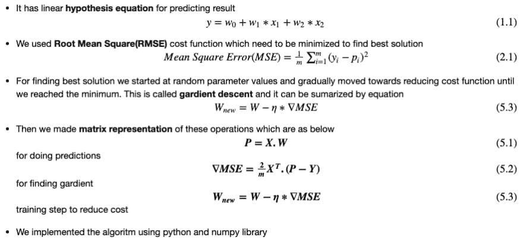](https://res.cloudinary.com/practicaldev/image/fetch/s--ph-G3LjV--/c_limit%2Cf_auto%2Cfl_progressive%2Cq_auto%2Cw_880/https://thepracticaldev.s3.amazonaws.com/i/9mqm551layw4e24vbw28.png)

请在这里找到整个博客和代码[的 jupyter 笔记本文件](https://medium.com/r/?url=https%3A%2F%2Fgist.github.com%2Fdevbkhadka%2Fb848ecabb5ec141e1026358779bb8b70)