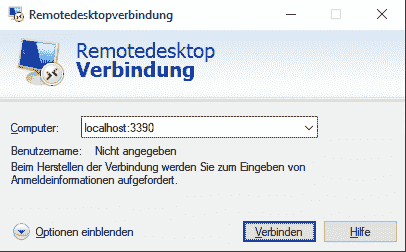
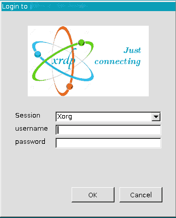
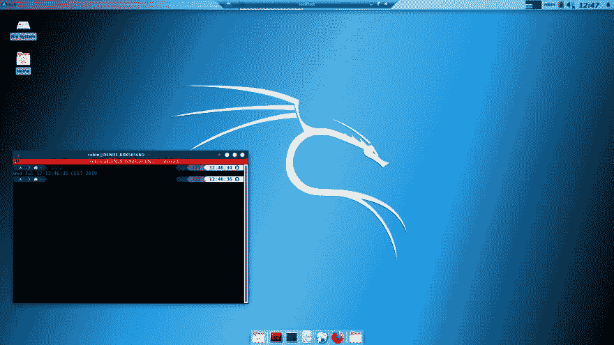

# Windows 上的 Linux:WSL 与桌面环境通过 RDP

> 原文：<https://dev.to/darksmile92/linux-on-windows-wsl-with-desktop-environment-via-rdp-522g>

WSL(Linux 的 Windows 子系统)现在非常普遍，特别是随着新的消息，Windows 将发布一个带有 [WSL 2.0](https://docs.microsoft.com/de-de/windows/wsl/wsl2-about) 的 [Linux 内核](https://github.com/microsoft/WSL2-Linux-Kernel)！

通过微软应用商店安装一个 Linux 发行版作为 WSL 是很容易的，那里有大量的教程。

大多数资源包括通过 Shell、终端、超级终端或其他基于控制台的工具访问 WSL。
运行 GUI 软件是可能的，有资源描述如何通过 VcXsrv 实现这一点(参见我的[这篇文章](https://dev.to/darksmile92/run-gui-app-in-linux-docker-container-on-windows-host-4kde#install-vcxsrv-and-configure-it)中的章节)。

但是如果你:

## 想拥有/访问 WSL 上的桌面环境？

您可以使用任何您想要的桌面环境，在这个例子中我将使用 [Xfce](https://www.xfce.org/) ，因为它是轻量级的。

下面是所有命令和步骤的简要介绍，将在下面的章节中解释。一个是 Kali Linux，另一个是基于 Debian 的发行版(Debian，Ubuntu，...).

对于卡利:

```
sudo apt update && sudo apt -y upgrade
sudo apt -y install kali-desktop-xfce
sudo apt-get install xrdp
sudo cp /etc/xrdp/xrdp.ini /etc/xrdp/xrdp.ini.bak
sudo sed -i 's/3389/3390/g' /etc/xrdp/xrdp.ini
sudo sed -i 's/max_bpp=32/#max_bpp=32\nmax_bpp=128/g' /etc/xrdp/xrdp.ini
sudo sed -i 's/xserverbpp=24/#xserverbpp=24\nxserverbpp=128/g' /etc/xrdp/xrdp.ini
sudo /etc/init.d/xrdp start 
```

Enter fullscreen mode Exit fullscreen mode

**编辑:08/2022**
作为[评论](https://dev.to/elvisvan/comment/212lj)中提到的[猫王范](https://dev.to/elvisvan)，现在有一个针对 Kali linux 的包专门针对这个案例: [kali-win-kex](https://www.kali.org/docs/wsl/win-kex/) 。它负责所有 Kali 组件和配置的完整设置，为您提供 WSL2 下的 Kali 桌面体验。

对于其他基于 debian 的发行版:

```
sudo apt update && sudo apt -y upgrade
sudo apt -y install xfce4
sudo apt-get install xrdp
sudo cp /etc/xrdp/xrdp.ini /etc/xrdp/xrdp.ini.bak
sudo sed -i 's/3389/3390/g' /etc/xrdp/xrdp.ini
sudo sed -i 's/max_bpp=32/#max_bpp=32\nmax_bpp=128/g' /etc/xrdp/xrdp.ini
sudo sed -i 's/xserverbpp=24/#xserverbpp=24\nxserverbpp=128/g' /etc/xrdp/xrdp.ini
sudo /etc/init.d/xrdp start 
```

Enter fullscreen mode Exit fullscreen mode

然后通过 RDP `localhost:3390`连接到你的桌面。

[](https://res.cloudinary.com/practicaldev/image/fetch/s--Zuom5SHX--/c_limit%2Cf_auto%2Cfl_progressive%2Cq_auto%2Cw_880/https://thepracticaldev.s3.amazonaws.com/i/ho6kk30r5w1azj1pgvfv.png)

[](https://res.cloudinary.com/practicaldev/image/fetch/s--IfG4_oat--/c_limit%2Cf_auto%2Cfl_progressive%2Cq_auto%2Cw_880/https://thepracticaldev.s3.amazonaws.com/i/nuteksr5x3tbmewsic7s.png)

### 详细步骤

#### 更新系统，安装 Xfce4

```
sudo apt update && sudo apt -y upgrade 
```

Enter fullscreen mode Exit fullscreen mode

```
sudo apt -y install kali-desktop-xfce 
```

Enter fullscreen mode Exit fullscreen mode

```
sudo apt -y install xfce4 
```

Enter fullscreen mode Exit fullscreen mode

第一个命令更新源代码列表和包。永远重要，这个我就不解释了。
`sudo apt -y install kali-desktop-xfce`安装一个 Kali Linux 特定版本的 Xfce4，`sudo apt -y install xfce4`将为基于 debian 的发行版安装 Xfce4 包。

#### 安装 Xrdp

```
sudo apt-get install xrdp 
```

Enter fullscreen mode Exit fullscreen mode

Xrdp 是一个开源的远程桌面解决方案，并且非常轻量级，易于配置。该命令将安装软件包，并使用端口 3389 设置默认配置。

#### 配置 Xrdp

```
sudo cp /etc/xrdp/xrdp.ini /etc/xrdp/xrdp.ini.bak
sudo sed -i 's/3389/3390/g' /etc/xrdp/xrdp.ini
sudo sed -i 's/max_bpp=32/#max_bpp=32\nmax_bpp=128/g' /etc/xrdp/xrdp.ini
sudo sed -i 's/xserverbpp=24/#xserverbpp=24\nxserverbpp=128/g' /etc/xrdp/xrdp.ini
sudo /etc/init.d/xrdp start 
```

Enter fullscreen mode Exit fullscreen mode

在更改之前复制配置文件作为备份，将端口从 3389 更改为 3390，出于质量原因，将 bpp 从 24 增加到 128。你可以使用这些设置，但是由于这是一个本地连接，速度应该不会比这些设置差。最后，重新启动 xrdp 服务以应用更改。

现在，您可以通过`localhost:3390`连接，并通过 RDP 获得您的 WSL 帐户凭证！💪

[](https://res.cloudinary.com/practicaldev/image/fetch/s--oBRJbOXY--/c_limit%2Cf_auto%2Cfl_progressive%2Cq_auto%2Cw_880/https://thepracticaldev.s3.amazonaws.com/i/3qds38rrmzc6kaya8mym.png)

###### 为什么端口从 3389 改为 3390？

两个原因:安全性，有时端口 3389 被 wsl 上的一个进程使用，您会收到消息

> `Your computer could not connect to another console session on the remote computer because you already have a console session in progress.`

#### RDP 的好处在这里

尽管您可以通过 XServer 在一个窗口中运行 GUI 软件，但有时使用完整的桌面环境会更方便。
您还可以轻松恢复之前断开的会话，而不必关闭控制台(例如让进程运行)。

让我知道你对这个话题的想法！