# 最佳免费 Visual Studio 扩展列表

> 原文：<https://dev.to/thomasardal/list-of-the-best-free-visual-studio-extensions-43l7>

Visual Studio 是一个很好的开发环境。但是再扩展几个，就更好了。有很多免费的扩展，这将改善编写代码的体验，甚至帮助你减少错误。我们已经收集了 Visual Studio 的最佳免费扩展列表。

* * *

## [螺旋推进器](https://marketplace.visualstudio.com/items?itemName=josefpihrt.Roslynator2017)

针对 C#的近 400 个分析器、重构和代码修复，由 Visual Studio 2017 捆绑的新罗斯林编译器提供支持。不喜欢什么？Roslynator 可能是你免费获得 ReSharper 的最接近的产品。

[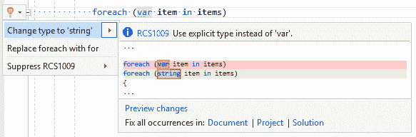](https://res.cloudinary.com/practicaldev/image/fetch/s--7AbJs7Fm--/c_limit%2Cf_auto%2Cfl_progressive%2Cq_auto%2Cw_880/https://blog.elmah.io/conteimg/old/roslynator.png)

* * *

## [侧挡板模板包](https://marketplace.visualstudio.com/items?itemName=MadsKristensen.SideWaffleTemplatePack)

让我们面对现实吧。现成可用的 Visual Studio 项目模板的数量非常有限。SideWaffle 用许多新的项目和条目模板解决了这个问题。

[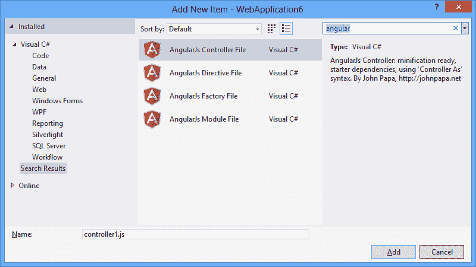](https://res.cloudinary.com/practicaldev/image/fetch/s--pXjSRZxn--/c_limit%2Cf_auto%2Cfl_progressive%2Cq_auto%2Cw_880/https://blog.elmah.io/conteimg/old/sidewaffle.png)

* * *

## [Visual Studio 的电源命令](https://marketplace.visualstudio.com/items?itemName=VisualStudioProductTeam.PowerCommandsforVisualStudio)

Power Commands 为 Visual Studio 添加了大量功能。这个扩展的重点主要是在 IDE 中导航，并将多次点击合并为一次。一旦安装完毕，没有这些小的改进，你将无法生活。

[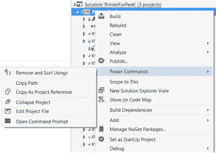](https://res.cloudinary.com/practicaldev/image/fetch/s--xdKK7Taj--/c_limit%2Cf_auto%2Cfl_progressive%2Cq_auto%2Cw_880/https://blog.elmah.io/conteimg/old/powercommands.png)

* * *

## [文件嵌套](https://marketplace.visualstudio.com/items?itemName=MadsKristensen.FileNesting)

你知道 web.release.config 文件是如何很好地嵌套在 web.config 下面的吗？文件嵌套扩展为所有类型的文件添加了此行为。清理解决方案资源管理器的最佳方式。

[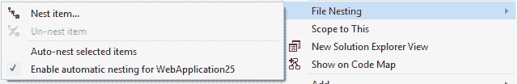](https://res.cloudinary.com/practicaldev/image/fetch/s--k2FZBg0n--/c_limit%2Cf_auto%2Cfl_progressive%2Cq_auto%2Cw_880/https://blog.elmah.io/conteimg/old/filenesting.png)

* * *

## [elmah.io](https://marketplace.visualstudio.com/items?itemName=ThomasArdal.elmahio)

曾经想在不离开 Visual Studio 的情况下浏览 elmah.io 日志吗？现在你可以了，使用我们自己的 Visual Studio 扩展。

[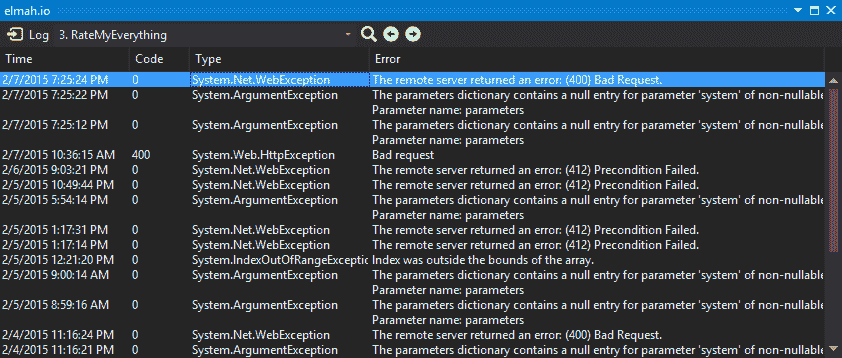](https://res.cloudinary.com/practicaldev/image/fetch/s--qnRWxJ2q--/c_limit%2Cf_auto%2Cfl_progressive%2Cq_auto%2Cw_880/https://blog.elmah.io/conteimg/old/elmahioextensions.png)

* * *

## [Visual Studio 拼写检查](https://marketplace.visualstudio.com/items?itemName=EWoodruff.VisualStudioSpellCheckerVS2017andLater)

拼写检查对每个网站开发者来说都很重要。为什么不让 Visual Studio 在你打字的时候使用这个免费的拼写检查器呢？

[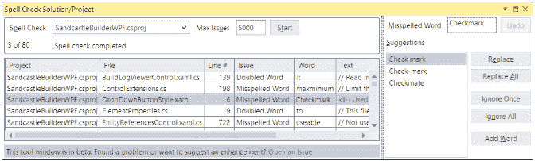](https://res.cloudinary.com/practicaldev/image/fetch/s--1qBk7IrH--/c_limit%2Cf_auto%2Cfl_progressive%2Cq_auto%2Cw_880/https://blog.elmah.io/conteimg/old/spellchecker.png)

* * *

## [文件图标](https://marketplace.visualstudio.com/items?itemName=MadsKristensen.FileIcons)

在解决方案资源管理器中显示正确的文件图标听起来并不重要。安装这个扩展后，你会很快意识到，它意味着导航项目文件时的世界。

[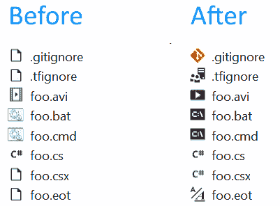](https://res.cloudinary.com/practicaldev/image/fetch/s--qvrBANHt--/c_limit%2Cf_auto%2Cfl_progressive%2Cq_auto%2Cw_880/https://blog.elmah.io/conteimg/old/fileicons.png)

* * *

## [图像优化器](https://marketplace.visualstudio.com/items?itemName=MadsKristensen.ImageOptimizer)

Mads Kristensen 的另一个伟大的扩展是图像优化。我以前使用在线工具来优化图像。现在，我在 Visual Studio 中右键单击一个图像，并通过单击大幅缩小图像大小。

[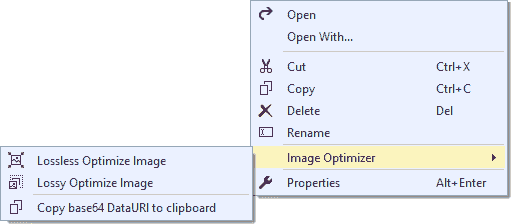](https://res.cloudinary.com/practicaldev/image/fetch/s--PDVowPAq--/c_limit%2Cf_auto%2Cfl_progressive%2Cq_auto%2Cw_880/https://blog.elmah.io/conteimg/old/imageoptimizer.png)

* * *

## [生产力电动工具](https://marketplace.visualstudio.com/items?itemName=VisualStudioProductTeam.ProductivityPowerPack2017)

与电源命令非常相似，生产力工具为 IDE 添加了许多小的改进。Productivity Tools 实际上“仅仅”是许多较小的扩展的保护伞，这些扩展可以单独安装。

[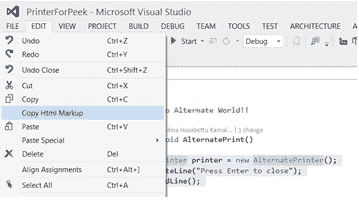](https://res.cloudinary.com/practicaldev/image/fetch/s--4wf6bg0a--/c_limit%2Cf_auto%2Cfl_progressive%2Cq_auto%2Cw_880/https://blog.elmah.io/conteimg/old/productivitypowertools.png)

* * *

## [SlowCheetah](https://marketplace.visualstudio.com/items?itemName=VisualStudioProductTeam.SlowCheetah-XMLTransforms)

Web.config 转换改变了我们配置网站的方式。我记得以前创建定制的配置工具。使用 SlowCheetah，您将能够基于活动配置转换任何 xml 文件。

[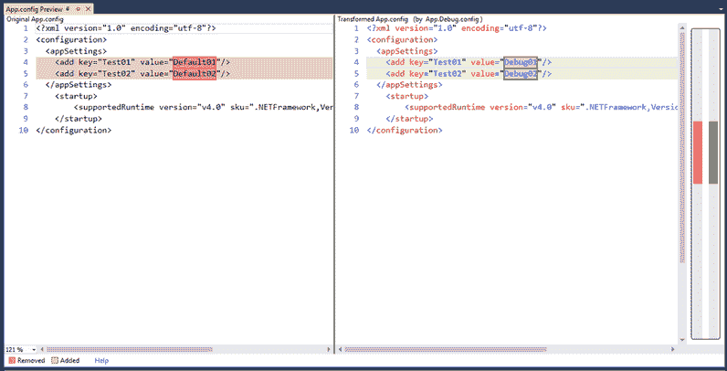](https://res.cloudinary.com/practicaldev/image/fetch/s--Er7xYmhJ--/c_limit%2Cf_auto%2Cfl_progressive%2Cq_auto%2Cw_880/https://blog.elmah.io/conteimg/old/slowcheetah.png)

* * *

## [网页精要](https://marketplace.visualstudio.com/items?itemName=MadsKristensen.WebExtensionPack2017)

另一个流行的扩展是 Web Essentials。我们已经提到了 Web Essentials 安装的一些扩展，但是我们仍然认为这是值得一提的。安装 WE 时，许多 web 开发人员改进了 Visual Studio。

[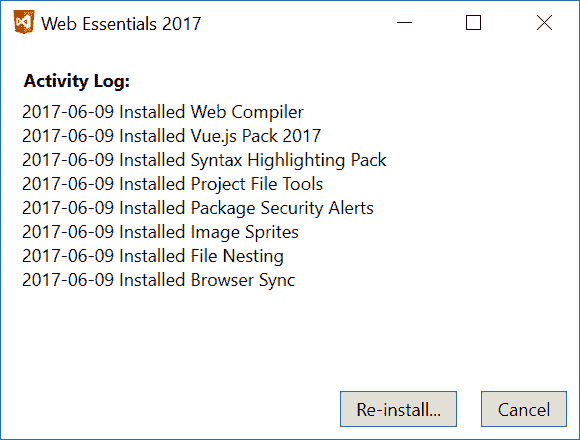](https://res.cloudinary.com/practicaldev/image/fetch/s--RFEJCbp6--/c_limit%2Cf_auto%2Cfl_progressive%2Cq_auto%2Cw_880/https://blog.elmah.io/conteimg/old/webessentials.png)

* * *

## [女仆](https://marketplace.visualstudio.com/items?itemName=SteveCadwallader.CodeMaid)

代码清理，重组以及一系列其他有用的工具是你安装 CodeMaid 后会收到的。CodeMaid 的好处在于，它可以处理多种文件类型，而不仅仅是 C#。

[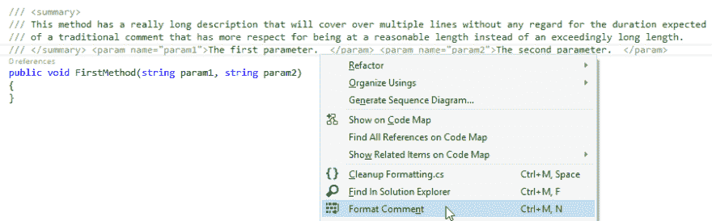](https://res.cloudinary.com/practicaldev/image/fetch/s--82fzr770--/c_limit%2Cf_auto%2Cfl_progressive%2Cq_auto%2Cw_880/https://blog.elmah.io/conteimg/old/codemaid.png)

* * *

## [德瓦特](https://www.devart.com/)

Devart 是许多. NET 组件和库的幕后公司。虽然他们的大多数产品必须购买，但他们有一个令人印象深刻的免费快速版本列表。举几个例子，有代码比较，T4(模板)编辑器和审查助理(代码审查)。

[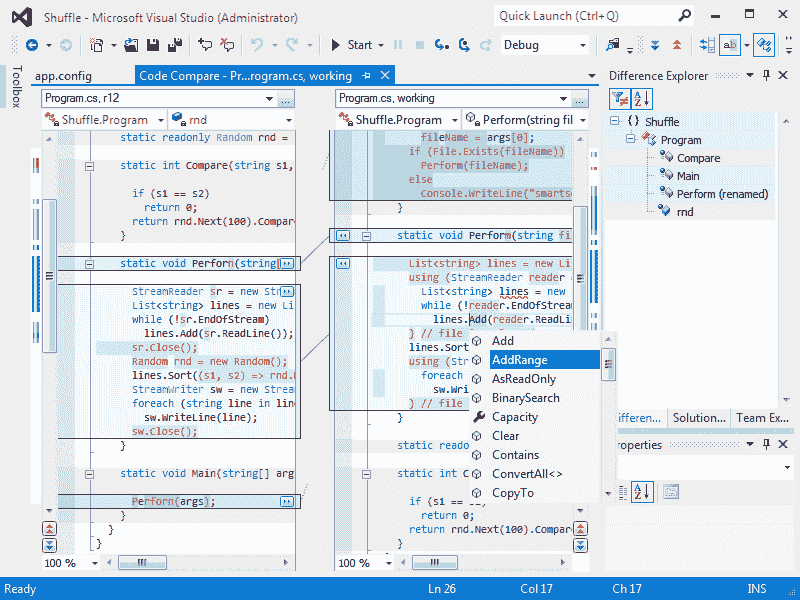](https://res.cloudinary.com/practicaldev/image/fetch/s--smMAszol--/c_limit%2Cf_auto%2Cfl_progressive%2Cq_auto%2Cw_880/https://blog.elmah.io/conteimg/old/devart.png)

* * *

## [VSColorOutput](https://marketplace.visualstudio.com/items?itemName=MikeWard-AnnArbor.VSColorOutput)

VSColorOutput 是另一个你从未想过会需要的扩展，但是一旦安装就无法生存。Visual Studio 中的输出窗口显示了许多有用的信息，但是如果没有颜色突出显示，该窗口就没有什么用处。不要再找了。

[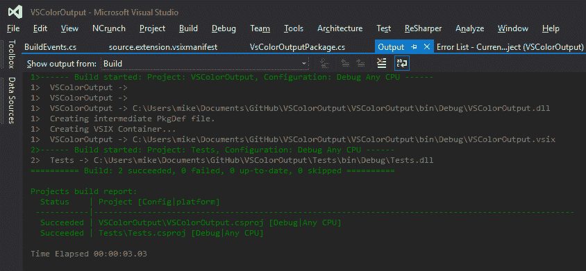](https://res.cloudinary.com/practicaldev/image/fetch/s--kv5mU-V9--/c_limit%2Cf_auto%2Cfl_progressive%2Cq_auto%2Cw_880/https://blog.elmah.io/conteimg/old/vscoloroutput.png)

* * *

## [雕塑家](https://marketplace.visualstudio.com/items?itemName=RionWilliams.Glyphfriend2017)

你可能已经在使用某种图标字体了，比如 FontAwesome，Bootstrap Glyphicons 或者 Material icons。使用 Glyphfriend，使用如下所示的丰富下拉菜单，选择正确的图标变得轻而易举:

* * *

你认为我们错过了什么吗？通过下面的评论让我们知道。

另外，请务必访问[终极列表。网志](https://blog.elmah.io/net-blogs-to-follow-the-ultimate-list/)和[太棒了。参加](https://blog.elmah.io/great-dot-net-conferences-to-attend/)网络会议。

## 你的用户会喜欢更少的错误吗？

elmah.io 是一个简单的错误记录和正常运行时间监控服务。NET web 和日志框架。

➡️ [错误监控。NET 网络应用](https://elmah.io/?utm_source=devto&utm_medium=social&utm_campaign=devtoposts) ⬅️

本文首次出现在 elmah.io 博客上，网址为[https://blog . elmah . io/list-of-the-best-free-visual-studio-extensions/](https://blog.elmah.io/list-of-the-best-free-visual-studio-extensions/)