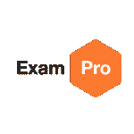

# 直播 7 月 30 日美国东部时间下午 12:30-1:30-Hacks 为开发者改进您的 LinkedIn 个人资料

> 原文：<https://dev.to/andrewbrown/live-stream-july-30th-12-30pm-1-30pm-edt-hacks-to-improve-your-linkedin-profile-for-devs-29g6>

嘿大家好。我明天有一个技术讲座的直播，我在多伦多做的是关于改善你的 LinkedIn 个人资料。这是问我问题或学习新技巧的好机会。

[https://zoom.us/j/128113715](https://zoom.us/j/128113715)

希望能在网上见到你。

对于那些还没有看到我之前两篇文章的人来说:

 [## 700 多名 Web 开发人员要求我给他们 LinkedIn 个人资料反馈，这些是我的🖐️ 5 大技巧。

### 例如安德鲁·布朗·🇨🇦5 月 29 日 196 分钟阅读

#career #webdev #beginners #linkedin](/exampro/700-web-developers-asked-me-to-give-them-linkedin-profile-feedback-and-these-are-my-5-top-tips-5382) [## LinkedIn 是给失败者用的？再想想。从💰10 万+到 20 万+的工作机会。包括🛠的黑客。

### 例如安德鲁·布朗·🇨🇦5 月 19 日 1915 分钟阅读

#career #webdev #beginners #linkedin](/exampro/linkedin-is-for-losers-think-again-from-100k-to-200k-job-opportunities-hacks-included-1a8e)