# LiveCode 是一种现代的超级卡

> 原文：<https://dev.to/soapdog/livecode-is-a-modern-day-hypercard-2l91>

这篇文章是对斯坦尼斯拉夫关于[为什么 HyperCard 必须死的回答。我并不是说这篇文章是错的，我只是提出了一个可行的替代方案。](http://www.loper-os.org/?p=568) [LiveCode](https://www.livecode.com) 是一种现代的 HyperCard，每个使用 HyperCard 的人都会有宾至如归的感觉。

LiveCode 可以在 macOS、Windows 和 Linux 上运行，可以为所有这些平台以及 Android 和 iOS 生成独立的二进制文件。你可以从 https://www.livecode.com 得到它，也可以从 https://www.livecode.org 的 T2 得到它的 GPL 版本。

在这篇文章中，我将重现 Stanislav 在他们的文章中创建的演示，这是一个简单的四则运算计算器。我希望读者会注意到这个环境是多么熟悉，然而它变得多么现代。

免责声明:我为 LiveCode 工作。

[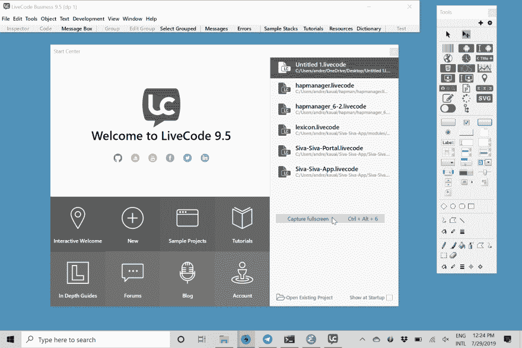](https://res.cloudinary.com/practicaldev/image/fetch/s--l0SMFrYv--/c_limit%2Cf_auto%2Cfl_progressive%2Cq_auto%2Cw_880/https://andregarzia.com/img/shots/LiveCode-start-center.png)

LiveCode 启动中心

第一步是创建一个堆栈。

[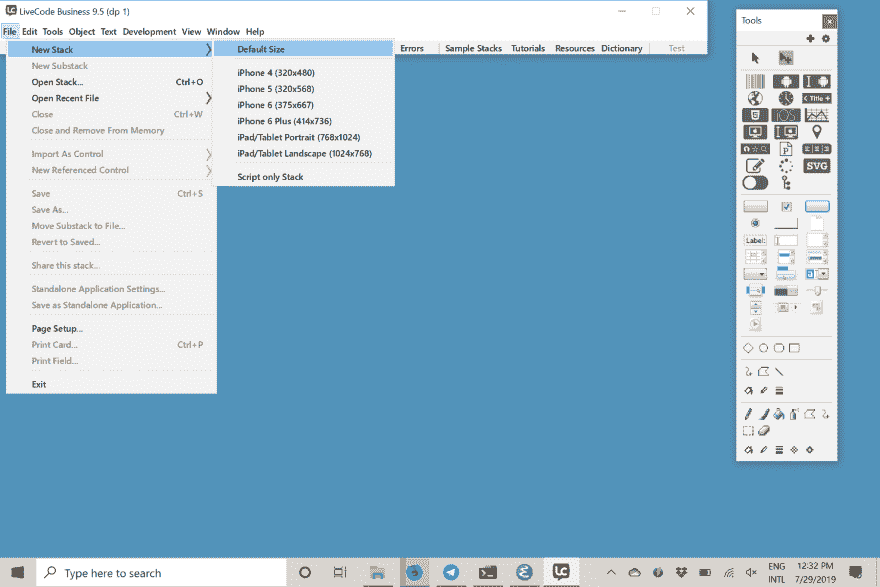](https://res.cloudinary.com/practicaldev/image/fetch/s--wb0xQNoo--/c_limit%2Cf_auto%2Cfl_progressive%2Cq_auto%2Cw_880/https://andregarzia.com/img/shots/LiveCode-new-stack.png)

创建新堆栈

我们使用菜单中的*堆栈检查器*或 *CTRL+K* 热键将其命名为 *SmallCalculator* 。

[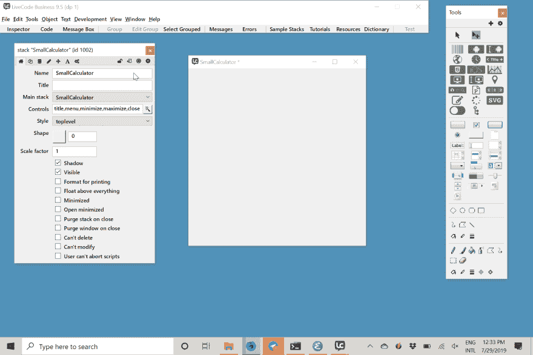](https://res.cloudinary.com/practicaldev/image/fetch/s--qZM9GVLS--/c_limit%2Cf_auto%2Cfl_progressive%2Cq_auto%2Cw_880/https://andregarzia.com/img/shots/LiveCode-stack-with-name.png)

命名堆栈

让我们将一个字段拖放到堆栈中，作为计算器的 LCD。

[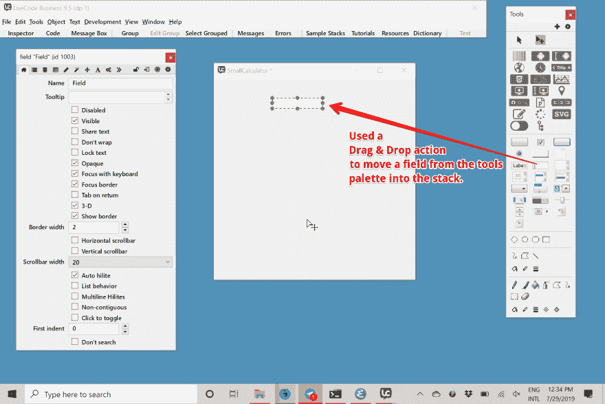](https://res.cloudinary.com/practicaldev/image/fetch/s--QDBGrBfo--/c_limit%2Cf_auto%2Cfl_progressive%2Cq_auto%2Cw_880/https://andregarzia.com/img/shots/LiveCode-new-field.png)

将对象拖放到堆栈中

请注意，就像 HyperCard 一样，我们正在使用一个*堆栈- >卡片- >对象*隐喻。我们在这里所做的就是瞄准*牌 1* ，它是堆叠中的第一张牌。当我提到将一个字段放入堆栈时，它实际上是在堆栈“小型计算器”的*卡 1 上创建一个字段。*

命名字段

为了创建按钮，我们也从工具面板中拖放。

[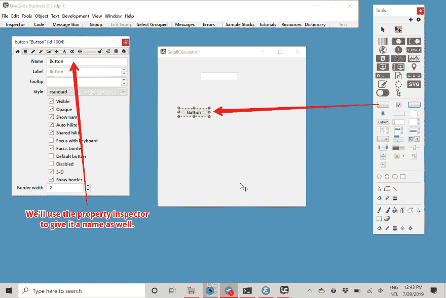](https://res.cloudinary.com/practicaldev/image/fetch/s--b7HSdx0E--/c_limit%2Cf_auto%2Cfl_progressive%2Cq_auto%2Cw_880/https://andregarzia.com/img/shots/LiveCode-new-button.png)

创建和按钮

让我们给它命名，并使用拖动处理程序来调整它的大小(就像在图形设计程序中一样)。

[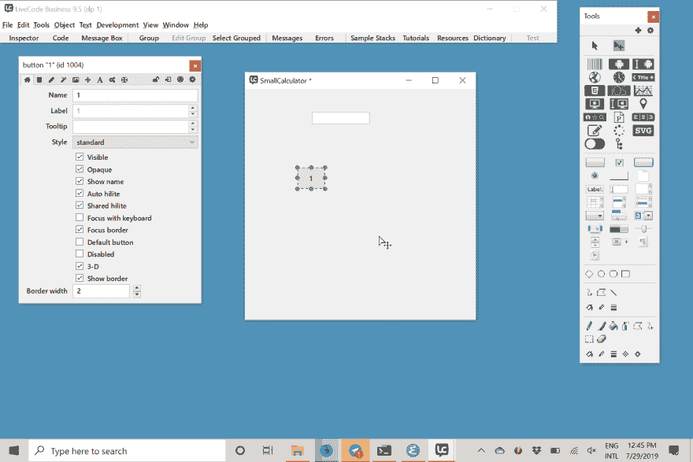](https://res.cloudinary.com/practicaldev/image/fetch/s--7jN4xg5l--/c_limit%2Cf_auto%2Cfl_progressive%2Cq_auto%2Cw_880/https://andregarzia.com/img/shots/LiveCode-button-with-name.png)

调整按钮的大小和命名

之后，是时候编辑按钮的脚本了。有多种方法可以访问对象的脚本。最容易发现的方法是使用菜单。

[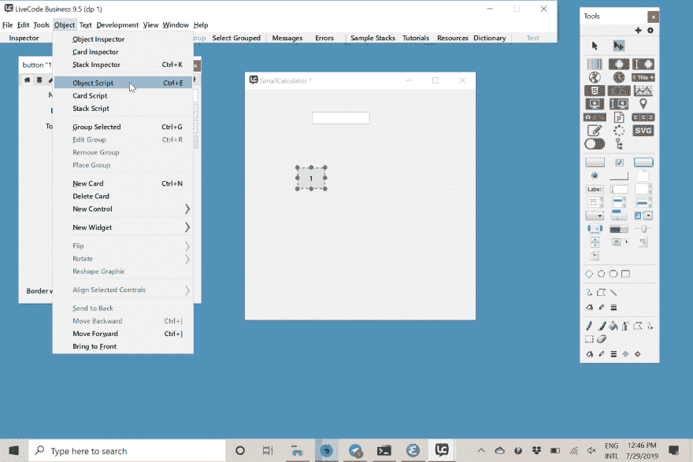](https://res.cloudinary.com/practicaldev/image/fetch/s--GlgmOEC4--/c_limit%2Cf_auto%2Cfl_progressive%2Cq_auto%2Cw_880/https://andregarzia.com/img/shots/LiveCode-menu-object-script.png)

访问对象脚本

我准备尽量模仿原帖的剧本。请注意，LiveCode 语言比 HyperCard 有更多的命令和表达式可用，我构建这个演示的方式并不是最佳方式。

[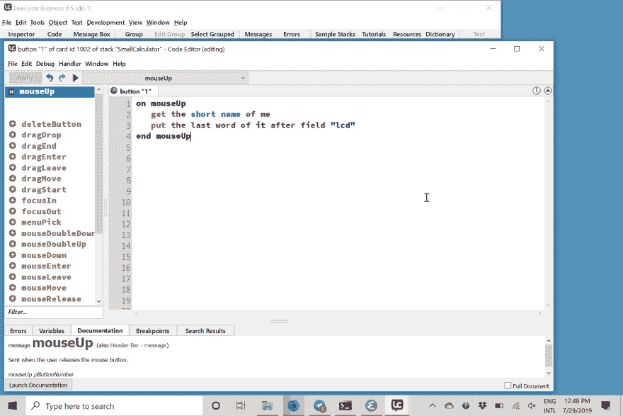](https://res.cloudinary.com/practicaldev/image/fetch/s---sg8jjIG--/c_limit%2Cf_auto%2Cfl_progressive%2Cq_auto%2Cw_880/https://andregarzia.com/img/shots/LiveCode-script-editor.png)

编辑按钮的脚本

观察一下，就像 HyperCard 一样，使用它不需要编译一个项目。在工具面板的顶部有两个不同的箭头。一个是*设计模式*，另一个是*交互模式*。你可以随时切换模式。如果你现在切换并点击按钮三次，你会在 *LCD 区域*看到数字 *111* 。

现在，我们将复制并粘贴足够的按钮来构建计算器的数字键盘。我们将简单地使用 CTRL+C 和 CTRL+V(或它们在 mac 上的 CMD 等价物)来复制和粘贴它们。我也花了一些时间来移动这些物体。

[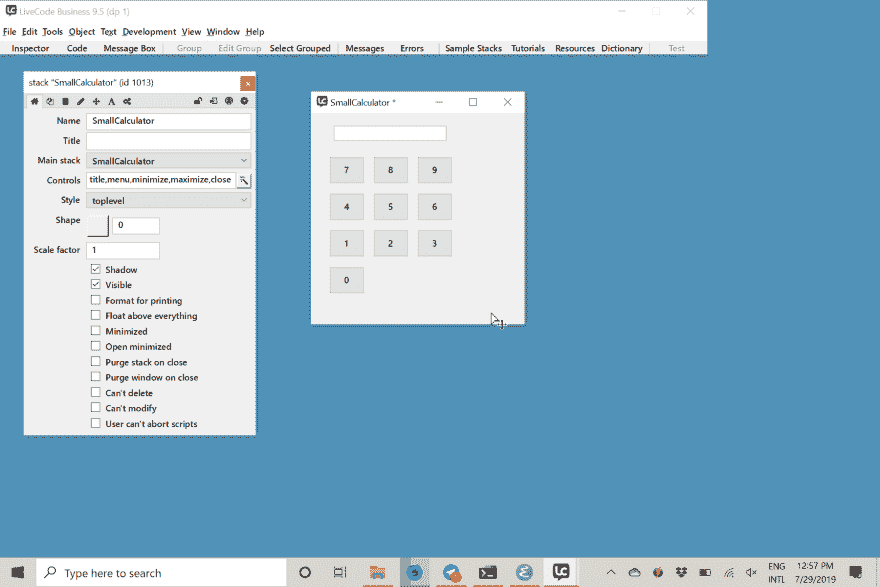](https://res.cloudinary.com/practicaldev/image/fetch/s--K9J33fnT--/c_limit%2Cf_auto%2Cfl_progressive%2Cq_auto%2Cw_880/https://andregarzia.com/img/shots/LiveCode-number-pad.png)

计算器的数字键盘

下一步是创建操作按钮和等于按钮。我只是在数字按钮上使用了复制和粘贴，并给它们起了一个与数学运算相匹配的名字。equal 按钮是通过将一个新按钮从工具面板拖放到堆栈中来构建的。

[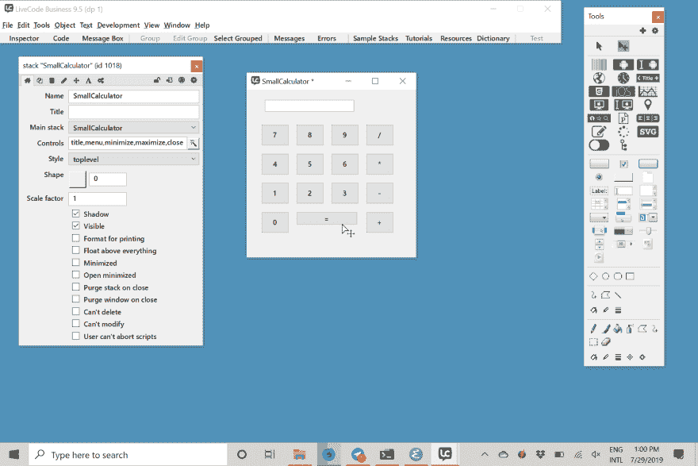](https://res.cloudinary.com/practicaldev/image/fetch/s--Kp8iS-rB--/c_limit%2Cf_auto%2Cfl_progressive%2Cq_auto%2Cw_880/https://andregarzia.com/img/shots/LiveCode-operations-and-equal.png)

带运算和等号按钮的计算器

现在，是时候为等号按钮编写脚本了。

[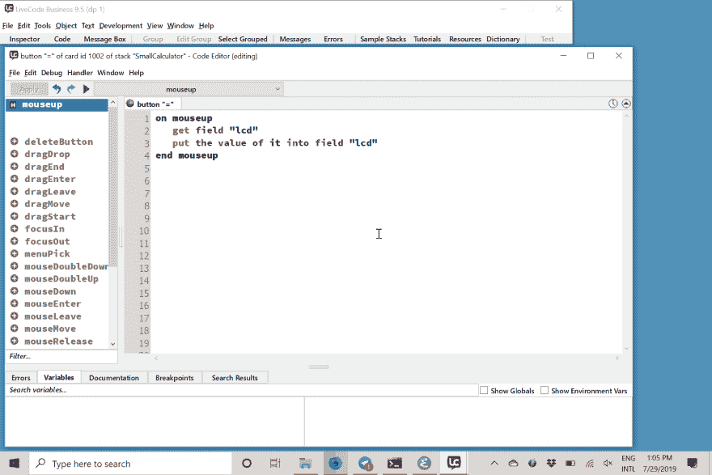](https://res.cloudinary.com/practicaldev/image/fetch/s--LzDjLZYz--/c_limit%2Cf_auto%2Cfl_progressive%2Cq_auto%2Cw_880/https://andregarzia.com/img/shots/LiveCode-script-editor-equal.png)

显示*等于按钮*的脚本的脚本编辑器

让我们带着计算器去兜一圈。

与演示相同的数学表达式

和按下后的结果相等。

[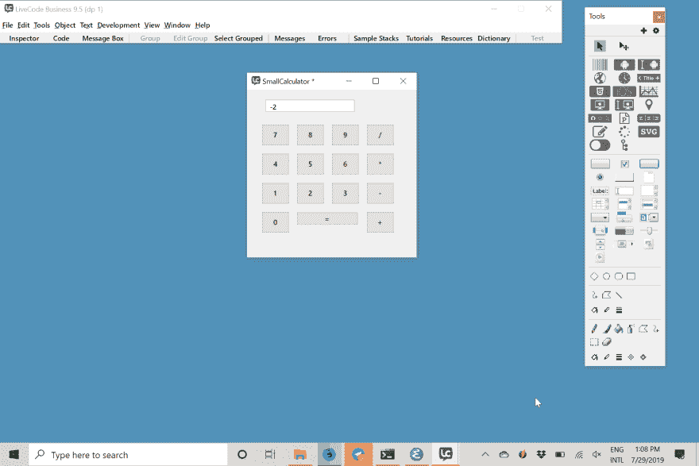](https://res.cloudinary.com/practicaldev/image/fetch/s--4sch0CSm--/c_limit%2Cf_auto%2Cfl_progressive%2Cq_auto%2Cw_880/https://andregarzia.com/img/shots/LiveCode-calculator-result.png)

同样的结果

现在，让我们稍微偏离一下演示，展示一些 HyperCard 从未有过的东西。从*文件菜单*中，我访问了*独立应用程序设置*来配置如何部署这个堆栈。我可以从我的 windows 机器部署到 macOS、Windows、Linux 和 Android。由于显而易见的(Apple argh)原因，我无法为 iOS 部署。我现在将只为 Windows 构建。

[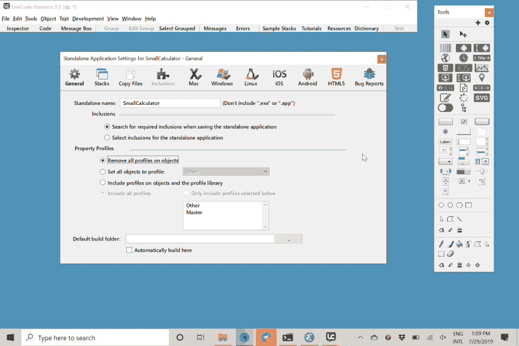](https://res.cloudinary.com/practicaldev/image/fetch/s--BfMHn95O--/c_limit%2Cf_auto%2Cfl_progressive%2Cq_auto%2Cw_880/https://andregarzia.com/img/shots/LiveCode-standalone-application-settings.png)

独立应用程序设置

这是一个在 windows 上独立运行的小计算器。

SmallCaltulator.exe

我希望你喜欢这篇文章，并对使用 LiveCode 感到好奇。每隔几个月，就会有一些关于 HyperCard 的帖子出现在 [HN](https://news.ycombinator.com) 或[论坛上，我看到很多人都渴望得到它。我想知道他们中有多少人知道 LiveCode。我怀疑许多人会像我一样喜欢它。](https://lobste.rs)