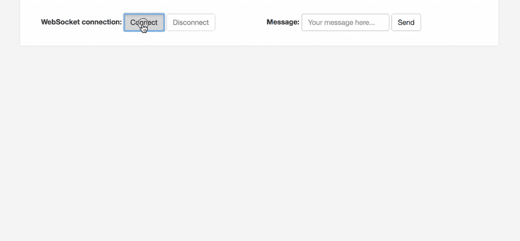
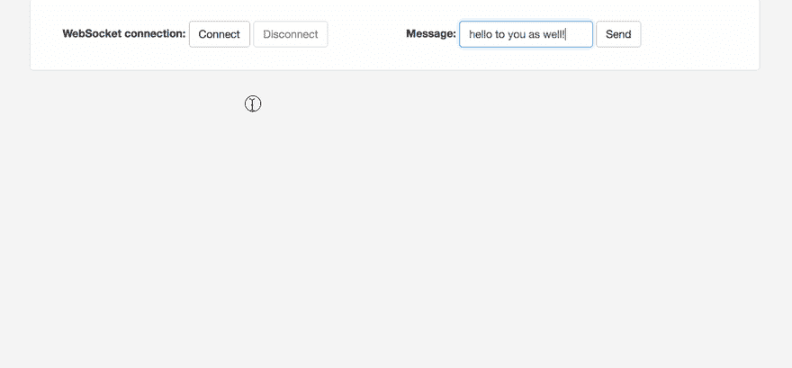

# 使用 Spring 云网关实现负载平衡的 Websockets

> 原文：<https://dev.to/jmlw/load-balanced-websockets-with-spring-cloud-gateway-3ke5>

[](https://res.cloudinary.com/practicaldev/image/fetch/s--S2xpsSsV--/c_limit%2Cf_auto%2Cfl_progressive%2Cq_auto%2Cw_880/https://images.unsplash.com/photo-1451340124423-6311db67a5d9%3Fixlib%3Drb-1.2.1%26q%3D80%26fm%3Djpg%26crop%3Dentropy%26cs%3Dtinysrgb%26w%3D1080%26fit%3Dmax%26ixid%3DeyJhcHBfaWQiOjExNzczfQ)

客户机和服务器之间的实时双向通信能力是大多数现代 web 应用程序的一个关键特性。

在 Spring Boot 建立 WebSockets 的一个简单方法在[Spring Boot 的简单 web sockets](https://blog.joshmlwood.com/websockets-with-spring-boot/)中有介绍，它使用了一个内存中的消息代理。但是，当您纵向扩展并添加额外的服务器时，这种方法存在不足。连接到不同服务器的用户将无法交流或获得其他服务器上发生的更新。让我们探索如何在我们的示例应用程序中适当地扩展 WebSockets。这将允许任何客户端能够相互通信，而不管它们连接到哪个服务器，以及订阅可能发生在它们没有连接到的服务器上的更新。

## 项目设置

我们需要一些应用程序来完成我们的设置。其中包括一个 *API 网关*、一个 *WebSocket 服务器*和一个 *Eureka* discovery 服务器，这样我们所有的服务都可以找到彼此。

注意:这个项目依赖于一个 Eureka 服务器进行服务发现。可以将其修改为仅使用 DNS 名称，但是这样做需要将 WebSocket 服务器的所有实例映射到相同的 DNS 名称，以便我们的 API 网关正确地路由请求。

我们将需要创建多个应用程序，所以首先，创建一个目录来包含与这篇文章相关的所有内容，并将其命名为`spring-cloud-gateway-websocket`。一旦创建了那个目录，将`cd`放入其中，并运行下面的命令来生成一个示例项目。

```
# Create the API Gateway
curl https://start.spring.io/starter.zip \
    -d dependencies=actuator,cloud-eureka,cloud-gateway \
    -d name=gateway \
    -d artifactId=gateway \
    -d baseDir=gateway | tar -xzvf -

# Create the Eureka Server
curl https://start.spring.io/starter.zip \
    -d dependencies=actuator,cloud-eureka-server \
    -d name=eureka \
    -d artifactId=eureka \
    -d baseDir=eureka | tar -xzvf -

# Create the WebSocket Server
curl https://start.spring.io/starter.zip \
    -d dependencies=websocket,webflux,web,actuator,cloud-eureka \
    -d name=websocket-server \
    -d artifactId=websocket-server \
    -d baseDir=websocket-server | tar -xzvf - 
```

这些命令将从 [Spring Initializr](https://start.spring.io) 自动生成项目。我们正在将*致动器*添加到所有项目中，以确保我们可以轻松测试它们是否运行正常，Eureka 将利用致动器的健康监控来检查每个应用程序实例的状态。默认情况下，只要应用程序正在运行，这种监视就只报告“启动”；在大多数情况下，它已经足够好了，如果需要的话，可以扩展到对当前应用程序状态进行更细粒度的控制。

对于“WebSocket Server”项目，我们还添加了`spring-boot-starter-webflux`作为依赖项。我们需要这种依赖性，因为 WebSocket 消息代理中继依赖于幕后的 Reactor Netty 来执行与消息代理通信的反应式异步操作。另一个选择是将`artifactiId=spring-boot-starter-reactor-netty`和`groupId=org.springframework.boot`放在一起，就像我在演示库中做的那样。它是一个较小的依赖项，但是此时`reactor-netty`似乎在 Spring Initializr 上不可用，所以我们可以通过`webflux`依赖它。

## WebSocket 服务器

既然基础项目已经生成，我们必须在 *WebSocket 服务器*应用程序中进行一些配置。

### 应用配置

默认生成的项目将在 resources 目录中包含一个`application.properties`。我们可以将它重命名为`application.yml`,因为与配置的属性风格相比，使用起来会稍微简单一些。

为了让应用程序按照演示的意图运行，我们需要在`application.yml`中提供一些配置键，如下面的代码片段。

```
spring:
  application:
    name: websocket-server
eureka:
  client:
    serviceUrl:
      defaultZone: ${EUREKA_URI:http://localhost:8761/eureka}
    healthcheck:
      enabled: true
  instance:
    prefer-ip-address: true
broker:
  relay:
    host: ${BROKER_HOST:localhost} 
```

我们在这里使用 Spring 表达式语言，用`${}`包围一个键的值，从环境变量中设置一个键的值。这告诉 Spring 应该尝试通过花括号中的字符串名称来查找环境变量或系统属性(或者可能从其他属性源中查找),并将其用作`application.yml`中的键值。这种行为可以定制为在环境中找不到值时提供默认值，这就是为什么我们在配置值中有一个`:`。如果没有找到与左边的名称匹配的环境变量，冒号右边的任何值都将用作配置键的默认值。当您在本地主机上运行应用程序时，此模式对于定义默认值很有用，并且是通过环境变量提供生产配置值的有用机制。

在上面的配置中，我们定义了一个应用程序名称。这一点很重要，因为默认情况下，Eureka 集成将使用 Spring 应用程序名称来标识应用程序的实例组(即服务器应用程序、实例 1 和 2 与网关应用程序)，这对于我们的网关在本文后面路由请求也很重要。此外，我们还有一个 Eureka 服务 URL 默认区域的配置值。该值告诉发现客户机在查找服务发现服务器时应该连接到哪里。在这种情况下，如果我们想在本地运行整个应用程序，我们可以使用默认配置(端口 8761)运行我们的 Eureka 服务器的副本，并启动我们的 WebSocket 服务器，它将在`http://localhost:8761/eureka`尝试连接 Eureka。当我们将所有东西配置为使用 docker-compose 运行时，将这个和代理中继主机定义为环境变量将会很有帮助。

因为我们使用 Eureka 在我们的应用集群中执行服务发现，所以我们需要为我们的应用启用它，否则，Spring Boot 提供的自动配置将无法运行。

用`@EnableDiscoveryClient`注释主应用程序类或任何配置类就足够了。一旦您这样做了，Spring 将自动实例化本演示所需的与服务发现客户机相关的所有配置。

### 创建 Spring WebSocket 配置

我们需要告诉 Spring 如何转发消息，以及我们的 WebSocket 端点应该位于何处。创建一个配置类来启用*代理支持的消息传递*并配置 WebSockets。

```
@Configuration
@EnableWebSocketMessageBroker
public class WebSocketConfig implements WebSocketMessageBrokerConfigurer {

    @Value("${broker.relay.host}")
    private String brokerRelayHost;

    @Override
    public void configureMessageBroker(MessageBrokerRegistry registry) {
        registry.enableStompBrokerRelay("/queue", "/topic")
            .setRelayHost(brokerRelayHost);
        registry.setApplicationDestinationPrefixes("/app");
    }

    @Override
    public void registerStompEndpoints(StompEndpointRegistry registry) {
        registry.addEndpoint("/websocket")
            .setAllowedOrigins("*");
        registry.addEndpoint("/sockjs")
            .setAllowedOrigins("*")
            .withSockJS();
    }
} 
```

这个配置类有几个值得注意的重要部分。首先，这个类使用`@Configuration`原型将它标识为 Spring 的一个*组件，*是一个配置类型。此外，它还有`@EnableWebSocketMessageBroker`注释。该注释将 Spring 配置为“使用高级消息传递子协议通过 WebSocket 启用代理支持的消息传递”，如注释的 javadoc 中所述。更简单地说，这允许 Spring 通过 STOMP(简单文本消息协议)或 AMQP(高级消息队列协议)等协议与消息代理对话。，而不是原始的 TCP WebSocket 协议，后者将比低级协议启用更多的消息代理功能。

configuration 类还扩展了一个`WebSocketMessageBrokerConfigurer`，这是 Spring 提供的一个接口，供我们修改`@EnableWebSocketMessageBroker`注释提供的配置。在上面的例子中，我们做了两件事:第一，我们通过 MessageBrokerRegistry 配置了一个消息代理，第二，我们通过 StompEndpointRegistry 配置了一个 STOMP 端点。对于 MessageBrokerRegistry，我们已经告诉 Spring 将从 WebSocket 协议接收到的所有消息转发给我们的`brokerRelayHost`,转发给任何带有`/topic`或`/queue`前缀的目的地(或 REST 或 MVC 风格语言的端点)。这两个前缀被选择为 STOMP 消息代理中继所支持的前缀(在这种情况下，我将选择 RabbitMQ 作为消息代理)，所有发往这些前缀的消息都将通过消息代理转发到(可能)我们的服务器应用程序的所有其他实例。作为`enableStompBrokerRelay`接口方法注释的来源:

> 启用 STOMP broker 中继并配置消息代理支持的目标前缀。查看 message broker 的 STOMP 文档，了解支持的目的地。

此外，根据您选择的消息代理，您可能希望配置不同的路径分隔符。一些消息代理可能要求您使用`.`作为路径分隔符，以充分利用代理的路径匹配能力。要使用句点作为路径分隔符，可以为注册表配置一个新的 ant 匹配器，如下所示:`registry.setPathMatcher(new AntPathMatcher("."))`。一个很好的例子是 [RabbitMQ 的主题交换教程](https://www.rabbitmq.com/tutorials/tutorial-five-java.html)，它很好地概述了使用通配符或路径替换来实现扇出模式。

如果我们希望将同一个 RabbitMQ 实例用作多个应用程序的消息代理，该怎么办？上面的配置基本保持不变，但是 Spring 的集成提供了一种配置特定于应用程序的前缀`setApplicationDestinationPrefixes`的方法。该方法将配置代理集成来过滤发往带注释方法的消息。因此，作为一个例子，一条发往`/app/my/message/endpoint`的消息将指向一个用`@MessageMapping("/my/message/endpoint")`注释的方法。Spring 将按照配置中的定义自动去除前缀，这样应用程序本身就不需要任何用于路由的前缀的上下文。另一方面，任何发往`/topic/some/notification/topic`或`/queue/some/work/queue`的消息都将被定向到消息代理。

我们仍然需要告诉 Spring 我们的 WebSocket 应该在哪里——确切地说，应该在哪个端点可用。为此，我们使用`StompEndpointRegistry`来注册我们想要公开的任何端点以及这些端点的配置。对于这个演示，allowed origins 被设置为`*`以允许任何 origin 连接(以防您不从同一个服务器托管客户端 HTML 页面)，并且还配置 SockJS 回退选项。SockJS 回退允许应用程序在 WebSocket 协议不可用或无法在客户端和服务器之间建立时，使用普通 HTTP 进行类似 WebSocket 的通信。

除了配置一个“中继”而不是一个“简单的 WebSocket 代理”之外，这包含了所有需要的配置，并且非常接近地镜像了[之前的 WebSocket post](https://blog.joshmlwood.com/websockets-with-spring-boot/)

### 使消息有效载荷

就像在[之前的文章](https://blog.joshmlwood.com/websockets-with-spring-boot/)中一样，我们需要一个类来表示在客户端和服务器之间来回传递的数据。这个类只需要是一个普通的 Java 对象，但是需要一个默认的构造函数让 Jackson 正确地将 JSON 反序列化到对象中。

```
public class Message {
    private String message;

    public Message() {
        // Required for Jackson
    }

    public Message(String message) {
        this.message = message;
    }

    public String getMessage() {
        return message;
    }
} 
```

### 创建消息控制器

接下来，我们需要一个控制器来处理应用程序面向“web”的部分，并将传入的 WebSocket 消息映射到一个方法上。消息控制器或多或少与“rest”控制器或 MVC 控制器相同，但是我们没有定义 HTTP 动词映射，而是指定了“MessageMappings”

```
@Controller
public class WebsocketController {
    private static final Logger LOGGER = LoggerFactory.getLogger(WebsocketController.class);

    @Value("${server.port}")
    private String port;

    @MessageMapping("/incoming")
    @SendTo("/topic/outgoing")
    public String incoming(Message message) {
        LOGGER.info(String.format("received message: %s", message));
        return String.format("Application on port %s responded to your message: \"%s\"", port, message.getMessage());
    }
} 
```

如果您熟悉基于 HTTP 的映射，控制器有两个特殊的映射。首先，它有一个`@MessageMapping`,指示 Spring 接受任何发往`/incoming`的消息(前缀已预先配置好！).它还使用消息体作为带注释的方法的输入。另一个特殊的注释是`@SendTo`映射。这种映射对于将我们方法的输出重定向到特定目的地很有用。在这种情况下，目的地被定义为`/topic/outgoing`，它将被重定向到消息代理，因为它有一个为上面的中继配置的前缀。如果没有 SendTo 注释，MessageMapping 注释的输出会自动将映射方法返回到接收消息的通道。根据不同的用例，这并不总是可取的。不过，这可以用`@SendToUser`注释进一步定制，注释将从输入消息的头中提取用户的用户名。

为了进行演示，我们想在控制器中再添加一个方法。我们希望确保可以在 WebSocket 服务器的多个实例上生成消息(因此是“负载平衡”部分)。为了确保不管生成消息的服务器实例是什么，我们都可以接收消息，让我们在控制器中创建一个定时方法，该方法会自动将消息发布到与传入消息处理程序发布到的主题相同的主题。

```
@Scheduled(fixedRate = 15000L)
    public void timed() {
        try {
            // simulate randomness in our timed responses to the client
            Thread.sleep(RANDOM.nextInt(10) * 1000);
            LOGGER.info("sending timed message");
            simpMessagingTemplate.convertAndSend(
                "/topic/outgoing",
                String.format("Application on port %s pushed a message!", port)
            );
        } catch (InterruptedException exception) {
            LOGGER.error(String.format("Thread sleep interrupted. Nested exception %s", exception.getMessage()));
        }
    } 
```

另外，添加一个私有变量和新的构造函数来支持 timed 方法中使用的“simpMessagingTemplate”。

```
...

    private final SimpMessagingTemplate simpMessagingTemplate;

    ...

    @Autowired
    public WebsocketController(SimpMessagingTemplate simpMessagingTemplate) {
        this.simpMessagingTemplate = simpMessagingTemplate;
    }

    ... 
```

因为这个方法是用`@Scheduled`注释的，所以不要忘记用`@EnableScheduling`注释一个配置类或主应用程序类，否则调度的方法将不会触发。

这就完成了 WebSocket 服务器所需的配置，以确保我们可以发送和接收 WebSocket 消息！

### Dockerfile

我们利用多阶段构建，所以我们只需要在我们的机器上安装 Docker 来构建和测试应用程序。

```
FROM maven:3-jdk-8-alpine AS build
WORKDIR /opt/src
COPY pom.xml .
RUN mvn dependency:go-offline
COPY src src
RUN mvn package -Dmaven.test.skip=true spring-boot:repackage

FROM openjdk:8-jre-alpine
COPY --from=build /opt/src/target/websocket-server-0.0.1-SNAPSHOT.jar /opt/app.jar
ENTRYPOINT ["java","-jar","/opt/app.jar"] 
```

这里的想法是尽可能多地缓存，以便在源代码更改的情况下(`COPY src src`发生在`mvn dependency:go-offine`之后)，Docker 可以缓存来自 Maven 的所有依赖项，这样我们就不需要多次下载它们。

然后，因为我们有了源文件，我们可以运行 Maven 将应用程序打包并`spring-boot:repackage`到一个 fat jar 中，以便以后运行。

第二个`FROM`步骤是第二个 dockerfile 阶段，因此我们创建了一个新的容器，它只包含那个 base `FROM`以及 jar 文件和一个 entrypoint，entry point 定义了 docker 容器启动时要运行的命令。

## 网关

接下来，需要将网关配置为将请求路由到适当的服务器实例。否则，应用程序在集群模式下运行时将没有可访问的端点。

### 应用配置

默认生成的项目将在 resources 目录中包含一个 application.properties。我们可以将它重命名为`application.yml`,因为与配置的属性风格相比，它会稍微简单一些。

为了让应用程序按照演示的意图运行，我们需要在`application.yml`中提供一些配置键。

```
spring:
  application:
    name: gateway
eureka:
  client:
    serviceUrl:
      defaultZone: ${EUREKA_URI:http://localhost:8761/eureka}
    healthcheck:
      enabled: true
  instance:
    prefer-ip-address: true 
```

这里我们配置 Eureka 与上面的 WebSocket 服务器应用程序一样。唯一的区别是我们不需要为“代理主机”定义一个值，我们给这个应用程序起了一个不同的名字:`gateway`。对于 Gateway 来说，在配置中定义一个名称并不重要，因为我们不依赖于 Eureka 将请求路由到我们的网关应用程序。我们可以简单地通过`http://localhost:8080`到达它，因为这是默认接口，port Spring 将监听。

我们依靠 Eureka 的 discovery 客户机来帮助网关知道在哪里可以找到它将把请求路由到的服务，所以我们需要用`@EnableDiscoveryClient`来注释主应用程序类或任何配置类。发现客户端跟踪我们集群中每个应用程序的 IP 和端口，这就是网关知道`http://weboscket-server`实际上是`http://docker-ip-address:application-port`的原因。我们需要配置网关从 Eureka 获取这些信息，因为我们使用的路由配置依赖于客户端负载平衡和将流量转发到 Docker 网络中正确 IP 的映射。

### 在网关中配置路由

设置网关将流量路由到我们的 WebSocket 服务器实例非常简单。Spring Cloud Gateway 提供了一个对象来创建路由映射`RouteLocatorBuilder`，我们将使用它来定制应用程序中的所有后端路由。

```
@Configuration
public class RouteLocatorConfiguration {
    @Bean
    public RouteLocator myRoutes(RouteLocatorBuilder builder) {
        return builder.routes()
            .route(predicateSpec -> predicateSpec
                .path("/**")
                .uri("lb://websocket-server")
            )
            .build();
    }
} 
```

`RouteLocatorBuilder`允许我们将 lambda 函数定义为提供者，以定义如何将传入的请求匹配到路由。在这个演示中，我们只使用“路径”匹配器，它接受一个 AntMatcher 样式的字符串模式来确定传入的请求是否匹配；前缀为`/`的任何内容都将匹配，然后被路由到提供有 PredicateSpec 的 URI。

在上面定义的 URI 中，我们没有给网关 IP 地址或应用程序的端口来进行路由。如前所述，这是为了让网关可以使用服务发现客户端来推断我们正在尝试使用 URI 路径的第一部分(服务的主机名)路由到哪个应用程序。每个服务发现客户机实例将连接到 Eureka 服务器，以报告它们运行在哪个端口和 IP 地址上。如果我们不知道我们的服务在部署到容器编排平台(如 Amazon Elastic Container Service 或 Kubernetes 等)时将被分配什么 IP 地址，这将非常有帮助。)或者当我们使用 Docker Compose 作为集群在本地运行应用程序时。

URI 还包含一个非标准协议前缀`lb`。`lb`前缀由服务发现提供，它指示路由定位器通过服务发现名称(在`application.yml`中配置的`spring.application.name`)查找给定服务的真实路由。这个前缀也是一个执行客户端负载平衡的指令，因此对于服务`websocket-server`的所有已知 IP 地址，发现客户端应该按照一些负载平衡算法(如*循环*)返回它们。

至此，我们的应用程序已经配置完毕，可以运行了，只差一个客户端连接到它，一个消息代理处理传入的 WebSocket 连接和消息路由。

### Dockerfile

就像 WebSocket 服务器的 Docker 文件一样，我们利用多阶段构建，所以我们只需要在我们的机器上安装 Docker 来构建和测试应用程序。

```
FROM maven:3-jdk-8-alpine AS build
WORKDIR /opt/src
COPY pom.xml .
RUN mvn dependency:go-offline
COPY src src
RUN mvn package -Dmaven.test.skip=true spring-boot:repackage

FROM openjdk:8-jre-alpine
COPY --from=build /opt/src/target/gateway-0.0.1-SNAPSHOT.jar /opt/app.jar
ENTRYPOINT ["java","-jar","/opt/app.jar"] 
```

## 找到了

为 Eureka 生成的基础项目足以让我们启动并运行，但是以后的计划是用 docker-compose 运行，所以我们还需要为这个项目创建一个 dockerfile。

### Dockerfile

Eureka 服务器的 other 文件与其他 other 文件完全相同，除了`COPY`命令指定了一个不同的 jar 来复制到最终的映像中。

```
FROM maven:3-jdk-8-alpine AS build
WORKDIR /opt/src
COPY pom.xml .
RUN mvn dependency:go-offline
COPY src src
RUN mvn package -Dmaven.test.skip=true spring-boot:repackage

FROM openjdk:8-jre-alpine
COPY --from=build /opt/src/target/eureka-0.0.1-SNAPSHOT.jar /opt/app.jar
ENTRYPOINT ["java","-jar","/opt/app.jar"] 
```

## 客户端

我们已经有了让我们的 API 工作所需的所有代码，但是我们仍然需要一个 UI 来连接到应用程序来测试它。这可以是任何东西，从移动应用程序或桌面应用程序到另一个服务器应用程序或一个简单的 HTML 页面。为了演示，HTML 页面是最简单的途径，因为你可能已经有一个网络浏览器(否则你如何浏览这篇文章？[...说真的，我想知道...]).通过脚本标签从 CDN 中提取一些实用程序，很容易就可以创建并运行一个基本页面。

*这一部分与我的[Spring Boot](https://blog.joshmlwood.com/websockets-with-spring-boot/)的简单 WebSockets 中的**创建客户端**部分几乎相同。*

### 创建 WebSocket 客户端

为了简单起见，我们可以用 jQuery 创建一个基本的静态 HTML 页面来提供一些用户交互。

首先，创建一个 HTML 页面。在头中，添加来自 CDN 的 jQuery 和 StompJS。如果您想尝试向后兼容，也可以添加 SockJS，但这不是必需的。

```
<script src="https://cdnjs.cloudflare.com/ajax/libs/jquery/3.3.1/jquery.js"></script>
    <script src="https://cdn.jsdelivr.net/npm/@stomp/stompjs@5.0.0/bundles/stomp.umd.js"></script>
    <script src="https://cdn.jsdelivr.net/npm/sockjs-client@1/dist/sockjs.min.js"></script> 
```

为了更好地设计样式，我还添加了 Bootstrap，但这只是为了让它看起来比基本的 HTML 布局更漂亮，并不是必需的。

现在我们已经包含了所需的库，我们可以为连接和断开连接的控件编写一些 HTML，为发送消息编写一个表单，为保存来自服务器的响应编写一个表。

```
<div class="container" id="main-content">
  <div class="row">
    <div class="col-md-6">
      <form class="form-inline">
        <div class="form-group">
          <label for="connect">WebSocket connection:</label>
          <button class="btn btn-default" id="connect" type="submit">Connect</button>
          <button class="btn btn-default" disabled="disabled" id="disconnect" type="submit">Disconnect
          </button>
        </div>
      </form>
    </div>
    <div class="col-md-6">
      <form class="form-inline">
        <div class="form-group">
          <label for="message">Message:</label>
          <input class="form-control" id="message" placeholder="Your message here..." type="text">
        </div>
        <button class="btn btn-default" id="send" type="submit">Send</button>
      </form>
    </div>
  </div>
  <div class="row">
    <div class="col-md-12">
      <table class="table table-striped" id="responses">
        <thead>
        <tr>
          <th>Messages</th>
        </tr>
        </thead>
        <tbody id="messages">
        </tbody>
      </table>
    </div>
  </div>
</div> 
```

现在我们已经有了 HTML 的框架，我们可以编写一些函数来处理连接、断开、发送消息和接收消息。

```
var stompClient = null;

    function connect() {
      stompClient = new window.StompJs.Client({
        webSocketFactory: function () {
          return new WebSocket("ws://localhost:8080/websocket");
        }
      });
      stompClient.onConnect = function (frame) {
        frameHandler(frame)
      };
      stompClient.onWebsocketClose = function () {
        onSocketClose();
      };

      stompClient.activate();
    } 
```

对于连接函数，我们将创建一个全局变量来保存我们的 Stomp 客户机，并使用 StompJS 库来创建一个新的客户机实例。我们已经给了我们的客户端一个配置对象来使用 WebSocket 工厂的匿名函数，这样我们就可以使用浏览器的内置`WebSocket`对象，并连接到正确的 URL。如果我们想使用`SockJS`而不是浏览器内置的 WebSocket 实现，我们可以用`new window.SockJS("http://localhost:8080/sockjs");`替换匿名函数的返回。

> 注意:我们使用`window`关键字，因为我们已经在浏览器窗口中将 SockJS 库注册为全局库。在一个有 Angular，React，Vue 等的现代 web app 里。，您可能只需要对使用它的组件使用一个本地导入，然后只需使用像`new SockJS(...)`这样的新命令就可以访问它。

我们也给`onConnect`和`onWebsocketClose`钩子分配了一些功能。

```
function onSocketClose() {
    if (stompClient !== null) {
        stompClient.deactivate();
    }
    setConnected(false);
    console.log("Socket was closed. Setting connected to false!")
} 
```

`onSocketClose`函数有助于正确地更新我们的视图，以便当我们失去或关闭与套接字的连接时，UI 会更新以启用或禁用特定的组件。这里我们还可以看到`setConnected`函数，它负责处理我们的插座连接或断开时的显示变化:

```
function setConnected(connected) {
    $("#connect").prop("disabled", connected);
    $("#connectSockJS").prop("disabled", connected);
    $("#disconnect").prop("disabled", !connected);
    if (connected) {
        $("#responses").show();
    } else {
        $("#responses").hide();
    }
    $("#messages").html("");
} 
```

现在我们需要编写一个方法来处理从服务器发送的消息。

```
function frameHandler(frame) {
    setConnected(true);
    console.log('Connected: ' + frame);
    stompClient.subscribe('/topic/outgoing', function (message) {
        showMessage(message.body);
    });
} 
```

这个`frameHandler`函数接收一个名为`frame`的对象。每个帧可以代表 WebSocket 的不同状态或从服务器推送的消息。Mozilla 有很棒的 WebSockets 文档，值得一看。对我们来说重要的是，当我们收到一个帧时，套接字将被连接，我们希望从我们的服务器订阅一个*主题*。这个主题将是服务器向客户端写入消息的地方。我们还有一个函数回调，负责处理从服务器发送的每条消息。这里的消息只是一个字符串消息(因为我们使用 STOMP 作为 WebSocket 上的协议)。下面的实现将把最新的消息添加到我们之前创建的消息表的顶部。

```
function showMessage(message) {
      $("#responses").prepend("<tr><td>" + message + "</td></tr>");
    } 
```

现在我们还需要向服务器发送消息的能力。

```
function sendMessage() {
      stompClient.publish({
        destination: "/app/incoming",
        body: JSON.stringify({'message': $("#message").val()}) 
      });
    } 
```

该函数指示 stopClient 发布一条主题为`/app/incoming`的消息，消息体包含来自 HTML 表单的输入。一旦 stop 客户端发布到这个主题，服务器将接收消息，将它路由到我们的`@MessageMapping`和配置好的`/incoming`目的地。

我们还应该有一个手动断开方法来关闭到 WebSocket 的连接，这只是为了演示的目的。如果客户端不为空，它只是停用 StompClient(和所有订阅)。因为这是与`onSocketClose`函数相同的功能，我们可以在这里代理这个调用。

```
function disconnect() {
    onSocketClose();
} 
```

为了获得功能性客户端，我们需要做的最后一件事是在按钮上设置 jQuery 监听器，并配置一个文档就绪函数。

```
$(function () {
    $("form").on('submit', function (e) {
        e.preventDefault();
    });
    $("#connect").click(function () {
        connect();
    });
    $("#connectSockJS").click(function () {
        connectSockJs();
    });
    $("#disconnect").click(function () {
        disconnect();
    });
    $("#send").click(function () {
        sendMessage();
    });
    $("document").ready(function () {
        disconnect();
    });
}); 
```

这个文件应该作为`example.html`放在项目的根目录下，我们可以直接用浏览器打开。另一个选项是将我们的 HTML 文件放在应用程序的资源目录中，名为`example.html` ( `websocket-server/src/main/resources/static/example.html`)。然后，当我们用 docker-compose 启动应用程序时，我们将能够访问[http://localhost:8080/example . html](http://localhost:8080/example.html)。如果没有 docker-compose(更确切地说是网关),会稍微困难一些，因为项目被配置为让 WebSocket 服务器实例监听随机端口；检查日志以查看服务器在哪个端口上运行是很重要的，否则我们可能无法访问它，除非我们也运行了网关和 Eureka 应用程序。

为了进行演示，一旦应用程序启动并运行了 Gateway 和 Eureka，我就在 WebSocket 服务器应用程序的静态资源目录中包含了我们在这里创建的 HTML 文件的副本。由于我们配置了网关来将所有请求转发到 WebSocket 服务器应用程序，这应该允许我们托管来自该应用程序的 HTML 并通过`http://localhost:8080/example.html`访问它。

## 消息代理

应用程序的最后一个重要部分是消息代理。这将负责管理连接的应用程序实例和客户端，并确定将消息路由到哪里。有许多消息代理可供选择，但是对于我们的应用程序来说，最容易加入的两个是 RabbitMQ 和 ActiveMQ，因为它们都支持 STOMP 协议，并且具有几乎相同的开箱即用配置。

对于这篇文章，我选择使用 RabbitMQ，因为它非常流行，并且在需要大量消息生产者的高度专业化的应用程序之外具有良好的性能。要完成这个设置，我们只需要在我们的项目中创建一个名为`rabbitmq`的目录，我们可以在这个目录中创建一个 Dockerfile，如下所示:

```
FROM rabbitmq:3.7-management
RUN rabbitmq-plugins enable --offline rabbitmq_mqtt rabbitmq_federation_management rabbitmq_stomp 
```

这在启动时进行一些配置，为 RabbitMQ 配置 MQTT、联邦管理和 STOMP 插件。这个演示只需要 STOMP 插件，但是如果您想在其他项目中重用它，其他插件可能会有用。

## 运行应用程序

现在一切都准备好了。我们可以通过构建 docker 映像并在新的容器中运行它来运行 RabbitMQ，启动 Eureka 服务器、网关和 WebSocket 服务器。不断启动这些依赖项会变得非常乏味，因此我们可以创建一个`docker-compose.yml`，它将允许我们自动构建所有的应用程序，创建容器，将它们连接在一起，并启动应用程序！

### (Docker)组成 App 集群

要使用 docker-compose，只需在项目目录的根目录下创建一个包含以下内容的`docker-compose.yml`:

```
version: '3'

services:
  rabbitmq:
    build: rabbitmq
    labels:
      kompose.service.type: nodeport
    ports:
      - '15672:15672'
    volumes:
      - 'rabbitmq_data:/bitnami'

  eureka:
    build: ./eureka
    ports:
      - '8761:8761'

  gateway:
    build: ./gateway
    ports:
      - '8080:8080'
    depends_on:
      - eureka
    environment:
      - EUREKA_URI=http://eureka:8761/eureka

  websocket-server-1:
    build: ./websocket-server
    depends_on:
      - eureka
      - rabbitmq
    environment:
      - EUREKA_URI=http://eureka:8761/eureka
      - BROKER_RELAY_HOST=rabbitmq

  websocket-server-2:
    build: ./websocket-server
    depends_on:
      - eureka
      - rabbitmq
    environment:
      - EUREKA_URI=http://eureka:8761/eureka
      - BROKER_RELAY_HOST=rabbitmq

volumes:
  rabbitmq_data:
    driver: local 
```

我们已经在这里设置了所有的服务，并配置了 docker-compose 来构建每个项目的 docker 文件。当容器启动时，我们还提供了一些环境变量来告诉应用程序在哪里可以找到 Eureka 以及我们的代理中继主机的主机名。

现在，从项目目录的根目录用`docker-compose build; docker-compose up`运行应用程序，所有的服务器都将构建并启动。

通过访问[http://localhost:8080/actuator/health](http://localhost:8080/actuator/health)检查网关是否正常，验证应用程序是否已经启动。此外，通过访问位于 [http://localhost:8761](http://localhost:8761) 的 Eureka 仪表板，验证网关和 WebSocket 服务器实例是否都已连接到 Eureka。如果一切正常，那么您应该能够打开[http://localhost:8080/example . html](http://localhost:8080/example.html)，点击 *connect* 按钮，并开始从 WebSocket 服务器的两个实例接收定时消息。根据您连接到的实例，您还应该能够发送消息并从其中一个服务器接收响应。您可以尝试在新的选项卡或不同的浏览器中打开页面，当您连接到 WebSocket 端点并验证您可以看到从所有其他连接的客户端发送的消息时，有希望被路由到第二个实例。

这里有几个 gif 演示了项目配置和运行后我们应该会看到什么。

[](https://res.cloudinary.com/practicaldev/image/fetch/s--XPQ4H-3Q--/c_limit%2Cf_auto%2Cfl_progressive%2Cq_66%2Cw_880/https://blog.joshmlwood.com/conteimg/2019/08/ws-demo-1.gif)

[](https://res.cloudinary.com/practicaldev/image/fetch/s--a09QBfZA--/c_limit%2Cf_auto%2Cfl_progressive%2Cq_66%2Cw_880/https://blog.joshmlwood.com/conteimg/2019/08/ws-demo-2.gif)

* * *

这涵盖了启动和运行基本的负载平衡 WebSocket 连接所需的所有设置和配置。更高级的设置将包括 Spring Security，用于在协商协议升级时验证 HTTP 上的初始 WebSocket 连接，以及更高级的消息路由，以及跟踪连接的用户和授权 WebSocket 协议上的特定请求。这可能是未来帖子的主题...

## 获取代码

如果你只想得到演示应用程序，请查看我在 GitHub(Spring Cloud Gateway web socket)上的[库，并查找 README.md 以获得关于运行的信息。](https://github.com/jmlw/demo-projects/tree/master/spring-cloud-gateway-websocket)