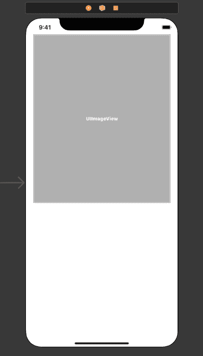
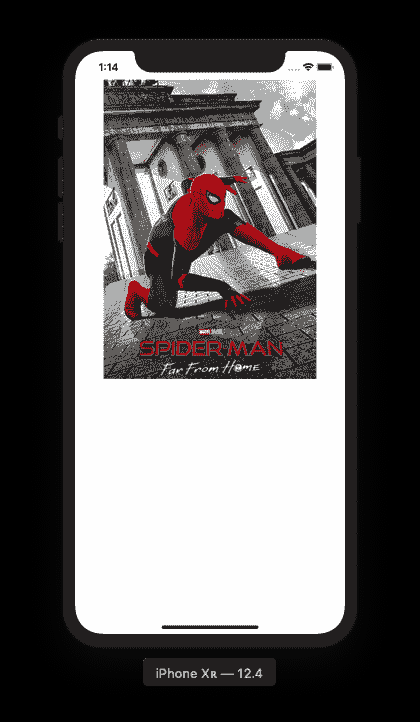

# 在没有 URLSession 的情况下从 Swift 中的 URL 加载图像

> 原文：<https://dev.to/shawonashraf/loading-images-from-urls-in-swift-without-urlsession-127g>

# 图片和网址

你写的是一个高级网站的前端。你必须从一个远程服务器加载图像，并且你有 url。你是做什么的？你抿了一口咖啡，咧嘴笑了笑，然后玩了些 HTML 花招。就像这样-

```
 
```

Enter fullscreen mode Exit fullscreen mode

就这样，白天(或夜晚)得救了，感谢飞天小女警们！哦，等等，你的图像标签！

# 这对于一个移动应用程序开发者来说怎么样？

应用程序开发者是一群不幸的人。他们享受不到网络开发者所拥有的美好事物。这是一种非常忧郁的方式，但他们的生活并不像加载带有 HTML 标签的图像那样简单。

# 好了，让我们回到正题

假设你想拥有和前端 web dev 一样的生活，也就是说你想在你的图像视图中从远程服务器加载图像，而不牺牲一个处女(实际上就是这样)，你怎么做呢？

# 准备中

创建单视图 iOS 项目。将一个`ImageView`添加到您的`View`中，并为它创建一个出口(如果您是初学者，按住 ctrl 并拖动它来创建一个变量)。如果你觉得有必要的话，可以增加一些约束，尽管这不是我们讨论的强制要求。

[](https://res.cloudinary.com/practicaldev/image/fetch/s--HXqBcmfT--/c_limit%2Cf_auto%2Cfl_progressive%2Cq_auto%2Cw_880/https://thepracticaldev.s3.amazonaws.com/i/ryv6copocp5243j4gwmo.png)

# 敬酒不吃吃罚酒- URLSessionDataTask

为此，您需要初始化一个 URLSession，然后创建并启动一个`datatask`，添加一个用于数据任务完成的`async`处理程序，然后设置图像。哦等等！您不能使用`main thread`来设置图像。你应该通过`dispatchqueue`启动一个单独的线程来实现。

```
func fetchImage(from urlString: String, completionHandler: @escaping (_ data: Data?) -> ()) {
    let session = URLSession.shared
    let url = URL(string: image_url)

    let dataTask = session.dataTask(with: url!) { (data, response, error) in
        if error != nil {
            print("Error fetching the image! 😢")
            completionHandler(nil)
        } else {
            completionHandler(data)
        }
    }

    dataTask.resume()
} 
```

Enter fullscreen mode Exit fullscreen mode

并将图像设置在一个`ImageView`(最后！)-

```
@IBOutlet weak var imageView: UIImageView!

func setImageToImageView() {
    fetchImage { (imageData) in
        if let data = imageData {
            // referenced imageView from main thread
            // as iOS SDK warns not to use images from
            // a background thread
            DispatchQueue.main.async {
                self.imageView.image = UIImage(data: data)
            }
        } else {
                // show as an alert if you want to
            print("Error loading image");
        }
    }
} 
```

Enter fullscreen mode Exit fullscreen mode

所有这一切，只是为了加载一个图像吗？

# 简单易行的方法

是的，有一个简单的方法。我们一直在独自做的事情是，我们从网络上获取资源(图像或任何东西)作为`Data`对象，然后根据我们的需要转换它们，无论是`image`还是`json`的大型转储。`Data`有一个`initializer`，你可以从一个`URL`的内容中创建它的一个对象。这可以让事情变得简单一点。我们去看看。

```
func setImage(from url: String) {
    guard let imageURL = URL(string: url) else { return }

    // just not to cause a deadlock in UI!
    DispatchQueue.global().async {
        guard let imageData = try? Data(contentsOf: imageURL) else { return }

        let image = UIImage(data: imageData)

        DispatchQueue.main.async {
            self.imageView.image = image
        }
    }
} 
```

Enter fullscreen mode Exit fullscreen mode

让我们用一个实际的图片 url 来测试一下。

```
// call inside viewDidLoad() or add some event handler
setImage(from: "https://image.blockbusterbd.net/00416_main_image_04072019225805.png") 
```

Enter fullscreen mode Exit fullscreen mode

# 看起来怎么样？

[](https://res.cloudinary.com/practicaldev/image/fetch/s--nSYDCey2--/c_limit%2Cf_auto%2Cfl_progressive%2Cq_auto%2Cw_880/https://thepracticaldev.s3.amazonaws.com/i/kn7a9img5yi28qvp9y7x.png)

# 的确如此，但要等待

一切都是有代价的，这个简单的方法也是如此。人们倾向于对网络请求使用强硬手段是有原因的(请注意，这不仅仅是为了图像)。那就是，如果你选择使用 URLSession 及其代理，Swift 可以让你实时观察网络操作的进度。这对于较大的网络请求来说很方便，可以让用户通过奇特的进度视图或其他方式了解进度。然而，对于上面的简单方法，没有办法做到这一点，除非你咬紧牙关自己写这样的东西。对于简单的图像加载，我们简单的方法会做得更好。然而，对于复杂的任务，你最好使用硬的方式。

*你也可以在[我的个人博客](https://shawonashraf.github.io/swift-imageview-from-url/)T3 上阅读这篇文章*

# 一首歌可以消暑吗？

[https://open.spotify.com/embed/track/4E54bVoiqqO5Afk2THY3qH](https://open.spotify.com/embed/track/4E54bVoiqqO5Afk2THY3qH)