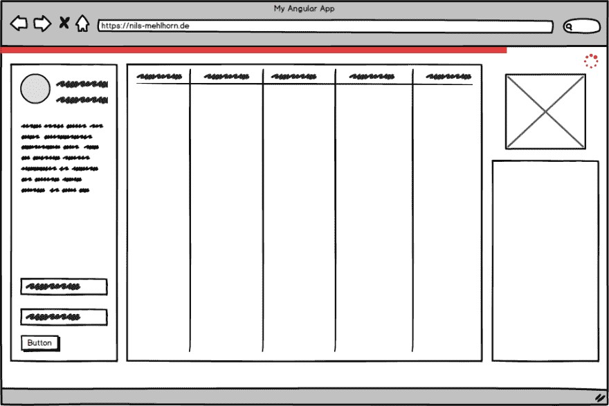
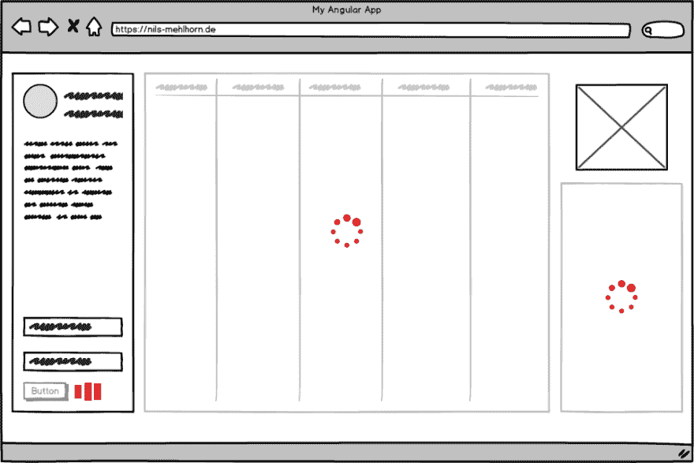

# 以角度表示的负载指示

> 原文：<https://dev.to/angular/loading-indication-in-angular-52b6>

<small>*原载于[nils-mehl horn . de](https://nils-mehlhorn.de/posts/indicating-loading-the-right-way-in-angular)2019 年 1 月 30 日*</small>

这是一个普遍的愿望:让一些东西旋转或飞来飞去来娱乐用户，而性能一般的后端从天知道哪里获取数据。虽然从 CodePen 借用一个[微调器并在您进行服务器往返时显示它似乎很容易，但是有一些常见的误解和陷阱，我们将予以澄清。](https://codepen.io/search/pens?q=spinner)

## 等待数据

让我们从一个常规任务开始:我们希望显示一个用户列表，该列表是通过服务异步获取的。一个没有经验但技术上很好的解决方案可能如下所示:

```
export class UserComponent implements OnInit  {

  users: User[]
  loading = false

  constructor(private userService: UserService) {}

  ngOnInit(): void {
    this.loading = true
    this.userService.getAll().pipe(
      finalize(() => this.loading = false)
    ).subscribe(users => this.users = users)
  }
} 
```

Enter fullscreen mode Exit fullscreen mode

一个实例变量用于保存用户，另一个用于表示用户是仍在加载还是已经到达的标志。在订阅之前——并因此启动异步调用——加载标志被更新。调用完成后，通过使用`finalize`操作符进行重置。传递给该操作符的回调将在可观察的调用完成后被调用——不管其结果如何。如果这只是在订阅回调中完成，加载标志将只在成功调用后重置，而不是在出错的情况下。相应的视图可能是这样的:

```
<ul *ngIf="!loading">
  <li *ngFor="let user of users">
    {{ user.name }}
  </li>
</ul>
<loading-indicator *ngIf="loading"></loading-indicator> 
```

Enter fullscreen mode Exit fullscreen mode

然而，对于大多数提供直接显示到视图中的数据的调用，可以使用 [AsyncPipe](https://angular.io/api/common/AsyncPipe) 来简化这种设置。我们的组件将被缩短为以下:

```
export class UserComponent implements OnInit  {

  users$: Observable<User[]>

  constructor(private userService: UserService) {}

  ngOnInit(): void {
    this.users$ = this.userService.getAll()
  }
} 
```

Enter fullscreen mode Exit fullscreen mode

现在，组件直接向视图公开用户流。我们将使用`async as`语法更新视图，以便
在流发出
后将流的值绑定到一个单独的`users`变量

```
<ul *ngIf="users$ | async as users; else indicator">
  <li *ngFor="let user of users">
    {{ user.name }}
  </li>
</ul>
<ng-template #indicator>
  <loading-indicator></loading-indicator>
</ng-template> 
```

Enter fullscreen mode Exit fullscreen mode

通过为`*ngIf`的`else`块提供视图模板，我们不必再显式地管理加载标志。这种方法更具声明性，因为它通过 if-else 连接来连接两种视图状态，而不是使用两个单独的 if 块。此外，我们不再需要自己管理流的订阅，因为这是由管道完成的(包括在组件被销毁时取消订阅)。

## 等待行动

当我们处理像点击按钮创建新用户这样的操作时，AsyncPipe 让我们失望。当您无法将可观察对象通过管道传输回视图时，您必须在组件内部进行订阅。

首先，虽然有些人可能不同意，但我认为这次使用国旗方法是有效的。不要追随那些谴责丝毫冗余的假先知。很多时候，应该让代码易于理解、测试，并且[删除](https://programmingisterrible.com/post/139222674273/write-code-that-is-easy-to-delete-not-easy-to)，而不是以尽可能少的行数结束。所以，这样做是很好的:

```
<button (click)="create()">Create User</button>
<div *ngIf="loading">
  Creating, please wait <loading-indicator></loading-indicator>
</div> 
```

Enter fullscreen mode Exit fullscreen mode

```
export class UserComponent  {

  loading: boolean

  constructor(private userService: UserService) {}

  create(name = "John Doe"): void {
    this.loading = true
    this.userService.create(new User(name)).pipe(
      finalize(() => this.loading = false)
    ).subscribe()
  }
} 
```

Enter fullscreen mode Exit fullscreen mode

现在，让我们看看，如果您坚决反对在每个组件中显式切换加载标志的那两行代码，我们能做些什么。

### 拦截机进场

我看到有人建议使用一个 [HttpInterceptor](https://angular.io/api/common/http/HttpInterceptor) 来观察当前是否有任何呼叫正在被处理。这样的拦截器可以看起来像这样:

```
@Injectable()
export class LoadingInterceptor implements HttpInterceptor {
  constructor(private loadingService: LoadingService) {}

  intercept(req: HttpRequest<any>, next: HttpHandler): Observable<HttpEvent<any>> {
    // you could also check for certain http methods here
    this.loadingService.attach(req);
    return next.handle(req).pipe(
      finalize(() => this.loadingService.detach(req)),
    );
  }
} 
```

Enter fullscreen mode Exit fullscreen mode

通过这种实现，当请求开始时，通过`attach(req)`通知单独的 LoadingService。一旦请求完成——无论结果如何——这个服务将再次通过`detach(req)`得到通知。该服务可以在每次调用时检查是否还有任何打开的请求，从而管理一个**全局**加载标志。

我自己也用过这种方法——甚至在 AngularJS 的时候。
虽然我认为这是一种体面的方法，给用户一个应用程序加载时的通用指示，但你真的需要
考虑三件事:

1) **你失去了特异性。**因为你没有一个针对每个请求的加载标志，而是一个全局标志，所以你不能确定哪个请求还在花费时间。虽然您可以将服务注入到您的任何组件中，并以这种方式显示本地指示，但您真正拥有的信息是在全局应用程序级别上。将它用作单个请求的指示器在语义上是错误的。

2) **用户打算用全局装载指示做什么？**只要你的应用程序中的*任何东西*还在加载，你就禁用*任何东西*吗？用户应该等到你的全局指示完成吗？如果一个与用户当前任务无关的请求被卡住了怎么办？

3) **你们真是奇怪的一对**。您已经将 HTTP 调用隐藏在服务后面，并小心地将它们与视图逻辑分开，这样您现在就可以在自己的背后进行了。我不会完全谴责，只是想一想。

### 知道自己想要什么

如果您对拦截器方法的权衡比较满意，那么您可以将它用于全局指示，比如从应用程序窗口的左上角到右上角的进度条，如下图所示。

<figure>

[](https://res.cloudinary.com/practicaldev/image/fetch/s--ooArIcH3--/c_limit%2Cf_auto%2Cfl_progressive%2Cq_auto%2Cw_880/https://thepracticaldev.s3.amazonaws.com/i/r7zbn97jwdbq8myc1nzb.png)

<figcaption>Global Loading Indication</figcaption>

</figure>

一些主流应用程序正在这样做，看起来有点花哨，已经有几个教程和不错的库在那里完全关注这种行为。

尽管如此，如果我们想告诉用户到底是什么在浪费他的时间，或者甚至同时禁用某些交互(同样，如下图所示)，我们必须想出别的办法。

<figure>

[](https://res.cloudinary.com/practicaldev/image/fetch/s--xrVuZenT--/c_limit%2Cf_auto%2Cfl_progressive%2Cq_auto%2Cw_880/https://thepracticaldev.s3.amazonaws.com/i/9gt8b53nqbch7p8ycx5d.png)

<figcaption>Contextual Loading Indication</figcaption>

</figure>

了解两者的区别至关重要。否则，您可能会指出您的表单操作(例如图中的左下方)仍然在加载，尽管另一个来自页面上其他地方的调用(例如图中最右边的小部件)才是真正的罪魁祸首。

不要被简单所迷惑，相反，要知道你想要什么，然后我们才能想出如何建造它。

### 反应式语境方法

如果您想要特定的上下文加载指示，而不需要显式翻转加载标志，您可以使用 RxJS 操作符来实现。从 RxJS 6 开始，你可以用纯函数的形式定义你自己的操作符。首先，我们将有一个在订阅时调用回调的操作符。这可以使用 RxJS 方法[延迟](https://rxjs-dev.firebaseapp.com/api/index/function/defer) :
来完成

```
export function prepare<T>(callback: () => void): (source: Observable<T>) => Observable<T> {
  return (source: Observable<T>): Observable<T> => defer(() => {
    callback();
    return source;
  });
} 
```

Enter fullscreen mode Exit fullscreen mode

现在我们创建另一个操作符，接受 subject 作为加载状态的接收器。使用我们新创建的`prepare`操作符，我们将在通过`indicator.next(true)`订阅实际的源流时更新这个主题。同样，我们使用`finalize`操作符通过`indicator.next(false)` :
通知它加载完成

```
export function indicate<T>(indicator: Subject<boolean>): (source: Observable<T>) => Observable<T> {
  return (source: Observable<T>): Observable<T> => source.pipe(
    prepare(() => indicator.next(true)),
    finalize(() => indicator.next(false))
  )
} 
```

Enter fullscreen mode Exit fullscreen mode

然后，我们可以在组件中使用新的`indicate`操作符，如下所示:

```
export class UserComponent  {
  loading$ = new Subject<boolean>()

  constructor(private userService: UserService) {}

  create(name = "John Doe"): void {
    this.userService.create(new User(name))
    .pipe(indicate(this.loading$))
    .subscribe()
  }
} 
```

Enter fullscreen mode Exit fullscreen mode

```
<button (click)="create()">Create User</button>
<div *ngIf="loading$ | async">
  Creating, please wait <loading-indicator></loading-indicator>
</div> 
```

Enter fullscreen mode Exit fullscreen mode

我已经在 StackBlitz 上将这些片段组合成了一个完整的例子。重新加载以查看第一个指标，单击“创建用户”以查看第二个指标。此外，不要被 StackBlitz 的蓝色指示器分散注意力，我们的指示器是红色的。

[https://stackblitz.com/edit/ng-loading-indication?embed=1&view=preview&](https://stackblitz.com/edit/ng-loading-indication?embed=1&view=preview&)