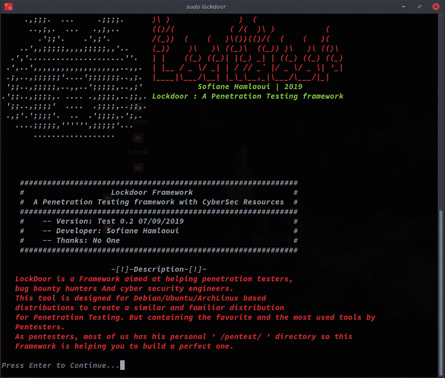
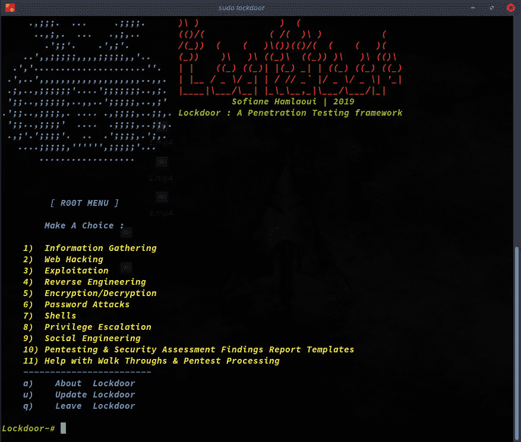
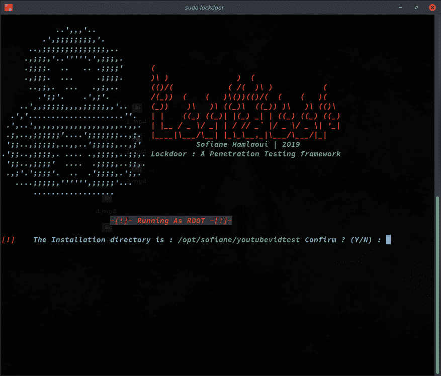

# Lockdoor 框架:一个带有网络安全资源的渗透测试框架(Sofiane…

> 原文：<https://dev.to/sofianehamlaoui/lockdoor-framework-a-penetration-testing-framework-with-cyber-security-resources-sofiane-b63>

### 🔐Lockdoor 框架:一个带有网络安全资源的渗透测试框架(Sofiane Hamlaoui)

### **锁门**？

Lockdoor，首先让我们从解释这个(有点)奇怪的名字开始。经过几天的思考，我让我最好的朋友(拉菲克)给我推荐一个关于网络安全、IT 领域等等的工具的名字！他首先想到的是洛克杜尔！我就像…嗯，我们走吧！

### **这种想法？**

在 Lockdoor 之前，我有一个 shell 脚本，可以从 Github 下载我需要的所有工具，从其他 Github 仓库下载公共工具，从我的仓库下载私有工具。这样我就可以定制、添加和删除工具等等。

有一天(07/09/2019)我说，为什么不制作一个框架并与他人分享，这样我就可以学习、分享并可能发现我甚至不知道的新工具！正是在这个正确的时刻！Lockdoor 诞生了:“”。

### Lockdoor 框架？

*Lockdoor*是一个旨在帮助渗透测试人员、bug 赏金猎人和网络安全工程师的框架。这个工具是为基于 Debian/Ubuntu/ArchLinux 的发行版设计的，为渗透测试创建一个相似和熟悉的发行版。但是包含了 Pentesters 最喜欢和最常用的工具。

作为 pentesters，我们大多数人都有自己的“/pentest/”目录，所以这个框架可以帮助你建立一个完美的目录。

### 新工具？

是的，我们都知道有很多像 lockdoor 这样的框架和类似工具，所以我的附加值(使 lockdoor 与众不同的地方)是添加 pentesters 最喜欢和最常用的工具，自动化 Pentesting 流程以帮助您更快地完成工作，这是最棒的部分！备忘单和资源！

所以，是的，这就是使 lockdoor 成为一个不同的新工具。

### Okey？

1.0Beta 版本的测试视频(在 Youtube 上) :

[https://www.youtube.com/embed/_agvb29FQrs](https://www.youtube.com/embed/_agvb29FQrs)

### 截图:

### 什么工具？

1.0 测试版具有:

*   信息合成工具(21)
*   网络黑客工具(15)
*   逆向工程工具(15)
*   开发工具(6)
*   测试和安全评估结果报告模板(6)
*   密码攻击工具(4)
*   Shell 工具+ Blackarch 的 Webshells 集合(4)
*   走查和测试处理助手(3)
*   加密/解密工具(2)
*   社会工程工具(1)
*   所有您需要的权限提升脚本和利用

### 接下来是什么？

嗯！增加更多的工具、资源、备忘单，让测试员的生活更轻松❤

> 更多:用这个星球上最详细的自述文件检查 Github 上的 Lockdoor 框架 Github Repo(我不确定那个！随便说说)

[SofianeHamlaoui/lock door-Framework](https://github.com/SofianeHamlaoui/Lockdoor-Framework)

我的 twitter 账户:

[Sofia hamlaoui](https://twitter.com/S0fianeHamlaoui)