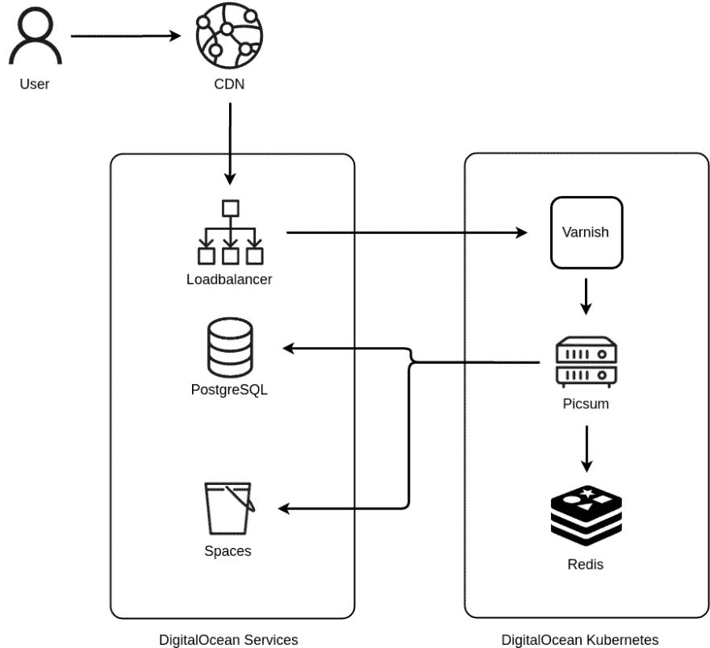

# Lorem Picsum，百万像素千兆比特的死亡

> 原文：<https://dev.to/dmarby/lorem-picsum-death-by-a-million-pixel-gigabits-jgm>

或者如何在预算有限的情况下每月提供 5 亿张占位符图片。

Lorem Picsum 是互联网上最受欢迎的占位网站之一。它开始于五年前用 NodeJS编写的一个小项目，以满足我自己的需求，随着它的发展，已经经历了几次迭代。在这篇文章中，我将介绍它的架构和内部工作原理。

## 挑战

处理图像非常耗费 CPU 资源。由于 Lorem Picsum 的预算非常少，随着服务变得越来越受欢迎，要处理所有的请求，我们希望尽可能避免这样做。这意味着将缓存添加到架构的多个层中。我们添加了两个独立的缓存层:一个 CDN 在前面，另一个缓存层使用 [Varnish Cache](https://varnish-cache.org/) 。为了使图像处理尽可能高效，我们决定使用 [libvips](https://libvips.github.io/libvips/) ，因为它非常快速且资源高效。

作为尽可能使 Lorem Picsum 易于使用的一部分，我们从未要求任何注册、API 密钥或强制任何使用限制。这通常工作得很好，但是偶尔一个高流量站点部署调用我们的 API 的生产代码，通常是偶然的，这导致两个主要问题:

*   服务的极端负载:一个站点在无法提供图像时使用 Lorem Picsum 作为后备图像。在某个时候，他们的图像服务中断了，导致每个月有几亿个请求点击 Lorem Picsum，而他们却没有注意到。然而，我们一联系他们，他们就很快纠正了这个错误。
*   隐私问题。在过去，一些网站在制作的每个页面上都包含了 Lorem Picsum 的图片，通过引用标题中的 URL 泄露了用户信息和活动。

虽然我们允许使用 Lorem Picsum 做几乎任何事情，但当有人使用这项服务到了不稳定/负载非常高的程度时，我们会尝试联系他们并要求他们停止使用。这种方法通常效果很好，而且在大多数情况下，这种用法是偶然的。然而，在少数情况下，我们没有收到对此类尝试的响应，这导致我们需要在缓存层中阻止这些网站。

## 建筑

Lorem Picsum 被设计成无状态的，运行在 Kubernetes 之上。整个系统由几个不同的组件组成，如上图所示。

当用户请求图像时，请求从我们的 CDN 开始。在 CDN 缓存未命中时，该请求继续发送到我们的[负载平衡器](https://dev.to/blog/lorem-picsum/#load-balancer)，在那里它被转发到我们的[缓存层](https://dev.to/blog/lorem-picsum/#caching)，在缓存未命中时，它被传递到[应用](https://dev.to/blog/lorem-picsum/#application)。[应用](https://dev.to/blog/lorem-picsum/#application)验证所请求的图像存在于[图像数据库](https://dev.to/blog/lorem-picsum/#image-database)中，并检查图像是否被[图像存储缓存](https://dev.to/blog/lorem-picsum/#image-storage-cache)缓存。如果没有，它从[图像存储器](https://dev.to/blog/lorem-picsum/#image-storage)中获取图像，处理图像并将其返回给用户。

#### 负载均衡

我们使用 [DigitalOcean 的负载平衡器](https://www.digitalocean.com/products/load-balancer/)来处理传入的请求，并将它们传递到我们的缓存层。

#### 缓存

为了减少系统的负载，在我们的 CDN 提供的缓存之上，我们使用 [Varnish Cache](https://varnish-cache.org/) 来缓存处理过的图像。这也允许我们通过使用优化来更有效地缓存，比如重写查询参数。

#### 申请

用 [Go](https://golang.org/) 编写的 Lorem Picsum 应用程序负责处理图像并为网站提供文件。网站是在构建期间使用 [Gulp](https://gulpjs.com/) 静态生成的。

#### 图像数据库

为了存储图像的信息，比如宽度和高度，我们使用了 [PostgreSQL](https://www.postgresql.org/) 。我们使用 [DigitalOcean 的托管数据库](https://www.digitalocean.com/products/managed-databases)来避免自己维护和扩展。

#### 图像存储

我们使用一个对象存储器来存储源图像，即[数字海洋空间](https://www.digitalocean.com/products/spaces/)。

#### 图像存储缓存

我们将所有源图像存储在 [Redis](https://redis.io/) 中，以避免在每次请求时从图像存储中获取它们。

## 编排

我们使用 [Terraform](https://www.terraform.io/) 进行编排；设置和配置数字海洋上的所有服务。这允许在 git repo 中对任何更改进行版本控制，并在需要时轻松地重新创建环境。

## 开源

Lorem Picsum 是完全开源的，并得到了 MIT 的许可。源代码和文档可以在 [GitHub repo](https://github.com/DMarby/picsum-photos) 中找到。

## 感谢

没有[数字海洋](https://www.digitalocean.com)的支持，Lorem Picsum 就不会存在。非常感谢他们在过去的四年里为 Picsum 提供了基础设施。