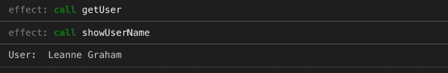
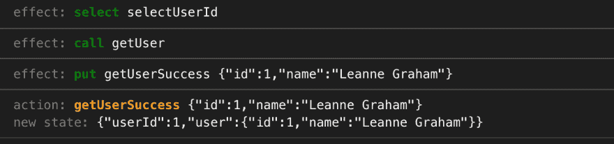
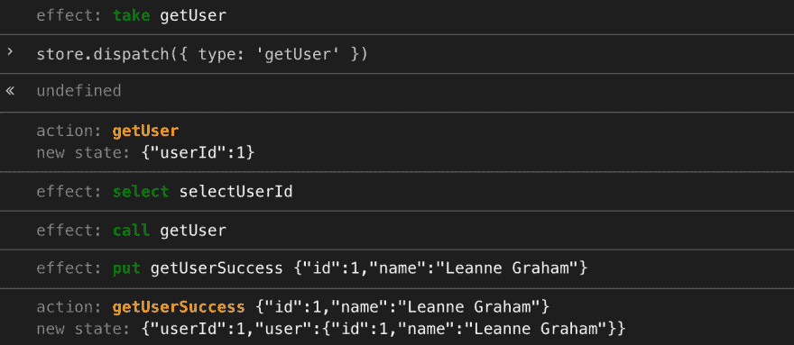
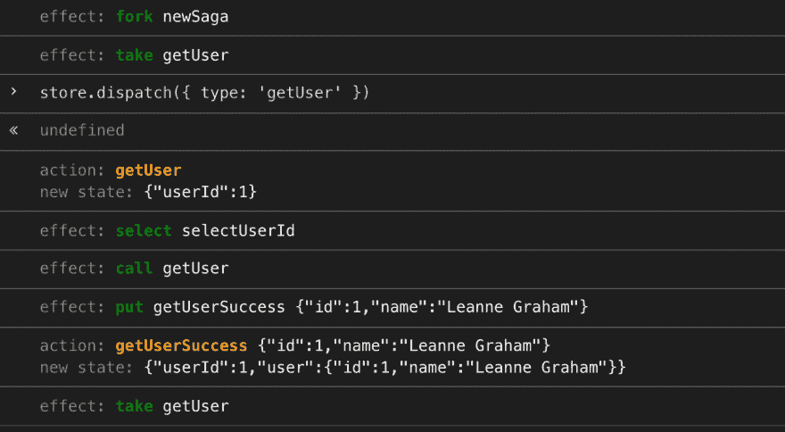

# 与 Redux 和 sagas 一起迷失？自己落实！

> 原文：<https://dev.to/scastiel/lost-with-redux-and-sagas-implement-them-yourself-1cj3>

您可以每天使用 React、Redux 或 Redux-Saga 等库。你可以非常高效地使用它。你可以告诉别人为什么它好或不好，以及他们是否应该使用它。但与此同时，你可能会觉得这有点神奇。它在引擎盖下做了很多，你无法解释它是如何工作的。这使得调试、测试或者只是使用它的所有特性变得困难。

我曾经和 Redux-Saga 一起生活过。在我看来，理解一个库如何工作的最好方法之一就是自己尝试实现它。显然是它的简约版。

*本文不是对 Redux 或 Redux-Saga 的介绍。网上有很多，包括他们各自的官方文档( [Redux](https://redux.js.org/basics/basic-tutorial) 、 [Redux-Saga](https://redux-saga.js.org/docs/introduction/BeginnerTutorial.html) )。我想你已经知道了一些基本知识，但还想知道更多关于里面真正的东西。*

在本文中，我将向您展示如何编写 Redux 和 Redux Saga 的基本实现。如果您在 React 项目中使用它们，您会发现它们并不像看起来那么神奇。

如果你想马上看到结果，最终的源代码和样本可以在这个沙箱中[获得。](https://codesandbox.io/embed/thirsty-glade-0g196)

## 用 Redux 创建商店

Redux 的基本概念是商店。要创建一个，你需要一个缩减器和一个初始状态。如果我们假设初始状态是由归约器在没有状态提供给他时返回的内容决定的，我们可以定义一个`createStore`函数，只取一个归约器作为参数:

```
const createStore = reducer => ({
  state: reducer(undefined, 'redux-init')
  // ...
}) 
```

当我们想要分派一个动作时，存储必须更新它的状态，使用 reducer 来获得它的新值:

```
dispatch(action) {
  this.state = reducer(this.state, action)
} 
```

基本功能在这里，但是如果我们不能订阅状态更新，我们的存储就没什么用了。为了处理这些订阅，我们将使用一个可公开访问的*事件发射器*。类似地，我们将为动作提供一个事件发射器；我们将在实现 Redux-Saga 时使用它。

```
import { EventEmitter } from 'events'

export const createStore = reducer => ({
  state: reducer(undefined, 'redux-init'),
  stateEmitter: new EventEmitter(),
  actionsEmitter: new EventEmitter(),

  dispatch(action) {
    this.state = reducer(this.state, action)
    this.actionsEmitter.emit(action.type, action)
    this.stateEmitter.emit('new_state')
  }
}) 
```

就是这样。这对你来说是不是太容易了？让我们试试看它是否真的有效。

让我们首先创建一个减速器:

```
const initialState = { name: undefined }

const reducer = (state = initialState, action) => {
  switch (action.type) {
    case 'setName':
      return { ...state, name: action.payload }
    default:
      return state
  }
} 
```

然后，让我们创建我们的商店，并使其全球可用，这样我们就可以在控制台上玩它:

```
const store = createStore(reducer)
window.store = store 
```

在控制台中，我们可以检查我们的状态是否被正确初始化，然后订阅状态更新，并调度一个动作:

```
> store.state
Object {name: undefined}
> store.stateEmitter.on('new_state', () => console.log('New state:', store.state))
EventEmitter {...}
> store.dispatch({ type: 'setName', payload: 'Jean Valjean' })
undefined
New state: Object {name: "Jean Valjean"} 
```

一切看起来都很好，对吗？而我们的 Redux 实现只有十行代码！当然，实际的 Redux 有更多的功能或优化。比如[中间件](https://redux.js.org/advanced/middleware)。尽管添加到我们的实现中并不复杂，但是如果你有灵感的话😉

第二个任务，重写 Redux-Saga。这有点复杂，因为库的基本概念本身更难理解。

## 实现还原传奇效果

首先要知道:传奇是发生器函数。说的快一点，一种遇到`yield`指令就停止执行，之后马上恢复的功能🤔。如果你想深入了解它们，我建议你阅读*中的[发电机章节，或者也许只是看看](https://exploringjs.com/es6/ch_generators.html)[有哪些宝贝将发电机功能传递给了](https://babeljs.io/repl/#?babili=false&browsers=&build=&builtIns=false&spec=false&loose=false&code_lz=GYVwdgxgLglg9mAVAAgLYE8DiBTM2BOAhlHPgBRgCUyA3gFDLLozYA2AJsmMgNTICMDJiw5deyAExD82KCHzdufAMx0AvnSA&debug=false&forceAllTransforms=false&shippedProposals=false&circleciRepo=&evaluate=false&fileSize=false&timeTravel=false&sourceType=module&lineWrap=true&presets=es2015%2Creact%2Cstage-2&prettier=false&targets=&version=7.5.5&externalPlugins=)。再说一次，这没什么神奇的！*

 *当你理解了*效果*的概念后，应用于传奇的生成器可能更容易得到。Sagas 必须是纯函数，即不会触发副作用，例如发出 HTTP 请求、记录某些内容或访问商店。一个传奇的诀窍是用某种消息来停止它的执行，比如“我需要在状态中读取这个值，当你有了它的时候再来找我”。这个消息是一个效果。

Redux-Saga 提供了一些我们将自己实现的基本效果:

*   `select`:用选择器读取状态
*   `call`:调用一个函数(可能是异步的)
*   `put`:分派一个动作
*   `take`:等待特定动作类型的动作
*   `fork`:用新的执行环境创造新的传奇

效果实际上是对象(动作也是)，所以每种类型的效果都有自己的助手来更容易地创建它们:

```
export const take = actionType => ({ type: 'take', actionType })
export const select = selector => ({ type: 'select', selector })
export const call = (fn, ...args) => ({ type: 'call', fn, args })
export const put = action => ({ type: 'put', action })
export const fork = (saga, ...args) => ({ type: 'fork', saga, args }) 
```

对于真正的 Redux-Saga，通过创建一个中间件并将其添加到 Redux store 来运行 Saga。在我们的实现中，为了简单起见，我们将创建一个函数`runSaga`，将商店和传奇作为参数:

```
export async function runSaga(store, saga, ...args) {
  // ...
} 
```

现在是时候处理我们的传奇和它引发的影响了。

## 调用具有`call`效果的函数

理解 sagas 和 JavaScript 的生成器函数的更简单的方法是记住它们基本上返回一个迭代器。迭代器返回的每个值都是一个效果，我们用效果期望的响应调用迭代器的下一个值:

```
const it = saga() // saga is a generator function: function* saga() { ...
let result = it.next() // result has `done` and `value` attributes
while (!result.done) {
  const effect = result.value
  // do something with the effect
  result = it.next(/* value we want to return to the saga */)
} 
```

让我们用`runSaga`的第一个实现来说明这一点，现在只处理`call`效果:

```
export async function runSaga(store, saga, ...args) {
  try {
    const it = saga(...args)

    let result = it.next()
    while (!result.done) {
      const effect = result.value
      // See `logEffect` function in src/logger.js
      // at https://codesandbox.io/embed/thirsty-glade-0g196.
      logEffect(effect)

      switch (effect.type) {
        case 'call':
          result = it.next(await effect.fn(...effect.args))
          break

        default:
          throw new Error(`Invalid effect type: ${effect.type}`)
      }
    }
  } catch (err) {
    console.error('Uncaught in runSaga', err)
  }
} 
```

我们基本上像处理任何迭代器一样处理 saga 返回的迭代器。根据效果，我们决定做什么。这里我们调用由`call`效果引用的函数以及相关的参数:

```
result = it.next(await effect.fn(...effect.args)) 
```

*注意，我们使用`await`来等待承诺被解决(它甚至对非承诺值也有效，这对我们有好处！).`await`与`yield`指令有相似之处，在`async` / `await`语法登陆 ES2015+之前，[部分库](https://github.com/tj/co)使用生成器函数模拟。*

让我们通过一个例子来使用第一个实现。

```
export const getUser = async id => {
  const res = await fetch(`https://jsonplaceholder.typicode.com/users/${id}`)
  const response = await res.json()
  return { id: response.id, name: response.name }
}

const showUserName = user => {
  console.log('User:', user.name)
}

function* mySaga() {
  const user = yield call(getUser, 1)
  yield call(showUserName, user)
}

// I created a basic store, you can find it in src/samples/store.js
// at https://codesandbox.io/embed/thirsty-glade-0g196.
runSaga(store, mySaga) 
```

通过运行此示例，您应该会在控制台中看到类似这样的内容:

[](https://res.cloudinary.com/practicaldev/image/fetch/s--QuWEa3fc--/c_limit%2Cf_auto%2Cfl_progressive%2Cq_auto%2Cw_880/https://thepracticaldev.s3.amazonaws.com/i/npb7j81h9sgp83fteghq.png)

正如你所看到的，我们的`runSaga`函数首先拦截了一个`call`效果，称为`getUser`函数，并等待结果，因为它是一个异步函数。然后用第二个`call`效果调用`showUserName`功能。

## 用`select`和`put`效果读写存储

由于`select`和`put`的影响，下一步是能够从存储中读取和写入。现在我们有了处理效果的样板文件，理解起来应该不会太复杂。

```
case 'select':
  result = it.next(effect.selector(store.state))
  break

case 'put':
  store.dispatch(effect.action)
  result = it.next()
  break 
```

对于`select`效果，我们只是调用给定的选择器，将状态作为参数传递给它。对于`put`类，我们调度给定的动作。让我们通过改进我们的样本来测试这些效果。

现在我们的 saga 将从状态中获取一个用户 ID，然后调用一个 API 来获取用户信息，最后调度一个动作来将这些信息保存在状态中。

```
function* mySaga() {
  const userId = yield select(state => state.userId)
  const user = yield call(getUser, userId)
  yield put({ type: 'getUserSuccess', payload: user })
} 
```

现在，您应该会在控制台中看到类似这样的内容:

[](https://res.cloudinary.com/practicaldev/image/fetch/s--I4-k_01f--/c_limit%2Cf_auto%2Cfl_progressive%2Cq_auto%2Cw_880/https://thepracticaldev.s3.amazonaws.com/i/c66xiqoz0xkmbbc8jzcz.png)

这很管用，你会承认这种传奇故事很常见。但是仍然缺少一些东西。当你写传奇时，你想对某些行为做出反应。在这里，我们只是运行了我们的传奇，但是我们如何才能只在给定的动作发生时运行这个过程呢？

通常我们会使用`takeEvery` helper 来告诉 Redux-Saga 我们想要在分派给定类型的动作时执行一些 Saga。但是在能够实现`takeEvery`之前，我们需要实现两个基础效果:`take`和`fork`。

## 等待具有`take`效果的特定动作

特效等待任何一个给定类型的动作，然后才继续播放。在我们的例子中，我们希望仅当类型为“getUser”的动作发生时才获取用户信息。

实现`take`效果并不难，我们只需要订阅我们商店的 actions 事件发射器`actionsEmitter`，用下一个匹配的动作恢复迭代器。通过使用基于承诺的方法，看起来像这样:

```
case 'take':
  const action = await new Promise(
    resolve => store.actionsEmitter.once(effect.actionType, resolve)
  )
  result = it.next(action)
  break 
```

现在，我们可以更新我们的传奇，只在“get user”操作上获取用户信息:

```
function* mySaga() {
  yield take('getUser')
  const userId = yield select(state => state.userId)
  const user = yield call(getUser, userId)
  yield put({ type: 'getUserSuccess', payload: user })
}

// ...
// Dont’t forget to make the store available for tests:
window.store = store 
```

你会注意到在控制台中我们只触发了一个效果:第`take`个。您将不得不分派一个“getUser”操作，以便执行 saga 的其余部分:

[](https://res.cloudinary.com/practicaldev/image/fetch/s--C0IxWgcA--/c_limit%2Cf_auto%2Cfl_progressive%2Cq_auto%2Cw_880/https://thepracticaldev.s3.amazonaws.com/i/yiofe5s09yfq9georthz.png)

这几乎是完美的，但是如果你尝试第二次调度相同的动作，你会注意到什么都没有发生…这是因为`take`只订阅了给定类型的下一个动作，而不是所有的动作。对每个“getUser”操作做出反应的一个解决方案是将我们的故事包装成一个无限循环:

```
function* mySaga() {
  while (true) {
    yield take('getUser')
    const userId = yield select(state => state.userId)
    const user = yield call(getUser, userId)
    yield put({ type: 'getUserSuccess', payload: user })
  }
} 
```

它工作得很好，不要担心它实际上不是我们倾向于禁止的那种无限循环，它只是一个无限迭代器。传奇永远不会终止，但是循环的内容将只在每个“getUser”动作调度时执行一次。

然而，它仍然不是完美的。如果我们想订阅两种操作类型，比如说“getUser”和“getDocuments”。`take`特效阻止了传奇的执行，所以不可能写:

```
while (true) {
  yield take('getUser')
  // do something for user

  yield take('getDocuments')
  // do something with documents
} 
```

这是可能的，但是它不会给出预期的行为。它只是交替处理两种动作类型。

为了能够用`take`处理几个动作，我们需要能够分叉我们的 saga 来创建几个执行上下文。这就是`fork`效应的意义所在。

## 用`fork`效果叉开当前传奇

虽然这可能是最难理解的效果，也是最难实现的真实用法(在真实的 Redux-Saga 中)，但我们的实现将非常简单。

```
case 'fork':
  runSaga(store, effect.saga, ...effect.args)
  result = it.next()
  break 
```

基本上，我们只是再次调用我们的`runSaga`函数，开始一个新的执行。当分叉一个传奇时，你给另一个传奇作为参数执行。两个 saga(初始的和新的)都将继续独立运行。所以现在可以写:

```
function* usersSaga() {
  while (true) {
    yield take('getUser')
    // do something for user
  }
}

function* documentsSaga() {
  while (true) {
    yield take('getDocuments')
    // do something with documents
  }
}

function* mySaga() {
  yield fork(usersSaga)
  yield fork(documentsSaga)
} 
```

三个 sagas 将并行运行:一个用于用户，一个用于文档，还有一个是主要的。请注意，主线程很快终止。

分叉一个传奇，创建无限循环和等待一个给定的动作类型是很常见的。但是如果你不记得经常使用`fork`和`take`，那可能是因为你更喜欢使用非常有用的`takeEvery`。

## 用`takeEvery`对具体行动做出反应

`takeEvery`只是一个帮助者，让我们更容易实现所做的事情。对于给定的动作类型，它派生出 saga，创建一个无限循环，采用该类型的所有动作，并运行新的 saga，将动作作为参数传递给它。

```
export function* takeEvery(actionType, saga) {
  yield fork(function* newSaga() {
    while (true) {
      const action = yield take(actionType)
      yield* saga(action)
    }
  })
} 
```

注意`yield*`指令的使用。这里我们不想触发一个效果，我们只想在相同的执行上下文中执行这个传奇。我们也用`yield*`来称呼`takeEvery`。看看我们传奇的最终版本:

```
function* userSaga() {
  const selectUserId = state => state.userId
  const userId = yield select(selectUserId)
  const user = yield call(getUser, userId)
  yield put({ type: 'getUserSuccess', payload: user })
}

function* mySaga() {
  yield* takeEvery('getUser', userSaga)
} 
```

*注:在 real Redux-Saga 中不一定要用`yield*`，用`yield`即可。这是因为当一个效果被触发时，它们的实现会仔细检查这个效果是否是一个生成器函数。如果是，就把它当作是用`yield*`叫的。*

正如你所看到的，在这个实现中`takeEvery`并不是一个真正的效果，只是一个触发其他效果的助手。

控制台中的跟踪非常有趣:

[](https://res.cloudinary.com/practicaldev/image/fetch/s--m6oduS-d--/c_limit%2Cf_auto%2Cfl_progressive%2Cq_auto%2Cw_880/https://thepracticaldev.s3.amazonaws.com/i/pi896zmijlrapvevn6or.png)

在我们分派任何东西之前，saga 被分叉(`fork`)并等待一个“getUser”动作(`take`)。当我们分派动作时，`select`、`call`和`put`效果被触发，然后传奇等待下一个“getUser”动作。

我们的 Redux Saga 实现和本文到此结束。带有示例的最终代码可在这个[代码沙箱](https://codesandbox.io/embed/thirsty-glade-0g196)中获得。

## 那都是乡亲们！

我希望看完这篇文章你能更好地理解 Redux 和 Redux Saga。您知道目标不是学习如何创建自己的实现并在生产中使用它们。

但是现在你可以看到，这些库中没有任何神奇之处，大多数开源库中也没有。通过学习如何重写极简和简单的实现，你会发现它们并不像看起来那么复杂，即使对于有经验的开发人员来说也是如此。

Redux 和 Redux Saga(和 React too)之所以伟大，不是因为有人发明了非常复杂的概念，而是因为有人花了大量时间创造简单的概念来解决复杂的问题。

*这篇文章最初发表在我的博客上。非常感谢马文的评论。查一下[他的博客](https://acodingdance.io/)，也很牛逼！**