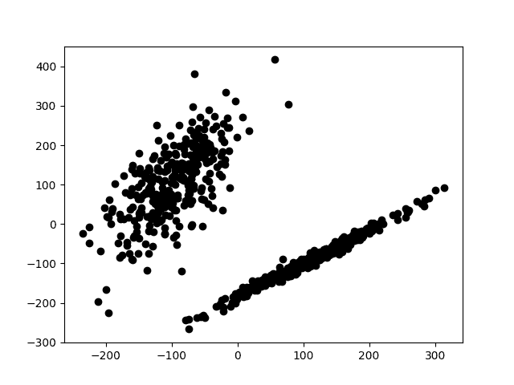
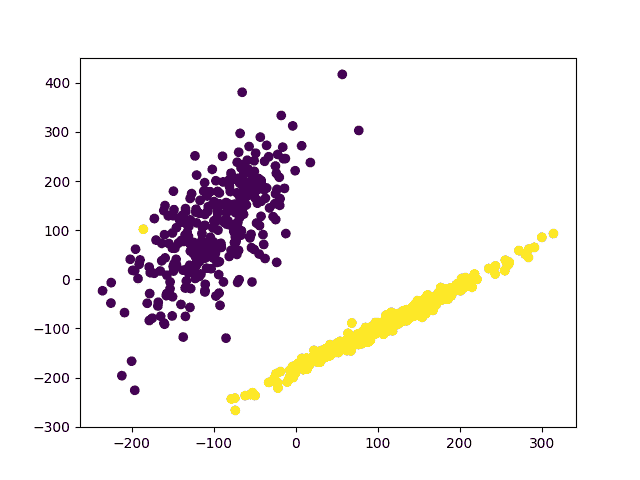

# 机器学习，分类解释

> 原文：<https://dev.to/petercour/machine-learning-classification-explanation-29bj>

有数据吗？机器学习让你玩数据。在本文中，我们将使用 Python ( [为什么使用 Python 进行机器学习](https://pythonbasics.org/why-python-for-machine-learning/))

数据可以用算法分类。所以你首先需要的是数据。你可以测量物体并收集数据。

例如，假设你有这些测量值。(每次测量 2 个值)。

[](https://res.cloudinary.com/practicaldev/image/fetch/s--R7-52PTd--/c_limit%2Cf_auto%2Cfl_progressive%2Cq_auto%2Cw_880/https://thepracticaldev.s3.amazonaws.com/i/5d2o7kuuslornmhm3nln.png)

从表面上看，很明显有两个等级。一种算法可以找到这两类。

[](https://res.cloudinary.com/practicaldev/image/fetch/s--3QYWSd0W--/c_limit%2Cf_auto%2Cfl_progressive%2Cq_auto%2Cw_880/https://thepracticaldev.s3.amazonaws.com/i/p5k59xspxwvrh2gyxd8x.png)

然后，给定两个新的测量值，就可以预测类别。那么你怎么知道一个算法工作得有多好呢？准确吗？

您可以将数据集分为训练集和测试集。然后，您可以运行算法并测量输出。如下例所示:

```
#!/usr/bin/python3 from sklearn import preprocessing
from sklearn.model_selection import train_test_split
from sklearn.datasets.samples_generator import make_classification
from sklearn.svm import SVC

import matplotlib.pyplot as plt

X,y = make_classification(n_samples=600,n_features=2,n_redundant=0,n_informative=2,
                          random_state=2020,n_clusters_per_class=1,scale=100)

plt.scatter(X[:,0],X[:,1],c='black')
plt.show()

plt.scatter(X[:,0],X[:,1],c=y)
plt.show()

X = preprocessing.scale(X)
X_train, X_test,y_train,y_test = train_test_split(X, y, test_size=0.3)
clf = SVC()
clf.fit(X_train, y_train)
print(clf.score(X_test, y_test)) 
```

相关链接:

*   [Sklearn 机器学习模块](https://scikit-learn.org/stable/index.html)
*   [机器学习与 Python 教程](https://gumroad.com/l/MnRYU)
*   [带 sklearn 的分类器](https://pythonbasics.org/machine-learning-classifier/)