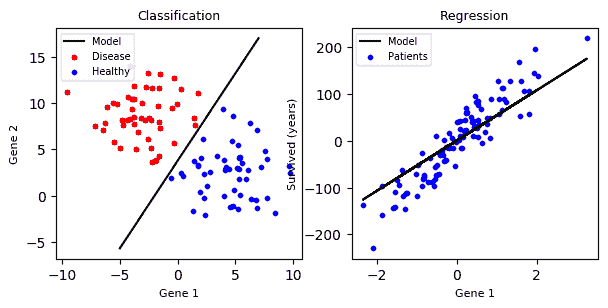

# 机器学习分类与回归

> 原文：<https://dev.to/petercour/machine-learning-classification-vs-regression-1gn>

听说过[机器学习](https://pythonprogramminglanguage.com/python-machine-learning/)吗？分类？回归？

这些任务有什么区别？

这完全取决于数据和您想要解决的问题类型。所有的机器学习算法都使用数据。

[](https://res.cloudinary.com/practicaldev/image/fetch/s--oo_G5qxG--/c_limit%2Cf_auto%2Cfl_progressive%2Cq_66%2Cw_880/https://proxy.duckduckgo.com/iu/%3Fu%3Dhttps%253A%252F%252Fmedia.giphy.com%252Fmedia%252F5Ch2Z4c4FfFw4%252Fgiphy.gif%26f%3D1)

计算机无时无刻不在处理数字，所以你拥有的任何信息都需要用数字来表示。在最基本的形式中，每个记录显示为二维平面中的(x，y)对。

### 分类 vs 回归

那么分类的任务就是，给定一个新的数据点，它属于蓝类还是红类？它的输出是一个离散值。

对于回归，它试图预测一个连续值。这就是为什么只有一种颜色。

[](https://res.cloudinary.com/practicaldev/image/fetch/s--c4Lfzdwy--/c_limit%2Cf_auto%2Cfl_progressive%2Cq_auto%2Cw_880/https://thepracticaldev.s3.amazonaws.com/i/mjshszqx4fj22hs12vfn.png)

这很难实现吗？不完全是。模块 [sklearn](https://scikit-learn.org/stable/index.html) 自带算法。对于[分类](https://pythonprogramminglanguage.com/machine-learning-classifier/)或者[回归](https://pythonprogramminglanguage.com/linear-regression/)有很多例子可用。

下面的程序创建了图

```
#!/usr/bin/python3 import matplotlib.pyplot as plt
import numpy as np

from sklearn.datasets import make_blobs, make_regression
from sklearn.svm import LinearSVC, LinearSVR

title_size = 14
axis_label_size = 12

params = {'legend.fontsize': 7,
          'figure.figsize': (7, 3),
          'axes.labelsize': 8,
          'axes.titlesize': 9,
          'xtick.labelsize': 10,
          'ytick.labelsize': 10}
plt.rcParams.update(params)

def make_classification_example(axis, random_state):
    X, y = make_blobs(n_samples=100, n_features=2, centers=2, cluster_std=2.7, random_state=random_state)

    axis.scatter(X[y == 0, 0], X[y == 0, 1], color="red", s=10, label="Disease")
    axis.scatter(X[y == 1, 0], X[y == 1, 1], color="blue", s=10, label="Healthy")

    clf = LinearSVC().fit(X, y)

    # get the separating hyperplane
    w = clf.coef_[0]
    a = -w[0] / w[1]
    xx = np.linspace(-5, 7)
    yy = a * xx - (clf.intercept_[0]) / w[1]

    # plot the line, the points, and the nearest vectors to the plane
    axis.plot(xx, yy, 'k-', color="black", label="Model")

    ax1.tick_params(labelbottom='off', labelleft='off')
    ax1.set_xlabel("Gene 1")
    ax1.set_ylabel("Gene 2")
    ax1.legend()

def make_regression_example(axis, random_state):
    X, y = make_regression(n_samples=100, n_features=1, noise=30.0, random_state=random_state)

    axis.scatter(X[:, 0], y, color="blue", s=10, label="Patients")

    clf = LinearSVR().fit(X, y)
    axis.plot(X[:, 0], clf.predict(X), color="black", label="Model")

    ax2.tick_params(labelbottom='off', labelleft='off')
    ax2.set_xlabel("Gene 1")
    ax2.set_ylabel("Survived (years)")
    ax2.legend()

random_state = np.random.RandomState(42)

f, (ax1, ax2) = plt.subplots(ncols=2)

ax1.set_title("Classification")
make_classification_example(ax1, random_state)

ax2.set_title("Regression")
make_regression_example(ax2, random_state)

plt.savefig("classification.vs.regression.png", bbox_inches="tight") 
```

机器学习资源:

*   硬化 python 模块
*   [为什么用 Python 进行机器学习](https://pythonbasics.org/why-python-for-machine-learning/)
*   [机器学习与 Python 教程](https://gumroad.com/l/MnRYU)