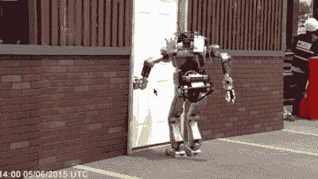

# 用 Python 进行机器学习

> 原文：<https://dev.to/petercour/machine-learning-with-python-2klg>

机器学习，这是许多人听到人工智能(AI)时想到的一切。但是，机器学习是人工智能的一个子集。

你经常会听说深度学习(DL)，那么那是什么呢？DL 是 ML 的子集。ML 和 DL 都需要数据来进行训练。没有数据，没有智能。

你拥有的数据越多，你能创造的智能机器人就越多。机器人可以是传统的硬件机器人，也可以是软件机器人。

人工智能已经进入了我们的生活:推荐系统(youtube，网飞)，人脸识别(相机，谷歌，facebook)，垃圾邮件过滤(电子邮件)等等。这不再是简单的基于规则的人工智能，基于数据的系统使这一切成为可能。

### ML 和 DL 对于 AI 来说是不是终结一切？

不，ML 和 DL 不是应用 AI 的唯一途径。还有更多解决方案:

*   遗传算法
*   贝叶斯推理
*   使用规则或本体的语义推理

### 如何进入 AI/ML？

有很多博客和课程。

*   [https://gumroad.com/l/MnRYU](https://gumroad.com/l/MnRYU)
*   [https://python programming language . com/python-machine-learning/](https://pythonprogramminglanguage.com/python-machine-learning/)
*   [https://developers.google.com/machine-learning/guides/](https://developers.google.com/machine-learning/guides/)
*   [https://towards data science . com/the-cold-start-problem-how-to-build-your-machine-learning-portfolio-6718 B4 AE 83 e 9](https://towardsdatascience.com/the-cold-start-problem-how-to-build-your-machine-learning-portfolio-6718b4ae83e9)
*   [https://pythonbasics.org/why-python-for-machine-learning/](https://pythonbasics.org/why-python-for-machine-learning/)