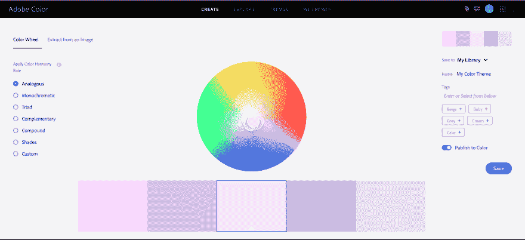
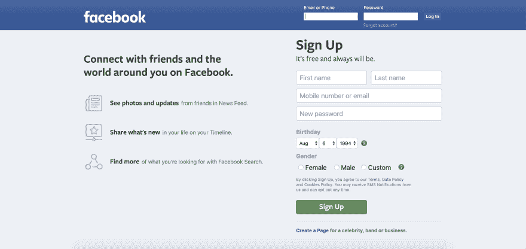
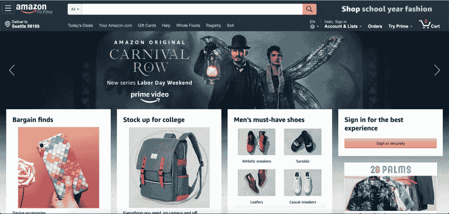
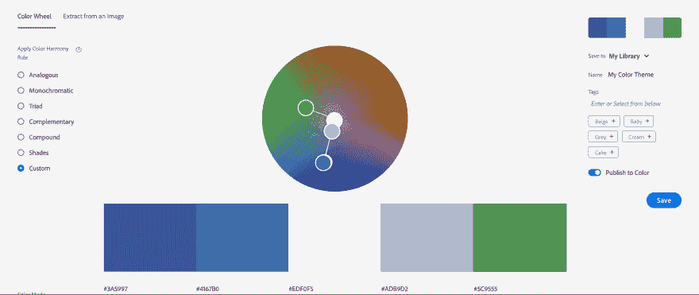
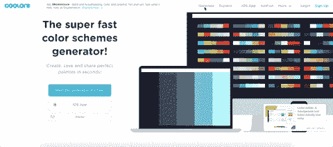

# 用简单的方法制作一个更好看的网站

> 原文：<https://dev.to/spencerlindemuth/make-a-better-looking-website-the-easy-way-28dp>

## 好看的网站

一个“好看的网站”可以有很多不同的含义。每个网站或公司都有自己的设计语言。比如 Google apps 有*材质设计*，微软用*流畅设计*，苹果用他们自己的*苹果设计指南*。他们也使用他们自己的字体，标志，配色方案，所有看起来完全不同，功能也不同。那么哪种语言能提供最好看的网站呢？这是因人而异的。虽然他们看起来完全不同，但他们有一个共同点。*一致的用户体验*。

### 一致性

如果你能从阅读这篇博客中得到一点收获，请让它成为*一致的网站设计*的重要性。如果你的一些按钮是圆形的，而一些是方形的，你的导航条在每一页上改变了粗细，当你渲染一个新的 div 时，页面元素移动了 2 个像素，或者菜单项在一半的页面上以不同的顺序排列，你就产生了一个微妙的(或不那么微妙的)不舒服的 UX。访问者也许不能挑出缺点并告诉你他们不喜欢什么，但是他们会在你的页面上有一种*的感觉。一个*感觉*他们宁愿在 Instagram 或亚马逊上。即使你不遵循某个知名公司开发的特定设计语言，一个完全一致的界面也会是你的设计语言。值得骄傲的设计语言。那么是什么使得一个*一致的*界面呢？*

#### 颜色

色彩无处不在。颜色是构成我们看到的一切的线。如果我们不穿不搭的衣服，为什么要做一个不搭的网站？在页面上放置任何元素之前，我首先要做的事情之一就是选择一个配色方案。无论我是事先挑选了一种颜色，还是当场就找到了一种，拥有一种基色会让你对未来产品的设想更有成效，并有助于激发创造力。如果我心中已经有了一个基色，我会去 Adobe Color Wheel 网站(也称为 Kuler)寻找最完美的颜色。
 
这包括拖动小滑块，直到阴影刚好找到要在 css 中使用的十六进制颜色代码。完美的颜色是主观的，但我喜欢遵循一些原则。你的*底色*是你网站的焦点。这是页面上每个元素都称赞的颜色。通常这是背景色或菜单栏颜色。对于背景色，你想要柔和、凉爽的颜色，文本放在上面看起来很好。文字在光线下总是更容易阅读黑色，并且容易阅读的文字对于增强你的用户体验很重要。菜单栏的颜色应该是粗体和暗色，但与背景色的色调相同。一些例子:

这些都很好，甚至页面看起来，没有眼睛罐子当你打开它们。注意你的眼睛被吸引到每一页的什么地方。首先扫描较亮的部分和容易阅读的深色文本，然后慢慢扫描较暗的部分。如果我们取 facebook 页面上的所有颜色，并将值放入 Kuler 中，我们会得到一个类似这样的轮子:

看看滑块的分布。页面的所有主色从深到浅都在一条直线上，这意味着它们都是同一种颜色的*色调*，背景是中间的浅色，对比色的菜单栏颜色是左边的深蓝色，所有的重音符号与背景*形成互补*。这可能不是一个绝对引人入胜的设计，但它是一致的，很好看，虽然只使用了 5 种颜色。你的页面不应该用彩虹的颜色来使它更令人兴奋。你页面上的内容应该是令人兴奋的部分，因为这就是用户在那里的原因！我用来挑选配色方案的一个很好的资源是 coolors.co 的

#### 布局-大局

本节是关于场地的总平面布置和*流程*。在更大的画面中有许多微妙之处，有些广告公司会花大价钱来更好地理解，但它们是留给你在设计你的网站时。如果你回头看看早先脸书、亚马逊和 Github 的图片，我们讨论了你的眼睛自然会被吸引到哪里，但是跳过了*为什么*我们的眼睛会被吸引到那里，或者更具体地说*为什么*那些元素被放在那里，包含了它们所包含的信息。这是意外吗？纯粹偶然？当然不是！作为开发商，没有什么是偶然发生的！这些元素被放在那里，使用那些特定的颜色来建立网页的*流*。在亚马逊上，你的眼睛会立刻被吸引到交易上，Github 会把你带到注册表单。当你进入页面时，你无法猜测会发生什么。没有扫描寻找注册按钮，没有想知道如何在亚马逊上找到产品。这些东西是为你设计的，把你放在他们希望你在页面上的位置。亚马逊可能有一个完整的设计和心理团队来决定如何增加主页以外的销售，但概念仍然保持不变。使用深思熟虑的布局，温和地引导你的用户沿着你想给他们看的信息，他们来看。

#### 造型——汗流浃背的小事

在这方面，造型就是使用形状、颜色和尺寸来创造你自己的设计语言。这些小部分将网站整合在一起，赋予它个性和主题，使它成为你可以向人们推销的产品。让所有这些 1 和 0 变成人们想要*感受*的有形的东西。这是真正将*的一致性*结合在一起的部分。我们在这里讨论的样式是**让页面上的所有东西在每一页上都看起来一样！**
每一个功能都应该风格一致。每个项目显示页面应该有相同的属性以相同的方式显示！每一个 logo 都应该把你带回首页！用户喜欢可预测性，对惯例的改变感到沮丧。下划线文本传统上是可点击的。如果你在 Instagram 个人资料的顶部给一个用户名加下划线，人们点击它，它什么也不做，你会有很多沮丧的 insta gram 用户。这是字面上的可预测性。按照创造事物的惯例来预测事物。正如带下划线的文本代表一个链接一样，submit 按钮显然是用来将您的信息发送到服务器的，而 back 按钮会将用户带回上一页。如果后退按钮总是将您带到主页...*令人沮丧*。但是这些规则很容易遵守，因为我们一直在使用它们，浏览器实际上为我们处理了大部分规则。*隐含的可预测性*正是我们的用武之地。这是创建可点击的图像，使它们更大，标志重定向到主页，并点击一个用户名，以查看用户资料。没有任何文字说明这些规则的存在，但它们直接与你的布局相结合，以提高网站的流量。最好的方法就是使用你的网站，注意你想走的捷径。然而，当你创建快捷方式时，真的要停下来想一想，这是否是一个用户想要尝试的*常规*动作。如果没有，你可能想借一点指导，也许设置你的文本颜色为不同的字体颜色来代表一个链接。

干净清晰的网站对每个人都有好处。如果你遵循这些指导方针，你的用户会感谢你，招聘人员会对你印象深刻，甚至你的祖母也可以查看你的网站。现在你对设计有了更好的概念性理解，下周继续关注，我将深入研究 CSS，帮助你的网站更加一致。