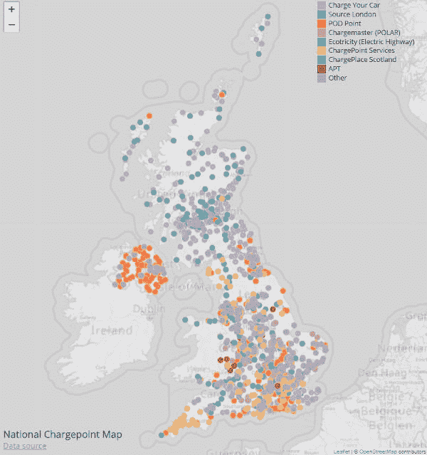
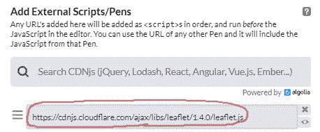
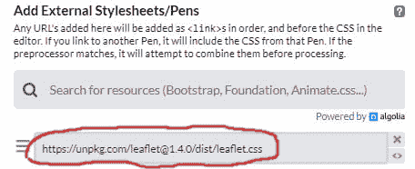
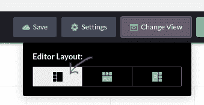
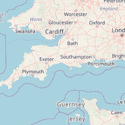
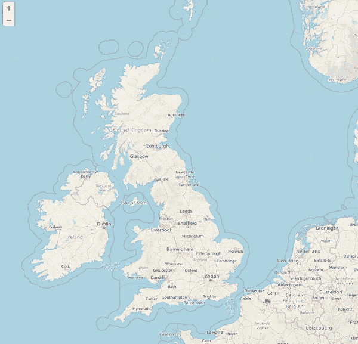
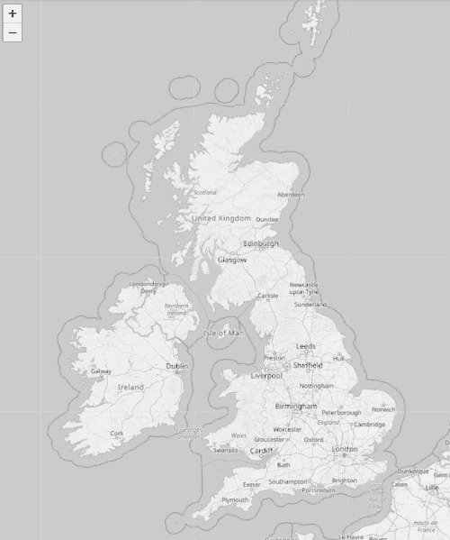
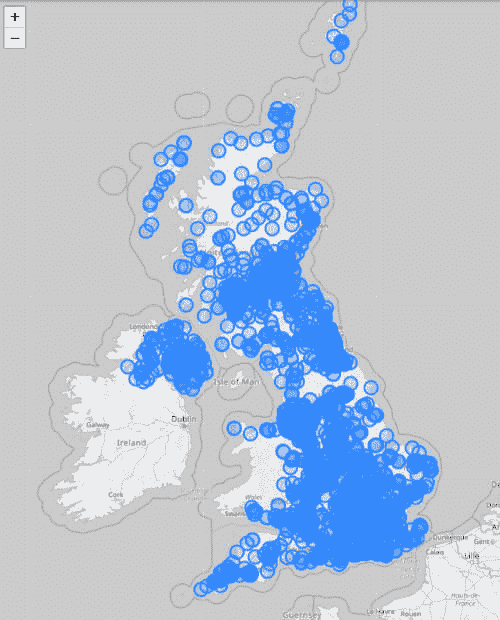

# 如何制作数据驱动地图:第一部分

> 原文：<https://dev.to/createwithdata/make-a-data-driven-map-part-one-31h8>

*交叉过账从[用数据](https://www.createwithdata.com/make-a-data-driven-map-part-one/)创建到*

这个由四部分组成的教程展示了如何使用 JavaScript 制作数据驱动地图。

我们将在地图上显示电动汽车充电点的位置:

[](https://codepen.io/createwithdata/live/ewoVGE)

数据来自英国的国家收费点登记处，我们将使用 T2 的传单来生成地图。传单是一个用于创建交互式地图的开源 JavaScript 库。有点像谷歌地图，但是开源。

我们将使用 CodePen 来开发我们的代码，因为它需要最少的设置，所以您可以快速启动并运行。

## 期待什么

在第一部分，你将学习如何使用传单创建背景地图。

第二部分将包括加载 CSV 数据和在地图上绘制位置。

第三部分将介绍以数据驱动的方式设计点的样式。例如，这些点将根据每个收费点的操作员进行着色。

最后一部分将添加一个标题，图例和一个信息弹出时，一个点悬停。

## 入门

转到[代码笔](https://codepen.io/)并创建一个新的笔。(如果您不熟悉代码笔，请查看我的[用 JavaScript 可视化数据教程](https://www.createwithdata.com/visualising-data-with-js-getting-started/)。)

点击 JS 面板中的 cog，并将`https://cdnjs.cloudflare.com/ajax/libs/leaflet/1.4.0/leaflet.js`添加到“添加外部脚本/笔”列表中:

[](https://res.cloudinary.com/practicaldev/image/fetch/s--kUutrOx3--/c_limit%2Cf_auto%2Cfl_progressive%2Cq_auto%2Cw_880/https://www.createwithdata.cimg/codepen-include-leaflet.jpg)

以类似的方式，点击 CSS 面板中的 cog，并将`https://unpkg.com/leaflet@1.4.0/dist/leaflet.css`添加到“添加外部样式表/笔”列表中。

[](https://res.cloudinary.com/practicaldev/image/fetch/s--SzkWxeh2--/c_limit%2Cf_auto%2Cfl_progressive%2Cq_auto%2Cw_880/https://www.createwithdata.cimg/codepen-include-leaflet-css.jpg)

最后点击“更改视图”并选择右侧输出窗口的排列:

[](https://res.cloudinary.com/practicaldev/image/fetch/s--PwmL7eeN--/c_limit%2Cf_auto%2Cfl_progressive%2Cq_auto%2Cw_880/https://www.createwithdata.cimg/codepen-change-view.png)

这种安排会更适合你的星盘。

## 创建地图

使用传单创建地图有三个步骤:

*   添加一个 HTML 元素来包含地图
*   添加一个 CSS 规则来设置地图的大小
*   添加 JavaScript 以创建地图

### 添加地图容器

在 HTML 面板中添加一个`<div>`元素作为地图的容器。给它一个 id`map`，这样我们就可以从传单中引用它:

```
<div id="map"></div> 
```

### 设置容器的大小

设置容器的高度很重要，否则你的地图将是不可见的！

我们希望我们的地图填充窗口，所以在 CSS 面板中添加以下样式规则:

```
html, body {
  height: 100%;
  margin: 0;
}

#map {
  height: 100%;
} 
```

> 您可以随意设置`#map`的宽度和高度。例如，尝试将宽度和高度设置为`400px`。

### 创建地图

通常，单张地图由一个地图对象和多个图层组成。传单支持多种图层类型，包括:切片、标记、多边形、GeoJSON 等。

让我们从创建一个地图对象开始。在 JavaScript 面板中添加:

```
var map = L.map('map'); 
```

现在创建一个瓷砖层，并将其添加到地图:

```
var tileLayer = L.tileLayer('https://{s}.tile.openstreetmap.org/{z}/{x}/{y}.png', {
  attribution: '&copy; <a href="https://www.openstreetmap.org/copyright">OpenStreetMap</a> contributors'
});

tileLayer.addTo(map); 
```

> 我们的代码使用 Open Street Map 的切片服务器，但是您可以从许多不同的服务器中进行选择。探索可用服务器的一个很好的资源是[传单提供商演示]([https://leaflet-extras.github.io/leaflet-providers/preview](https://leaflet-extras.github.io/leaflet-providers/preview))。请注意，不同的图块提供商有不同的使用条款。如果您的地图可能会收到大量流量，那么检查您是否处于任何使用限制范围内是很重要的。为您使用的任何提供商添加属性也很重要。

切片图层与地图切片服务器连接，并请求给定位置和缩放级别的切片。每个区块是一个小图像

[](https://res.cloudinary.com/practicaldev/image/fetch/s--qjzo6NYK--/c_limit%2Cf_auto%2Cfl_progressive%2Cq_auto%2Cw_880/https://www.createwithdata.cimg/make-a-data-driven-map/map-tile.png)

当传单收到每个瓷砖，它把他们放在一个网格布局，以弥补地图。

现在使用`map.setView()`设置地图的查看位置和缩放级别。第一个参数是数组`[latitude, longitude]`，第二个参数是缩放级别。缩放级别越高，地图被放大的程度越大:

```
map.setView([55, -2], 6); 
```

现在在输出窗格中应该有一个地图:

[](https://res.cloudinary.com/practicaldev/image/fetch/s--QYrT39Kg--/c_limit%2Cf_auto%2Cfl_progressive%2Cq_auto%2Cw_880/https://www.createwithdata.cimg/make-a-data-driven-map/basemap-1.jpg)

请注意，您可以缩放和平移地图(类似于 Google Maps)。

## 对地图进行造型

虽然您可以通过选择不同的切片提供者来更改底图的样式(请参见上一节),但是您也可以使用 CSS 过滤器来设置切片的样式。

为了使地图灰度化，在 CSS 面板中添加如下内容:

```
.leaflet-container .leaflet-tile-pane img {
  filter: grayscale(1);
} 
```

这将使我们在第二部分添加的彩色圆圈更加突出。

[](https://res.cloudinary.com/practicaldev/image/fetch/s--181H2k-V--/c_limit%2Cf_auto%2Cfl_progressive%2Cq_auto%2Cw_880/https://www.createwithdata.cimg/make-a-data-driven-map/basemap.jpg)

这是 Codepen 上完成的代码:

[https://codepen.io/createwithdata/embed/ZdZvXY?height=600&default-tab=result&embed-version=2](https://codepen.io/createwithdata/embed/ZdZvXY?height=600&default-tab=result&embed-version=2)

## 包装完毕

我们已经创建了一个传单地图，并通过添加 CSS 规则使其灰度化。

在下一部分，我们将加载数据(使用 [D3](https://d3js.org/) 并在地图上绘制每个数据点。

[](https://res.cloudinary.com/practicaldev/image/fetch/s--G_fuvWnr--/c_limit%2Cf_auto%2Cfl_progressive%2Cq_auto%2Cw_880/https://www.createwithdata.cimg/make-a-data-driven-map/points.jpg)

与此同时，在地图上玩一玩。您可以尝试的一些事情有:

*   从[传单供应商演示](https://leaflet-extras.github.io/leaflet-providers/preview)中探索其他瓷砖供应商
*   调整地图大小(使用 CSS)
*   设置地图样式(使用 CSS 滤镜)。其他滤镜包括`opacity`和`sepia`。

愉快的映射，我希望在下一部分看到你！