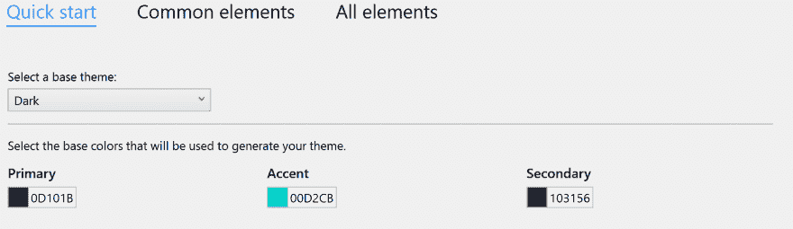
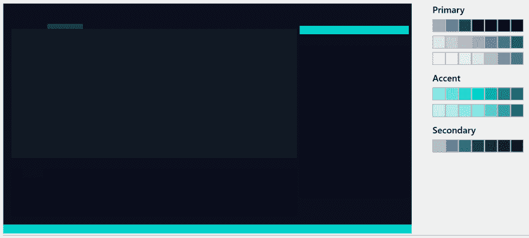
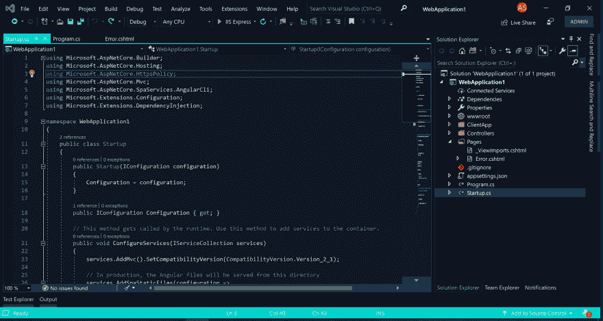
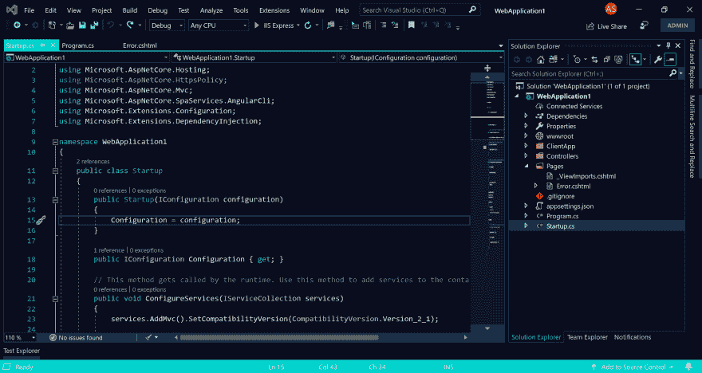

# 为 2019 年的 Visual Studio 制作主题

> 原文：<https://dev.to/austinstanding/making-a-theme-for-visual-studio-in-2019-f82>

就在本月早些时候，微软发布了一个新的 Visual Studio 主题扩展，名为 [Color Theme Designer](https://devblogs.microsoft.com/visualstudio/theming-in-visual-studio-just-got-a-lot-easier/) 。你没看错，Visual Studio，不是 VS 代码！😥😲随着公告，我想尝试做一些我可以享受的东西，因为没有太多的 VS 主题可供选择。我必须承认，我从来没有尝试过旧的颜色主题编辑器扩展，虽然从主题的缺乏和公告中提到的内容，我可以看到为什么很少有人这样做。

> “如果你有足够的勇气来创建你自己的主题，你必须从 3000 多个模糊命名的颜色标记中一个接一个地编辑元素。
> 
> 今年夏天，一群实习生开发了一个新发布的颜色主题设计扩展，我们希望对于初学者和高级设计师来说，定制主题变得更加简单。"

虽然仍然会有令人困惑的时刻，但这个过程是由“快速启动”启动的，允许您从基本主题开始，然后选择原色、次色和强调色。

这将根据您的选择为您生成调色板。这让我达到了 90%的目标，但仍然有一些突出的问题和怪癖。

文本和关键词的色调有所改变，但编辑器背景是一样的。菜单背景看起来很棒，但是它们的悬停状态对比度非常低。不要让我开始我的地图模式滚动条。

我对使用“所有元素”中的颜色类别有了一些耐心，但只有在经历了惨痛的教训后，我才知道不能将任何颜色大量更新为新颜色。突然，随机文本有一个丑陋的背景颜色，我无法恢复正常，当突出显示文本时，背景覆盖了突出显示的颜色。正是在这里，我意识到我没有启动 git repo 来跟踪变更。业余时间！🤦‍♂️

如果你发现自己处于这种情况，以下是我用来让自己重回正轨的诀窍。我用同样的主题和颜色做了第二个项目，然后改变了颜色。vstheme 文件。我能够保存我想要保留的那些更改，并恢复我所做的全部更改。*如果你正在做的不仅仅是快速启动，使用版本控制！*

最后，我对结果超级满意。我现在向你们展示我的第一个主题，午夜之光。

虽然它仍然有我发现的怪癖，但这是一个有趣的学习机会。希望下周我会把它作为一个扩展发布，在 Visual Studio 新的主题扩展类别中可用！在那之前，你可以随意下载或者在 [GitHub](https://github.com/austinstanding/midnight-lights-vstheme) 上分享。

##  [奥斯汀站](https://github.com/austinstanding) / [午夜灯-vstheme](https://github.com/austinstanding/midnight-lights-vstheme)

### Visual Studio 2019 的黑暗主题

<article class="markdown-body entry-content container-lg" itemprop="text">

# 午夜之光 Visual Studio 主题

<g-emoji class="g-emoji" alias="milky_way" fallback-src="https://github.githubassets.cimg/icons/emoji/unicode/1f30c.png">🌌</g-emoji> **午夜灯光**是 Visual Studio 2019 的黑暗主题，由[色彩主题设计师](https://marketplace.visualstudio.com/items?itemName=ms-madsk.ColorThemeDesigner)制作。

这是我的第一个主题，你可能会发现一些怪癖。这是一个个人项目，但是请随意使用 [fork 库](https://github.com/austinstanding/midnight-lights-vstheme)！

## 装置

在[从市场](https://marketplace.visualstudio.com/items?itemName=AustinStanding.vsthememidnightlights)安装扩展后，主题将会出现在*工具- >选项- >常规*下的下拉列表中。

## 混杂的

CI/CD 用 Azure DevOps，继 [Meziantou 的博客](https://www.meziantou.net/ci-cd-pipeline-for-a-visual-studio-extension-vsix-using-azure-devops.htm)。

我喜欢用 [Viasfora](https://marketplace.visualstudio.com/items?itemName=TomasRestrepo.Viasfora) 来扩展我的主题，主要是彩虹背带。我已经在 github repo 中添加了我的 Viasfora 主题作为`viasfora-theme.json`。如果你是 Viasfora 用户，可以从*工具- >选项- > Viasfora - >导入/导出*导出/导入主题。

## 版本

### v1.1.5

*   修改了 peek 背景，更新了主题图标

### v1.1.1

*   修改了 Razor 代码高亮显示以更好地匹配主题

### v1.1

*   变暗的编辑器背景以匹配窗口背景
*   变暗的菜单…

</article>

[View on GitHub](https://github.com/austinstanding/midnight-lights-vstheme)

你试过颜色主题设计器了吗？你的经历是什么？您希望看到哪些功能/调整？

更新:扩展现在已经发布了！[从 Visual Studio Marketplace 安装](https://marketplace.visualstudio.com/items?itemName=AustinStanding.vsthememidnightlights)。