# 使用 JavaScript 和网络套接字制作交互式悬浮滑板游戏。

> 原文：<https://dev.to/devdevcharlie/making-an-interactive-hoverboard-game-using-javascript-and-web-sockets-379j>

## 背故事

这个项目的最初版本是用一个[白日梦控制器](https://vr.google.com/intl/en_au/daydream/smartphonevr/)建造的。

为了让更多人可以使用它，我花了一些时间对它进行了更改，以便您可以使用您的手机。T3】

然而，FIY，如果你喜欢的话，你也可以使用 Arduino、加速度计和蓝牙模块来构建自己的控制器！😃

对于这个项目的第一个版本，我使用网络蓝牙将 Daydream 控制器直接连接到浏览器，我希望代码保持相似，但我意识到手机无法使用网络蓝牙 API 连接到笔记本电脑。电话和笔记本电脑都只能是“中央”设备，而不是“外围”设备，所以我不得不将这个演示改为使用 Web 套接字在电话和笔记本电脑之间进行通信。

[https://www.youtube.com/embed/d3QRNH_jNOI](https://www.youtube.com/embed/d3QRNH_jNOI)

* * *

## 它是如何工作的？

这个版本的实验通过在你的电脑上打开主网页，在你的手机上打开另一个网页来获得加速度计数据。

使用 [DeviceOrientation Web API](https://developer.mozilla.org/en-US/docs/Web/API/Detecting_device_orientation) ，手机的方位被检测到，并通过 WebSockets 发送到笔记本电脑上的浏览器。

把你的手机放在滑板上，它就能变成一个控制器。您可以使用方向数据将其应用到 3D 环境中，并与游戏进行交互，就像您在悬浮滑板上一样。

* * *

## 这个教程讲的是什么

我不打算浏览整个代码，因为我不认为逐行浏览是非常有益的。相反，我将解释原型的核心部分。

如果你想跳过这一切，只需查看一下 **[Github repo](https://github.com/charliegerard/hvbrd-sockets)** 、 **[CodeSandbox](https://codesandbox.io/s/hvbrd-sockets-ln0mi)** 或尝试一下 **[live demo](https://bit.ly/hvbrd)** ，请随意。

* * *

## 所需材料:

*   现代移动电话(任何内置加速度计的电话)。
*   一台电脑。
*   一台投影仪*(可选)*。

### 技术堆栈:

*   超文本标记语言
*   半铸钢ˌ钢性铸铁(Cast Semi-Steel)
*   JavaScript(香草 JS，不需要框架知识！).
*   DeviceOrientation Web API
*   带有 Socket.io 的 Node.js

* * *

## 步骤 1:设置 Node.js 服务器和 web sockets

首先，我们需要设置一个服务器来服务我们的文件，公开路由并设置 socket.io。

[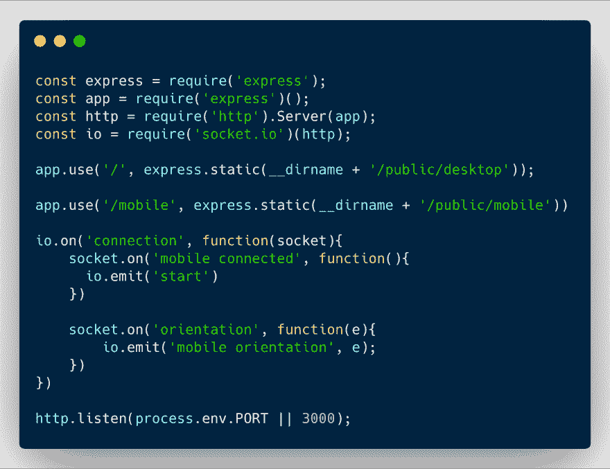](https://res.cloudinary.com/practicaldev/image/fetch/s--GKc9rXsC--/c_limit%2Cf_auto%2Cfl_progressive%2Cq_auto%2Cw_880/https://thepracticaldev.s3.amazonaws.com/i/fnv29xqn9vsfvxt5mxmf.png)

在上面的代码示例中，我们需要一些模块，启动一个 [Express](https://expressjs.com/) 服务器，并指明为我们的文件提供服务的路径和路线。

我们还设置了一个基本的 socket.io 连接，它将等待服务器和前端之间的通信建立。一旦连接，socket.io 将等待来自前端的某些消息。

当用户访问移动页面时，应该会收到第一条消息，这样我们就可以确认他们已经准备好与游戏进行交互了。当收到这个消息时，我们发出一个桌面上的页面将会监听的消息，这样我们就可以开始游戏了。

当移动设备开始流式传输定向数据时，将接收到第二条消息。该消息将向桌面浏览器发出一个事件，其中包含该数据，以便将其应用于悬浮滑板。

现在我们的服务器已经设置好了，让我们开始前端工作。

* * *

## 步骤 2:获取和流式传输方位数据

使用 [DeviceOrientation Web API](https://developer.mozilla.org/en-US/docs/Web/API/Detecting_device_orientation) ，我们能够从手机获取方位数据。

要进行设置并将其发送回服务器，我们需要如下所示的代码:

[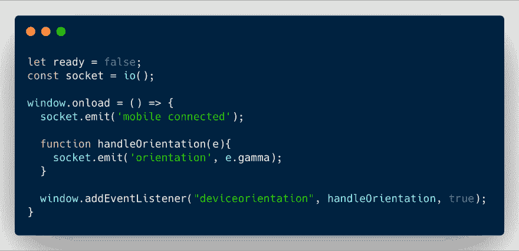](https://res.cloudinary.com/practicaldev/image/fetch/s--E8d_vahg--/c_limit%2Cf_auto%2Cfl_progressive%2Cq_auto%2Cw_880/https://thepracticaldev.s3.amazonaws.com/i/fwrwbgsprivqiaf9f6vq.png)

这里，我们实例化了 socket.io，当页面加载时，我们向服务器发送第一条消息，表明移动页面已被访问。

然后，我们有一个事件监听器来检查`deviceorientation`事件。在更改时，我们调用`handleOrientation`函数，该函数向服务器发送另一个事件，其中数据在某个轴上。这个数据代表了当你倾斜滑板时从左到右的位置变化。

现在移动设备上的页面正在向服务器发送方向数据，让我们看看桌面页面是如何监听它的。

* * *

## 第三步:监听游戏中的方位数据

为了能够在笔记本电脑上使用来自手机的方位数据，我们需要监听服务器发送的消息。

[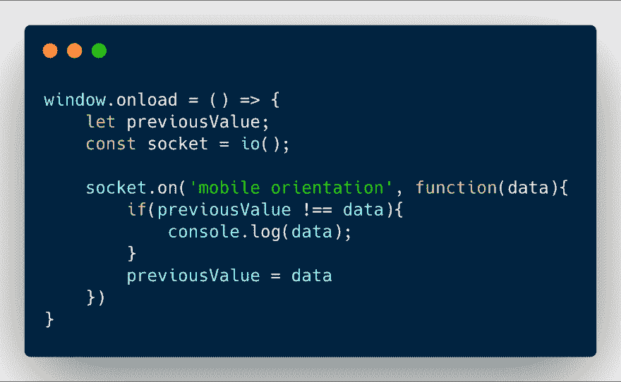](https://res.cloudinary.com/practicaldev/image/fetch/s--89fC7HNw--/c_limit%2Cf_auto%2Cfl_progressive%2Cq_auto%2Cw_880/https://thepracticaldev.s3.amazonaws.com/i/6e3ekf5indnfy6e5n331.png)

同样，我们实例化 socket.io，当我们从服务器接收到消息`mobile orientation`时，我们能够在游戏中使用倾斜数据。

在上面的代码示例中，我还添加了一个`previousValue`变量，这样我们只有在方向数据不同于之前收到的数据时才会使用它。

既然我们已经在服务器和前端之间建立了一个基本的通信，并且从手机中获得了方位数据，我们就可以使用 [Three.js](https://threejs.org/) 开始围绕它构建游戏了。

* * *

## 第四步:设置游戏

### 加载库

这个项目中构建的 3D 环境使用 Three.js。要开始使用它和一些附加组件，我们需要将它们包含在我们的 HTML 中。

[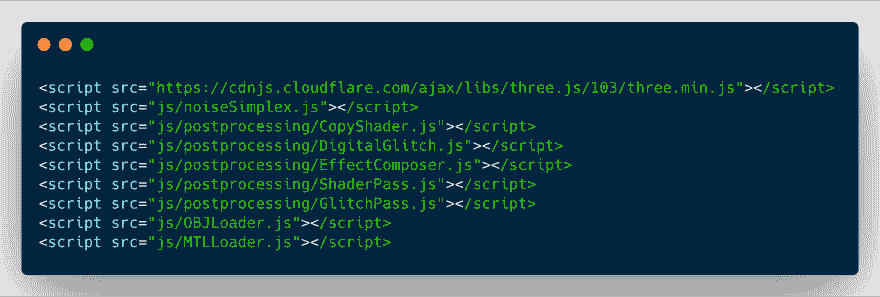](https://res.cloudinary.com/practicaldev/image/fetch/s--eEeaIk_r--/c_limit%2Cf_auto%2Cfl_progressive%2Cq_auto%2Cw_880/https://thepracticaldev.s3.amazonaws.com/i/52o61t3oqxrlur0n3z3c.png)

如果你想创建一个基本的游戏，并不需要所有这些。文件`CopyShader`、`DigitalGlitch`、`EffectComposer`、`ShaderPass`、`GlitchPass`仅用于我添加的与障碍物碰撞的效果。

这里需要的主要资源是 Three.js 库、生成飞机的`noiseSimplex`脚本以及加载用于悬浮滑板和障碍物的 3D 资源的`OBJ`和`MTL`加载器。

### 创建 3D 场景

要创建一个场景，你需要写下面几行:

[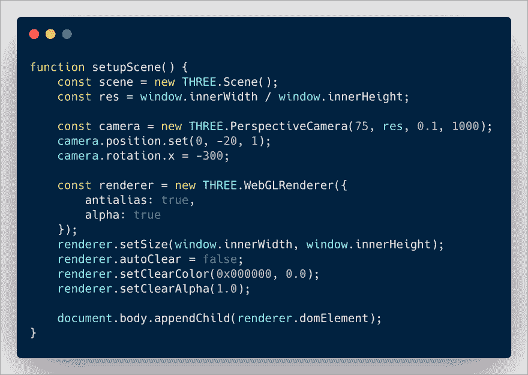](https://res.cloudinary.com/practicaldev/image/fetch/s--7ge9O2GW--/c_limit%2Cf_auto%2Cfl_progressive%2Cq_auto%2Cw_880/https://thepracticaldev.s3.amazonaws.com/i/rd75tn38c0vnpfwjhirh.png)

在上面的代码中，我们创建了场景、摄像机、渲染器，并将所有东西添加到主体中。

您也可以将灯光添加到场景中。你可以使用不同类型的灯光，但在我目前的原型中，我使用了环境光和聚光灯:

[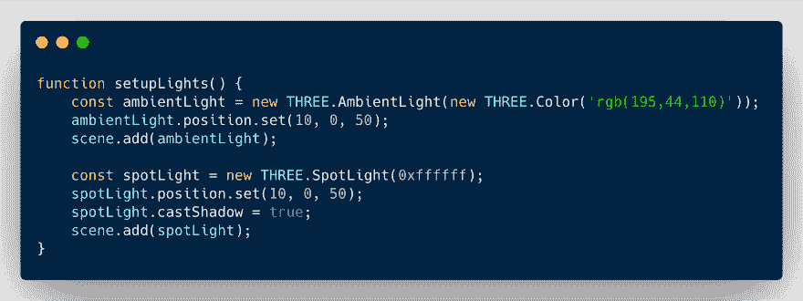](https://res.cloudinary.com/practicaldev/image/fetch/s--owdmKNac--/c_limit%2Cf_auto%2Cfl_progressive%2Cq_auto%2Cw_880/https://thepracticaldev.s3.amazonaws.com/i/x3b0k07lbqqh3vutzpix.png)

现在我们有了一个基本的场景，但是里面什么也没有。让我们从生成我们在演示中看到的风景开始。

### 生成地形

设置景观稍微复杂一点。它从一个简单的`PlaneGeometry`和`WireframeGeometry`开始。

[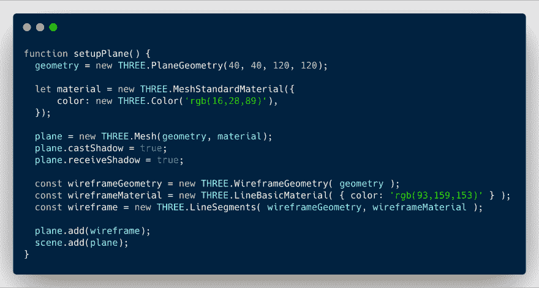](https://res.cloudinary.com/practicaldev/image/fetch/s--M29lLKXh--/c_limit%2Cf_auto%2Cfl_progressive%2Cq_auto%2Cw_880/https://thepracticaldev.s3.amazonaws.com/i/totyzw4eelplfjpyzt2j.png)

但是，我们可以在演示中看到，我们有一个生成“山”的效果。为此，我们需要使用我们的`PlaneGeometry`的顶点。

[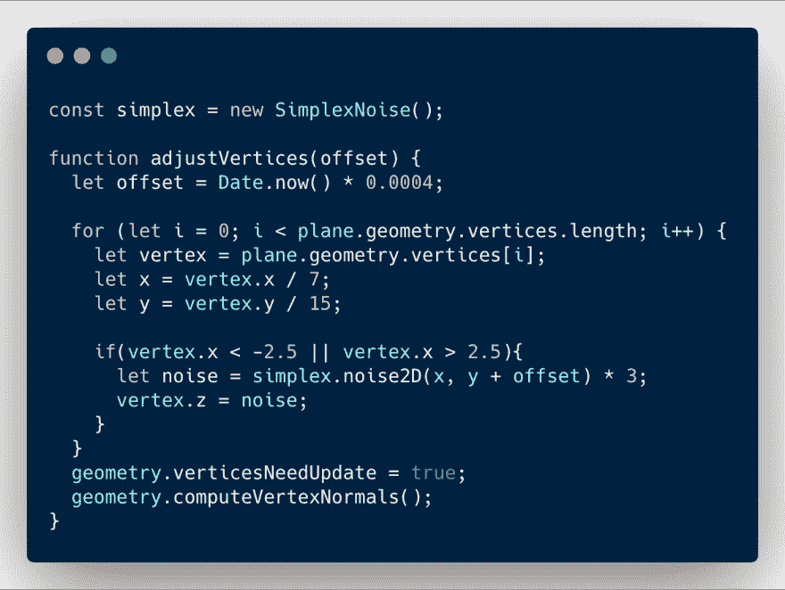](https://res.cloudinary.com/practicaldev/image/fetch/s--cqpsGz6l--/c_limit%2Cf_auto%2Cfl_progressive%2Cq_auto%2Cw_880/https://thepracticaldev.s3.amazonaws.com/i/zw0ecw2kbmggwqkox3h2.png)

使用我们之前定义的几何图形，我们将使用`SimplexNoise`脚本来帮助我们通过操纵顶点来创建波浪地形的效果。

为了让这个效果在整个游戏中持续，我们需要用`requestAnimationFrame`调用这个函数。

现在我们有了地形，我们还需要添加一些岩石(障碍物)和悬浮滑板。

### 加载 3D 模型

岩石和滑板是 3D 模型。要加载它们，我们需要以下几行:

[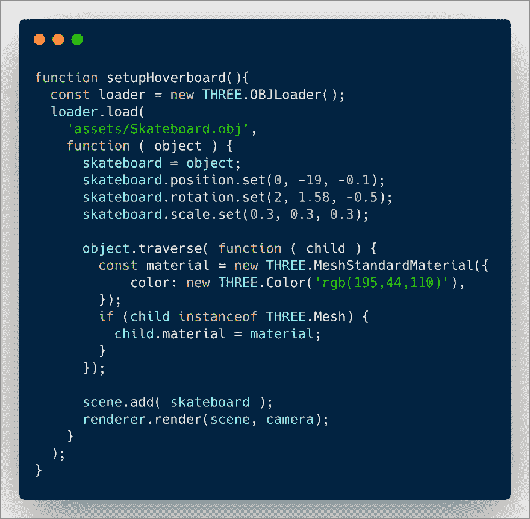](https://res.cloudinary.com/practicaldev/image/fetch/s--3VHzEtl7--/c_limit%2Cf_auto%2Cfl_progressive%2Cq_auto%2Cw_880/https://thepracticaldev.s3.amazonaws.com/i/evibddjgb835xgkcuod7.png)

使用上面的代码行，我们创建了一个`OBJLoader`，我们给了它到我们的`.obj`文件的路径，并且我们设置了它在场景中的大小&位置。我们还设置了一个颜色材质，最后，我们将它添加到场景中。

岩石的代码基本相同。

[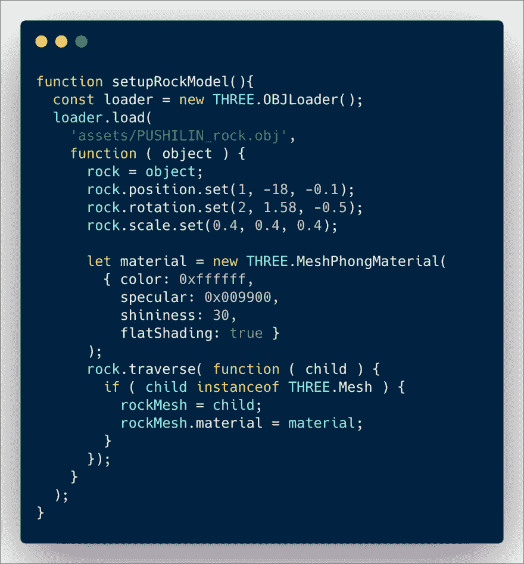](https://res.cloudinary.com/practicaldev/image/fetch/s--nHYVbWtf--/c_limit%2Cf_auto%2Cfl_progressive%2Cq_auto%2Cw_880/https://thepracticaldev.s3.amazonaws.com/i/r7r3m5n4wu9uqaqpzk9m.png)

所以，我们已经讲述了如何创建一个简单的场景，添加一个程序化的地形，3D 模型，但是我们缺少了交互的部分。

### 使其互动

现在我们已经设置好了场景，我们可以使用之前讨论过的方向数据来更新悬浮滑板模型在场景中的位置。

为此，我们需要这样的代码:

[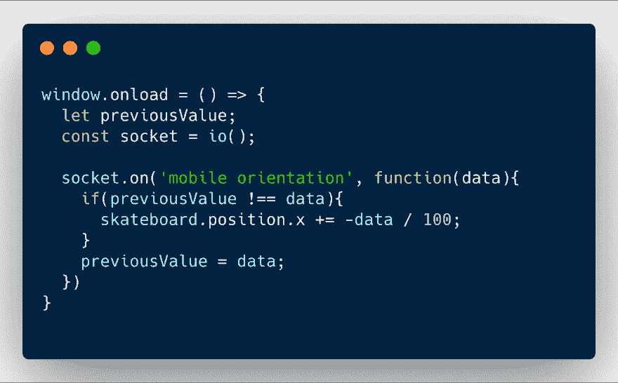](https://res.cloudinary.com/practicaldev/image/fetch/s--gdt0F2I5--/c_limit%2Cf_auto%2Cfl_progressive%2Cq_auto%2Cw_880/https://thepracticaldev.s3.amazonaws.com/i/6333pasulbpfw540kdz2.png)

这个代码样本类似于本教程前面展示的那个，除了现在我们有了我们的`skateboard`在我们的场景中，所以我们能够根据从我们的手机返回的数据来改变它的位置！

* * *

如前所述，完整体验的代码比这个多一点，但就核心概念而言，就是这样！😃🎉

如果你想检查代码，这里有 **[Github repo](https://github.com/charliegerard/hvbrd-sockets)** 。否则这里的 **[现场演示](https://bit.ly/hvbrd)** ！

希望你觉得有趣！😊👋

* * *