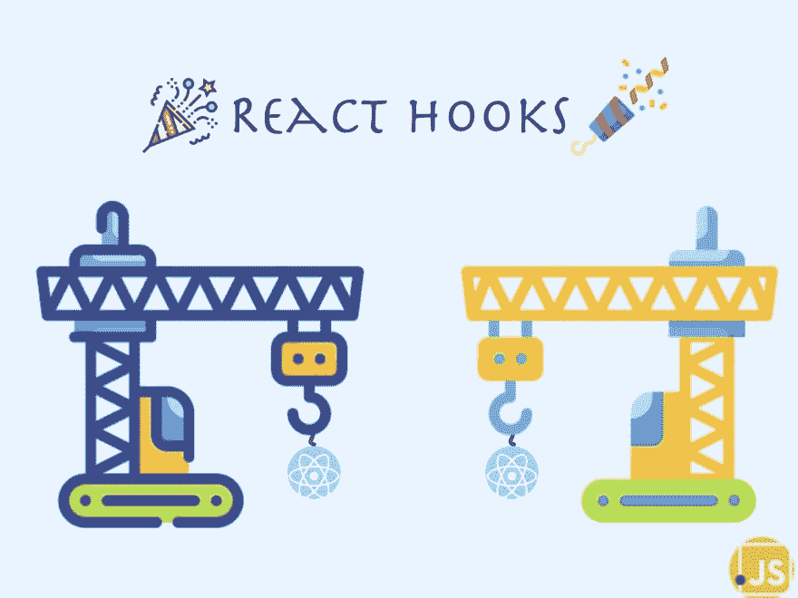
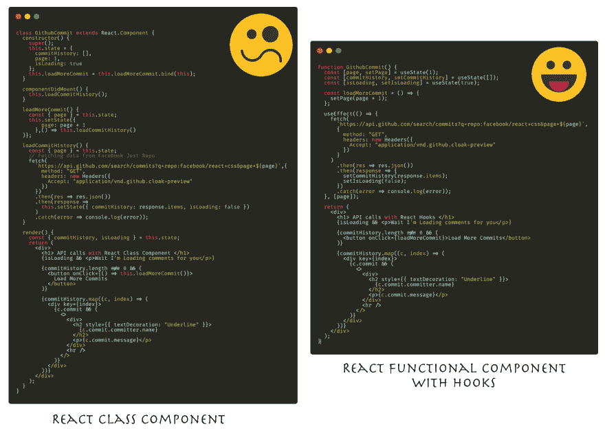

# 用 React 挂钩进行 API 调用

> 原文：<https://dev.to/harshmakadia/making-api-calls-with-react-hooks-47gk>

原贴于[中的](https://medium.com/)于[中的零碎](https://blog.bitsrc.io/)

随着 React 库中新的更新的出现，在你的应用中使用所有新的 React 特性确实是不可能的。距离 React 16.8.0 发布的
React Hooks 正式发布已经过去 6 个月了(2019 年 2 月
6 日)

这篇文章将帮助你一步步使用 React 钩子，它将
解释你可以采取的所有基本方法来充分利用这个
漂亮的特性。

React Hooks【Icon Credit—[wanicon](https://www.flaticon.com/authors/wanicon)，
[freepik](https://www.freepik.com/)

让我们从快速介绍 React 钩子开始

钩子是让你从功能组件“钩入”反应状态和生命周期特性
的功能。钩子在类中不起作用——它们让你不用类就能使用 React
。

#### 使用状态😄

`useState`是一个*钩子，*当我们想要
给它添加一些本地状态时，我们在函数组件内部调用它。这样做的好处是，在重新渲染过程中，状态将被保留为
。

`useState`返回一对:**当前状态值**和一个**函数**，函数
让你更新你的组件。调用一个函数将类似于
`this.setState`工作，它将更新状态的值，除了它不会
合并新旧状态。

#### 使用效果😄

效果挂钩`useEffect`增加了从
功能组件执行副作用的能力。

useEffect 的目的类似于
类组件中生命周期方法的目的，如`componentDidMount`、`componentDidUpdate`和
、`componentWillUnMount`

也可以决定何时重新渲染。考虑下面的例子，其中我们在 useEffect 之后传递了一个计数数组。

让我们考虑一下计数值是否为 60，如果组件在
计数值不变(即 60)的情况下重新渲染，React 将比较之前的渲染
值，并决定是否调用 effect。如果值不同，那么
只调用效果。这是一种提高性能和避免
不必要调用的方法。💯 🚀

如果数组中有多个项目，React 将重新运行效果，即使其中只有一个不同。

* * *

#### 用钩子将类构件转换成功能构件⚖️

让我们看一个例子，看看我们如何使用钩子在函数组件中获得与类
组件相同的行为。

**示例:**考虑一个示例，您需要进行 API 调用，获取
数据并填充到我们的组件中，单击 *load* more 按钮将
从服务器获取更多数据。

在 React 16.8.0(Hooks)发布之前，不可能使用功能组件来实现这些
，因为生命周期方法在
功能组件中不可访问，并且不可能管理
功能组件内部的状态。

为了进行 API 调用，我们将使用 Github API
[https://developer.github.com/v3/search/#search-commits](https://developer.github.com/v3/search/#search-commits)

下面是普通类组件
和使用钩子的功能组件的典型 React 代码。

 
API 调用代码[图标信用—
圆形图标](https://www.flaticon.com/authors/roundicons)

每当涉及 API 调用时，我们都需要多个状态值—

*   保存要呈现的数据
*   进行 API 调用的页数
*   加载状态(显示加载屏幕/组件，直到从服务器收到数据)
*   错误状态(获取数据时出错时显示错误消息)

因此，上图中的类组件和功能组件做了同样的事情
,从 Github 加载提交。因此，这个简单的例子将帮助
您理解在您的应用程序中开始使用 hook 是多么容易。有了
钩子，你可以灵活地编写代码并进行排序。

 
用 React 钩子调用 API

* * *

**代码片段—** 类组件 API 调用代码

—挂钩 API 调用代码

**现场演示的链接**

[https://code sandbox . io/s/functional-component-API-calls-qg ho3](https://codesandbox.io/s/functional-component-api-calls-qgho3)

* * *

以下是使用 React 钩子时应该记住的规则

1.  不要试图将类组件中编写的旧代码转换成钩子。但是，建议您在新的实现中尝试使用钩子
2.  使用状态和[使用效果](https://reactjs.org/docs/hooks-overview.html#effect-hook)是掌握钩子应该知道的两个新概念
3.  只调用顶层的钩子**。不要在循环、条件或嵌套函数中调用钩子。**
4.  只从 React 函数组件调用钩子**。不要从常规的 JavaScript 函数中调用钩子。**

因此，这就是 React 钩子在进行 API 调用时如何有用，有时我们
不得不将一个功能组件转换成一个类组件，仅仅因为
不能管理功能组件内部的状态。

**参考**【https://reactjs.org/】-

快乐学习💻 😄

### 相关故事