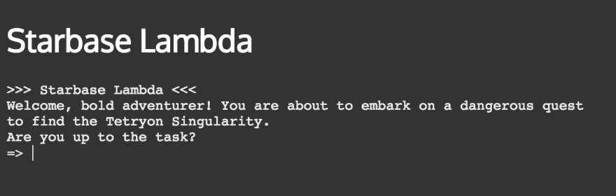
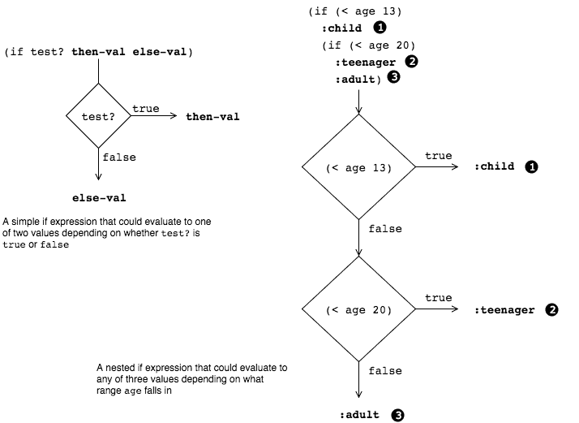
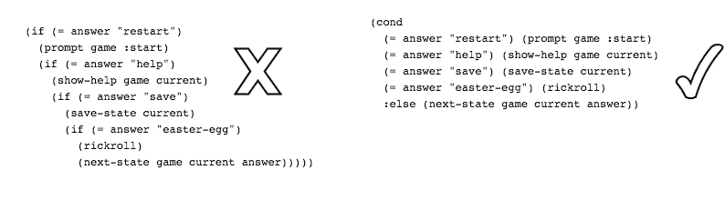

# 做出选择

> 原文：<https://dev.to/kendru/making-choices-3h0g>

这篇文章是安德鲁的书[第十课](https://www.learn-clojurescript.com/section-2/lesson-10-making-choices/)，[T3】学 ClojureScriptT5】](https://gum.co/learn-cljs)

* * *

到目前为止，我们大部分时间都在编写代码，这些代码都有一个起点，并且一直进展到完成。 <sup id="fnref1">[1](#fn1)</sup> 它有明确的任务，必须遵循一系列明确的指令来完成这个任务。我们一直缺少的是*选择*的概念——能够根据某些条件选择不同的道路。想象一条绵延数百英里的道路从未与另一条道路相交。如果我们沿着那条路开车，那就容易多了，因为我们永远不必决定是否走另一条路；然而，这次旅行也相当平淡无奇。我们编写的代码也是如此:我们可以编写简单地从上到下运行并具有清晰的线性执行的脚本，但这样我们就会错过最有趣和最有价值的程序。

*本章内容:*

*   应用`if`和`when`进行简单的选择
*   熟悉真实的概念及其定义
*   使用`cond`在多个选项之间进行选择

## 举例:冒险游戏

[](https://res.cloudinary.com/practicaldev/image/fetch/s--tjAJSS4p--/c_limit%2Cf_auto%2Cfl_progressive%2Cq_auto%2Cw_880/https://kendru.github.io/img/learn-cljs/chapter10/adventure-screenshot.png)

*基于文字的冒险游戏*

在这一章中，我们将构建一个简单的基于文本的冒险游戏。冒险游戏非常适合学习条件句的概念，因为它们是围绕让用户对如何在虚拟环境中导航做出一系列选择而构建的。这样我们就可以一次专注于学习一个构建模块，我们将使用作者的 [bterm](https://github.com/kendru/bterm) 终端仿真器库。这将允许我们专注于控制结构的核心概念，而不会陷入 DOM 操作和事件处理或学习大型框架的泥潭。

## 用 if 和 when 做简单的选择

当我们做出选择时，我们通常需要确定某事是真还是假:特定的复选框被选中了吗？帐户余额是否低于某个阈值？玩家的库存里有特殊的药剂吗？这类问题只能有两个答案——“是”或“不是”。请记住，ClojureScript 是通过*计算表达式*来工作的，所以这些问题通常采用计算结果为真或假的表达式的形式。我们可以把上面的问题翻译成 ClojureScript 表达式:

#### 表示提问的表情

```
;; Is the checkbox checked?  (aget  my-checkbox  "checked")  ;; Is the account balance below a threshold?  (<  (:balance  account)  low-balance-threshold)  ;; Does the player have the potion of wisdom in their inventory?  (some  #(=  (:name  %)  "Potion of Wisdom")  (get-inventory  player)) 
```

Enter fullscreen mode Exit fullscreen mode

当我们评估这些表达式中的一个时(假设我们引用的变量是实际定义的)，这个值将是我们可以认为是*真*或*假*的值。

### 用 if 选择

我们常常希望在答案为真时做出一个选择，在答案为假时做出另一个选择——在这种情况下，我们可以使用 ClojureScript 的`if`特殊形式。if 表达式采用以下形式:

```
(if  test-expr  then-expr  else-expr) 
```

Enter fullscreen mode Exit fullscreen mode

If 有 3 个表达式:一个测试，一个测试为真时使用的值，一个测试为假时使用的值。根据第一个表达式的值，整个`if`表达式将计算第二个或第三个表达式的值。为了使用上面的帐户余额示例，我们可以编写以下代码:

```
(def  account-status  (if  (<  (:balance  account)  low-balance-threshold)  <1>  :low-balance  <2>  :ok))  <3> 
```

Enter fullscreen mode Exit fullscreen mode

1.  测试余额是否低于某个点
2.  如果测试为真，评估到`:low-balance`
3.  如果测试为假，评估至`:ok`

> *注:特殊表格*
> 
> 当我们编写一个 s 表达式时，只要表达式中的第一个符号解析为函数名、宏名或*特殊形式*，ClojureScript 就会对其求值。虽然对`if`的调用看起来就像一个函数调用，但`if`实际上是一种特殊的形式，而不是一个函数。我们写函数已经有一段时间了，我们将在后面的章节中学习写宏，但是特殊的形式已经融入到语言中，因为它们是如此的基础，以至于不能作为库函数来实现(或者至少效率不高)。幸运的是，从我们作为开发者的角度来看，我们不需要关心我们调用的具体东西是函数、宏还是特殊形式，因为它们被调用的方式没有区别。

虽然任何开发人员都应该熟悉`if`语句的概念，但是大多数语言的 if 语句和 ClojureScript 的 if 之间有一个关键的区别:在 ClojureScript 中，`if`是一个表达式，因此它总是计算一个特定的值。在像 JavaScript 这样的命令式语言中，`if`语句通常会在*执行*的哪个代码分支之间做出选择。实际的 if 语句不产生值。例如，以下是无效的 JavaScript:

#### JavaScript if 不是表达式

```
// This will throw a SyntaxError
var answer = if (someCondition) {
   'Yes';
} else {
   'No';
} 
```

Enter fullscreen mode Exit fullscreen mode

在 JavaScript 中——和大多数命令式语言一样——我们使用`if`语句来执行副作用，比如有条件地设置变量、提示用户输入或操作 DOM。在 ClojureScript 中，我们通常使用`if`表达式来决定两个值。整个表达式将采用`then`表达式或`else`表达式的值。通过用另一个(嵌套的)`if`表达式替换`then`或`else`表达式，也可以在两个以上的值之间进行选择。

[](https://res.cloudinary.com/practicaldev/image/fetch/s--y6XqCxLb--/c_limit%2Cf_auto%2Cfl_progressive%2Cq_auto%2Cw_880/https://kendru.github.io/img/learn-cljs/chapter10/selecting-expressions.png)

*条件评估*

但是要小心，因为 if 表达式嵌套太深，很难阅读，通常可以用一个`cond`来代替，这一点我们将在本章后面学习。

### 快速回顾

*   解释 JavaScript 中的`if`和 ClojureScript 的区别
*   如果给定两个数值，`a`和`b`，你将如何编写一个`if`表达式，如果 a 为> b，则计算为`"greater"`，如果 a 为< b，则计算为`"less"`，或者如果它们相等，则计算为`"same"`？

### 条件求值用时

与`if`密切相关的是`when`表达式。我们可以把它想象成一个没有`else`表情的`if`:

```
(when  test-expr  some-value) 
```

Enter fullscreen mode Exit fullscreen mode

当测试表达式为真时，整个表达式计算为给定值，当测试为假时，表达式计算为`nil`。事实上，`when`只是一个`if`的简写，其中的`else`表达式是`nil` :

```
(if  test-expr  some-value  nil) 
```

Enter fullscreen mode Exit fullscreen mode

`when`的两个常见用例是仅当值不为零时转换该值，以及当某个条件成立时执行一些副作用。对于第一种情况，我们经常看到如下代码:

```
(defn  conversion-rate  [sessions]  ;; <1>  (let  [users  (user-count  sessions)  purchases  (purchase-count  sessions)]  (when  (>  users  0)  ;; <2>  (/  purchases  users)))) 
```

Enter fullscreen mode Exit fullscreen mode

1.  定义一个函数来获取用户购买率
2.  使用`when`防止被零除

对于第二种情况，我们通常希望只在特定情况下执行一些 DOM 操作或其他副作用。例如，当我们从后端 API 接收到服务器错误时，我们可能想要弹出一个错误消息:

```
(when  (<  499  (:status  response))  (show-error-notification  (:body  response))) 
```

Enter fullscreen mode Exit fullscreen mode

### 应用 if 和 when

考虑到冒险游戏的例子，我们可以使用一个`if`表达式来决定在提示用户一个是/否问题后做什么。让我们快速后退一步来讨论游戏的整体架构。我们将把整个游戏表示为一个地图，其中键是每个州的名称，值是表示特定屏幕的地图。我们游戏数据结构的大致形状如下:

我们将把我们的游戏表示为一个状态的集合，当用户做出一些决定时，规则决定如何在状态之间移动:

```
{:start  {  ...  }  :state-1  {  ...  }  :state-2  {  ...  }  :state-3  {  ...  }  :win  {  ...  }} 
```

Enter fullscreen mode Exit fullscreen mode

我们的游戏将从在星际基地 Lambda 的飞船中的用户开始，他们的目标是揭开 **Tetryon 奇点**的位置。他们会发出简单的命令，并回答“是”或“否”的问题。

游戏中的每个状态(我们在上面用`{ ... }`填充)将包含一个`:type`、`:title`、`:dialog`和`:transitions`。类型决定了游戏处于什么样的状态——例如`:start`、`:win`或`:lose`——标题和对话决定了我们在屏幕上显示什么，过渡决定了用户应该根据他们的选择过渡到哪个状态。例如:

#### 举例游戏状态

```
{:type  :start  :title  "Starbase Lambda"  :dialog  (str  "Welcome, bold adventurer! You are about to embark on a dangerous "  "quest to find the Tetryon Singularity.\nAre you up to the task?")  :transitions  {"yes"  :embarked,  "no"  :lost-game}} 
```

Enter fullscreen mode Exit fullscreen mode

当用户处于这种状态时，我们会将标题和对话框打印到屏幕上，并提示他们输入。如果他们键入“是”，我们将前进到`:embarked`状态；否则，我们将进入`:lost-game`状态。

### 提示输入

我们要做的第一件事是显示用户当前所处场景的标题和对话框，并提示他们输入。我们将稍后处理输入，所以现在让我们只考虑如何显示场景。我们正在使用的 bterm 库提供了几个用于控制输出的有用函数:

*   `print` -将屏幕打印到终端
*   `println` -在终端上打印一个带有尾随换行符的屏幕
*   `clear` -清除终端的任何现有输出

考虑到这一点，我们来考虑一下如何展示场景。我们总是想打印标题和对话，但我们也应该指出他们是否赢得了比赛。在这种情况下，我们可以显示“你赢了！”或者“游戏结束”。为此，我们可以首先测试当前场景的类型，如果类型是`:win`或`:lose` :
，则只显示结束游戏的消息

```
(when  (or  (=  :win  type)  ;; <1>  (=  :lose  type))  ;; Display message                    ;; <2>  ) 
```

Enter fullscreen mode Exit fullscreen mode

1.  仅当用户处于游戏结束状态时，有条件地评估代码

此外，我们希望根据用户是赢了还是输了来使用不同的消息。我们可以用`if` :
来完成这个任务

```
(io/println  term  (if  (=  :win  type)  "You've Won!"  "Game Over"))  <1> 
```

Enter fullscreen mode Exit fullscreen mode

1.  `if`表达式的计算结果要么是“你赢了！”或者“游戏结束”，这取决于`type`的值

将这些片段与标题和对话的打印放在一起，我们得到了这样的结果:

#### 提示输入

```
(defn  prompt  [game  current]  ;; <1>  (let  [scene  (get  game  current)  ;; <2>  type  (:type  scene)]  (io/clear  term)  (when  (or  (=  :win  type)  ;; <3>  (=  :lose  type))  (io/print  term  (if  (=  :win  type)  "You've Won! "  "Game Over ")))  ;; <4>  (io/println  term  (:title  scene))  ;; <5>  (io/println  term  (:dialog  scene))  (io/read  term  #(on-answer  game  current  %))))  ;; <6> 
```

Enter fullscreen mode Exit fullscreen mode

1.  这个函数获取整个游戏数据结构和当前场景
2.  用`let`创建两个本地绑定，我们将在函数的其余部分使用它们
3.  有条件地打印游戏结束消息
4.  确定要打印的消息
5.  不管场景类型是什么，打印标题和对话
6.  使用我们将要编写的 on-answer 函数处理用户输入的任何内容

### 处理输入

既然我们已经处理了显示方面的事情，我们将想要处理用户输入。在前面的代码片段中，当用户输入答案时，我们将控制权传递给了`on-answer`函数。这个函数像`prompt`一样，传递整个游戏数据结构以及标识当前场景的密钥；但是，用户在提示符下输入的字符串也会传递给它。使用这些信息，我们需要确定接下来显示哪个场景，然后再次提示用户输入。下面是这段代码的框架:

```
(defn  on-answer  [game  current  answer]  (let  [scene  (get  game  current)  next  ;; TODO: determine the next state  ]  (prompt  game  next))) 
```

Enter fullscreen mode Exit fullscreen mode

首先，我们只需要处理“是”或“否”的响应。因为我们只在两个选项之间做出决定，所以一个简单的`if`表达式就足够了:

```
(if  (=  "yes"  answer)  (get-in  scene  [:transitions  "yes"])  (get-in  scene  [:transitions  "no"])) 
```

Enter fullscreen mode Exit fullscreen mode

### 你试试

还有另一种类型的游戏状态我们需要处理= `:skip`，它有如下形状:

```
{:type  :skip  :title  "..."  :dialog  "..."  :on-continue  :next-state} 
```

Enter fullscreen mode Exit fullscreen mode

向`on-answer`函数添加另一个条件，无论用户输入什么，该函数都将前进到下一个状态。下面给出了一个可能的解决方案:

```
(defn  on-answer  [game  current  answer]  (let  [scene  (get  game  current)  next  (if  (=  :skip  (:type  scene))  (:on-continue  scene)  (if  (=  "yes"  answer)  (get-in  scene  [:transitions  "yes"])  (get-in  scene  [:transitions  "no"])))]  (prompt  game  next))) 
```

Enter fullscreen mode Exit fullscreen mode

## 真假

在继续之前，让我们简单回顾一下 ClojureScript 中的真值概念。我们传递给`if`或`when`的测试表达式可以是一个实际的布尔值——`true`或`false`——但这并不是必须的。就像在 JavaScript 中一样，我们可以传递任何值作为测试。即使它不是一个布尔值，语言要么认为它是“真的”并通过测试，要么认为它是“假的”并失败。

与 JavaScript 不同，它有许多被认为是假的特殊情况，ClojureScript 遵循一个非常简单的规则:`false`和`nil`是假的，而*其他一切*是真的。

> ClojureSctipt 的真值法则
> 
> `false`和`nil`为假，其他所有值为真。

### 快速回顾

*   以下“测试”的每个值的`(if TEST "Truthy" "Falsy")`值是多少:
    *   `true`
    *   `false`
    *   `"false"`
    *   `""`
    *   `0`
    *   `nil`
    *   `js/NaN`
    *   `[]`

## 用 cond 进行更复杂的选择

有了`if`和`when`，我们就拥有了技术上处理任何需要用代码做的决策所需的一切。然而，我们经常面临`if`难以使用的情况。考虑添加更多的命令到我们的游戏中，这样用户就可以输入“重启”来回到开始，或者输入“帮助”来显示可用的命令。随着我们添加更多的选项，我们将不得不继续嵌套越来越多的`if`表达式——就像用小刀雕刻木制雕塑一样，这可能行得通，但结果不会令人满意。

输入`cond`和它的表亲`condp`和`case`。`cond`接受一些表达式和任意数量的测试/结果对，整个表达式将计算出“then”表达式，该表达式出现在第一个为真的测试之后:

#### cond 的结构

```
(cond  test-1  then-1  test-2  then-2  ;; ...  test-n  then-n) 
```

Enter fullscreen mode Exit fullscreen mode

如果没有其他测试为真，习惯上使用`:else`作为“失败”值的测试表达式。请记住，只有`false`和`nil`是假的，所以关键字`:else`将永远是真的，并且将满足`cond`，如果没有事先测试。想想我们想要添加到游戏中的额外命令，使用 cond 会简单得多。

[](https://res.cloudinary.com/practicaldev/image/fetch/s--p-9h-BjA--/c_limit%2Cf_auto%2Cfl_progressive%2Cq_auto%2Cw_880/https://kendru.github.io/img/learn-cljs/chapter10/cond-if-comparison.png)

*用 Cond 替换嵌套 If*

### 用 condp 重复测试

如果这是我们能做到的最好的，这将是一个重大的改进，但是我们仍然可以用一个更集中的叫做`condp`的`cond`变体来进一步简化事情。像`cond`，`condp`允许我们从许多选项中选择，但是如果在每个测试表达式中有很多共同的代码，`condp`通常可以帮助我们把它分解出来。在我们的例子中，我们用每个测试表达式中的某个字符串来测试“答案”的值是否相等。

这对于`condp`来说是一个很好的例子，它接受一个二元谓词——也就是说，一个接受两个参数并返回一个布尔值的函数，例如`=`——一个在每个测试中用作右侧的表达式，以及任意数量的左侧表达式/结果对。如果之前的测试都不真实，它还可以使用可选的默认值。

#### condp 的结构

```
(condp  pred  expr  test-expr-1  then-1  test-expr-2  then-2  ;; ...  test-expr-n  then-n  default-expr) 
```

Enter fullscreen mode Exit fullscreen mode

对于每个测试表达式/结果对，它将谓词应用于测试表达式和另一个表达式，并计算其测试表达式通过谓词的第一个结果值。理论上，这可能会令人困惑，但是看到一个例子可以帮助澄清事情，所以这里是我们使用`condp` :
重写的基于文本的菜单

```
(condp  =  <1>  answer  <2>  "restart"  (prompt  game  :start)  <3>  "help"  (show-help  game  current)  "save"  (save-state  current)  "easter-egg"  (rickroll)  (next-state  game  current  answer))  <4> 
```

Enter fullscreen mode Exit fullscreen mode

1.  使用`=`谓词函数来测试每个选项
2.  在每次测试中，右手侧通过`answer`
3.  每个条款将作为`(= "restart" answer)`进行测试
4.  如果之前的所有测试都失败，请提供默认表达式

与我们最初使用嵌套 if 语句的实现相比，这个使用`condp`的版本非常简洁易读。因此，当不需要 case 的完全灵活性时，condp 被广泛用于测试多个值。

### 快速回顾

*   使用`cond`编写一些代码，当给定的数字为正数时，计算结果为`:pos`，为负数时，计算结果为`:neg`，当数字正好为零时，计算结果为`:zero`
*   使用`condp`编写代码来做同样的事情

## 总结

在这一章中，我们学习了通常所说的分支控制结构。我们了解到，与 JavaScript 和其他命令式语言不同，这些结构被用作在值之间进行选择的表达式，而不是指导执行流程的命令式语句。我们还研究了 ClojureScript 的真值概念，以及它如何比大多数其他语言更简单。我们现在可以:

*   使用`if`在两个值之间进行选择
*   使用`when`有条件地评估代码
*   使用`cond`和`condp`简化多选选项

尽管它们在 ClojureScript 中的功能与在其他语言中略有不同，但这些分支机制是我们编写应用程序所需的最基本的构件之一。接下来，我们将看看另一类控制结构——循环。

* * *

1.  我们遇到过一些使用条件的代码示例，因为它们对于任何有趣的程序来说几乎都是不可避免的。 [↩](#fnref1)