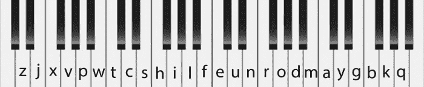

# 用 MIDI、Solace 和 Slack 制作事件驱动的音乐

> 原文：<https://dev.to/solacedevs/making-event-driven-music-with-midi-solace-and-slack-goe>

我是一名对音乐感兴趣的软件开发人员。我的专业工作几乎完全与音乐无关，但我最近有机会让大约 200 人，其中大多数不是音乐家，使用 Solace 消息路由器、Slack(通信产品)、软件合成器和一点点代码，创作几分钟独特的自发音乐。这篇文章描述了它是如何工作的。它还包括我使用的软件的链接和听起来像那首音乐的样本。

对于那些不熟悉我们的 PubSub+这样的事件代理的人来说，它们是存储和转发消息的计算机组件。最常见的场景是某个称为“发布者”的系统向代理发送消息，代理将消息发送给其他称为“订阅者”的系统。消息可以是温度传感器读数、股票市场交易、赛马赌注、天气信息或任何可以表示为计算机数据的东西。当需要高性能和可靠性时，消息代理可以只是软件或硬件设备。Solace 两者都做，并提供了 PubSub+软件代理的免费版本和云服务。大多数消息路由器的用户都在商业和工业领域，但是我对探索消息路由器在艺术领域的使用很感兴趣。

音乐产业已经支持一种叫做 MIDI(乐器数字接口)的信息类型。)这是在 20 世纪 80 年代初创建的，并迅速成为行业标准。对于那些不熟悉它的人来说，MIDI 定义了一个硬件接口(连接器和软线)，一个有线协议(如何以及哪些数据通过线路发送)，以及一个用于存储音乐作品的文件格式。MIDI 不直接处理音频或声音。相反，它与音符的简化概念一起工作。想象一个键盘手敲击一个音符。当按键被按下时，MIDI 将创建一个事件，称为“音符开”消息，包含一个与按键相对应的数字(例如，60 代表中音 C)，一个代表按键敲击力度的数字(在 MIDI 术语中称为力度)以及正在演奏的乐器(称为通道)。)当玩家释放该键时，会发送“音符关”信息。

## T2】

MIDI 还可以传输各种其他乐器控制的信息，如按下延音踏板或转动弯音轮。多达 16 种不同的仪器可以共享同一个连接。

在我看来，探索音乐和消息传递最简单、最明显的第一步是通过消息代理发送 MIDI 消息。但是这有什么用呢？大多数音乐依赖于相当精确的定时。当电缆太长或多个设备以菊花链形式连接在一起时，即使是 MIDI 也会引入不可接受的延迟。但是通过计算机网络发送信息通常会带来更大的时间问题。

由 20 世纪作曲家开创的一些现代艺术音乐形式对时间的把握更为宽容。例如，埃德加·瓦雷兹(1958)的电子作品 *Poeme Electronique* 和卡尔海因兹·斯托克豪森(1960)的 *Kontakte* 就没有可辨别的节奏。如果在这种类型中工作，网络延迟就不是问题了。

在 Solace，我们有一个名为 Kanata Day 的年度活动，这是一种全公司范围的会议。我们开发人员被鼓励编写演示来展示我们的产品。我认为这是一个尝试新想法的机会。为什么不让房间里的 200 多人都将 MIDI 音符发送给一个信息代理，并让一个程序收集这些音符并在乐器上演奏它们呢？

我可以用什么让一群人发送音乐笔记？一个想法是有一个网络应用程序，它有几个按钮，人们可以在他们的手机上使用来触发声音。这本来是可行的，但它比我所希望的更加有限。

我们都在工作中大量使用 Slack，并把它放在手机上。我认为，人们只需向 Slack bot 发送文本消息，并通过某种方式将文本转换为 MIDI 音符，这将非常容易。所以，我写了一个机器人来做这件事。它根据字母在英语中出现的频率将每个字母映射到一个注释。最常用的字母是“e ”,我把它映射到中音 C(钢琴键盘中间附近的一个音符)。)我将其他常用到很少使用的字母映射到与中音 c 渐远的音符。下图显示了哪些字母映射到了哪些键:

Slack bot 中使用的字母到键分配

每当有人发送消息时，Slack bot 会选择一个持续时间，250、375、500、750、1000 或 1500 毫秒中的一个。该持续时间将用于一条消息中的所有注释。此外，如果用户输入一个大写字母，则该字母的持续时间会加倍。这给音乐增加了一些时间上的变化。对了，不用 Slack 也可以在本地玩这个软件。这记录在下面描述的 slack-midi-web repo 中。

人们可以通过输入 0 到 9 之间的数字从 10 种乐器中选择一种。这些工具是:

*   0:羽管键琴(默认)
*   1:小号
*   2:低音吉他
*   3:电吉他
*   4:电子琴
*   5:咩咩盒子(一种会发出羊叫声的玩具)
*   6:三角钢琴
*   7:低音提琴
*   8:合成器
*   9:鼓

例如，如果用户键入“我看见了 3 只狗”，那么前四个音符将由大键琴演奏，后三个音符将由电吉他演奏。

每个音符的响度是在合理的范围内随机确定的。

任何不是字母或数字的字符都被视为休止符，即不会播放任何声音。

对于信息中的每个字母，Slack bot 都会发送一个 MIDI“音符开”信息，其中包含适当的音高、响度和乐器选择。则发送相应的“音符关”消息。这些信息符合实际的 MIDI 规范，只有三个字节长。

在接收端是一个名为“ [midi-mercury](https://github.com/damaru-inc/midi-mercury) 的 Java 程序，它接收来自消息代理的消息，并将它们发送到 midi 设备。Java 对 MIDI 有很好的内置支持，可以很容易地与任何连接的 MIDI 设备或软件乐器通信。该程序列出了它看到的设备，并让用户选择一个。Java 提供了一种内置的乐器，可以在没有其他设备的情况下播放声音。该程序还可以用来将 MIDI 音符从设备发送到消息代理。在演示过程中，我使用了斯坦伯格的 Halion 6。

以下是一些听起来与我们那天听到的非常相似的录音:

*   [样品 1](http://music.damaru.com/kanataday_slack_2.mp3)
*   [样品 2](http://music.damaru.com/kanataday_slack_4.mp3)
*   [样品 3](http://music.damaru.com/kanataday_slack_5.mp3)

## **我用过的程序**

Java 命令行程序“midi-mercury”(可在 [Github](https://github.com/damaru-inc/midi-mercury) 上获得)在 Solace message broker 和 midi 设备之间来回移动数据。目前它只支持“音符开”和“音符关”信息。用户可以选择将 MIDI 消息转换为 JSON 格式，以实现与其他系统的互操作性。例如，可以编写一个程序来生成注释并将它们发送给消息代理，但是发送文本可能比发送二进制数据更方便。

[slack-midi-web](https://github.com/damaru-inc/slack-midi-web) 是一个 NodeJS 程序。它是作为一个 [Slack bot](https://api.slack.com/) 编写的，但是因为它作为一个 Web 服务器运行，所以它可以独立运行——你可以向它发送 HTTP POST 请求，让它处理文本，就好像它收到了一条 Slack 消息一样(它附带了一个测试脚本来做这件事)。如上所述，它将文本转换为 MIDI 信息，并将它们发送到 Solace 信息路由器。它也可以在 [Github](https://github.com/damaru-inc/slack-midi-web) 上下载。出于 Kanata Day 演示的目的，我将它部署在 Google Cloud 上的 Kubernetes 集群中。我在存储库中包含了实现这一点的脚本。

用 MIDI、Solace 和 Slack 制作事件驱动音乐的帖子[最早出现在](https://solace.com/blog/making-event-driven-music-with-midi-solace-and-slack/) [Solace](https://solace.com) 上。