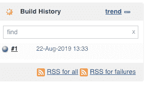
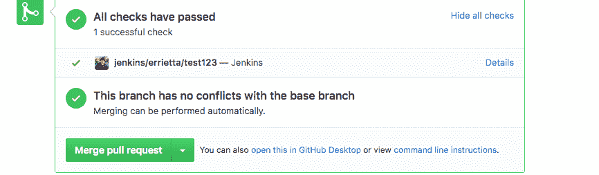
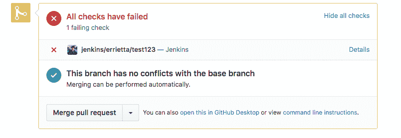

# 让 Jenkins 和 Github 实际上相互融合

> 原文：<https://dev.to/errietta/making-jenkins-and-github-actually-integrate-with-each-other-4kgk>

[](//jenkins.img/logos/fire/256.png)

当从存储库中创建分支/PRs 时，您可能需要构建 jenkins 作业——比方说，运行测试。完成后，您可能还想报告测试状态。你可能会发现这样做很令人沮丧。如果这些事情是真的，和我一起踏上旅程吧…

## 介绍

在一个工作项目中，我需要将 Jenkins 测试与 Github 库集成。基本上，我们从库中的分支对 master 发出 pull 请求，然后在评审和测试通过时合并它们。为了运行自动化测试，我们使用 jenkins，因此我们希望能够在创建 PR 时触发 Jenkins 作业，并根据结果将 PR 检查状态更改为通过或失败。

## 假设

做这些事情有许多不同的方法，所以我尽早列出我的假设是非常重要的，这样你就不会浪费时间去读一篇实际上对你没有帮助的博文。这些假设适用于我想要解决的案例，而你的情况可能会有所不同。

*   你不使用 Jenkins 多分支管道，如果你使用，某些事情会更容易，但这里仍然有可能帮助你的信息。
*   您希望从同一个存储库中的分支构建 PRs(大多数私人/公司项目都是如此)，而不是从 forks 构建 PRs(大多数自由/开源软件项目都是如此)。

## 要求

*   2GB 或更大的 RAM，Jenkins 非常需要内存…
*   Jenkins 安装——如果您像我一样，不想在您公司的实际 Jenkins 安装上进行试验，那么投资一个 Linux 系统可能是明智的，例如 DigitalOcean、AWS、Linode 或其他云提供商虚拟机。因为它需要能够接收 Github webhooks，所以它必须可以从互联网上访问，或者从任何托管 Github Enterprise 实例的地方访问。因此，不幸的是，您很可能无法在本地 VM 或 docker 容器上玩这个游戏——抱歉！但是上面提到的一些云提供商是按小时定价的，所以应该不会花你太多钱。
*   一个你想集成的 Github 项目，咄！
*   一种放松的方式(相信我，你会需要它……)
*   很有耐心

## 设置

### Github 访问

第一步是设置 Github 设置，允许 Jenkins 更新 PR 状态。从技术上来说，先做这一步还是下一步并不重要，但这是为后面打下基础的一部分。不幸的是，尽管我们试图将需要在 Github 和 Jenkins 中分别完成的事情进行分组，但我们需要在两个平台之间进行大量转换，所以要为此做好准备。

话虽如此，我还是会尽可能地把在一个平台上完成的事情放在一起，所以如果有些事情不能马上理解，不要担心，它们最终会走到一起的。我希望如此。

#### 使用户具有写权限

首先，确保您有一个对您的存储库具有**写权限**的用户，您可以使用它。不要担心，我们最终不会允许 Jenkins 拥有完全的写权限，但由于 Github 的工作方式，这是必需的。你可以使用一个已经存在的用户或者创建一个新的用户，你可以根据你的需要锁定它以确保它的安全。

#### 创建个人访问令牌

个人访问令牌允许使用令牌而不是用户名和密码来访问 Github API。除此之外，他们可以被锁定，只拥有绝对必要的权限。因此，这是与任何服务集成的最安全的方式之一。

*   进入 Github 设置(点击右上角的头像即可进入)
*   点击底部附近的**开发者设置**。
*   点击**个人访问令牌**。
*   点击**生成新令牌**
*   为此，唯一需要的范围是“ **repo:status** ”。这意味着您生成的令牌可以用于**更新提交状态**，但是不能用于其他任何事情。
*   将令牌保存在某个地方，你将无法再次获得它。我们将在稍后的帖子中再次需要它来设置 Jenkins 集成。

### Jenkins 插件和设置

现在已经完成了，我们需要做一些基础工作来允许 Github 触发 jenkins 构建，所以让我们开始下一步的 Jenkins 安装。

对于这个任务，你只需要为 Jenkins 安装 **Github 插件**。这提供了一个 webhook URL，它是`<YOUR_JENKINS_INSTANCE_URL/github-webhook>`。您可以手动访问该 URL，看看它是否有效；如果您看到“需要方法 POST ”,那么它已经设置好了。

## 综合

现在你已经设置了 Github access 并安装了 Jenkins 插件，是时候了！

### 创建 Jenkins 作业

如果您已经有了想要使用的作业，您可以对其进行编辑，使其与这些设置相匹配。

*   转到您的詹金斯安装
*   点击**创建项目**
*   点击'**自由式项目'**–我们再次假设您没有使用管道。如果是，那你的生活就轻松多了。
*   勾选 **github 项目**并添加您的项目 URL
*   在**源代码管理**中添加存储库——这需要至少具有只读访问权限的用户凭证，或者您的存储库是公共的。
*   让**分支构建**为空，这样你就可以构建 PR 分支。
*   至少选择**“git SCM 轮询的 GitHub hook 触发器”**
*   添加一个运行测试的**构建步骤**;我将把这一个留给你。
*   现在请单击“保存”；我们将需要稍后进行更多的编辑，但首先让基本案例工作是好的。

### Trigger Jenkins 从 Github 构建

还记得之前的 github-webhook URL 吗？该是那个网址发光的时候了。是时候将它作为 webhook 添加到我们的 github repo 中了，这样它就可以触发构建了。

*   转到 github repo 中的**设置**
*   点击**网页挂钩**
*   将**有效负载 URL** 作为之前的 URL，例如`YOUR_JENKINS_INSTANCE_URL/<github-webhook>`。
*   选择“将所有内容发送给我**”。我不确定这是必须的，但这真的没关系。**
*   保存 webhook。

现在，制作一个至少有一个提交的 PR。如果一切顺利，您应该会看到詹金斯的职位增加:

[](//www.errietta.me/blog/wp-content/uploads/2019/08/image.png)

如果不顺利，点击' **Github Hook Log** '希望可以诊断出问题。如果没有，你可能需要来自**需求**部分的**耐心**和**放松方式**，加上大剂量的 **StackOverflow。**

**在这个阶段，github 不会报告作业状态。这很正常！我们将在下一步中解决这个问题！**

### 报告作业状态

我建议在这一点上休息一下，因为这是迄今为止最令人沮丧的一步。

欢迎回来！希望你已经做了很长时间的冥想/喝酒/无论什么让你在做非常烦人的事情时保持理智。

现在是时候进入这个过程的最后也是最令人沮丧的部分了——实际更新 GH 构建状态。你准备好了吗？

#### 创建一个 jenkins 秘密来存储令牌

你之前保存令牌了吗？没有吗？别担心，你可以再做一个。现在您有了一个令牌，是时候将它安全地*存储在 Jenkins 中了。

它们是加密的，但如果有人能够访问 jenkins 实例，就可以被解密。希望你已经保护好了，对吧？

*   点击主页中的**凭证**
*   单击要存储凭据的凭据库。如果你不知道这意味着什么(我肯定不知道)，点击“詹金斯”商店。
*   点击域，如"全局凭证"
*   点击“添加凭证”
*   善良是“秘密文本”
*   秘密是你之前的令牌。
*   选择一个有意义的 id 和描述

#### 将秘密添加到您的工作中

*   回到您的 jenkins 作业，单击“配置”,它很方便地放在“删除作业”按钮的旁边，您不想意外单击它。
*   在“构建环境”中，勾选**使用秘密文本或文件**
*   在绑定中，选择“机密文本”。这应该会展开一个新的对话框。
*   在变量中，键入要使用的环境变量的名称，如 GH_TOKEN
*   选择“特定凭证”,并选择您在上一步中创建的密码的 id

#### 向 github 报告状态

现在，是真正任务的时候了！向 Github 报告情况。虽然仍然在同一个配置页面上，但是现在应该稍微调整一下构建工作了。

将下面的**放在运行测试命令的**之前，将状态设置为 pending:

```
export REPO_NAME='YOUR_REPO_NAME'
export JOB_NAME='YOUR_JOB_NAME'

curl "//api.GitHub.com/repos/$REPO_NAME/statuses/$GIT_COMMIT
      ?access_token=$GH_TOKEN" \
-H "Content-Type: application/json" \
-X POST \
-d "{
    \"state\": \"pending\",
    \"context\": \"jenkins/$REPO_NAME\",
    \"description\": \"Jenkins\",
    \"target_url\": \"//YOUR_JENKINS_URL/job/$JOB_NAME/$BUILD_NUMBER/console\"
}"
```

这将把您的 git 提交设置为挂起！

现在，因为我们没有使用管道，并且因为您不希望作业在失败时停止，所以您需要更改您的测试命令。因此，如果你的命令是，比方说，`bash test.sh`，你需要这样改变它，这样你就可以捕捉它是否成功。**这是假设如果失败，你的命令将返回一个非零状态，**这对于大多数测试框架都是正确的。

首先`export TEST_ERROR=0`，我们将使用它来存储错误(如果有的话)

将您的命令从`bash test.sh`更改为`bash test.sh || TEST_ERROR=$?`

现在，当您想要报告状态时，您可以检查我们是否捕获了错误:

```
if [ $TEST_ERROR -eq 0 ] ; then
    curl "//api.GitHub.com/repos/$REPO_NAME/statuses/$GIT_COMMIT
          ?access_token=$GH_TOKEN" \
    -H "Content-Type: application/json" \
    -X POST \
    -d "{
        \"state\": \"success\",
        \"context\": \"jenkins/$REPO_NAME\",
        \"description\": \"Jenkins\",
        \"target_url\": \"//YOUR_JENKINS_URL/job/$JOB_NAME/$BUILD_NUMBER/console\"
    }"
else
    curl "//api.GitHub.com/repos/$REPO_NAME/statuses/$GIT_COMMIT?access_token=$GH_TOKEN" \
    -H "Content-Type: application/json" \
    -X POST \
        -d "{
        \"state\": \"failure\",
        \"context\": \"jenkins/$REPO_NAME\",
        \"description\": \"Jenkins\",
        \"target_url\": \"//YOUR_JENKINS_URL/job/$JOB_NAME/$BUILD_NUMBER/console\"
    }"

    exit $TEST_ERROR
fi 
```

这将运行一个钩子来更新成功或失败，取决于`$TEST_ERROR`的值。如果之前有失败，它也会以非零状态退出，告诉 jenkins 也记录失败。

## 就是这样！

如果您做的一切都是正确的，您应该看到向 GH 报告的状态，成功或失败:

[](//www.errietta.me/blog/wp-content/uploads/2019/08/image-1.png)

[](//www.errietta.me/blog/wp-content/uploads/2019/08/image-3.png)

恭喜你！在经历了许多痛苦之后，你有了一个有效的集成。

## 进一步的步骤

*   您**可能**想要研究 jenkins 多分支管道，这样您至少可以以编程方式处理构建状态，而不必编写一个笨拙的 shell 脚本。

## 谢谢

感谢博文[“在你的 jenkins 管道中添加一个 github web hook”](//dzone.com/articles/adding-a-github-webhook-in-your-jenkins-pipeline)和[“如何在 github 中更新 jenkins 构建状态”](//applitools.com/blog/how-to-update-jenkins-build-status-in-github-pull-requests-step-by-step-tutorial?utm_referrer=//www.google.com/)，对我帮助极大。尽管我不能直接复制他们所做的，但我的解决方案确实是他们两个的弗兰肯斯坦式的怪物拼接，所以对他们来说太好了。

感谢在[詹金斯作品页面](//jenkins.io/artwork/)的人们为这篇文章使用的特色图片。尽管我抱怨 jenkins，但它可能是我用过的最强大的 CI 工具之一。

感谢您的阅读！如果你想让我写一篇关于多分支管道的文章让自己更痛苦，请告诉我！我敢肯定，看着我尝试写 Groovy 对某些人来说会很有趣…

如果这篇帖子看起来比我通常的风格更消极攻击，我很抱歉，但对我来说，这是一次真正的冒险…