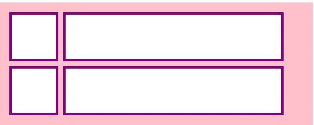
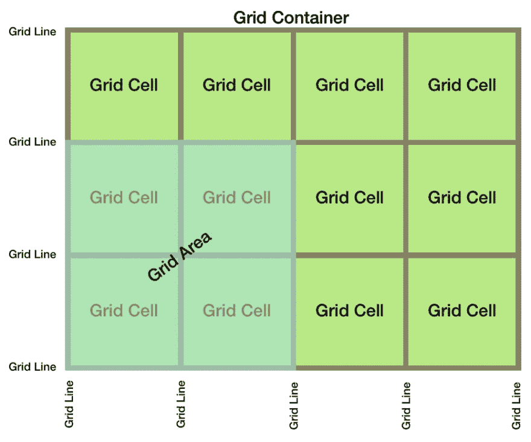
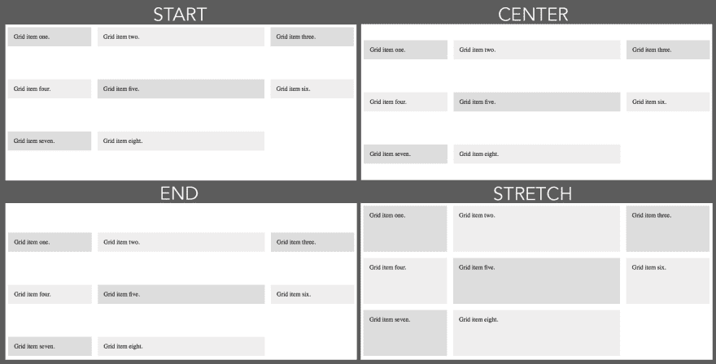

# 用 CSS (Pt c)制作布局——前端开发系列之五

> 原文：<https://dev.to/dillionmegida/making-layouts-with-css-pt-c-part-5-of-frontend-development-series-59en>

本文是我上一篇文章[用 CSS 制作布局(Pt b)——前端开发系列](https://dev.to/dillionmegida/making-layouts-with-css-pt-b-part-5-of-frontend-development-series-1icl)的第 5 部分——关于前端开发系列的延续。

目录

*   CSS 网格
*   结论

# CSS 网格

> 从上一篇文章中，我想相信你现在已经熟悉了`flex`。

当在任何元素中设置显示属性`grid`时，该元素将成为一个`grid`容器。不像`flex-container`提供调节元件的“单向”流动，这个容器提供两个方向。

```
<!-- index.html -->
<div class='grid-container'>
  <div class='grid-item'></div>
  <div class='grid-item'></div>
  <div class='grid-item'></div>
  <div class='grid-item'></div>
</div> 
```

Enter fullscreen mode Exit fullscreen mode

```
/* style.css */
.grid-container {
  display: grid;
  background-color: pink;
  grid-template-columns: auto 450px;
  grid-template-rows: 100px 100px;
  width: 600px;
  padding: 20px;
  grid-gap: 30px;
}
.grid-item {
  background-color: white;
  border: 5px solid purple;
} 
```

Enter fullscreen mode Exit fullscreen mode

当您阅读本文时，会参考这些代码。

结果:
[](https://res.cloudinary.com/practicaldev/image/fetch/s--Xdua1SGD--/c_limit%2Cf_auto%2Cfl_progressive%2Cq_auto%2Cw_880/https://res.cloudinary.com/dillionmegida/image/upload/v15689026img/code_samples/grid1_av5z7w.jpg) 
同样，随着我们的继续，上面的图表会变得更加清晰

* * *

<figure>

[](https://res.cloudinary.com/practicaldev/image/fetch/s--4StLOZ5X--/c_limit%2Cf_auto%2Cfl_progressive%2Cq_auto%2Cw_880/https://codingthesmartway.com/wp-content/uploads/2017/12/01_CSS_Grid_Overview.png)

<figcaption>Image from [codingthesmartway.com](https://www.google.com/url?sa=i&source=images&cd=&ved=2ahUKEwimxs-jhd3kAhVS6uAKHY5gBcwQjRx6BAgBEAQ&url=https%3A%2F%2Fcodingthesmartway.com%2Fgetting-started-with-css-grid%2F&psig=AOvVaw1mV5A918xg4GlBq0k_hPun&ust=1568987821603427)</figcaption>

</figure>

*   网格项目的垂直线被称为(您可能已经猜到了)列。它们被称为`grid columns`。
*   而水平线称为行，称为`grid rows`。
*   网格列之间的间隙称为`column gap`。可以使用属性`grid-column-gap`设置列之间的间距。
*   行列之间的间隙称为`row gap`。可以用属性`grid-row-gap`设置行与行之间的间隙。
*   行与列之间的间隙可以用`grid-gap`同时设置。

上面代码中的这一行现在应该可以理解了。

*   列之间的线称为`column lines`。
*   行与行之间的线称为`row lines`。

### 与 CSS 网格相关的属性

这些属性仅在容器的显示设置为网格时有效。

*   `grid-template-columns`:使用这个属性，您可以指定容器中给出的列数。在上面的代码中，
    `grid-template-columns: auto 450px;`
    这一行让网格容器包含两列——宽度分别为`auto`和`450px`。这意味着第二列的宽度将为 450px，而第一列将填充剩余的可用空间。

    > 您可以指定精确的尺寸，如`grid-template-columns: 10px 450px 40px 100px;`。这意味着该列将容纳四个具有指定宽度的列。

*   `grid-template-rows`:使用这个属性，您可以指定网格容器的行数。在我们上面的代码中；
    `grid-template-rows: 100px 100px;`为网格容器指定两行及其各自的高度。

**注意:**如果没有指定`grid-template-rows`，网格容器将使用从`grid-template-columns`和子元素数量中确定的最大行数。

**还要注意:**如果子元素的数量超过了我们的容器提供的网格单元的数量，我们的网格可能看起来是无序的。这不应该让你感到惊讶，ðÿ˜•

回到我们上面的图表；
[T3】](https://res.cloudinary.com/practicaldev/image/fetch/s--Xdua1SGD--/c_limit%2Cf_auto%2Cfl_progressive%2Cq_auto%2Cw_880/https://res.cloudinary.com/dillionmegida/image/upload/v15689026img/code_samples/grid1_av5z7w.jpg)

这个图表现在应该更清楚了吧？😊

再来说说更多的属性...

<figure>

[](https://res.cloudinary.com/practicaldev/image/fetch/s--6AyfeVLT--/c_limit%2Cf_auto%2Cfl_progressive%2Cq_auto%2Cw_880/http://grid-layout.cimg/align-combine2.png)

<figcaption>Image gotten from grid-layout.com</figcaption>

</figure>

*   justify-content
    该属性的值包括:
    `space-evenly | space-between | space-around | center | stretch | start | end`
    这些值类似于 flex 容器的 justify-content 属性。唯一的区别是 flex-start 用作开始，同样的事情也用于结束。

*   align-content `The values for this property also include:` 等间距|间距|环绕间距|居中|拉伸|开始|结束。

这也类似于 flex 容器中的对齐内容。上图中也有描述。

如果上面提到的术语听起来不熟悉，请在 [flex](https://dev.to/dillionmegida/making-layouts-with-css-pt-b-part-5-of-frontend-development-series-1icl) 上查看这篇文章。

# 结论

您已经观察到 CSS flex 一次只关注一个方向，而 CSS grid 同时关注两个方向。但是，它们有自己的使用案例。

想更深入的了解和使用网格的方法？我不能推荐任何更好的文章(在我看来)- [完整的 CSS 网格-css-tricks.com](https://css-tricks.com/snippets/css/complete-guide-grid/)

你可以在评论区提问或投稿，也可以在 twitter 上联系我。

我也在我的个人网站上写关于前端 web 开发的文章-[dillionmegida.com](https://dillionmegida.com)