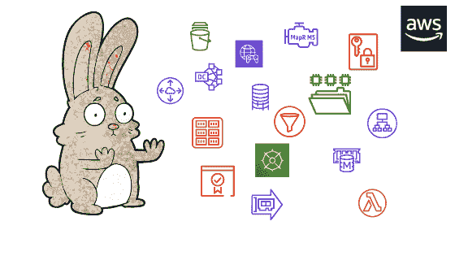

# 理解混乱的 AWS 账户

> 原文：<https://dev.to/yuvalo/making-sense-of-a-chaotic-aws-account-i4h>

我们都经历过这种情况，在你的新工作或项目中获得了 AWS 帐户，现在你需要交付结果。是的，即使对于最有经验的开发者来说，这也总是令人不知所措，并可能引发冒名顶替综合症，尤其是在账目特别混乱的情况下。哦，他们总是很乱。

您如何理解和把握 AWS 帐户中发生的事情？你怎样才能自信地步入你的新角色，而不是浪费时间摸索，因为你不知道事情是如何运作的？

我列出了一系列步骤来帮助你找到自信，并缩短你的适应期。谁知道呢，你甚至可能成为所有 AWS 客户问题的关键人物。

## 跟着钱走

我发现了一个很好的技巧来查看公司使用了哪些服务，或者他们放弃了哪些项目，那就是查看计费仪表板。

计费仪表板向您显示组织如何花费资金，并且是查看他们正在使用哪些地区和服务的简单方法。它可以帮助您省去逐个服务、逐个仪表板地了解情况的繁琐工作。
只要看一眼仪表盘，就能知道公司是倾向于使用托管服务还是倾向于运行自己的服务。

谁知道呢，有些事情可能会立即跳出来，告诉你他们在资源上超支了。稍后用它来提出改进建议(确保你在匆忙之前知道自己在做什么)。

## 用户故事

最终，每个系统都是为用户服务的，你可以利用它来了解公司做什么以及他们如何使用他们的 AWS 账户。

试着坐下来，跟随用户故事。问问你自己他们如何与系统交互，然后数据如何在系统中流动。
例如，如果大多数客户端与一个网站交互，遵循 http 请求，考虑认证、负载平衡器、后端服务器、消息队列以及您遇到的任何其他东西。
每一步都揭示了底层架构中的另一个系统。

你还记得那些“选择你自己的冒险”的书吗？你必须在身边放一张小地图，并且每一次都要更新。(我宁愿选择一个怪物，也不愿发现那个躲在角落里的错误配置的卡夫卡集群)。

## 地形图——VPC 的人脉

这可能是我的网络背景，但在我有足够的信心做任何实际工作之前，我在新环境中做的第一件事是获得网络拓扑的清晰图像。这是你可以通过一小步一小步地开始做的事情，我发现这在不知所措的时候很有帮助，尤其是当我不知道从哪里开始的时候。就像治疗一样。

问问你的新同事，他们是否已经有了网络拓扑图来帮助你开始，我保证即使他们有，也是过时的，充满了漏洞。你可以使用纸笔、白板或网络图工具。
一边走，一边问问题:

*   为什么他们决定用某种方式做事？
*   这个资源还在用吗？
*   事物是如何联系在一起的？
*   存在哪些安全层？

每一个问题都弥合了你理解上的另一个缺口。

## 现有文档

这个有点显而易见，但是试着看看公司是否有任何架构的文档。大多数公司至少会有一个合流账户，或类似的文件解决方案。在研究过程中，你可能需要挖掘得更深一点，或者参考他们的资料，但你可能会从中找到一些答案。

请记住，文档不一定是书面文档的形式。作为代码的配置在今天更加普遍，您可能会发现 Terraform 或其他配置工具配置。即使代码是混乱的，你也差不多已经挖到了金子。但是，不要单纯依赖它。继续构建你心中的建筑地图。

如果你发布了自己的文档，并使下一个人的入职变得更容易，那就加分了。

## 只是和人说话

另一个明显的步骤，但在面试同事时，有几件事你应该记住:

1.  友好一些，不要妄加评论。
Sometimes 我们看着一个系统，想，这是什么？他们为什么以这种方式做事？
Well，你是这个项目的新手，不了解全部情况。也许他们以某种方式做事，因为在他们开始的时候，新的解决方案还不存在。他们可能有你从未遇到过的问题。
Just 保持开放的心态。
2.  记住每个人都有一个议程。当你开始询问人们对系统的看法时，每个人都会讲述不同的故事，强调不同的事情，指责他人，并告诉你他们想要引入的激进变革。
Try 保持客观，不要陷入他们的政治和世界观。他们可能是对的，但是在做决定之前，要确保你有全面的了解。

3.  如果你要接替一个即将离职的人，这种情况经常发生，在那个对系统了如指掌的人离职去找另一份工作的前一天，你被带来了。
You 可能会坐下来，在一天内完成所有的事情，然后，你就只能靠自己了。
Even:如果他们非常关心这个项目并全力合作，你的时间是不够的。因此，不要试图面面俱到，试着学习以下内容:

    *   传递知识——人们“记住”的没有记载的信息——那个每晚更新整个系统的“Cron job”。一个叛离的服务器，每隔一段时间就会停止运行，每隔一周就需要重新启动一次。
    *   他们如何克服共同的问题。
    *   什么是当务之急，你下一步应该做什么。
    *   关于不同专业领域，您应该联系的人员列表。
4.  试着尊重他们的时间，记住你可能需要在接下来的几年里保持这种关系。

## 工具

你可能很想一头扎进使用只需按一下按钮就能自动完成工作的工具。使用工具有很多好处，但是请记住，没有一个工具是完美的，您可能会错过保存在内存而不是 API 中的有价值的数据点。

*   [Cloud Mapper](https://github.com/duo-labs/cloudmapper) -将帮助您为您的 AWS 帐户创建网络图和库存报告。
*   [TerraCognita](https://github.com/cycloidio/terracognita) -尝试做同样的事情，但是输出 Terraform 配置文件。
*   另一个将你的配置导出到 Terraform 的工具。
*   当然，还有 [CloudCraft](https://cloudcraft.co/) ，它通过连接到你的 AWS 账户来创建漂亮的图表。同样，我认为你应该按原样使用这些工具，工具，来帮助你描绘画面，但不要盲目依赖它们。

## 从哪里开始？

拿起笔记本和笔，登录 AWS 控制台，开始记笔记。
我发现计费仪表板和流动用户故事是很好的起点，有助于你更好地准备与不同利益相关者的会面。找出最适合你的方法，并享受这个过程。

## 想了解更多？

前往[推送构建测试部署](https://pushbuildtestdeploy.com/)并继续阅读。