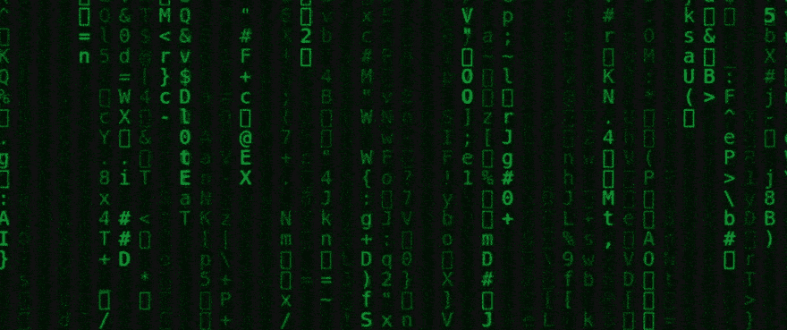

# 在 Javascript 中制作“矩阵”效果

> 原文：<https://dev.to/gnsp/making-the-matrix-effect-in-javascript-din>

我一直是电影系列《黑客帝国三部曲》的忠实粉丝。在这篇文章中，我们将使用普通的 Javascript 从《黑客帝国》系列中制作以下视觉效果。

[](https://res.cloudinary.com/practicaldev/image/fetch/s---1w4VnJR--/c_limit%2Cf_auto%2Cfl_progressive%2Cq_66%2Cw_880/https://thepracticaldev.s3.amazonaws.com/i/n9b2p3j0h1mdqvms3ogc.gif)

这里的 GIF 是针对尺寸优化的，所以它的质量很低，而且会抖动。但是我们最终的结果会是顺利的。让我们开始吧。

我们将在一个 HTML5 `canvas`上渲染这个视觉效果。对于本文，除了一个`canvas`之外，我们不需要页面上的任何其他元素。最初我们可以给它任何有效的大小(宽度和高度)，因为我们将从 JS 代码中设置画布的实际宽度和高度。我们会给它一个 ID，以便从 JS 代码中方便地引用它。

```
<canvas width="500" height="200" id="canv" /> 
```

Enter fullscreen mode Exit fullscreen mode

现在我们可以获取这个`canvas`的 DOM 节点，并设置它的宽度和高度来填充`body`。我们还将获得这幅画布的 2D 绘画背景。为了这个效果，屏幕将是黑色的，所以我们将通过绘制一个宽度和高度与画布相同的黑色矩形来填充画布。

```
// Get the canvas node and the drawing context
const canvas = document.getElementById('canv');
const ctx = canvas.getContext('2d');

// set the width and height of the canvas
const w = canvas.width = document.body.offsetWidth;
const h = canvas.height = document.body.offsetHeight;

// draw a black rectangle of width and height same as that of the canvas
ctx.fillStyle = '#000';
ctx.fillRect(0, 0, w, h); 
```

Enter fullscreen mode Exit fullscreen mode

我们希望文本以列的形式出现。每列宽 20px。在动画的每一帧中，我们将在每一列的末尾放置一个字符。最初，每列的终点(y 坐标)为 0。

```
const cols = Math.floor(w / 20) + 1;
const ypos = Array(cols).fill(0); 
```

Enter fullscreen mode Exit fullscreen mode

在每一帧中，我们需要在前一帧的顶部渲染一个半透明的黑色矩形，这样前一帧中渲染的字符看起来会逐渐变暗。然后，我们需要在当前帧的每一列的末尾呈现新字符。

每列的 y 坐标存储在`ypos`数组中。在每一帧中，我们希望随机重置一些列，使其从顶部重新开始，这样看起来就像不同高度的列从顶部落下。对于其余的列，我们将简单地将 y 坐标下移 20px，这样在下一帧中，一个新的字符将出现在当前字符的下方。

```
function matrix () {
  // Draw a semitransparent black rectangle on top of previous drawing
  ctx.fillStyle = '#0001';
  ctx.fillRect(0, 0, w, h);

  // Set color to green and font to 15pt monospace in the drawing context
  ctx.fillStyle = '#0f0';
  ctx.font = '15pt monospace';

  // for each column put a random character at the end
  ypos.forEach((y, ind) => {
    // generate a random character
    const text = String.fromCharCode(Math.random() * 128);

    // x coordinate of the column, y coordinate is already given
    const x = ind * 20;
    // render the character at (x, y)
    ctx.fillText(text, x, y);

    // randomly reset the end of the column if it's at least 100px high
    if (y > 100 + Math.random() * 10000) ypos[ind] = 0;
    // otherwise just move the y coordinate for the column 20px down,
    else ypos[ind] = y + 20;
  });
}

// render the animation at 20 FPS.
setInterval(matrix, 50); 
```

Enter fullscreen mode Exit fullscreen mode

这就是我们在普通 JS 中渲染矩阵效果所需要的。本文的代码在下面的笔中给出，以供参考。

[https://codepen.io/gnsp/embed/vYBQZJm?height=600&default-tab=result&embed-version=2](https://codepen.io/gnsp/embed/vYBQZJm?height=600&default-tab=result&embed-version=2)

希望你喜欢阅读这篇文章，并从中学到一些东西。你可以在的 [gnsp .找到更多关于我的信息。](https://gnsp.in)

**感谢阅读！**