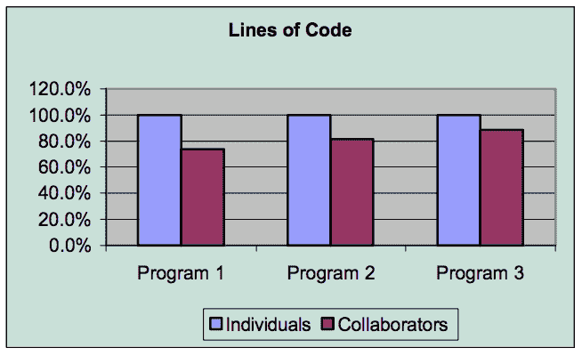
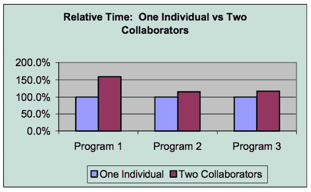

# 推动结对编程

> 原文：<https://dev.to/danvyle/making-the-push-for-pair-programming-24l5>

你可能会这样想:

## 什么是结对编程，实际上是什么样子的？

#### 1。一个站，两个开发者

*   一个键盘，一个显示器，一个鼠标

#### 2。一名司机

*   编写代码的开发人员

#### 3。一名导航员

*   观察、校对和制定下一步策略的开发人员会预见未来的问题。

#### 4。这些角色应该在一天的工作中互换。

#### 5。结对应该积极地检查代码并捕捉 bug。

#### **重要提示:**不要与合作伙伴编程混淆

*   两个合作伙伴并肩工作，在同一个项目上合作。

## 结对编程的优势

#### 1)事业

*   内部建立的导师计划
*   初级工程师很快升到高级职位
*   高层教授新思想/方法
*   整个团队的工作流程协同

#### 2)团队合作

*   在 2000 年对结对程序员进行的一项在线调查中，96%的人表示他们比单独编程时更喜欢自己的工作，95%的人表示结对编程时他们对自己的解决方案更有信心。(1)

*   在一个测试班，老师互动较少:74%的人写道“在我和我的搭档之间，我们可以解决所有问题。”班上 84%的人同意“我学习动态服务器页面更快更好，因为我总是和伙伴一起工作。”(2)

*   不同的背景创造了代码、设计和架构的完美结合

#### 3)更快解决问题

*   提出解决问题的多种选择和方法。(三个臭皮匠胜过一个诸葛亮)

*   结对编程允许团队成员快速共享问题和解决方案。这有助于结对程序员更容易地学习交流。"这提高了项目内部的沟通带宽和频率，增加了团队内部的整体信息流."[2]

*注意图表:程序 1 是第一个测试案例，程序 2 和程序 3 在初始“调整”期之后。*

#### 4)交叉训练

*   项目以多人理解系统或代码的许多方面而告终
*   如果员工打电话请病假，去度假，工作继续
*   减少了失去关键程序员或专家的风险。

#### 5)有毒环境

*   炙手可热的人物和自负对保住他们的工作影响不大。

#### 6)试探权宜之计

*   特别是在一个没有开发测试/QA 部门的新公司，这在缺陷检测方面越来越有价值。

## 会出什么差错？

#### 1。生产力损失

*   2 名编码员分别推出车票，而 2 名编码员处理一张车票。

*   研究表明，两个程序员在同一个程序上工作，只比这些程序员独立工作时慢 15%，而不是预先假定的慢 50%。[3]

#### 2。脱离

*   认为这项任务很容易的开发人员接手，从而使他们的合作伙伴脱离

#### 3。自大的家伙

*   在职业生涯的大部分时间里一直独自工作的开发人员

## 如何做好一对。需要考虑的事项:

#### 专家级&技能集

*   决定你是在上层还是下层，这可以随着情况的变化而变化。
    *   你是高级工程师还是初级工程师？
    *   你从事这个行业的时间更长吗？
    *   你在这个行业工作了多久？
    *   你有计算机科学学位吗？你是自学的吗？
    *   CEO 是你最好的朋友还是爸爸？
    *   等等。

#### 占多大空间？

*   你是内向的人吗

    

*   你是外向的人吗

*   害羞的开发者比外向的开发者想法少吗？外向的人在大声说出他们的想法之前会仔细检查吗？我斗胆分别说“不是”和“是”。(免责声明:这是根据经验得出的。)

#### 牢记这些:检查你的特权

*   反思你自己感知到的力量。如果你处于“上层”,支持你的搭档，成为他们的盟友。
*   让你的搭档在你之前说出他们的想法，注意不要打断。
*   当他们的想法没有被听到时，重复他们的想法。
*   感同身受。通过重复你的搭档对他们说的话来显示你在听。[4]

## 最后的想法和观察

TLDR:我在新兵训练营。我也做运动。结对就像运动。团队获胜。对子赢。公司赢了。底线赢了。

我目前是西雅图熨斗训练营的学生。我最近刚刚完成了为期一周的第二次结对编程作业。我喜欢它。除了与合作伙伴一起学习，了解合作伙伴，一起经历考验和胜利，我还喜欢在一天结束时，我们都可以解释我们的代码，而不需要另一个人在场。

我在运动中长大。我是一个女子足球队的队长，该队每两年参加一次女子联赛。如果你玩团队运动，你知道除了暴露对手的弱点之外，发挥你团队的优势也是至关重要的。当然，你对另一个团队也有同样的期望。在游戏中，我们制定策略，用我们的优势来暴露他们的弱点。在实践中，我们会进行练习来弥补我们的弱点，这样其他团队每周可以利用的机会就会越来越少。

个人编程甚至是伙伴编程对于发挥每个玩家的优势都是非常好的。然而，这会在个人擅长和不擅长的方面造成更大的差距。

结对编程就像足球队。我们发挥自己的优势，同时努力克服自己的弱点。从长远来看，我们都成为更好的球员和更好的队友。

我特别喜欢我的训练营，我们所有人都来自各种各样的背景，拥有跨越所有领域的技能。这绝对是练习的最佳时机，对你的伴侣或你感到不足的事情要有耐心和努力。结对编程是一个优秀的系统，可以培养领导者，团结同事，让开发人员接受文化，并产生高质量的代码和结果。

引用来源:

1.  威廉姆斯，劳里；罗伯特·凯斯勒；坎宁安·沃德；罗恩·杰弗里斯(2000 年)。“加强结对编程”(PDF)。IEEE 软件。17 (4): 19–25.citeserx 10 . 1 . 1 . 33 . 5248。doi:10.1109/52.854064。

2.  阿利斯泰尔·考克伯恩；劳里·威廉姆斯(2000 年)。“结对编程的成本和收益”(PDF)。第一届极限编程和软件工程中的灵活过程国际会议录(XP2000)。[https://collaboration . CSC . ncsu . edu/Laurie/Papers/XPSardinia。PDF](https://collaboration.csc.ncsu.edu/laurie/Papers/XPSardinia.PDF)

3.  威廉姆斯，劳里；罗伯特·凯斯勒；坎宁安·沃德；罗恩·杰弗里斯(2000 年)。“加强结对编程”(PDF)。IEEE 软件。17 (4): 19–25.citeserx 10 . 1 . 1 . 33 . 5248。doi:10.1109/52.854064。

4.  安娜莉·埃雷拉(2018)。“Voom 的结对编程:我们的代码如何飞行”。[https://blog . voom . flights/pair-programming-at-voom-how-our-code-take-flight-423 a05d 63718](https://blog.voom.flights/pair-programming-at-voom-how-our-code-takes-flight-423a05d63718)