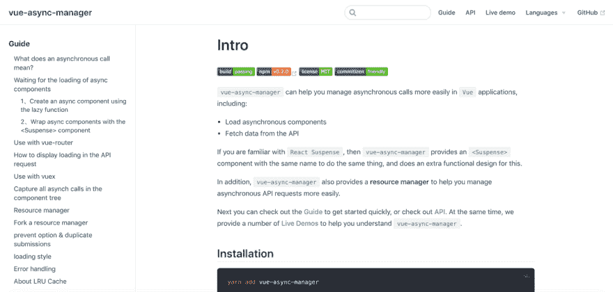

# 在 Vue 应用中更轻松地管理异步呼叫

> 原文：<https://dev.to/hcysunyang/manage-asynchronous-calls-more-easily-in-vue-apps-48f8>

目录:

*   异步调用是什么意思？
*   等待异步组件的加载
*   与 vue 路由器一起使用
*   如何在 API 中显示请求加载
*   与 vuex 配合使用
*   捕获组件树中的所有异步调用
*   资源管理程序
*   派生一个资源管理器
*   防止选项和防止重复提交
*   装载形式
*   错误处理
*   关于 LRU 缓存

github:[https://github.com/shuidi-fed/vue-async-manager](https://github.com/shuidi-fed/vue-async-manager)

文件:[https://shuidi-fed.github.io/vue-async-manager/](https://shuidi-fed.github.io/vue-async-manager/)

[](https://res.cloudinary.com/practicaldev/image/fetch/s--iWAxIvi3--/c_limit%2Cf_auto%2Cfl_progressive%2Cq_auto%2Cw_880/https://miro.medium.com/max/1400/1%2AYFoQM2KGU6oWfrKtfid_eg.png)

# 向导

> 在 Vue 应用中更轻松地管理异步呼叫

## 异步调用是什么意思？

这里所说的异步调用主要指两件事:

*   异步组件加载
*   发送异步请求以从 API 获取数据

## 等待加载异步组件

事实上，在`Vue`中，异步组件已经支持在加载过程中显示`loading`组件。以下代码摘自官网:

```
new Vue({
  // ...
  components: {
    'my-component': () => ({
        // async component
        component: import('./my-async-component'),
        // loading component
        loading: LoadingComponent,
        // delay
        delay: 200
    })
  }
}) 
```

:::提示
`delay`用于指定显示`loading`组件的延迟时间。上面代码中的延迟时间是`200ms`。如果异步组件的加载在`200ms`内完成，`loading`组件没有机会显示。
:::

但是它有两个问题:

*   1、`loading`组件与异步组件紧密联系在一起，`loading`组件不能提升到更高的层次并用于加载多个异步组件。
*   2、如果异步组件本身还有异步调用，比如请求 API，`loading`组件的隐藏不会等待 API 请求完成。

`vue-async-manager`提供了`<Suspense>`组件来解决以上两个问题。

### 1、使用`lazy`函数创建一个异步组件

过去，我们创建异步组件的方式是:

```
const asyncComponent = () => import('./my-async.component.vue') 
```

现在我们使用由`vue-async-manager`提供的`lazy`函数来创建异步组件:

```
import { lazy } from 'vue-async-manager'

const asyncComponent = lazy(() => import('./my-async.component.vue')) 
```

如上面的代码所示，只需将原来的异步工厂函数作为参数传递给`lazy`函数即可。

### 2、用`<Suspense>`组件包装异步组件

```
<template>
  <div id="app">
    <!-- Use the Suspense component to wrap a component tree that may have async components -->
    <Suspense>
      <!-- Loading slot -->
      <div slot="fallback">loading</div>
      <!-- Async component -->
      <asyncComponent1/>
      <asyncComponent2/>
    </Suspense>
  </div>
</template>

<script>
// Create async components
const asyncComponent1 = lazy(() => import('./my-async.component1.vue'))
const asyncComponent2 = lazy(() => import('./my-async.component2.vue'))

export default {
  name: 'App',
  components: {
    // Registration component
    asyncComponent1,
    asyncComponent2
  }
}
</script> 
```

只有在`<asyncComponent1/>`和`<asyncComponent2/>`都被加载后，`loading`组件才会消失。

:::提示
现场演示:[等待所有异步组件加载](///demo.html#waiting-for-all-async-components-to-load)
:::

## 配合 vue-router 使用

当我们开发`Vue`应用时，使用异步组件最常见的方式是用`vue-router`做代码拆分，比如:

```
const router = new VueRouter({
  routes: [
    {
      path: '/',
      component: () => import('./my-async-component.vue')
    }
  ]
}) 
```

为了让`<Suspense>`组件等待这个异步组件的加载，我们可以用`lazy`函数:
包装这个异步组件工厂函数

```
const router = new VueRouter({
  routes: [
    {
      path: '/',
      component: lazy(() => import('./my-async-component.vue'))
    }
  ]
}) 
```

最后，我们只需要用`<Suspense>`组件:
包装`<router-view>`组件

```
<Suspense :delay="200">
  <div slot="fallback">loading</div>
  <router-view/>
</Suspense> 
```

:::提示
现场演示:[带 vue 路由器](///demo.html#use-with-vue-router)T3】:::

## 如何在 API 请求中显示加载

以前我们通常手动维护是否显示`loading`，比如“请求启动”时，显示`loading`。当“请求结束”时隐藏`loading`。而如果有多个请求并发，就要等所有请求完成后再隐藏`loading`。简而言之，你需要自己维护`loading`的状态，不管它是存储在组件中还是存储在`store`中。

现在我们来看看`vue-async-manager`是如何解决 API 请求过程中的`loading`显示问题的，假设如下代码:

```
<Suspense>
  <div slot="fallback">loading...</div>
  <MyComponent/>
</Suspense> 
```

`<MyComponent>`组件呈现在`<Suspense>`组件内，这是一个普通组件。在`<Suspense>`组件内部，发送一个 API 请求，如下面的代码所示:

```
<!-- MyComponent.vue -->
<template>
  <!-- Display data -->
  <div>{{ res }}</div>
</template>

<script>
import { getAsyncData } from 'api'

export default {
  data: {
    res: {}
  },
  async created() {
    // Fetch data
    this.res = await getAsyncData(id)
  }
}
</script> 
```

这是我们经常看到的代码，通常我们在`created`或`mounted`钩子中发送异步请求。然而，对于`<Suspense>`组件，它不知道在隐藏`loading`之前需要等待异步请求完成。为了解决这个问题，我们可以使用`vue-async-manager` :
提供的`createResource`函数创建一个**资源管理器**

```
<template>
  <!-- Display data -->
  <div>{{ $rm.$result }}</div>
</template>

<script>
import { getAsyncData } from 'api'
import { createResource } from 'vue-async-manager'

export default {
  created() {
    // Create a resource manager(rm)
    this.$rm = createResource((params) => getAsyncData(params))
    // Read data
    this.$rm.read(params)
  }
}
</script> 
```

将一个工厂函数传递给`createResource`函数，我们创建一个**资源管理器** : `$rm`，然后调用资源管理器的`$rm.read()`函数读取数据。注意，上面的代码是以同步的方式编写的，`<Suspense>`组件知道该组件正在进行异步调用，所以`<Suspense>`组件会在隐藏`loading`之前等待异步调用完成。

另外，我们看到上面代码的模板部分，我们展示的数据是`$rm.$result`，实际上异步数据获取成功后，获取的数据会保存在`$rm.$result`属性中，需要注意的是属性本身是反应性的，所以不需要在组件的`data`选项中声明。

* * *

:::提示
现场演示:[暂挂组件等待资源管理器取数据](///demo.html#suspense-waits-for-rm-to-fetch-data)
:::

## 与 vuex 配合使用

用`vuex`很简单，只需用`mapActions`将`actions`映射到方法:

```
export default {
  name: "AsyncComponent",
  methods: {
    ...mapActions(['increase'])
  },
  created() {
    this.$rm = createResource(() => this.increase())
    this.$rm.read()
  }
}; 
```

:::提示
现场演示:[配合 vuex](///demo.html#use-with-vuex) 使用 T3】:::

## 捕获组件树中的所有异步调用

`<Suspense>`组件不仅捕获异步组件的加载。如果一个异步组件本身有其他异步调用，比如通过**资源管理器**读取数据，`<Suspense>`组件也可以捕获这些异步调用，并在隐藏`loading`之前等待所有异步调用结束。

我们来看一个例子:

```
<Suspense>
  <div slot="fallback">loading</div>
  <!-- MyLazyComponent is a component created by the lazy function -->
  <MyLazyComopnent/>
</Suspense> 
```

`<MyLazyComopnent/>`组件是由`lazy`函数创建的组件，因此`<Suspense>`组件可以等待异步组件加载，而异步组件本身通过**资源管理器** :
读取数据

```
// Async component
export default {
  created() {
    // Read data through the resource manager
    this.$rm = createResource((params) => getAsyncData(params))
    this.$rm.read(params)
  }
} 
```

此时，`<Suspense>`组件将在隐藏`loading`之前等待两个异步调用的完成，它们是:

*   1、异步组件加载
*   2、由异步组件内的资源管理器发送的异步请求

:::提示
现场演示:[暂挂组件等待资源管理器取数据](///demo.html#suspense-waits-for-rm-to-fetch-data)
:::

## 资源经理

我们一直在强调一个词:**资源管理器**，`createResource`函数的返回值是资源管理器，也就是一个对象，我们通常用`$rm`来命名。

资源管理器的完整形式如下:

```
this.$rm = createResource(() => getAsyncData())

this.$rm = {
    read(){},   // A function that calls this function to actually send an async request to fetch data
    $result,    // The initial value is null. After the async data is successfully acquired, the obtained data is stored.
    $error,     // The initial value is null, which holds the err data when the async request fails.
    $loading,   // A boolean value with an initial value of false, indicating whether the request is in progress
    fork()      // Create a new resource manager based on an existing resource manager
} 
```

`$rm.read()`函数用于发送异步请求取数据，可以多次调用，比如点击按钮再次调用。`$rm.$result`我们也见过，用来存储异步获取的数据。`$rm.$loading`是一个布尔值，表示请求是否正在进行。通常我们可以这样定制`loading`显示:

```
<template>
  <!-- Control loading display -->
  <MyButton :loading="$rm.$loading" @click="submit" >提交</MyButton>
</template>

<script>
import { getAsyncData } from 'api'
import { createResource } from 'vue-async-manager'

export default {
  created() {
    // Create a resource manager
    this.$rm = createResource((params) => getAsyncData(params))
  },
  methods: {
    submit() {
      this.$rm.read(params)
    }
  }
}
</script> 
```

:::提示
更重要的是:**`createResource()`可以和`<Suspense>`分开使用。**
::

如果资源管理器在获取数据时遇到错误，错误数据将存储在`$rm.$error`属性中。`$rm.fork()`函数用于基于现有的**资源管理器**创建一个相同的资源管理器。

## 分叉一个资源管理器

当一个 API 用来取数据，我们需要取数据两次，我们只需要调用`$rm.read()`两次:

```
<script>
import { getAsyncData } from 'api'
import { createResource } from 'vue-async-manager'

export default {
  created() {
    // Create a resource manager
    this.$rm = createResource((type) => getAsyncData(type))

    // Continuous fetch data twice
    this.$rm.read('top')
    this.$rm.read('bottom')
  }
}
</script> 
```

但是这样做会产生一个问题，由于一个**资源管理器**只与一个`$rm.$result`关联，所以在上面的代码中，`$rm.$result`只会保存`$rm.read('bottom')`的数据。当然，有时这是意料之中的，但是如果需要存储两次调用的数据，就需要`fork`创建一个新的资源管理器:

```
<script>
import { getAsyncData } from 'api'
import { createResource } from 'vue-async-manager'

export default {
  created() {
    // Create a resource manager
    this.$rm = createResource((type) => getAsyncData(type))
    // Fork a new resource manager based on the existing resource manager
    this.$rm2 = this.$rm.fork()

    // The data read twice will be stored separately
    this.$rm.read('top')
    this.$rm2.read('bottom')
  }
}
</script> 
```

因此，由于`$rm`和`$rm2`是两个独立的资源管理器，它们不会相互影响。

## `prevent`选项&重复提交

假设我们正在提交一个表单。如果用户点击按钮两次，将导致重复提交，如下例:

```
<template>
  <button @click="submit">Submit</button>
</template>
<script>
import { getAsyncData } from 'api'
import { createResource } from 'vue-async-manager'

export default {
  created() {
    // Create a resource manager
    this.$rm = createResource((type) => getAsyncData(type))
  },
  methods: {
    submit() {
      this.$rm.read(data)
    }
  }
}
</script> 
```

事实上，我们可以在创建资源管理器时提供`prevent`选项，这样创建的资源管理器会自动为我们防止重复提交:

```
<template>
  <button @click="submit">Submit</button>
</template>
<script>
import { getAsyncData } from 'api'
import { createResource } from 'vue-async-manager'

export default {
  created() {
    // Create a resource manager with the prevent option
    this.$rm = createResource((type) => getAsyncData(type), { prevent: true })
  },
  methods: {
    submit() {
      this.$rm.read(data)
    }
  }
}
</script> 
```

第一次单击按钮时，会发送一个请求，在请求完成之前出现的所有新请求都会被忽略。

## 加载样式

`loading`的样式分为两种:一种是只显示`loading`，不显示其他内容；另一种是在正常渲染其他内容的同时显示`loading`，比如页面顶部有一个长长的加载栏。这个加载条不影响其他内容的正常呈现。

所以`vue-async-manager`提供了两种渲染模式:

```
import VueAsyncManager from 'vue-async-manager'
Vue.use(VueAsyncManager, {
  // Specify the rendering mode, the optional value is 'visible' | 'hidden', the default value is: 'visible'
  mode: 'visible'
}) 
```

默认使用`'visible'`的渲染模式。这意味着`loading`可以和其他内容共存。如果不想要这种渲染模式，可以指定`mode`到`'hidden'`。

到目前为止，我们只看到用`<Suspense>`组件控制`loading`的显示，`loading`的内容是由`<Suspense>`组件的`fallback`槽决定的。但是有时我们希望更加灵活，我们经常会遇到这样的场景:当你点击按钮并在按钮上显示一个微小的`loading`图标时，我们的代码可能看起来像这样:

```
<MyButton :loading="isLoading" >Submit</MyButton> 
```

`loading`的样式是由`<MyButton>`组件提供的，换句话说，我们放弃了`<Suspense>`的`fallback`槽作为`loading`来展示。因此，我们需要知道它当前是否正在加载。我们已经介绍了这个问题的解决方案，我们可以使用资源管理器的`$rm.$loading`属性:

```
<MyButton :loading="$rm.$loading" >Submit</MyButton> 
```

## 错误处理

当`lazy`组件加载失败时，显示`<Suspense>`组件的`error`插槽。您还可以通过监听`<Suspense>`的`rejected`事件来自定义错误处理。

:::提示
现场演示:[加载失败显示错误槽](///demo.html#load-failed-to-show-error-slot)
:::

除了在错误发生时显示`error`槽，还可以通过监听`<Suspense>`组件的`rejected`事件来自定义处理:

```
<template>
  <Suspense :delay="200" @rejected="handleError">
    <p class="fallback" slot="fallback">loading</p>
    <AsyncComponent/>
  </Suspense>
</template>
<script>
export default {
  // ......
  methods: {
    handleError() {
      // Custom behavior
    }
  }
};
</script> 
```

:::提示
现场演示:[通过事件处理错误](///demo.html#through-event-processing-error)
:::

## 关于 LRU 的缓存

`React Cache`使用`LRU`算法缓存资源，要求 API 幂等。然而，在我的工作环境中，很少有 API 在给定的时间段内是幂等的，所以没有提供缓存资源的能力。