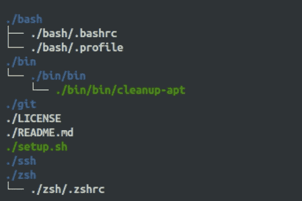

# 使用 GNU stow 命令管理点文件

> 原文：<https://dev.to/eddinn/manage-dotfiles-with-the-gnu-stow-command-33f6>

我一直在寻找一种管理我的点文件和配置的好方法，我发现了[肖恩·麦克埃尔罗伊](https://dev.to/autoferrit)写的这篇文章[关于用 GNU stow 管理你的点文件。](https://dev.to/writingcode/how-i-manage-my-dotfiles-using-gnu-stow-4l59)

所以我将他的方法应用到我的配置中，到目前为止我非常满意，并且我用初始配置和 README.md 在我的 GitHub 页面上初始化了一个 git repo