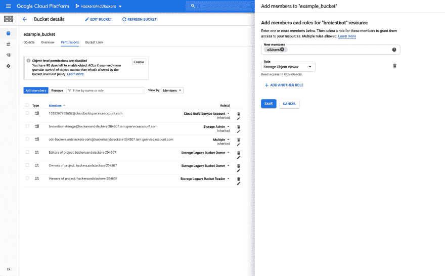
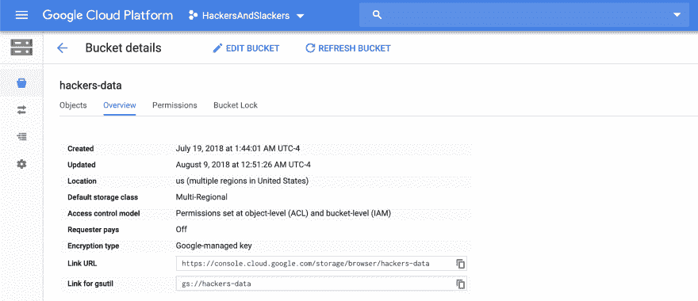

# 用 Python 管理 Google 云存储中的文件

> 原文：<https://dev.to/hackersandslackers/manage-files-in-google-cloud-storage-with-python-59fi>

[](https://res.cloudinary.com/practicaldev/image/fetch/s---sjExbVL--/c_limit%2Cf_auto%2Cfl_progressive%2Cq_auto%2Cw_880/https://hackersandslackers.com/conteimg/2019/06/gcp-cloudstorage.jpg)

我最近在做一个项目，这个项目结合了我一生中最大的两个爱好:编码和迷因。当然，这个项目是一个聊天机器人:一个有趣的虚拟朋友，坐在你选择的聊天室里，忠诚地等待你的召唤，在你需要的任何时候提供迷因。在某些情况下，机器人会在互联网上搜寻新鲜出炉的迷因，但也有很多情况下，所需的迷因应该更容易预测，即来自云上托管的预先确定的迷因子集，可以动态更新。这就是谷歌云存储的用武之地。

对于任何 GCP 的粉丝来说，谷歌云存储是 S3 的一个很好的替代品。Google Cloud 通过**Google-Cloud-Storage**Python SDK 提供了一种非常简单的与云存储交互的方式:我发现自己更喜欢 Python 库，而不是 clunkier Boto3 库。

当我们通过[以编程方式与 big query](https://dev.to/hackersandslackers/google-bigquerys-python-sdk-creating-tables-programmatically-3cof)进行交互时，我们实际上已经简单地接触了 google 云存储，但是这个库中有足够的功能来证明一篇文章本身的价值。

## 开始设置

设置 Google Cloud bucket 非常简单，可以跳过细节，但是有几件事情值得一提。列表中的第一项:我们需要设置 bucket 的权限。

### 设置桶级权限

在绝大多数情况下，让桶可公开访问是一大禁忌；我们应该*永远不要*公开包含敏感信息的桶(除非你是美国政府的承包商，你决定将所有美国选民的[个人信息存储在一个公开的 S3 桶中](https://www.upguard.com/breaches/the-rnc-files)——这显然是可以的)。因为我正在处理从其他来源窃取的迷因，所以我不介意这个桶被公开访问。

默认情况下，不会在新存储桶上启用存储桶级权限(新存储桶遵循对象级权限)。起初，改变这一点可能有点棘手:我们需要单击我们选择的存储桶，并注意屏幕顶部的提示:

<figure>[](https://res.cloudinary.com/practicaldev/image/fetch/s--2DLW0FLY--/c_limit%2Cf_auto%2Cfl_progressive%2Cq_auto%2Cw_880/https://hackersandslackers.com/conteimg/2019/06/googlecloudstorage-allusers-1.png) 

<figcaption>新桶应该提示你桶级权限。</figcaption>

</figure>

点击“启用”将在屏幕右侧打开一个侧面板。要启用公开可见的文件，我们需要将**存储对象查看器**角色附加到一个名为 **allUsers** 的关键字上(allUsers 是“成员”的保留类型，意思是“全世界的每个人”)。

### 查找我们的存储桶信息

当我们以编程方式访问我们的 bucket 时，我们将需要一些关于我们的 bucket 的信息，比如我们的 bucket 的 URL(我们需要它来实际知道我们的 bucket 中的项目将被存储在哪里)。关于我们铲斗的一般信息可在“概述”选项卡下找到，请记下:

<figure>[](https://res.cloudinary.com/practicaldev/image/fetch/s--kdutV348--/c_limit%2Cf_auto%2Cfl_progressive%2Cq_auto%2Cw_880/https://hackersandslackers.com/conteimg/2019/06/gcp-bucket-overview-2.png) 

<figcaption>要访问我们在 bucket 中修改的文件，您需要知道 URL。</figcaption>

</figure>

### 生成服务密钥

最后，我们需要生成一个 JSON 服务密钥来授予我们的脚本权限。在你的 GCP 控制台中查看[凭证](https://console.cloud.google.com/apis/credentials?)页面，并下载一个包含你的凭证的 JSON 文件。请记住不要在任何地方犯这个错误。

## 配置我们的脚本

我们开始编码吧，好吗？用`pip3 install google-cloud-storage`确保谷歌云存储库安装在你的机器上。

我将使用一个包含我们需要使用的相关信息的 **config.py** 文件来设置我们的项目:

```
"""Google Cloud Storage Configuration."""
from os import environ

# Google Cloud Storage
bucketName = environ.get('GCP_BUCKET_NAME')
bucketFolder = environ.get('GCP_BUCKET_FOLDER_NAME')

# Data
localFolder = environ.get('LOCAL_FOLDER') 
```

*   `bucketName`是我们水桶的名字。谷歌云存储通过寻找与你的 GCP 账户中的名字相匹配的存储桶来与存储桶进行交互。
*   `bucketFolder`是我们将使用的 bucket 中的一个文件夹。
*   我在那里保存了一些本地文件，用来测试上传和下载到 GCP。

完成后，我们可以通过导入这些值来开始我们的脚本:

```
"""Programatically interact with a Google Cloud Storage bucket."""
from google.cloud import storage
from config import bucketName, localFolder, bucketFolder

... 
```

## 管理 GCP 桶中的文件

在我们做任何事情之前，我们需要创建一个表示我们的 bucket 的对象。我正在创建一个名为 **bucket** 的全局变量。这是通过在我们的存储客户机上调用`get_bucket()`方法并传递我们的存储桶的名称来创建的:

```
"""Programatically interact with a Google Cloud Storage bucket."""
from google.cloud import storage
from config import bucketName, localFolder, bucketFolder

storage_client = storage.Client()
bucket = storage_client.get_bucket(bucketName)

... 
```

为了演示如何与 Google 云存储交互，我们将创建 5 个不同的函数来处理常见任务:上传、下载、列出、删除和重命名文件。

### 上传文件

我们的第一个函数将查看机器上的本地文件夹，并上传该文件夹的内容:

```
from os import listdir
from os.path import isfile, join

...

def upload_files(bucketName):
    """Upload files to GCP bucket."""
    files = [f for f in listdir(localFolder) if isfile(join(localFolder, f))]
    for file in files:
        localFile = localFolder + file
        blob = bucket.blob(bucketFolder + file)
        blob.upload_from_filename(localFile)
    return f'Uploaded {files} to "{bucketName}" bucket.' 
```

我们做的第一件事是使用`listdir()`获取本地文件夹中的所有文件。我们通过使用`isfile()`来验证我们获取的每个项目是一个文件(而不是一个文件夹)。

然后我们遍历文件数组中的每个文件。我们使用`bucket.blob()`设置每个文件的期望目的地，它接受期望的文件路径，一旦上传到 GCP，我们的文件将保存在该路径中。然后我们用`blob.upload_from_filename(localFile)`上传文件:

```
Uploaded ['sample_csv.csv', 'sample_text.txt', 'peas.jpg', 'sample_image.jpg'] to "hackers-data" bucket. 
```

### 清单文件

知道哪些文件存在于我们的桶中显然很重要:

```
def list_files(bucketName):
    """List all files in GCP bucket."""
    files = bucket.list_blobs(prefix=bucketFolder)
    fileList = [file.name for file in files if '.' in file.name]
    return fileList 
```

从我们的桶中获取文件列表。默认情况下，这将返回*所有的*文件；通过指定`prefix`属性，我们可以将想要列出的文件限制在 bucket 中。

```
['storage-tutorial/sample_csv.csv', 'storage-tutorial/sample_image.jpg', 'storage-tutorial/sample_text.txt', 'storage-tutorial/test.csv'] 
```

看起来 **test.csv** 存在于我们的桶中，而不在我们的本地文件夹中！

### 下载文件

我构建的聊天机器人的一个功能是为每个迷因关键词获取一个随机的迷因。让我们看看我们是如何做到的:

```
from random import randint

...

def download_random_file(bucketName, bucketFolder, localFolder):
    """Download random file from GCP bucket."""
    fileList = list_files(bucketName)
    rand = randint(0, len(fileList) - 1)
    blob = bucket.blob(fileList[rand])
    fileName = blob.name.split('/')[-1]
    blob.download_to_filename(localFolder + fileName)
    return f'{fileName} downloaded from bucket.' 
```

我们利用已经创建的`list_files()`函数来获取我们的桶中的项目列表。然后，我们通过使用`randint`生成随机索引来选择一个随机项目。

这里需要注意的是，`.blob()`返回一个“blob”对象，而不是一个字符串(用`type()`检查我们的 blob 会导致`<class 'google.cloud.storage.blob.Blob'>`)。这就是为什么我们看到`blob.name`在设置 blob 的文件名时发挥作用。

最后，我们用`download_to_filename()`下载我们的目标文件。

### 删除文件

删除文件就像`.delete_blob`一样简单:

```
def delete_file(bucketName, bucketFolder, fileName):
    """Delete file from GCP bucket."""
    bucket.delete_blob(bucketFolder + fileName)
    return f'{fileName} deleted from bucket.' 
```

### 重命名文件

要重命名文件，我们将一个 blob 对象传递给`rename_blob()`，并通过`new_name`属性设置新名称:

```
def rename_file(bucketName, bucketFolder, fileName, newFileName):
    """Rename file in GCP bucket."""
    blob = bucket.blob(bucketFolder + fileName)
    bucket.rename_blob(blob,
                       new_name=newFileName)
    return f'{fileName} renamed to {newFileName}.' 
```

## 管理桶

我们还可以使用谷歌云存储来与整个存储桶进行交互:

*   `create_bucket('my_bucket_name')`用给定的名称创建一个新的存储桶。
*   `bucket.delete()`删除现有的存储桶。

还有一些编程方式，比如访问关于一个 bucket 的细节，或者删除 bucket 中的所有对象。不幸的是，这些动作只受到 REST API 的支持。反正我也没觉得这些动作特别有用，所以随便吧。

本教程的源代码可以在[这里](https://github.com/hackersandslackers/googlecloud-storage-tutorial)找到。就这些了，伙计们！