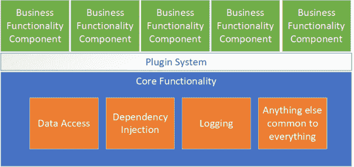
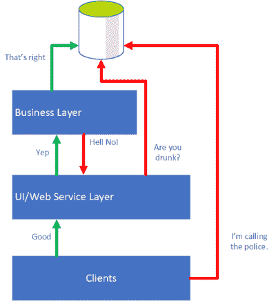

# 管理大型企业应用程序。网络生态系统

> 原文：<https://dev.to/alistairjevans/managing-big-enterprise-applications-in-the-net-ecosystem-4af8>

我将在这里花几分钟讨论一些设计/维护大型企业级的建议。NET 应用程序，特别是那些你卖给别人的，而不是自己开发的。

> 免责声明:我主要处理企业客户使用的大型应用程序。我想很多读这篇文章的人也一样，但是很多人可能不同意我的一些想法/建议。下面的内容只是基于我设计和部署用户驱动的 ASP.NET 应用程序的经验。

## 巨石的短暂防御(部署)

微服务现在风靡一时，它们非常酷，我不否认这一点；易于维护的小逻辑块都可以快速构建、部署和启动，非常出色。当你正在部署你自己的软件时，它们是很棒的，无论是在你自己的场所还是在云中；但是，如果您的软件必须由该环境的所有者部署到其他人的环境中，该怎么办呢？

如果他们不使用容器，甚至不使用虚拟化，会怎么样？

如果他们根本没有 DevOps 管道，一切都要手动完成怎么办？

在这些情况下，部署简单性是我们最重要的考虑因素之一，而微服务部署绝不简单。

我需要的是将可部署组件的数量保持在最低限度。我的目标是一键安装程序，其次是最小的配置。

在最近的一次微软 Azure 会议上，我问一个小组，他们有什么解决方案/计划来将一个复杂的微服务架构作为一个易于安装的组件部署在其他人的基础架构中。如果他们也使用 Azure，那么你可能会在不久的将来走运，但除此之外，我没有得到任何让我对可分发微服务包抱有希望的答案。

## 管理独石

在现代开发生态系统中，有些人认为“整体”是一个肮脏的词。它们被视为不可避免的大量代码、可怕的膨胀和痛苦的开发经历。但这不一定是真的。

我将写几篇博客文章，详细介绍维护企业 ASP.NET monolithis 的具体技巧，但是我将从一些一般性的建议开始。

以下所有内容完全适用于 ASP.NET 应用程序。NET 框架，以及。NET Core(即将被称为。净 5)。

#### 使其模块化，使其可拼接

“模块化整体结构”的概念并不新鲜。如果你不把你的应用程序分成多个库(即 dll)，你将很快进入代码的世界，这将使你的源代码控制库崩溃。

> 我发现循环引用预防实际上最终有助于实施良好的设计模式，如果所有东西都在一个大项目中，您就不会得到这种模式。

即使你所有的代码都非常整洁，如果你把你的软件分发给企业客户，在某些时候你需要修补一些东西，因为大客户不会经常升级到你的最新版本(十年一次并不罕见)。当他们发现一个需要修复的 bug 时，他们当然不会仅仅升级到 trunk/master 上的最新版本。

如果您需要重新发布整个应用程序来修补某些东西，您的客户的内部测试团队将会叫屈，因为他们无法预测您的更改的影响，所以他们会说他们需要重新测试整个东西。当你说你所有的自动化测试都通过了，他们肯定不会继续信任你。

因此，为此，不要在一个项目中构建一个 ASP.NET(v4 或核心)web 应用程序(尽管大多数入门教程一开始都告诉您要这样做)。我不管它有多大，把它分开。

如果需要，您可以添加自己的程序集加载启动过程。的。NET 加载器在加载你的引用方面做得很好，但是我发现你最终需要比默认行为更多的控制。例如，您可以基于某些清单文件显式加载应用程序的库(有助于控制修补的 DLL 版本)。

#### 微仁是你的朋友

如果可以，那么使用微内核架构来构建你的应用。我说的微内核是指应用程序应该有一个中央核心，它提供基本的技术支持特性(数据访问、日志记录、依赖注入等)，但不为应用程序添加任何实际功能。

一旦你有了这些，你就可以:

*   轻松更新(和修补)应用程序中的功能块。这些变化比你的核心更频繁。
*   创建客户特定的特性(这经常发生),而不污染您的通用应用程序代码。
*   孤立地开发和测试您的功能块。
*   通过给他们不同的功能块来将您的开发扩展到多个团队。

听起来熟悉吗？开发微服务可以分享这些优势；具有特定问题领域的小功能块，可以单独开发。

在部署方面，我们仍然有一个部署包；您的 CI 系统应该根据给定客户或分支机构所需组件的列表，将核心组件和功能组件放入一个安装程序或其他包中。

我要说的是，定义一个微内核架构是非常困难的，特别是如果你必须在以后将它添加到一个现有的应用程序架构中。

> pro tip——为你的核心组件定义你自己的内部 NuGet 包，这样它们就可以很容易的分发；然后，您可以轻松地向其他团队“发布”新的核心版本。
> 
> 如果您从 CI 系统中输出 NuGet 包，您甚至可以让一些团队在开发中需要核心功能来完成核心的“alpha”构建。

#### 在你的 API 中强制层分离

(或者“如果你在 MVC 控制器中使用数据上下文，编译器会扇你一巴掌”)

仅仅因为所有的事情都可能在一个进程中运行，并不意味着你不应该保持严格的层分离。

至少，您应该定义一个允许访问您的数据库的业务层，以及一个不允许访问的 UI/Web 服务层。

业务层不应该使用 UI 服务，UI 层也不应该直接访问/修改数据。

应用程序的客户端应该只能看到那个 UI 或 Web 服务层。

 

<figcaption>软件设计中不断升级的恐怖事件。</figcaption>

您可以通过代码审查来强制执行所有这些，但是我发现事情仍然会从缝隙中溜走，所以我喜欢让我的 API 布局在我的核心中执行工作来强制执行布局。

我找到了一个很好的方法。NET 应用程序(微内核或其他)的目的是:

*   定义支持每层功能的清晰基类。例如，在业务层中创建一个 MyAppBusiness 类，所有业务服务都必须从该类派生。类似地，定义一个 MyAppController 类，所有 MVC 控制器都将从该类派生(该类又从普通控制器类派生)。
*   在这些类中，公开受保护的方法来访问每一层需要的核心服务。因此，您的基本 MyAppBusiness 类可以向派生类公开数据访问，并且您的 MyAppController 类可以提供本地化/视图呈现支持。
*   在您的启动过程中(最好是当您注册您的依赖注入服务时，如果您使用它，您应该使用它)，只注册有效的服务，这些服务从正确的基类派生。如有必要，由命名空间/程序集强制执行。如果有人弄错了，抛出异常。

在可能的情况下，开发人员的错误在代码中应该是可检测/可预防的。把它放进你的 API 中，你就可以让人们遵循标准，因为如果他们不遵循标准，他们就什么也做不了。

## 接下来

在以后关于这类主题的文章中，我将讨论:

*   在具有复杂数据库的应用程序中使用实体框架的提示
*   大型应用程序的自动化测试
*   使用 PostSharp 在编译时验证开发人员模式

..以及想到的任何其他话题。