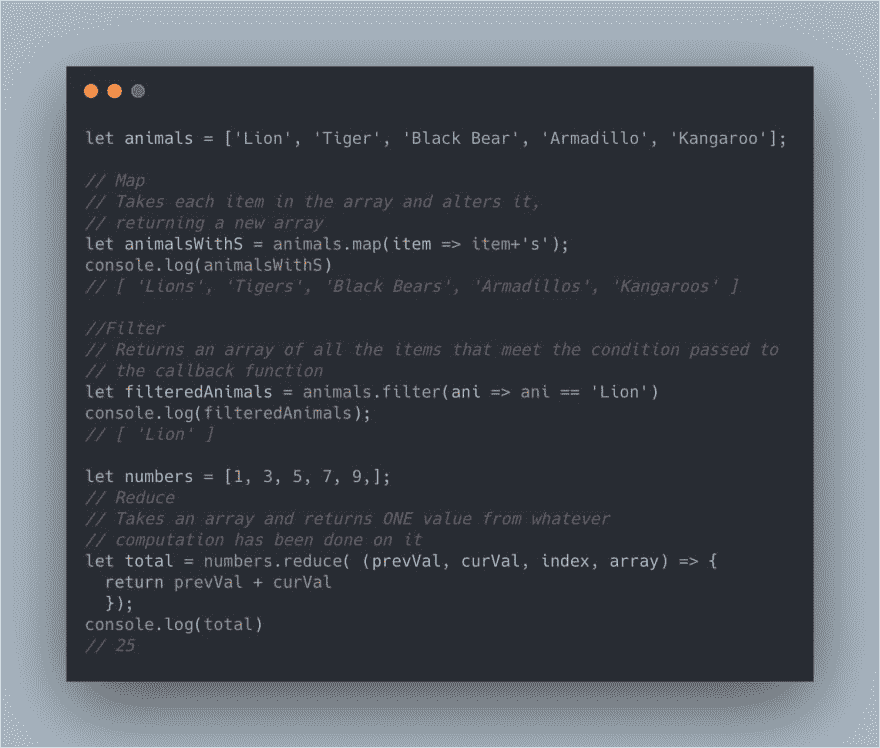

# 。map()，。过滤器()和。减少()

> 原文：<https://dev.to/pickleat/map-filter-and-reduce-2efb>

> 最初发布在我的[博客](https://pickleat.github.io/posts/reviewingArrayMapReduceFilter/)

在过去的几周里，我一直在申请工作。遗憾的是，我工作的那家初创公司并不成功。我非常失望它没有成功，但事情有时就是这样。无论如何，我已经在 twitter 上发了帖子，说我正在四处看看，我有一个朋友提议做一次模拟面试。

简而言之，他把我烤熟了。

我很感谢我们做到了这一点，因为老实说，我从来没有在这样的采访中被问到过技术问题。我只是在压力下崩溃了。我不是不知道怎么倒序。我就是想不起来怎么按需做。

所以我一直在复习一些基本的 JavaScript 概念，因为记住它们的作用和用法对我有好处。而不是每次都要去查。昨天我在推特上发布了这段代码，它似乎对人们很有帮助，所以这里有更多的解释。

[](https://res.cloudinary.com/practicaldev/image/fetch/s--rm7nHjyM--/c_limit%2Cf_auto%2Cfl_progressive%2Cq_auto%2Cw_880/https://pbs.twimg.com/media/D-uEwR8X4AEN9n5%3Fformat%3Djpg%26name%3Dlarge)

## Array.map()

[来自 MDN:](https://developer.mozilla.org/en-US/docs/Web/JavaScript/Reference/Global_Objects/Array/map)

> map()方法创建一个新数组，其结果是对调用数组中的每个元素调用一个提供的函数。

你有一个数组，你需要对每个元素做一些事情。这就是地图的作用！

```
let numbers = [1,2,3,4,5]
numbers = numbers.map(numb=> numb+1)
console.log(numbers)
// will be [2,3,4,5,6] 
```

最初对我来说，最大的障碍是意识到`numb`完全是虚构的。你想叫它什么都可以。通常的做法是将`array`称为数组中包含的任何内容的复数，而将每个计算的项目称为单数。老实说，通过长时间使用`forEach()`,我发现了很多。它们之间的区别是`.map()`返回一个更新后的数组。所以在上面的例子中，数字数组被重写为每个值加一。但是如果你想保留原来的数字数组，你可以简单地声明它为一个新的数组，比如 so `let numbersPlusOne = numbers.map(numb=> numb+1)`。

## Array.filter()

[来自 MDN:](https://developer.mozilla.org/en-US/docs/Web/JavaScript/Reference/Global_Objects/Array/filter)

> filter()方法创建一个新数组，其中所有元素都通过了由提供的函数实现的测试。

这里的主要区别是，无论您传递什么条件，都会给您一个满足该条件的所有项目的变异数组。
例如:

```
let numbers = [1,2,3,4,5]
numbers = numbers.filter(numb=> numb % 2 == 0)
console.log(numbers)
// will be [2,4] 
```

将对数组中的每一项检查您传递的任何条件，并将它添加到新数组中并返回。

## Array.reduce()

[来自 MDN:](https://developer.mozilla.org/en-US/docs/Web/JavaScript/Reference/Global_Objects/Array/Reduce)

> reduce()方法对数组的每个元素执行一个 reducer 函数(您提供的),产生一个输出值。

这个稍微复杂一点，因为有更多的论点。但最简单的形式是，您可以获取一个数组，并对每个元素执行相同的函数来接收单个值。回到我们的数字数组

```
let numbers = [1,2,3,4,5]
numbers.reduce( (accumulator, currentValue) => accumulator + currentValue )
console.log(numbers)
// 15 
```

请记住，您所做的计算将在数组中的每一项上进行，`accumulator`是运行总数。在`currentValue`(箭头函数之前)后面还有可选的参数`currentIndex`和`array`，但我不会在这里深入讨论。

希望这有所帮助！