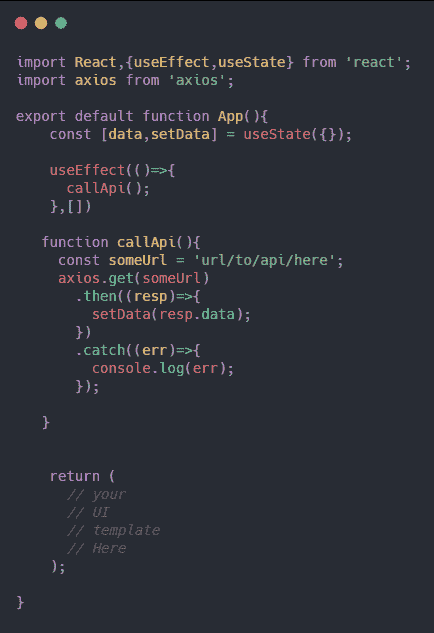
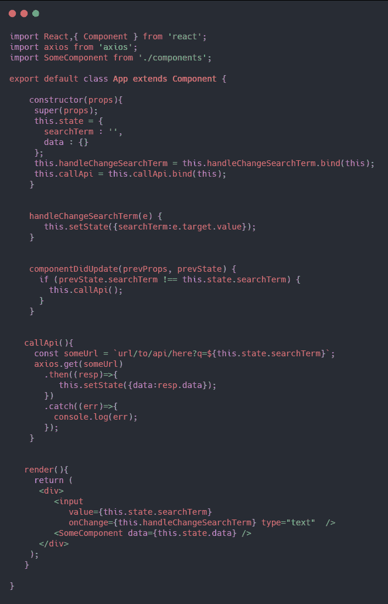
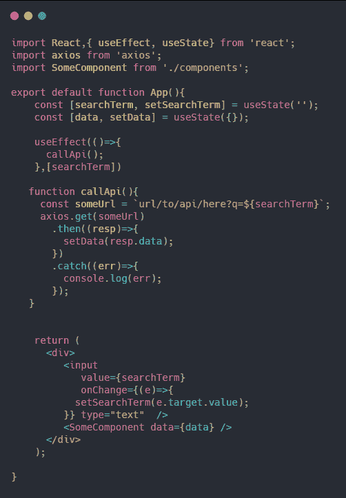
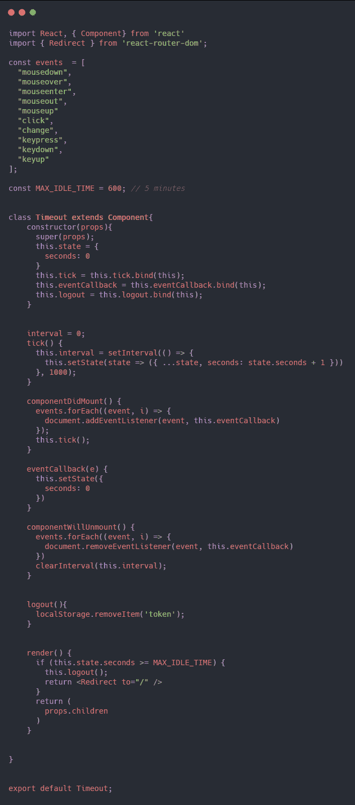
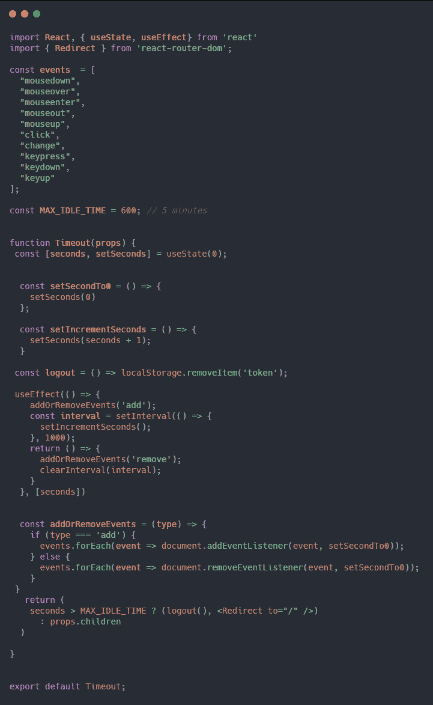

# 掌握 useEffect API

> 原文：<https://dev.to/macmacky/mastering-the-useeffect-api-57ed>

Hooks API 是去年 2 月在 v16.8 版本中添加的一个很棒的特性，它改变了我们编写 React 应用的方式。我们现在编写更多的功能组件，而不是类组件。由于函数组件的存在，我们不需要在构造函数中绑定更多的函数。所以今天我们来揭开**使用效果** API 的神秘面纱。

基本上这个钩子做的是**你需要在你做了一些事情之后渲染组件。它主要用于从 API 或 web 服务调用或获取数据，并且您需要在 DOM 更新后做一些事情**。

**useEffect 钩子基本上是 componentDidMount、componentDidUpdate 和 componentWillUnmount 组合的**。

首先，我们演示了与 **useEffect** API 等价的 **componentDidMount** 。

你可以看到两个例子之间的区别。第二个例子的行数比第一个少，可读性比第一个好，我们去掉了构造函数方法。这里的关键是 useEffect 方法中的第二个参数一个空数组，这意味着我们只运行 useEffect 钩子的第一个参数或者回调函数**一次，或者我们只在组件**的第一次渲染时调用它。

其次，我们演示了与 **useEffect** API 等价的 **componentDidUpdate** 。

这里要记住的关键是，我们在 **useEffect** 钩子的第二个参数中传递数组上的 **searchTerm** 。当 **searchTerm** 值改变时，我们在 **useEffect** 钩子上运行回调函数。如果 **searchTerm** 的当前值是**“a”**并且下一次渲染的新值是**“ab”****use effect**钩子比较该值并评估其不同，然后调用回调函数。

最后，我们演示了与 **useEffect** API 等价的**组件 WillUnmount** 。

在 **useEffect** 钩子上第一个参数的回调函数中，我们返回了一个名为**清理**的函数，这样我们可以避免应用程序中的内存泄漏。在本例中，我们删除了 dom 中的事件侦听器，并清除了超时。我制作的这个超时组件助手是一个高阶组件，如果用户没有触发 events 数组上的任何事件，组件就会将用户重定向到基本路径。超时，在本例中是 600 秒或 5 分钟。请随意在您的项目中使用它，或者向它添加一些功能。

#### 感谢阅读本帖。

### 祝大家有美好的一天😃。