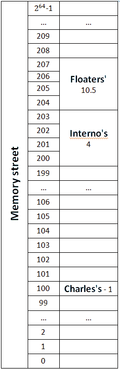

# 内存地址和指针

> 原文：<https://dev.to/giladri/memory-addresses-pointers-3hda>

欢迎来到记忆街！在记忆街，有 2^64 情节。每个地块都有一个地址，从 0 到 2^64 - 1(是的，那是一条很长的街道，尤其是因为所有的地块都在路的同一边)。有些地块上有房子，有些则没有。有些房子建在几块地上，有些只建在一块地上。例如，查理的房子(我们从现在开始称它为 **`ch`** )只建在一块土地上，而且只有一个人住在里面。这所房子的地址是记忆街 100 号。

如果我们将这些信息翻译成我们的语言，我们可以说变量 **`ch`** 包含 1 作为它的值，它的地址是 100。同样，它的大小是一个 [**字节**](https://en.m.wikipedia.org/wiki/Byte) 。一个字节是可以访问的最小内存单位**(就像我们理论上的街道中的一个地块)，它包含 8 位。位是内存的最小单位，只能是 0 或 1。**

 **现在让我们看看 Interno 的房子(`ih` __，从现在开始)，它包含 4 个人，建在 4 个地块上:200、201、202 和 203。这意味着它的地址是 200。紧挨着这栋房子的是“流浪者之家”(`fh` __，从现在开始)，它的地址是 204，也建在 4 块地上。住在这所房子里的人数是 10.5 人。

[](https://res.cloudinary.com/practicaldev/image/fetch/s--baAhEVNQ--/c_limit%2Cf_auto%2Cfl_progressive%2Cq_auto%2Cw_880/https://thepracticaldev.s3.amazonaws.com/i/tj52t7f33lq4uvpv4erz.PNG)

对于上面提到的所有房子，我们能说些什么呢？我们可以说房子的地址分别是 100，200 和 204。而且，我们可以说它们的值分别是 1，4，10.5。我们已经知道如何在代码中表示值:

```
char ch = '1';
int ih = 4;
float fh = 10.5; 
```

Enter fullscreen mode Exit fullscreen mode

但是我们如何表示地址呢？

还记得 **`scanf`** 函数中的' & '符号吗？这就是答案。如果你把这个操作符放在一个变量之前，你得到的是它的**地址**，而不是它的**值**。比如:

```
char * chAddress = &ch; // 100 in our example
int * ihAddress = &ih; // 200 in our example
float * fh fhAddress = &fh; // 204 in our example 
```

Enter fullscreen mode Exit fullscreen mode

注意，这里的' * '是**而不是乘法运算符**，但它是我们声明一个**指针**的方式。一个**指针**是我们保存**地址**的变量。这意味着**指针**的**值**是一个**内存地址**。一个**指针**也有自己的地址，这意味着我们也可以用另一个指针指向它。如果我们想声明一个指针，我们写:

```
<variable_type> * <pointer_name>; 
```

Enter fullscreen mode Exit fullscreen mode

例如:

```
int * pointer; // can  point at an integer variable 
```

Enter fullscreen mode Exit fullscreen mode

如果我们想得到指针所指向的变量的**值**，我们可以这样再次使用星号(' * ')操作符:

```
#include <stdio.h> 
int x = 10;
int * pointer = &x; // pointer now points at x
printf("The value of the variable which the pointer points at is: %d", *pointer); // we put '*' before a pointer in order to get the value of the variable/address it points at 
```

Enter fullscreen mode Exit fullscreen mode

换句话说，如果我们想声明一个指针，我们在类型后面加一个“*”，如果我们想得到指针指向的变量/地址的值，我们也在指针名称前面加一个“*”。可能会有点混乱，但是你很快就会习惯的。

“我们为什么需要指针？”你可能会问。一个答案是，我们希望**将变量**的地址传递给函数，而**不是它们的值**。换句话说，我们想告诉函数在哪里可以找到原始的盒子，并得到它所包含的内容，以防止它需要创建一个新的盒子，在这个新的盒子中，它将只复制原始盒子的值。比如我们上面提到的 **`scanf`** 函数:

```
#include <stdio.h> 
int x;
printf("Enter a number:\n");
scanf("%d", &x); 
```

Enter fullscreen mode Exit fullscreen mode

在上面的例子中， **`scanf`** 函数获取 **`x`** 的**地址**，原因很清楚: **`scanf`** 函数不需要 **`x`** 的值，(更准确地说: **`x`** 的值是“垃圾”，因为我们以前从未初始化过它)，但它需要 **`x`** 的**地址**才能知道函数 **`scanf`** 获取一个盒子的**地址**并用输入填充它！

这个传递变量的方法通过引用来调用**(而不是通过值**来调用**)。**

让我们观察下一个例子:

```
#include <stdio.h> 
void swapByValue(int x, int y) {
    int temp = x;
    x = y;
    y = temp;
}

void swapByReference(int * x, int * y) {
    int temp = *x;
    *x = *y;
    *y = temp;
}

int main() {
    // Initializes two variables
    int x = 5;
    int y = 3;
    printf("x=%d, y=%d\n", x, y);
    // Runs the first function and prints the values of x and y
    swapByValue(x, y);
    printf("x=%d, y=%d\n", x, y);
    // Runs the second function and prints the values of x and y
    swapByReference(&x, &y);
    printf("x=%d, y=%d\n", x, y);
    // Success
    return 0;
} 
```

Enter fullscreen mode Exit fullscreen mode

上例中代码的输出是:

```
x=5, y=3
x=5, y=3
x=3, y=5 
```

Enter fullscreen mode Exit fullscreen mode

为什么？第一个 **`printf`** 输出很琐碎，只是我们如何在 **`main`** 中初始化我们的变量。第二个输出对聪明的读者来说应该也是微不足道的，因为实际上 **`swapByValue`** 函数**什么也不做！**该函数创建了两个**新的**变量，**`x`****`y`**，这两个变量与**`main`****`x`****`y`**【其他框】的变量完全不同，但具有相同的值。这意味着交换发生了，但发生在函数末尾不再存在的无关变量上(我们将在以后学习**范围**)。最后的输出就是我们想要的输出。变量真的在正确的范围内交换了它们的值( **`main`** 的代码块)。那是因为 **`swapByReference`** 函数也创建了两个新的**变量，但这一次变量的值不仅仅是复制了 **`main_'s`** 变量的值。新变量的值是 **`main`** 变量的**地址**，因此，交换操作发生在 **`main`** 变量上！(正如其本意)。**

 **这个帖子到此为止。我知道这对于一次来说太多了。在你继续下一篇文章之前，确保你完全理解了我们所说的，这是关于**内存分配**和**动态数组**的。

一个很好的挑战，在工作面试中经常出现:你能写一个不初始化新变量的交换函数吗？( **`temp`** ，以我们为例。)

#### **永远记住，事情比你想象的要复杂得多！**

问候，
吉拉德****