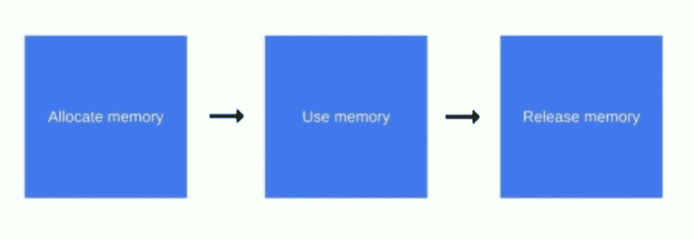
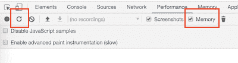
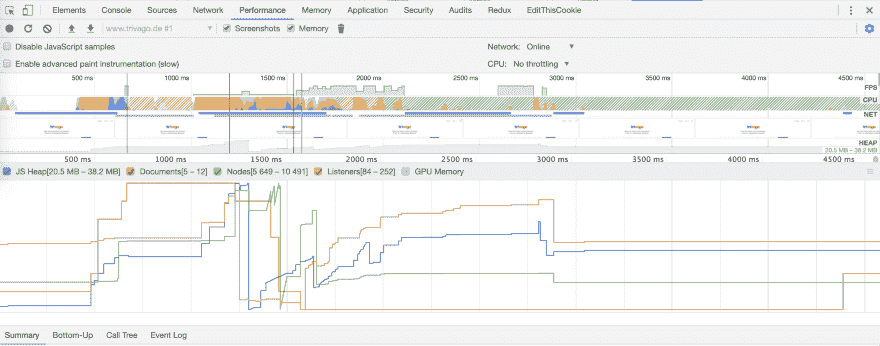
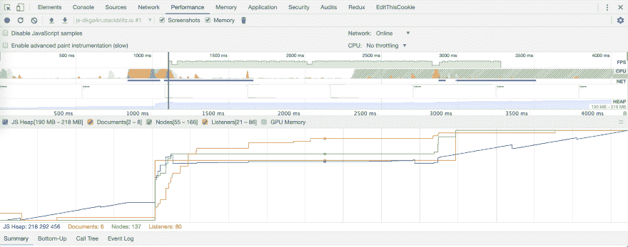

# 内存泄漏以及如何使用 Chrome 开发工具找到它们

> 原文：<https://dev.to/ayusharma_/memory-leaks-and-how-to-find-them-using-chrome-dev-tools-2749>

在应用程序中很难发现内存泄漏，通过采取一些预防措施，可以在编写代码的过程中避免内存泄漏。每个开发人员都应该知道最常见的内存泄漏模式。

在本文中，我将尝试涵盖应用程序中的内存生命周期模式、内存泄漏的最常见原因以及如何在 Chrome 开发工具中识别它们。

#### 内存生命周期模式

内存生命周期模式说**一些内存被分配给你的代码**，**分配的内存被你的代码**使用，然后**当你的代码被执行**时它被释放(释放)。

[](https://res.cloudinary.com/practicaldev/image/fetch/s--jUOAmq9M--/c_limit%2Cf_auto%2Cfl_progressive%2Cq_auto%2Cw_880/https://thepracticaldev.s3.amazonaws.com/i/odv6bz1z5w0ctjck13fy.png)

#### 内存泄露的原因

**1。意外全局**处于`non-strict`模式

```
function iCauseMemoryLeak() {
  temp = 1;
} 
```

这里，你给`temp`变量赋值，这个值在`iCauseMemoryLeak`函数的任何作用域中都不可用。Javascript 编译器在`global`范围内设置变量，并且变量`temp`在将来不会被垃圾收集。在应用程序的生命周期中，它将永远存在。

**2。被遗忘的计时器**

```
 setTimeout(() => {
  /** Perform a task here.. */
}, 1000);

// OR

setInterval(() => {
  /** Perform a task here.. */
}, 1000); 
```

*定时器*分配动态内存来执行任务，如果你忘记清除*定时器*，那么它将导致内存泄漏。

您可以使用`clearTimeout`清除`setTimeout`，使用`clearInterval`
清除`setInterval`

```
 var a = setTimeout(() => {
  /** Perform a task here.. */
}, 1000);

clearTimeout(a);

// OR

var b = setInterval(() => {
  /** Perform a task here.. */
}, 1000);

clearInterval(b); 
```

**3。DOM 操作**

想象一下，你有两个按钮，当你点击*按钮一*时，它将从 DOM 中删除*按钮二*。

```
 const buttonOne = document.querySelector('#button-a');
const buttonTwo = document.querySelector('#button-b');

buttonOne.addEventListener('click', () => {
    document.body.removeChild(buttonTwo);
}); 
```

在上面的代码中，您通过单击`buttonOne`从 DOM 中移除`buttonTwo`，但是我们从未移除存储在变量`buttonTwo`中的`buttonTwo`的引用。这种内存泄漏可能非常危险。

我们可以通过在`click`事件监听器中存储`buttonTwo`的引用来避免这种情况。

```
const buttonOne = document.querySelector('#button-a');

buttonOne.addEventListener('click', () => {
    const buttonTwo = document.querySelector('#button-b');
    document.body.removeChild(buttonTwo);
}); 
```

这里，我们通过点击`buttonOne`将`buttonTwo`从 *DOM* 中移除，它就是*垃圾收集*。

#### Chrome 开发工具中的  标识

*   打开 Chrome 开发工具。
*   加载您的网站。
*   在性能面板中选择**内存**复选框，并点击**重新加载**图标。

[](https://res.cloudinary.com/practicaldev/image/fetch/s--EUTsZQI0--/c_limit%2Cf_auto%2Cfl_progressive%2Cq_auto%2Cw_880/https://thepracticaldev.s3.amazonaws.com/i/m5d8o6wa9e623tjxo9x1.png)

*   加载配置文件和内存图表。

#### 分析记忆图形

**图像一**
[](https://res.cloudinary.com/practicaldev/image/fetch/s--LWnvnOeT--/c_limit%2Cf_auto%2Cfl_progressive%2Cq_auto%2Cw_880/https://thepracticaldev.s3.amazonaws.com/i/li94mzf1kqifok9r485y.png)

**图片 B**
[](https://res.cloudinary.com/practicaldev/image/fetch/s--MpF4pME8--/c_limit%2Cf_auto%2Cfl_progressive%2Cq_auto%2Cw_880/https://thepracticaldev.s3.amazonaws.com/i/4shikummcyopgsvxtq1s.png)

你怎么看？哪个图像代表内存泄漏？

让我们按照*内存生命周期模式*来寻找答案。

> 分配内存，使用内存和释放内存。

在*图像 A* 中，应用程序启动，它使用一些内存，然后释放它，这种情况一直持续到应用程序处于加载状态。最后，当加载应用程序时，您会注意到图形几乎保持线性和平坦。它表示带有映像 A 的应用程序需要为应用程序运行时保留内存，并且所需的内存是恒定的。

另一方面，在*图像 B* 中，内存图一直在增加，直到结束，它们是一个阶跃函数，这些图表示内存随时间的增加。

现在，我们可以说*图像 B* 代表内存泄漏。

我希望你喜欢阅读这篇文章。快乐学习。

*附:你能猜出我生成记忆图的图片 A 中的网站吗？*

#### 参考文献:

1.  [Javascript 中的垃圾收集](https://developer.mozilla.org/en-US/docs/Mozilla/Projects/SpiderMonkey/Internals/Garbage_collection)
2.  [设置超时](https://developer.mozilla.org/en-US/docs/Web/API/WindowOrWorkerGlobalScope/setTimeout)和[设置间隔](https://developer.mozilla.org/en-US/docs/Web/API/WindowOrWorkerGlobalScope/setInterval)
3.  [Chrome 开发工具文档](https://developers.google.com/web/tools/chrome-devtools/)