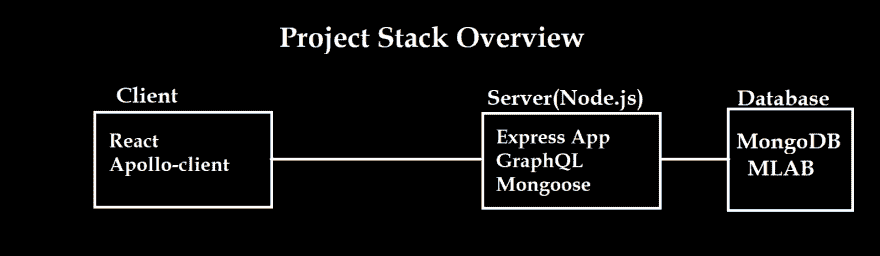
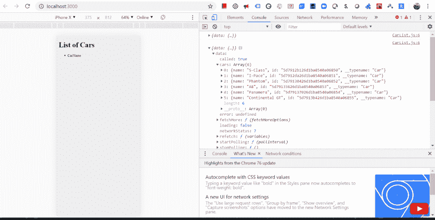
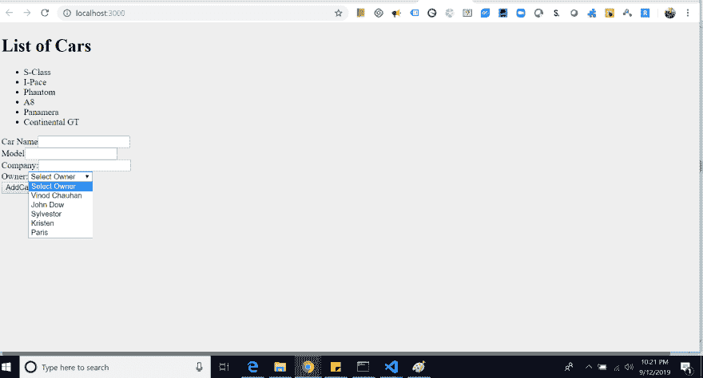
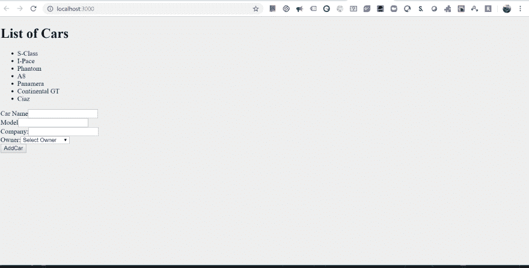
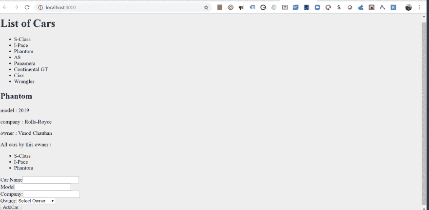

# MERN 应用程序通过阿波罗客户端使用 GraphQL，(反应钩)。(第三部分)前端

> 原文：<https://dev.to/vinodchauhan7/mern-app-using-graphql-via-apollo-client-react-hooks-part-3-frontend-2e5o>

[](https://res.cloudinary.com/practicaldev/image/fetch/s--aKgur8cz--/c_limit%2Cf_auto%2Cfl_progressive%2Cq_auto%2Cw_880/https://thepracticaldev.s3.amazonaws.com/i/cqepkau8mio5hhg4ekoy.png)

[GitHub 链接:MERN-app-using-graph QL-Apollo-client](https://github.com/vinodchauhan7/MERN-app-using-graphql-apollo-client/tree/master)

最后，我们完成了本系列第 2 部分中的 express 服务器。现在，我们将重点放在这个 MERN 应用程序的客户端(前端)。

**[MERN App 通过 Apollo-Client 使用 GraphQL，(React Hooks)。](https://dev.to/vinodchauhan7/mern-app-using-graphql-via-apollo-client-react-hooks-part-1-17p9)(第一部分)**

**[MERN App 通过 Apollo-Client 使用 GraphQL，(React Hooks)。](https://dev.to/vinodchauhan7/mern-app-using-graphql-via-apollo-client-react-hooks-part-2-2ifn)(第二部)**

为了创建我们的客户端，我们将选择“创建-反应-应用程序”库来为我们创建一个反应应用程序。

> 安装“create-react-app”:NPM install-g create-react-app

在车辆管理系统中，我们之前已经创建了后端“服务器”文件夹，在终端中点击以下命令。

```
npx create-react-app my-client
cd my-client
//Delete each and every file in 'src' folder except //'app.js','index.css','index.js'

//App.js
import React from "react";

function App() {
  return (
    <div className="App">
      <h1>List of Cars</h1>
    </div>
  );
}

export default App; 
```

> 运行 react-app hit : npm start

上述命令将使用 localhost:3000 在浏览器上打开 react-app。

在实现我们的前端之前，我们需要安装 apollo-client & graphql 的依赖项。

> npm 安装 Apollo-boost react-Apollo graph QL-save。

现在我们已经准备好开始我们的客户端实现了。

#### 阿波罗-助推

它为我们提供了一个 Apollo client,帮助我们连接运行在' localhost:4000/graphql '上 express-graphQL 服务器。

#### 做出反应——阿波罗

它为我们提供了 *ApolloProvider* ，帮助 react app 连接由 *ApolloClient* 检索到的数据。

```
//app.js
import React from "react";
import ApolloClient from "apollo-boost"; //connect with our server which is running at backend
import { ApolloProvider } from "react-apollo"; // Connect react with apollo.

//Using ApolloClient to connect with server
const client = new ApolloClient({
  uri: "http://localhost:4000/graphql"
});

function App() {
  return (
    <ApolloProvider client={client}>
      <div className="App">
        <h1>List of Cars</h1>
      </div>
    </ApolloProvider>
  );
}

export default App; 
```

在上面的代码中，如果你使用过“React-Redux ”,那么你可以简单地理解数据是如何从父设备传输到子设备的。那些不知道 **React-Redux** 的人，不要担心子组件会得到这个**客户端**数据作为道具。

了解 React-Redux : [React-Redux 基本了解](https://codesandbox.io/s/reactredux-understanding-slw9n)

**反应-还原中的积垢操作** : [反应-还原中的积垢](https://codesandbox.io/s/react-redux-crud-lqopj)

### a)创建‘CarList’组件。

首先在“src”文件夹中创建一个“components”文件夹。并在' components '文件夹中创建文件' CarList.js'

```
import React from "react";

const CarList = props => {
  return (
    <>
      <ul id="carList">
        <li>CarName</li>
      </ul>
    </>
  );
};

export default CarList; 
```

**在 App.js 文件中导入该组件，以便在我们的应用程序中显示。**

```
//App.js
import React from "react";
import ApolloClient from "apollo-boost"; //connect with our server which is running at backend
import { ApolloProvider } from "react-apollo"; // Connect react with apollo.
import CarList from "./components/CarList";

//Using ApolloClient to connect with server
const client = new ApolloClient({
  uri: "http://localhost:4000/graphql"
});

function App() {
  return (
    <ApolloProvider client={client}>
      <div className="App">
        <h1>List of Cars</h1>
        <CarList></CarList>
      </div>
    </ApolloProvider>
  );
}

export default App; 
```

### b)创建 Graphql 查询并将结果嵌入到 *CarList* 组件中。

首先，在 src 文件夹中创建一个名为“queries”的文件夹。在“queries”文件夹中创建一个新文件“queries.js”。我们将使用“apollo-boost”中的“gql”常量。

```
//queries.js
import { gql } from "apollo-boost";

const getCarsQuery = gql`
  {
    cars {
      name
      id
    }
  }
`;

export default getCarsQuery; 
```

在上面的文件中，我们在“localhost:4000/graphql”服务器上的 graphql 工具中创建了一个相同的查询，以获得带有详细信息的汽车列表。

现在连接 CarList 组件
中的“getCarsQuery”

```
//CarList
import React from "react";
import { graphql } from "react-apollo";
import getCarsQuery from "./../queries/queries";

const CarList = props => {
  console.log(props); //check in the browser to see this values.
  return (
    <>
      <ul id="carList">
        <li>CarName</li>
      </ul>
    </>
  );
};

export default graphql(getCarsQuery)(CarList); //HOC 
```

请看文件的底部，我们正在传递 graphql 函数中的查询来处理它并从服务器获取数据。

> 如果你们不知道这个东西是怎么工作的或者它叫什么？然后在 React 中寻找我关于这个 **[高阶组件的文章](https://dev.to/vinodchauhan7/high-order-component-hoc-in-react-what-why-ml6)**

现在我们的控制台出现错误，主要原因是我们需要在运行于其他终端的服务器上实现 cors()。

在我们的服务器代码中，打开 app.js 文件。

```
//Add two lines 

const cors = require("cors");

/**
 * Cors added as middleware
 */
app.use(cors()); 
```

它将重新启动，现在可以在前端应用程序控制台中查看数据。

[](https://res.cloudinary.com/practicaldev/image/fetch/s--pWAKYdJL--/c_limit%2Cf_auto%2Cfl_progressive%2Cq_auto%2Cw_880/https://thepracticaldev.s3.amazonaws.com/i/n0k3fk6rcbuip1hrtm8y.png)

当服务器命中 mongodb 时，props.data.loading 为真，当数据被加载时，它变为“假”。

### c)汽车数据表的迭代

```
import React from "react";
import { graphql } from "react-apollo";
import getCarsQuery from "./../queries/queries";

const CarList = props => {
  console.log(props);

  const displayCars = () => {
    var data = props.data;
    if (data.loading) {
      return <div>Loading Cars...</div>;
    } else {
      return data.cars.map(car => {
        return <li key={car.id}>{car.name}</li>;
      });
    }
  };

  return (
    <>
      <ul id="carList">{displayCars()}</ul>
    </>
  );
};

export default graphql(getCarsQuery)(CarList); 
```

### d)添加新车

要添加新车，请在组件文件夹中创建“添加汽车”组件。

```
import React from "react";
import { getOwnersQuery } from "./../queries/queries";
import { graphql } from "react-apollo";

const AddCar = props => {
  const getOwners = () => {
    var data = props.data;
    if (data.loading) {
      return <option disabled>Owner loading...</option>;
    } else {
      return data.owners.map(owner => {
        return (
          <option key={owner.id} value={owner.id}>
            {owner.name}
          </option>
        );
      });
    } //esle ends here
  };

  return (
    <>
      <form>
        <div className="field">
          <label>Car Name</label>
          <input type="text" name="carName"></input>
        </div>
        <div className="field">
          <label>Model</label>
          <input type="number" name="model"></input>
        </div>
        <div className="field">
          <label>Company:</label>
          <input type="text" name="company"></input>
        </div>
        <div className="field">
          <label>Owner:</label>
          <select>
            <option>Select Owner</option>
            {getOwners(props)}
          </select>
        </div>
        <button>AddCar</button>
      </form>
    </>
  );
};

export default graphql(getOwnersQuery)(AddCar); 
```

**在 queries.js 文件中创建 getOwnersQuery**

```
import { gql } from "apollo-boost";

const getCarsQuery = gql`
  {
    cars {
      name
      id
    }
  }
`;

const getOwnersQuery = gql`
  {
    owners {
      name
      id
    }
  }
`;

export { getCarsQuery, getOwnersQuery }; 
```

**现在在 app.js 中添加 AddCar.js 文件的条目**

```
function App() {
  return (
    <ApolloProvider client={client}>
      <div className="App">
        <h1>List of Cars</h1>
        <CarList></CarList>
        <AddCar></AddCar>
      </div>
    </ApolloProvider>
  );
} 
```

[](https://res.cloudinary.com/practicaldev/image/fetch/s--iND6hH92--/c_limit%2Cf_auto%2Cfl_progressive%2Cq_auto%2Cw_880/https://thepracticaldev.s3.amazonaws.com/i/qd8gcttb9ajc0awwatog.png)

### e)让 CustomHook 处理表单数据

在“src”文件夹中创建一个文件夹“hooks”。

```
// handleFormHook.js
import React from "react";

const HandleFormHook = callback => {
  const [inputs, setInputs] = React.useState({});

  const handleSubmit = event => {
    if (event) {
      event.preventDefault();
      console.log(inputs);
    }
    callback();
  };
  const handleInputChange = event => {
    event.persist();
    setInputs(inputs => ({
      ...inputs,
      [event.target.name]: event.target.value
    }));
  };
  return {
    handleSubmit,
    handleInputChange,
    inputs
  };
};

export default HandleFormHook; 
```

现在更新 **AddCar.js** 组件来使用这个定制钩子。

```
//AddCar.js
import React from "react";
import { getOwnersQuery } from "./../queries/queries";
import { graphql } from "react-apollo";
import HandleFormHook from "./../hooks/handleFormHook";

const AddCar = props => {
  const getFormData = () => {
    console.log(`${inputs}`);
  };

  const { inputs, handleInputChange, handleSubmit } = HandleFormHook(
    getFormData
  );

  const getOwners = () => {
    var data = props.data;
    if (data.loading) {
      return <option disabled>Owner loading...</option>;
    } else {
      return data.owners.map(owner => {
        return (
          <option key={owner.id} value={owner.id}>
            {owner.name}
          </option>
        );
      });
    } //esle ends here
  };

  return (
    <>
      <form onSubmit={handleSubmit}>
        <div className="field">
          <label>Car Name</label>
          <input
            type="text"
            name="carName"
            onChange={handleInputChange}
            value={inputs.carName}
          ></input>
        </div>
        <div className="field">
          <label>Model</label>
          <input
            type="number"
            name="model"
            onChange={handleInputChange}
            value={inputs.model}
          ></input>
        </div>
        <div className="field">
          <label>Company:</label>
          <input
            type="text"
            name="company"
            onChange={handleInputChange}
            value={inputs.company}
          ></input>
        </div>
        <div className="field">
          <label>Owner:</label>
          <select
            name="owner"
            onChange={handleInputChange}
            value={inputs.owner}
          >
            <option>Select Owner</option>
            {getOwners(props)}
          </select>
        </div>
        <button>AddCar</button>
      </form>
    </>
  );
};

export default graphql(getOwnersQuery)(AddCar); 
```

**getFormData()将获取表单数据的所有值。检查控制台的结果。**

> 了解钩子:[钩子(定制钩子)](https://dev.to/vinodchauhan7/react-hooks-usestate-useeffect-useref-usememo-2dj)
> 
> [高级钩子演示](https://codesandbox.io/s/advanced-react-hooks-grf7o)

### f)命中突变代码。

> 安装> npm 安装重组-保存

在 queries.js 文件
中添加突变查询

```
//queries.js

//mutation function getting arguments from calling function and passing to //addCar.
const AddCarMutation = gql`
  mutation($name: String!, $model: Int!, $company: String!, $ownerId: ID!) {
    addCar(name: $name, model: $model, company: $company, ownerId: $ownerId) {
      name
      id
    }
  }
`;

export { getCarsQuery, getOwnersQuery, AddCarMutation }; 
```

**现在修改 AddCar.js 文件，在服务器上点击 AddCar 突变，并添加更新的列表。**

```
import React from "react";
import { compose } from "recompose";
import {
  getOwnersQuery,
  AddCarMutation,
  getCarsQuery
} from "./../queries/queries";
import { graphql } from "react-apollo";
import HandleFormHook from "./../hooks/handleFormHook";

const AddCar = props => {
  const getFormData = () => {
    console.log(`${inputs}`);
//Hitting AddCarMutation with arguments.
    props.AddCarMutation({
      variables: {
        name: inputs.carName,
        model: parseInt(inputs.model),
        company: inputs.company,
        ownerId: inputs.owner
      },
      refetchQueries: [{ query: getCarsQuery }] // to update carsQuery on CarList.js
    });
  };

  const { inputs, handleInputChange, handleSubmit } = HandleFormHook(
    getFormData
  );

  const getOwners = () => {
    var data = props.getOwnersQuery;
    if (data.loading) {
      return <option disabled>Owner loading...</option>;
    } else {
      return data.owners.map(owner => {
        return (
          <option key={owner.id} value={owner.id}>
            {owner.name}
          </option>
        );
      });
    } //esle ends here
  };

  return (
    <>
      <form onSubmit={handleSubmit}>
        <div className="field">
          <label>Car Name</label>
          <input
            type="text"
            name="carName"
            onChange={handleInputChange}
            value={inputs.carName}
          ></input>
        </div>
        <div className="field">
          <label>Model</label>
          <input
            type="number"
            name="model"
            onChange={handleInputChange}
            value={inputs.model}
          ></input>
        </div>
        <div className="field">
          <label>Company:</label>
          <input
            type="text"
            name="company"
            onChange={handleInputChange}
            value={inputs.company}
          ></input>
        </div>
        <div className="field">
          <label>Owner:</label>
          <select
            name="owner"
            onChange={handleInputChange}
            value={inputs.owner}
          >
            <option>Select Owner</option>
            {getOwners(props)}
          </select>
        </div>
        <button>AddCar</button>
      </form>
    </>
  );
};

//For hitting two queries we need compose library.
export default compose(
  graphql(getOwnersQuery, { name: "getOwnersQuery" }),
  graphql(AddCarMutation, { name: "AddCarMutation" })
)(AddCar); 
```

在下面的截图中，你可以看到我添加了一辆新车“Ciaz”。
[T3】](https://res.cloudinary.com/practicaldev/image/fetch/s--DH87ZvtY--/c_limit%2Cf_auto%2Cfl_progressive%2Cq_auto%2Cw_880/https://thepracticaldev.s3.amazonaws.com/i/y7nkd9gxw8l285aad2jt.png)

### g)现在添加 CarDetails.js 组件来显示汽车细节。

在 queries.js 文件中添加新查询

```
const getCarQuery = gql`
  query($id: ID!) {
    car(id: $id) {
      id
      name
      model
      company
      owner {
        id
        name
        age
        cars {
          name
          company
          id
        }
      }
    }
  }
`;

export { getCarsQuery, getOwnersQuery, AddCarMutation, getCarQuery }; 
```

现在添加 CarDetails.js

```
import React from "react";
import { graphql } from "react-apollo";
import { getCarQuery } from "./../queries/queries";

const CarDetails = props => {
  console.log(props.carId.Id);

  const getCarDetails = () => {
    const { car } = props.data;
    console.log(car);
    if (car) {
      return (
        <div>
          <h2>{car.name}</h2>
          <p>model : {car.model}</p>
          <p>company : {car.company}</p>
          <p>owner : {car.owner.name}</p>
          <p>All cars by this owner :</p>
          <ul>
            {car.owner.cars.map(item => {
              return <li key={item.id}>{item.name}</li>;
            })}
          </ul>
        </div>
      );
    } else {
      return <div>No Car Selected</div>;
    }
  };

  return <div id="carDetails">{getCarDetails()}</div>; };

//Passing carId in getCarQuery 
export default graphql(getCarQuery, {
  options: props => {
    return {
      variables: {
        id: props.carId.Id
      }
    };
  }
})(CarDetails); 
```

最后，更新 CarList.js，我们可以从中选择汽车。

```
//CarList.js
import React from "react";
import { graphql } from "react-apollo";
import { getCarsQuery } from "./../queries/queries";
import CarDetails from "./CarDetails";

const CarList = props => {
  console.log(props);
  const [Id, setCar] = React.useState(0);

  const displayCars = () => {
    var data = props.data;
    if (data.loading) {
      return <div>Loading Cars...</div>;
    } else {
      return data.cars.map(car => {
        return (
          <li key={car.id} onClick={e => setCar({ Id: car.id })}>
            {car.name}
          </li>
        );
      });
    }
  };

  return (
    <>
      <ul id="carList">{displayCars()}</ul>
      <CarDetails carId={Id}></CarDetails>
    </>
  );
};

export default graphql(getCarsQuery)(CarList); 
```

### 点击任何一辆车，你将得到该车及其车主的详细信息。

## 最终输出

[](https://res.cloudinary.com/practicaldev/image/fetch/s--o1ovFAS_--/c_limit%2Cf_auto%2Cfl_progressive%2Cq_auto%2Cw_880/https://thepracticaldev.s3.amazonaws.com/i/6615cqjxnk8y0ycoph1t.png)

抱歉，伙计们没有在这里添加任何 Css 部分。

> 哇哦！我们刚刚通过 apollo 客户端使用 graphql 完成了我们的 MERN 应用程序。

希望你能从这篇文章中学到一些东西。