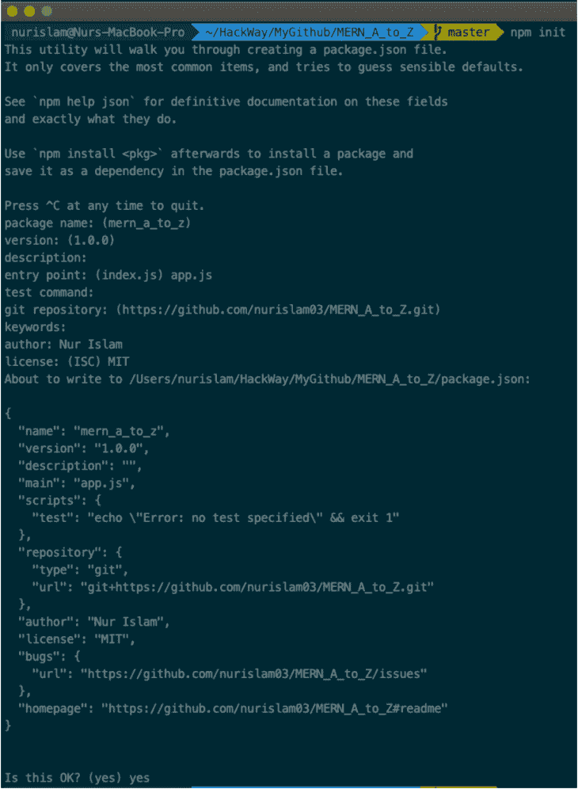
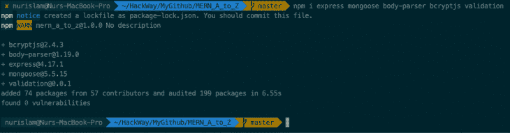
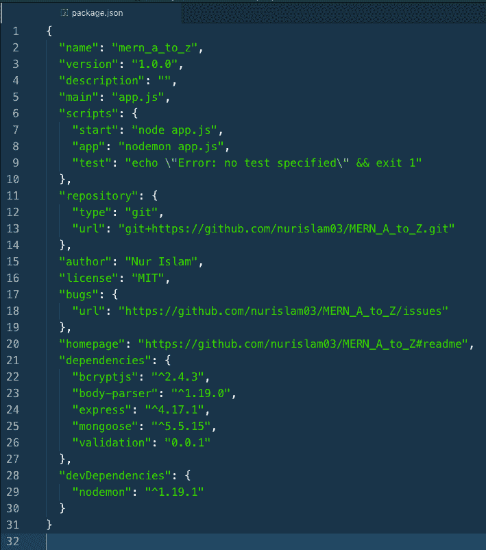
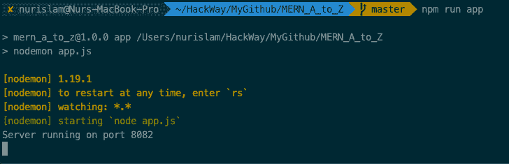
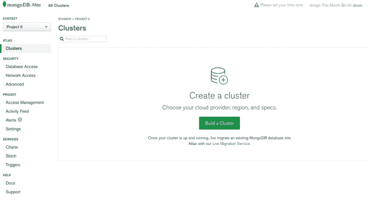
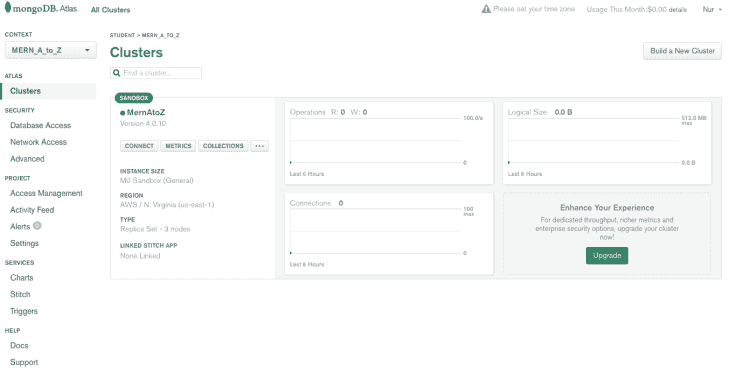
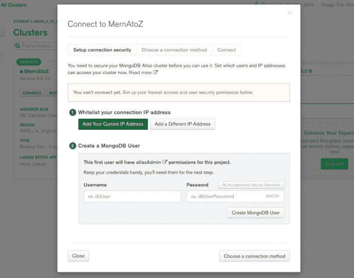
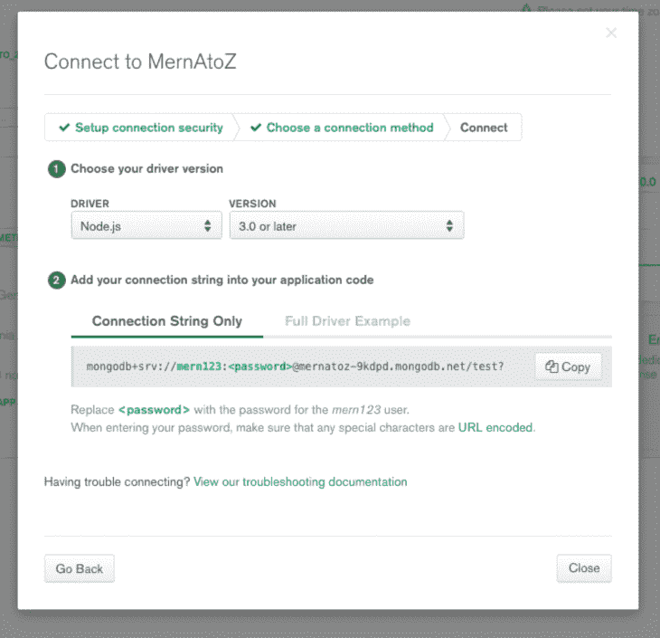
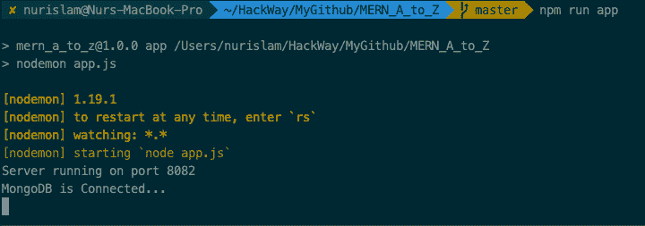

# MERN 堆栈 A 到 Z:第 1 部分

> 原文：<https://dev.to/bnevilleoneill/mern-stack-a-to-z-part-1-564j>

[](https://res.cloudinary.com/practicaldev/image/fetch/s--l_IihPlt--/c_limit%2Cf_auto%2Cfl_progressive%2Cq_auto%2Cw_880/https://thepracticaldev.s3.amazonaws.com/i/ds38ffck01cqcub98cgz.jpg)

本教程是所有关于 MERN 堆栈。我们将通过从头开始开发一个简单的 CRUD(创建、读取、更新和删除)应用程序来探索这个流行的堆栈以及如何使用它。

我们将把重点放在 MERN 设置上，而不是应用程序本身。虽然这个项目非常简单，但我们将努力遵循最佳的项目结构，将其提升到行业标准水平，这样任何人都可以将它作为样板项目。

短语“MERN 堆栈”指的是以下技术:

*   MongoDB: MongoDB 是一个跨平台的面向文档的数据库程序
*   **Express.js:** Express.js，简称 Express，是 Node.js 的 web 应用框架
*   **React:** React 是一个用于构建用户界面的 JavaScript 库。
*   Node.js: Node.js 是一个开源的、跨平台的 JavaScript 运行时环境，它在浏览器之外执行 JavaScript 代码

为了使本教程简单，我将把它分成两部分:

*   **第 1 部分:**在这一部分，我们要完成服务器端的工作。我们将使用 Node 和 Express，并将其与 MongoDB 连接。之后，我们将创建一些 API。
*   **第 2 部分:**在下一节中，我们将重点关注使用 React 构建用户界面的前端部分。之后，我们将把前端连接到后端。

> **注意:**本系列将假设对 Node.js、Express、MongoDB 和 React 有基本的了解。

[](https://logrocket.com/signup/)

## 用 Express 和 Node 设置服务器

### npm 包初始化

我们的第一个任务是创建一个项目文件夹。通过终端进入文件夹，然后运行以下命令:

```
$ npm init 
```

现在它会问你一些关于包名，版本，入口点等问题。如果您想保留默认值，请按 enter 键。之后，你会得到这样的东西:

[](https://res.cloudinary.com/practicaldev/image/fetch/s--9JOG4z-Z--/c_limit%2Cf_auto%2Cfl_progressive%2Cq_auto%2Cw_880/https://i2.wp.com/blog.logrocket.com/wp-content/uploads/2019/07/npm-package.json-file-e1562600260796.png%3Fresize%3D730%252C996%26ssl%3D1)

选择**是**，您就可以开始了。它创建一个名为`package.json`的文件。

### 依赖包安装

现在，我想添加一些依赖:

```
$ npm i express mongoose body-parser bcryptjs validation 
```

键入或复制上面的命令，然后按 enter 按钮。您将看到类似这样的内容:

[](https://res.cloudinary.com/practicaldev/image/fetch/s--FCojCXQI--/c_limit%2Cf_auto%2Cfl_progressive%2Cq_auto%2Cw_880/https://i0.wp.com/blog.logrocket.com/wp-content/uploads/2019/07/adding-project-file-dependencies-e1562600284195.png%3Fresize%3D730%252C191%26ssl%3D1)

*   bcryptjs 是由尼尔斯·普罗沃斯和大卫·马齐耶尔设计的密码散列函数
*   **body-parser** 允许我们在整个请求过程中获取数据
*   express 是我们的主要框架
*   **mongose**用于与 MongoDB 连接/交互
*   **验证**(顾名思义)用于验证

现在我想添加 [nodemon](https://nodemon.io/) 作为开发依赖项。如果你不想添加它，你可以跳过它，它是可选的。

```
$ npm i -D nodemon 
```

nodemon 是一个实用程序，它将监视源代码中的任何更改，并自动重启服务器。

此时，您的`package.json`应该是这样的:

[](https://res.cloudinary.com/practicaldev/image/fetch/s--8GK_j7iF--/c_limit%2Cf_auto%2Cfl_progressive%2Cq_auto%2Cw_880/https://i2.wp.com/blog.logrocket.com/wp-content/uploads/2019/07/package.json-file-dependencies.png%3Fresize%3D709%252C802%26ssl%3D1)

### 设置入口点

现在为我们的入口点创建一个名为`app.js`的文件。您可以使用下面的命令从项目文件夹中创建它(在 Mac 上):

```
$ touch app.js 
```

然后粘贴下面的代码:

```
// app.js

const express = require('express');

const app = express();

app.get('/', (req, res) => res.send('Hello world!'));

const port = process.env.PORT || 8082;

app.listen(port, () => console.log(`Server running on port ${port}`)); 
```

现在，运行命令

```
$ node app 
```

您将看到**服务器运行在端口 8082** 上。也可以从浏览器查看:打开浏览器，输入`http://localhost:8082`。

此时，如果我们改变了什么，我们需要手动重启服务器。但是如果我们设置了 nodemon，那么我们就不用每次都重启它了；nodemon 将观察是否有任何变化，并自动重启服务器。

因此，您需要做的是对我们的`package.json`文件中的脚本做一点修改。见下图:

```
// package.json

{
  "name": "mern_a_to_z",
  "version": "1.0.0",
  "description": "",
  "main": "app.js",
  "scripts": {
    "start": "node app.js",
    "app": "nodemon app.js",
    "test": "echo \"Error: no test specified\" && exit 1"
  },
  "repository": {
    "type": "git",
    "url": "git+https://github.com/nurislam03/MERN_A_to_Z.git"
  },
  "author": "Nur Islam",
  "license": "MIT",
  "bugs": {
    "url": "https://github.com/nurislam03/MERN_A_to_Z/issues"
  },
  "homepage": "https://github.com/nurislam03/MERN_A_to_Z#readme",
  "dependencies": {
    "bcryptjs": "^2.4.3",
    "body-parser": "^1.19.0",
    "express": "^4.17.1",
    "mongoose": "^5.5.15",
    "validation": "0.0.1"
  },
  "devDependencies": {
    "nodemon": "^1.19.1"
  }
} 
```

所以，现在您可以使用这个命令运行您的项目:

```
$ npm run app 
```

如果此时出现任何错误，那么运行下面的命令:

```
$ npm install
$ npm run app 
```

如果一切正常，您将在终端中看到以下变化:

[](https://res.cloudinary.com/practicaldev/image/fetch/s--Gt1SZ3Rw--/c_limit%2Cf_auto%2Cfl_progressive%2Cq_auto%2Cw_880/https://i0.wp.com/blog.logrocket.com/wp-content/uploads/2019/07/running-project-successful.png%3Fresize%3D728%252C235%26ssl%3D1)

## 用 MongoDB 管理数据库

现在是时候用 MongoDB 设置我们的数据库了。为了简单起见，我们将使用 MongoDB Atlas。

### 为 MongoDB Atlas 创建账户

MongoDB Atlas 是一个完全托管的云数据库，由构建 MongoDB 的同一个团队开发。

首先，[你需要一个账户](https://www.mongodb.com/cloud/atlas)。创建一个并按照步骤操作。创建帐户后，您会看到如下内容:

[](https://res.cloudinary.com/practicaldev/image/fetch/s--Y2aR5FOs--/c_limit%2Cf_auto%2Cfl_progressive%2Cq_auto%2Cw_880/https://i1.wp.com/blog.logrocket.com/wp-content/uploads/2019/07/mongodb-homescreen-e1562599566295.png%3Fresize%3D730%252C406%26ssl%3D1)

点击**项目 0** 部分(左上角)，您将看到一个创建新项目的按钮。创建一个项目并选择该项目。

现在，从您创建的项目中点击 **Build a Cluster** 按钮。它会显示所有的信息。在底部，您将看到一个名为**集群名称**的部分，单击它并输入数据库的名称，然后点击**创建集群**按钮。

两到三分钟后，如果一切顺利，你会发现这样的东西:

[](https://res.cloudinary.com/practicaldev/image/fetch/s--vwghiu5w--/c_limit%2Cf_auto%2Cfl_progressive%2Cq_auto%2Cw_880/https://i2.wp.com/blog.logrocket.com/wp-content/uploads/2019/07/creating-cluster-mongodb.png%3Fresize%3D730%252C387%26ssl%3D1)

点击**连接**按钮，并填写数据库的用户名和密码表格。

[](https://res.cloudinary.com/practicaldev/image/fetch/s--rI81kLS---/c_limit%2Cf_auto%2Cfl_progressive%2Cq_auto%2Cw_880/https://i2.wp.com/blog.logrocket.com/wp-content/uploads/2019/07/setting-up-connection-mongodb-atlas-e1562599847264.png%3Fresize%3D730%252C574%26ssl%3D1)

现在点击**创建 MongoDB 用户**按钮。您也可以选择您当前的 IP 地址或不同的 IP 地址，这取决于您。

现在，如果您按下**连接**按钮或**选择连接方法**按钮，您将看到一些不同的方法。相应选择。

[](https://res.cloudinary.com/practicaldev/image/fetch/s--YaZmmMUm--/c_limit%2Cf_auto%2Cfl_progressive%2Cq_auto%2Cw_880/https://i2.wp.com/blog.logrocket.com/wp-content/uploads/2019/07/connection-method-options-mongodb-e1562600007239.png%3Fresize%3D730%252C645%26ssl%3D1)

在这种情况下，选择**连接您的应用程序**部分。

现在您将获得您的数据库链接，我们将在下一步中使用它。

[](https://res.cloudinary.com/practicaldev/image/fetch/s--46DCzt5e--/c_limit%2Cf_auto%2Cfl_progressive%2Cq_auto%2Cw_880/https://i2.wp.com/blog.logrocket.com/wp-content/uploads/2019/07/connection-string-output-mongodb.png%3Fresize%3D730%252C705%26ssl%3D1)

我们的数据库已经准备好了——现在我们需要将它添加到我们的项目中。

在项目文件夹中，创建另一个名为`config`的文件夹，并在其中创建两个名为`default.json`和`db.js`的文件。添加以下代码:

```
// default.json

{
  "mongoURI":
    "mongodb+srv://mern123:<password>@mernatoz-9kdpd.mongodb.net/test?retryWrites=true&w=majority"
}
 /* Replace <password> with your database password */

/* ------------------------------------------------------------------ */
// db.js

const mongoose = require('mongoose');
const config = require('config');
const db = config.get('mongoURI');

const connectDB = async () => {
  try {
    await mongoose.connect(
      db,
      {
        useNewUrlparser: true
      }
    );

    console.log('MongoDB is Connected...');
  } catch (err) {
    console.error(err.message);
    process.exit(1);
  }
};

module.exports = connectDB; 
```

**注意:**我们需要对我们的`app.js`文件做一点修改来连接数据库。将您的`app.js`更新为:

```
// app.js

const express = require('express');
const connectDB = require('./config/db');

const app = express();

// Connect Database
connectDB();

app.get('/', (req, res) => res.send('Hello world!'));

const port = process.env.PORT || 8082;

app.listen(port, () => console.log(`Server running on port ${port}`)); 
```

我们需要另一个名为`config`的依赖包来运行我们的项目。使用以下命令将其安装到项目中:

```
$ npm i config 
```

现在，您可以使用下面的命令运行项目:

```
$ npm run app 
```

[](https://res.cloudinary.com/practicaldev/image/fetch/s--pwT2i6J8--/c_limit%2Cf_auto%2Cfl_progressive%2Cq_auto%2Cw_880/https://i2.wp.com/blog.logrocket.com/wp-content/uploads/2019/07/successfully-connected-server.png%3Fresize%3D720%252C253%26ssl%3D1)

太好了！到目前为止，我们走在正确的道路上。我们的数据库已成功连接。现在是完成路由设置的时候了，之后，我们将看到如何创建 RESTful APIs。

## RESTful API

创建一个名为`routes`的文件夹。在其中，创建另一个名为`api`的文件夹，它将保存我们所有的 API。

在`api`文件夹中，创建一个名为`books.js`的文件。我们将在这里创建一些 API 来展示它是如何工作的。

现在用下面的代码更新您的`books.js`:

```
// routes/api/books.js

const express = require('express');
const router = express.Router();

// Load Book model
const Book = require('../../models/Book');

// @route GET api/books/test
// @description tests books route
// @access Public
router.get('/test', (req, res) => res.send('book route testing!'));

// @route GET api/books
// @description Get all books
// @access Public
router.get('/', (req, res) => {
  Book.find()
    .then(books => res.json(books))
    .catch(err => res.status(404).json({ nobooksfound: 'No Books found' }));
});

// @route GET api/books/:id
// @description Get single book by id
// @access Public
router.get('/:id', (req, res) => {
  Book.findById(req.params.id)
    .then(book => res.json(book))
    .catch(err => res.status(404).json({ nobookfound: 'No Book found' }));
});

// @route GET api/books
// @description add/save book
// @access Public
router.post('/', (req, res) => {
  Book.create(req.body)
    .then(book => res.json({ msg: 'Book added successfully' }))
    .catch(err => res.status(400).json({ error: 'Unable to add this book' }));
});

// @route GET api/books/:id
// @description Update book
// @access Public
router.put('/:id', (req, res) => {
  Book.findByIdAndUpdate(req.params.id, req.body)
    .then(book => res.json({ msg: 'Updated successfully' }))
    .catch(err =>
      res.status(400).json({ error: 'Unable to update the Database' })
    );
});

// @route GET api/books/:id
// @description Delete book by id
// @access Public
router.delete('/:id', (req, res) => {
  Book.findByIdAndRemove(req.params.id, req.body)
    .then(book => res.json({ mgs: 'Book entry deleted successfully' }))
    .catch(err => res.status(404).json({ error: 'No such a book' }));
});

module.exports = router; 
```

### 数据库模型

为了与我们的数据库进行交互，我们需要为我们的每个资源创建一个模型。因此，在根目录下创建一个名为`models`的文件夹，在`models`文件夹中，创建一个名为`Book.js`的文件，并用这个文件更新它:

```
// models/Book.js

const mongoose = require('mongoose');

const BookSchema = new mongoose.Schema({
  title: {
    type: String,
    required: true
  },
  isbn: {
    type: String,
    required: true
  },
  author: {
    type: String,
    required: true
  },
  description: {
    type: String
  },
  published_date: {
    type: Date
  },
  publisher: {
    type: String
  },
  updated_date: {
    type: Date,
    default: Date.now
  }
});

module.exports = Book = mongoose.model('book', BookSchema); 
```

运行项目，看看此时是否一切正常，可以通过 Postman 测试所有的 API(注意，在使用 Postman 测试 API 之前，需要先运行项目)。你可以在这里下载邮递员[。](https://www.getpostman.com/)

## 结论

到目前为止，一切顺利！我们已经成功设置了我们的后端。现在我们需要处理前端部分，我们将使用 React 来构建用户界面。请稍后回来查看第 2 部分，同时，您可以在这里找到该项目的 [GitHub repo。](https://github.com/nurislam03/MERN_A_to_Z)

* * *

## Plug: [LogRocket](https://logrocket.com/signup/) ，一款适用于网络应用的 DVR

[](https://logrocket.com/signup/)

LogRocket 是一个前端日志工具，可以让你回放问题，就像它们发生在你自己的浏览器中一样。LogRocket 不需要猜测错误发生的原因，也不需要向用户询问截图和日志转储，而是让您重放会话以快速了解哪里出错了。它可以与任何应用程序完美配合，不管是什么框架，并且有插件可以记录来自 Redux、Vuex 和@ngrx/store 的额外上下文。

除了记录 Redux 操作和状态，LogRocket 还记录控制台日志、JavaScript 错误、堆栈跟踪、带有头+正文的网络请求/响应、浏览器元数据和自定义日志。它还使用 DOM 来记录页面上的 HTML 和 CSS，甚至为最复杂的单页面应用程序重新创建像素级完美视频。

[免费试用](https://logrocket.com/signup/)。

* * *

帖子 [MERN 堆栈 A 到 Z:第一部分](https://blog.logrocket.com/mern-stack-a-to-z-part-1/)首先出现在[日志博客](https://blog.logrocket.com)上。