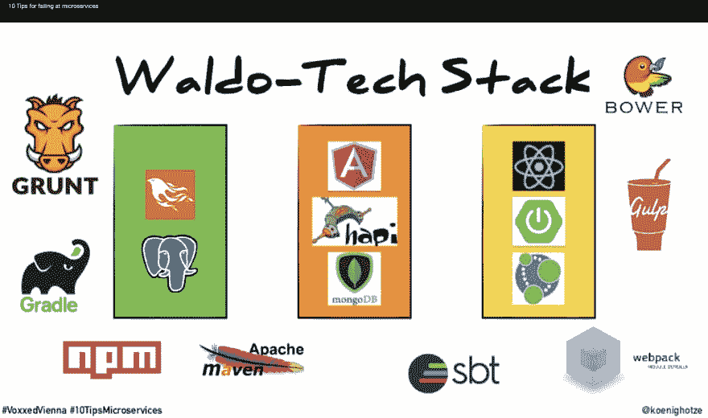
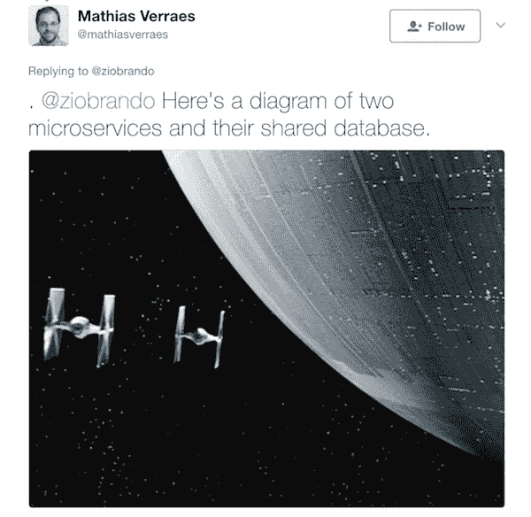
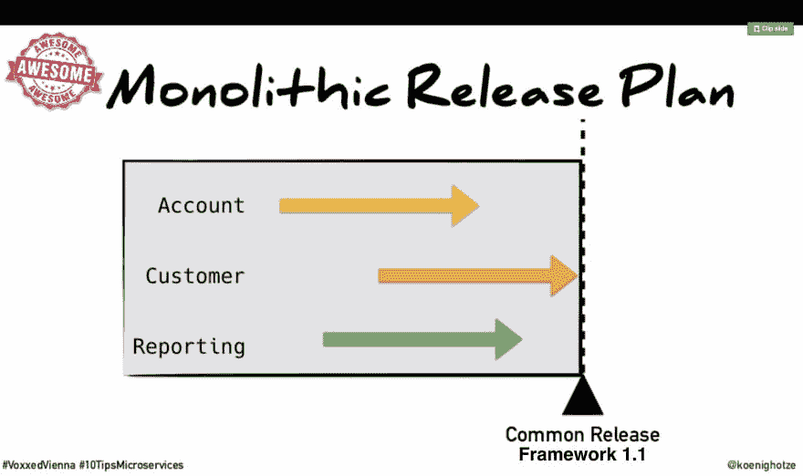
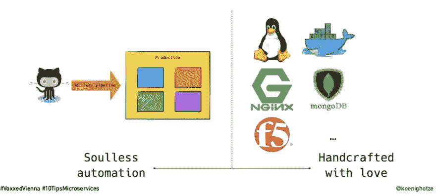
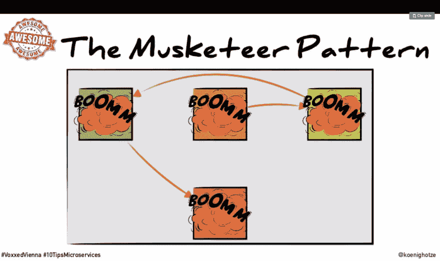
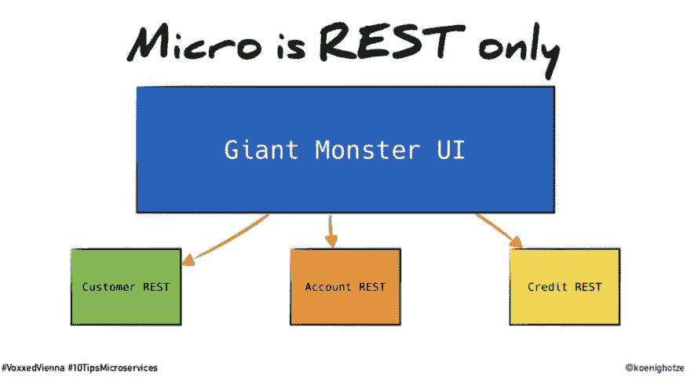
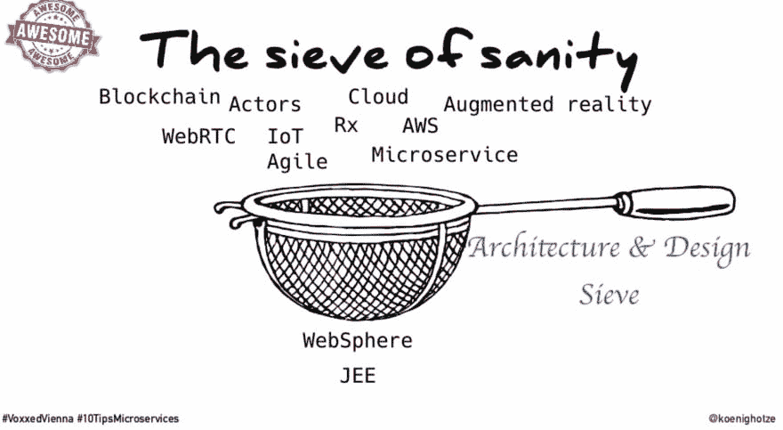
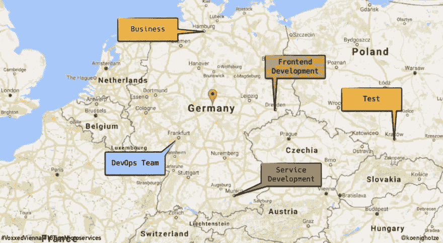

# 微服务反模式和十大失败技巧

> 原文：<https://dev.to/simbo1905/microservces-anti-patterns-and-ten-tips-to-fail-badly-2le>

在这篇文章中，我将播放 David Schmitz 的 youtube 视频，介绍反模式和击败微服务的技巧。

[https://www.youtube.com/embed/X0tjziAQfNQ](https://www.youtube.com/embed/X0tjziAQfNQ)

10)全面掌握多种语言

使用微服务的一个好处是，你可以在不同的服务中使用不同的编程语言。这种选择的自由可能会被多种技术的不当使用所滥用。有一个短语“CV 驱动的工程”,是指开发人员使用框架和工具，因为这在他们的 CV 上看起来很好。没有人能够支持所有的代码，客户也会因此变得更糟。

9)数据块

下一个反模式是共享数据库。您可以共享表完全隔离的数据库集群。这里所说的是通过数据库共享数据。如果你去另一个微服务表，他们改变了他们的表，事情就爆炸了。几十年前，在我担任技术主管的第一个平台上，策略是让许多编写微前端的团队共享一个数据库。单点登录服务意味着我们可以在应用程序之间建立链接，用户会有一个单一的大服务的错觉，但系统的每个领域都是由不同的团队构建的。技术策略的严重缺陷在于团队通过存储的过程交换数据。数据库并没有被设计成封装业务逻辑的 API。实际上，团队只是让其他团队访问他们自己的应用程序所使用的进程。这就跟查询对方的表一样。💩 💥 💀

8)大型活动

有一种流行的事件源模式，将其逻辑发挥到极致，它被称为“从里到外的数据库”模式，这种模式在卡夫卡世界中越来越流行。David 的视频解释说，除非你非常小心，否则在团队之间公开事件会给你带来高度耦合，并可能导致复制粘贴修复和增强被添加到每个服务中。在很高的层次上，您可能会遇到与共享数据库表相同的问题。向共享事件日志追加条目就像向共享数据库表追加行一样。任何团队都不应该将事件流暴露给另一个团队，除非他们将保持严格的向后兼容性规则，就像他们必须使用任何微服务 API 一样。Avro 可以用来添加属性，而不会破坏读取新事件的旧进程。升级数据或修复数据相关的错误需要仔细的规划和实践，否则你会头痛。

7)本土独石

显然，像微服务这样酷的新事物需要你去编写自己的框架。毕竟，你是最聪明的人之一，如果谷歌能做到，那么你也能。然而，当你在编写应用程序的同时也在编写自己的框架时，很难避免一个改变世界的事件。一个自主开发的框架是一股巨大的力量，而且不成熟，分散了添加业务特性的注意力。

6)使用肉云

大卫在这里特别挑选了大型金融服务机构。“肉云”在运营团队中使用大量人员，而不是自助服务自动化。通常，做微服务的团队为他们的应用程序代码有一个持续的集成和持续的部署管道。然而，大公司认为，最好有单独的团队来管理所有需要支持票才能做出任何改变的基础设施。因为他们有人坐在那里等着工作，他们手动点击设置，而不是自动化。为了防止人们破坏昂贵的共享工具，他们把它们锁起来，只做他们预期你需要做的事情。有经验的人谁设置它不在实际运行商店。你有一个没有全局观念的人每天点击鼠标。这就把想做某事的人、知道如何做的人、有特权做这件事的人和有时间做这件事的人分开了。所以什么也做不成。

5)分布式整体结构

这里的反模式是构建一个应用程序，就好像它是一个整体，但却部署了许多微服务。这结合起来给你两个世界最糟糕的。对于相同级别的应用程序代码质量，在微服务环境中，失败比在单一环境中更常见。这是因为网络不是完美的，也是因为累积概率的数学。如果你有一个 365 个请求中只有 1 个失败的问题，这是一个非常糟糕的问题。如果您正在使用微服务，其中需要 23 个服务间调用来构建页面，那么 365 个请求中有 1 个失败意味着 50%的客户页面将失败。网络不可靠。[这里有一篇关于真实世界中断的帖子](https://aphyr.com/posts/288-the-network-is-reliable)，表明网络可靠性是一个谬论。服务网格可能有所帮助，但它本身是一个复杂的分布式系统，需要花费精力来建立和运行。

4)单页应用程序(SPA)整体

这是另一个隐藏的整体反模式。问题是你的单页应用程序可能会变成一个整体。它有着传统的独石的所有问题，并且在许多不同的浏览器上运行。David 指出，当您的需求突然改变时，将新的逻辑放入前端感觉很容易，但是这种便利是拥有一个大的 mud 应用程序球的道路。将 React.lazy 等方法应用于带有代码分割的 React 路由，可以让您为前端创建一个[模块化架构](https://dev.tomodular%20architecture)来避免这个陷阱。这种先进的技术远远超出了基础知识的范畴，需要努力进行设置，并且对快速增长的代码库进行改造也是一个挑战。

3)决策块

我们都可以挖苦那些限制使用新技术的建筑师，以及那些禁止 J2EE 成为解决所有问题的方法的建筑师。然而，为了降低风险，很难不对新想法说不。我们应该确保我们没有教条和僵化的方法，我们创造方法去试验和不断引入新的创新。

2)整体业务

微服务不能仅仅是技术问题。如果我们有整体流程，那么我们实际上是在做变相的瀑布。这也被称为“wagile”、“water-scrum-fall”、“dark agile”、“faux agile”以及许多其他名称。除了流程如何工作之外，我们还应该在业务参与方面提出技术之外的整体态度和方法。敏捷和微服务的本质是，我们发布的很少，而且经常是为了获得有价值的反馈。如果在业务用户和我们正在构建的东西之间没有真正的反馈回路，那么我们就没有优化业务价值。

1)使用人力资源驱动的微服务架构

这里值得一提的是:

> "寻找反应开发者比寻找一般的女工匠更容易."

这基本上是说，如果你的招聘实践侧重于专业化，那么你就降低了构建、部署和支持微服务的能力。将团队组织成专业化也是一种众所周知的不良做法。你需要围绕小型混合纪律团队进行组织，这些团队有权以尽可能自助的模式设计、构建、部署和支持他们所创建的东西。然而，当我与开发人员交谈时，我经常惊讶于他们如何自我认同某一特定专业，例如“我是一名 Java 开发人员”或“我是一名 React 开发人员”。这只会延续筒仓，让组织把你关进筒仓，剥夺你的权力，同时声称这是让你快乐的事情。称自己为软件工程师，从智力上好奇一切是如何工作的。云中的基础架构和网络是软件定义的，并且有一个可供您使用的 API。目标是成为东西的制造者，而不是特定技能的持有者。

这是所有的乡亲。如果能听听你的经验，知道哪些有用，哪些没用，那将会很棒。