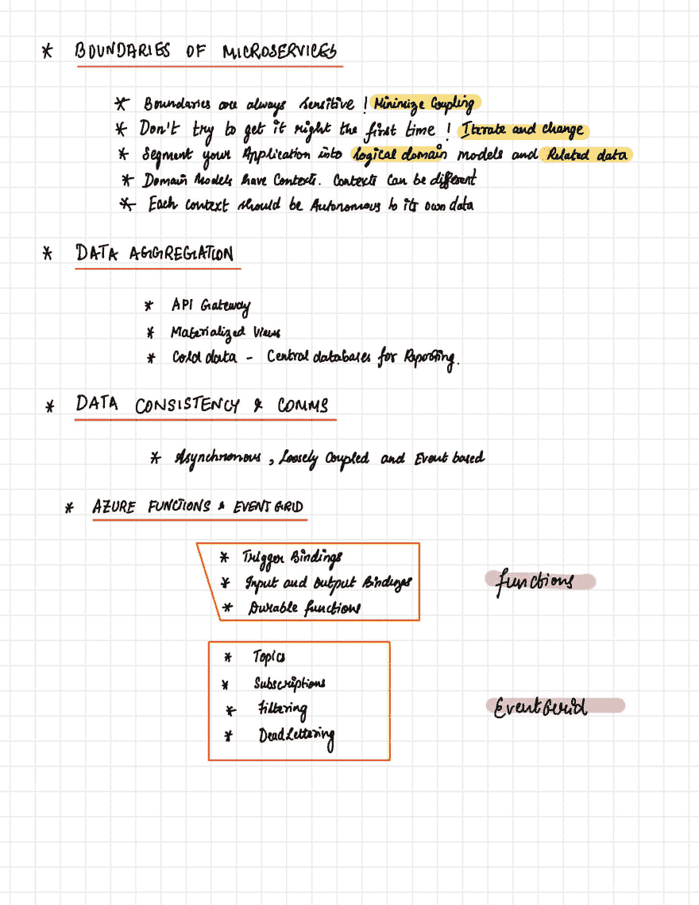

# 使用 Azure 函数和事件网格的微服务👍❤️

> 原文：<https://dev.to/irajbalakrish/microservices-using-azure-functions-and-event-grid-47jn>

# [第 1 页](https://thepracticaldev.s3.amazonaws.com/i/zzuemdqyz2q32zdvqgtd.jpeg)

# [第二页](https://thepracticaldev.s3.amazonaws.com/i/bp5hbdfov5fmrma8m5jo.jpeg)

# 第 3 页-未完待续