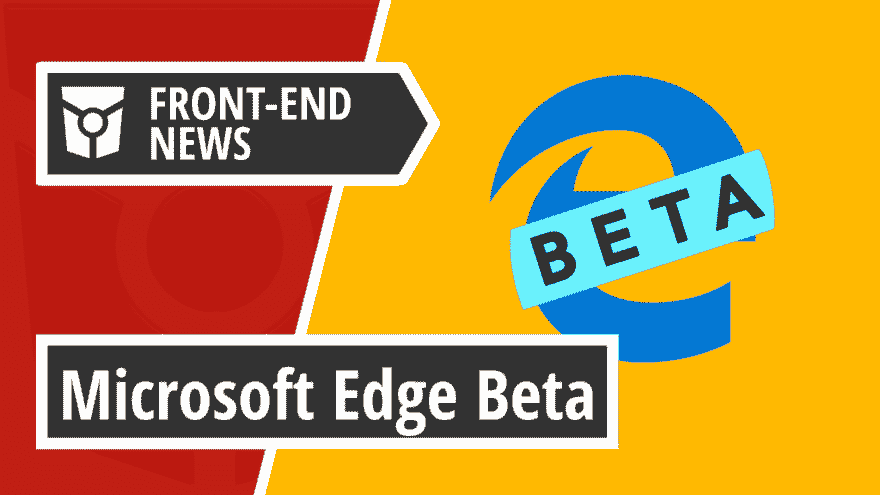
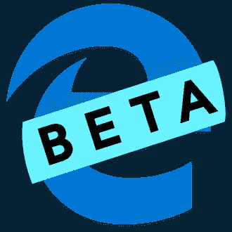
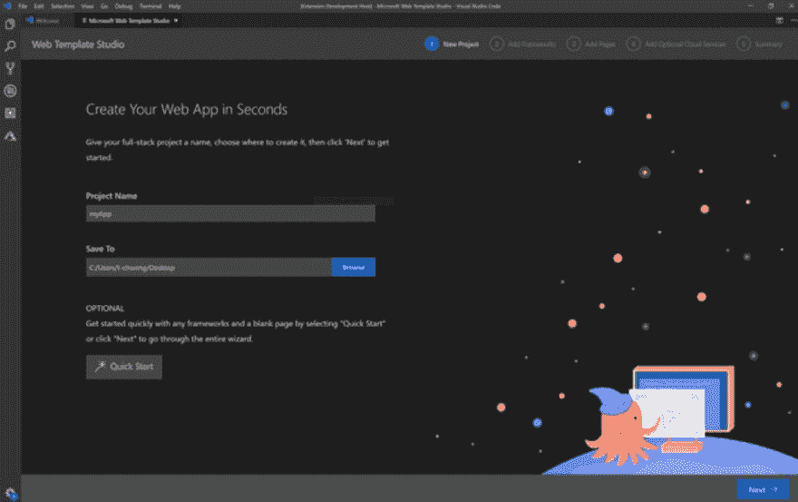

# 微软 Edge 测试版将推出新的微软 Edge 内部奖金计划|前端新闻#15

> 原文：<https://dev.to/adriansandu/microsoft-edge-beta-goes-live-with-a-new-microsoft-edge-insider-bounty-program-front-end-news-15-4acc>

<figure> 

<figcaption>在 YouTube 上查看[https://youtu.be/J12QqCflSIo](https://youtu.be/J12QqCflSIo)</figcaption>

</figure>

大家好，欢迎收看新一轮的前端新闻。这是我今天为你准备的:

微软的三大声明占据了头条:

*   Microsoft Edge 的测试版可供下载
*   微软 Edge Chromium 有一个新的奖励计划
*   开发人员现在可以使用 Web Template Studio 的第二代产品

接下来是一个比通常更大的软件更新部分，以及一个特殊的开发者周。所以请陪我到最后，找出所有的细节。

一如既往，我也为那些喜欢听而不是读的人准备了视频版本。如果你喜欢这种格式，如果你也能订阅 YouTube 频道，我将不胜感激。

[https://www.youtube.com/embed/J12QqCflSIo](https://www.youtube.com/embed/J12QqCflSIo)

### 微软 Edge 测试版上线

新 Edge 浏览器的公开测试版终于可以下载了。这是第三个也是最后一个预览频道，将在发布前上线，它标志着人们可以开始在日常生活中使用新浏览器的时刻。

自然，我不得不亲自尝试一下。安装过程既快又轻松，我很快就运行了新的浏览器。尽管看起来像旧的边缘，在引擎盖下，铬是清晰可见的，从菜单选项到开发工具。你甚至可以安装 Chrome 扩展，只要你激活允许来自其他商店的扩展选项。

总的来说，这对于微软和整个网络来说都是一个重要的里程碑。因此，如果你是一个开发者或者只是想看看新浏览器提供了什么，去官方网站下载你的拷贝。

*   [https://blogs . windows . com/windows experience/2019/08/20/introducing-Microsoft-edge-beta-be-a-the-first-to-try-it-now/](https://blogs.windows.com/windowsexperience/2019/08/20/introducing-microsoft-edge-beta-be-one-of-the-first-to-try-it-now/)

### 微软 Edge 内幕奖金更新

你可能不知道，微软已经为其现有版本的 Edge 浏览器制定了一项奖励计划。随着新的基于 Chromium 的 Edge 测试版的发布，他们也扩展了该程序，以增加他们最新浏览器的安全性。

该计划提供高达 30.000 美元，用于为新的微软 Edge 浏览器找到测试版和开发版中的重要和关键漏洞。这比旧的 Edge 浏览器提供的金额高出一倍。

更多的细节，包括计划的规则，可以在下面链接的官方网页上找到。

*   [https://msrc-blog . Microsoft . com/2019/08/20/announcing-the-Microsoft-edge-insider-channels-bounty/](https://msrc-blog.microsoft.com/2019/08/20/announcing-the-microsoft-edge-insider-channels-bounty/)

### 成长网络模板工作室

Web Template Studio 是 Visual Studio 代码的扩展，它为创建新的全栈 Web 应用程序提供了向导界面。

该扩展是车库实习计划的一部分，它有三个主要步骤:框架，应用程序页面和云服务。

React、Angular 和 Vue.js 是目前前端部分支持的三个框架，而对于后端，您必须使用 Node 或 Flask。该程序还打包了一个依赖检查器，以确保加载了所需的 Node 和 Python 版本。

第二步，你可以为你的应用选择页面模板，比如简单的空白页面、通用布局和实现通用模式的页面(例如，网格、列表)。

最后，你指定你想要使用的 Azure 云服务。目前支持的服务包括存储(Azure Cosmos DB)和托管(Azure App Service)。

Web Template Studio 是完全开源的，现在可以在 GitHub 上获得。目前有一个公开的路线图，并为任何想加入这一乐趣的人提供了一套贡献规则。你可以在下面的链接中找到更多信息。

*   [https://blogs . windows . com/windows developer/2019/08/21/growing-we b-template-studio/](https://blogs.windows.com/windowsdeveloper/2019/08/21/growing-web-template-studio/)
*   [https://www . Microsoft . com/en-us/garage/blog/2019/08/garage-interners-add-new-services-launching-web-template-studio-2-0/](https://www.microsoft.com/en-us/garage/blog/2019/08/garage-interns-add-new-services-launching-web-template-studio-2-0/)

### 软件更新和发布

**Safari 技术预览版 90 的发行说明**

WebKit 团队发布了 Safari Technology Preview 90 的发行说明。到目前为止，最多的更新集中在 Web Inspector 上，但还有许多其他的变化和改进，你可以在下面链接的文章中看到它们。

*   [https://WebKit . org/blog/9515/release-notes-for-safari-technology-preview-90/](https://webkit.org/blog/9515/release-notes-for-safari-technology-preview-90/)

**NodeJS 12.9.0**

NodeJS 继续其 12.9.0 版本的更新周期，最显著的变化是 V8 引擎升级到版本 76。官方发行说明中提供了全部信息。

*   [https://nodejs . org/en/blog/release/v 12 . 9 . 0/](https://nodejs.org/en/blog/release/v12.9.0/)

**角度 9 . 0 . 0-下一步 3**

Angular 发布了他们即将推出的第 9 版的 next.3 预览版。他们发布了一系列错误修复、一些新功能和大量性能改进。不过，在升级代码时，一定要检查所有的重大变化。

*   [https://github.com/angular/angular/blob/master/CHANGELOG.md](https://github.com/angular/angular/blob/master/CHANGELOG.md)

**StandardJS v14.0.0**

StandardJS 是一个 JavaScript 样式向导、linter 和格式化程序，已经升级到 14.0.0 版。最重要的变化是支持 ES 2019、`*.mjs`和`*.cjs`文件的自动 lint 以及包含`funding`，这是一个帮助维护人员获得报酬的开源实验。以下链接的发行说明中提供了完整的详细信息。

*   [https://standardjs.com/changelog.html#1400-2019-08-19](https://standardjs.com/changelog.html#1400---2019-08-19)

**NuxtJS v2.9.0**

NuxtJS v2.9.0 带来了大量的错误修复、新特性、重构和依赖性更新。以下链接的发行说明中提供了完整的详细信息。

*   [https://github.com/nuxt/nuxt.js/releases/tag/v2.9.0](https://github.com/nuxt/nuxt.js/releases/tag/v2.9.0)

**vista-CLI 4 . 0 . 0-RC . 0**

接下来，我们发布了 vue-cli v4.0.0-rc.0。该版本带来了一些错误修复、更新的文档以及一些新功能。您可以在发行说明中找到完整的列表。

*   [https://github . com/vuej/view-CLI/releases/tag/v 4 . 0 . 0-RC . 0](https://github.com/vuejs/vue-cli/releases/tag/v4.0.0-rc.0)

### 一周的开发者

今天，本周开发人员是社区的真正独角兽。她设计，她编码，她写作，她运行一个播客，她发微博，她在世界各地的活动中发言。我向你介绍独一无二的尤娜·克拉韦茨。

Una 爱旅游，爱听有声读物，爱刷字。她是一个名为“工具日”的关于技术工具的播客的共同主持人，她策划并制作“开发涂鸦”，并为开源软件做出贡献。

Una 的职业生涯以 IBM Design 和 Digital Ocean 等知名公司为标志，今年早些时候，她成为了谷歌材料设计开发人员的倡导者。现在，她不再需要抽出时间在活动中发言，因为这是她的工作描述的一部分。要是有人能在南极洲组织一次会议，让她也能去那块大陆就好了…

Una 在 Twitter 上非常活跃，她的可爱小狗 Disco 在谷歌办公室和 Instagram 上都很受欢迎。所以，去跟随她去那里，继续看到来自未角之地的一瞥。

*   [https://una.im/](https://una.im/)
*   [https://twitter.com/una](https://twitter.com/una)
*   [https://www.instagram.com/discodoodledog/](https://www.instagram.com/discodoodledog/)

### 今日问题

你打算给新的 Edge 浏览器一个机会吗？请在评论区留下你的答案，或者发送到[https://twitter.com/frontendnexus.](https://twitter.com/frontendnexus.)

这一版就这么多了。在 https://twitter.com/frontendnexus[的 Twitter 上关注 Front End Nexus](https://twitter.com/frontendnexus)，一旦有新的更新，我们将立即通知您。我还想鼓励你在 https://www.youtube.com/channel/UCgACtqiDmnSaskDIBsK54ww[的](https://www.youtube.com/channel/UCgACtqiDmnSaskDIBsK54ww)订阅 YouTube 频道。一旦该频道达到 100 名订户，我可以解锁更多的选项，因此非常感谢您的支持。

祝您度过愉快而富有成效的一周，我们下次再见！

* * *