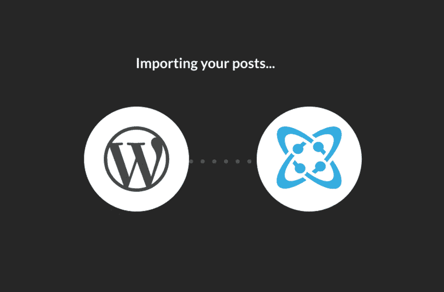

# 从 WordPress 迁移到 Cosmic JS Headless CMS

> 原文：<https://dev.to/carsoncgibbons/migrating-from-wordpress-to-the-cosmic-js-headless-cms-2fid>

在这一期的 [Cosmic JS 开发者聚焦系列](https://cosmicjs.com/community)中，我们采访了居住在北卡罗莱纳州夏洛特市的经验丰富的软件开发人员 [Jamie Introcaso](https://cosmicjs.com/jintrocaso) 。Jamie 是 [Cosmic JS 社区](https://cosmicjs.com/community)的活跃成员，最近分享了一篇[博客](https://cosmicjs.com/articles/moving-from-wordpress-to-limitless-opportunity-using-cosmic-js-jx2ei3kz)，记录了他使用 [WordPress 导入程序扩展](https://cosmicjs.com/extensions/wordpress-importer)从 WordPress 迁移到 Cosmic JS 的过程。随着更多社区项目的进行，我们很高兴为本期聚焦采访我们自己的一位成员。😎在杰米的 [Cosmic-powered 网站](https://www.jamieintrocaso.com)、 [Twitter](https://twitter.com/JLIntro) 和 [LinkedIn](https://www.linkedin.com/in/jamieintrocaso/) 上查看杰米，享受对话。

你第一次开始开发软件是什么时候？
**杰米:**高中毕业后，我做了将近 15 年的现场录音师和调酒师，然后决定重返校园，完成我的学士学位。在我做音响工程师的时候，我注意到技术和软件的使用增加了很多。我从小就被技术所吸引，所以这种热情加上行业中的就业增长使得获得计算机科学学位成为一个容易的选择。我是 2014 年毕业的，从那以后一直在专业领域工作。这是非常有益的。每天我都在学习一些东西，或者更好地教别人一些东西来解决问题。

**您首选的开发堆栈是什么？**
我大部分时间都在 C#/中工作。NET 堆栈的各种形式，如 WebForms 和 MVC，这是我觉得最舒服的。我开始尝试拓展更多的领域，学习更多的前端框架。这很好，因为我仍然可以熟悉。NET，并使用新的前端框架提高我的技能。

过去有哪些项目是你最引以为豪的，为什么？
我要说我最引以为豪的项目是一个 MES(制造执行系统)，是我和另外两个开发人员一起做的。这是我第一次从头开始领导和设计一个项目，有好有坏，令人兴奋和害怕。幸运的是，我有一个伟大的团队支持我。当我参观工厂，看到所有这些操作人员使用我开发的软件时，我仍然会惊叹不已。这绝对是一次严峻的考验。我意识到他们不会在我们最初的“上线”期间关闭工厂，这样我就可以修复我的软件了！但我也意识到，我能够胜任这项任务，能够执行一个项目，并在专业水平上实施它。

是什么让你想离开 WordPress，转而使用一个无头的 CMS？
我最初去 WordPress 是为了方便，也许更多的是因为懒惰。创建并运行一个博客实在是太容易了。的确如此。我有一个很好的编辑器来打印我的博客文章，让全世界的人阅读。我可以点击并添加漂亮的主题和插件，据说可以提高我的性能和缓存，基本上是治疗 WordPress 本身引起的症状！简直是疯了！

我试着建立了一个 WordPress 开发环境几次来调整我的网站，这是如此令人沮丧！我可以做一个 UI。我只需要一部分，我可以托管我的内容，并把它交付给我。这就是为什么我开始研究无头 CMS 的想法。对于像我这样精通应用程序编程的人来说，这很有意义。拥有能够将我的内容传递给我并允许我以自己选择的方式实现它的东西的想法是如此的解放。你曾经尝试过将一个 WordPress 站点从一个环境迁移到另一个环境吗？简直让人抓狂！！

对于现在深陷 WordPress 泥潭的开发者，你有什么最好的建议？
问问你自己，在 WordPress 处理事情的方式上，你花了多少开发时间来创造变通方法。你在 WordPress 的更新上花了多少时间？修复损坏的插件？回滚更改并进行数据库更新？想想你可以利用这段时间做什么。在你的网站上投入更多的时间。创建另一个网站。花更多的时间和你的朋友和家人在一起。有更好的方法。你已经拥有了离开 WordPress 所需的所有工具。你很可能知道 HTML、CSS 和 JavaScript。这就是你所需要的。宇宙 JS 拥有[工具，可以在几分钟内将你的帖子](https://cosmicjs.com/extensions/wordpress-importer)迁移到他们的 API 中。

你很想了解哪些技术？
正如我之前提到的，我开始探索学习一些前端框架。主要角度是我一直在努力学习的。在我目前的职位上，我们正在使用它，所以学习它是很好的报酬！我也渴望学习更多的 NodeJS。我用过一点，只是觉得更深入的学习 Javascript 的前端和后端，对我的职业生涯会有用。除此之外，我觉得学习其他有助于可伸缩性和可靠性的技术和概念是我接下来要关注的重点。我认为微服务、容器化、分布式系统和系统设计等知识是我接下来重点学习的概念。

Cosmic JS Spotlight 系列致力于展示使用现代工具构建应用程序的开发人员。在这里了解如何为[做出贡献](https://cosmicjs.com/contribute)。为了与我们保持联系[在 Twitter 上关注我们](https://twitter.com/cosmic_js)和[加入 Slack 上的对话](https://cosmicslack.now.sh)。