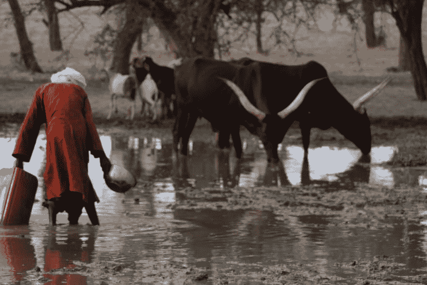

# 第 1 部分:规划非政府组织安曼伊曼的网页重新设计

> 原文：<https://dev.to/jamiekaren/milestone-1-planning-the-charity-s-webpage-re-design-khh>

透明度免责声明:我是一名自学成才的营销人员，已经在一家非营利机构的志愿者岗位上远程工作了大约 4 年。我的全职工作是应收账款。

老实说，我和自己争论过是否要在这里重新发布这篇文章(我最初是在 Medium 上发布的),因为我缺乏经验，而且在我的工作中不存在代码因素。

但是我最近看到**阿里·斯皮特**谈到在 Codelands 期间在这里写博客，现在我觉得又有了写博客的灵感。

虽然我目前正在 Rutgers 大学参加全栈 web 开发的编码训练营，但是在写这篇博文的时候，我还没有编码经验。你可以在这个帖子里读到这些:

 [## 我加入了一个编码训练营(原因如下)

### 杰米费鲁吉亚罗 4 月 24 日 197 分钟阅读

#beginners #career #codenewbie #webdev](/jamiekaren/i-joined-a-coding-bootcamp-and-here-s-why-ede)

* * *

我兼职志愿担任非营利组织安曼·伊曼 的志愿数字营销经理，这是一个在西非阿扎瓦克山谷(横跨尼日尔和马里两国的偏远农村地区)工作的非政府组织。

***安曼伊曼**通过 WASH 方案(水、环境卫生、个人卫生)、粮食安全、经济安全和妇女赋权方案，支持因气候变化而严重缺水的儿童和家庭。*

我在美国新泽西远程工作，主要与位于马里兰州的副总监 Debbie Khan 和位于法国的创始人 Ariane Kirtley 互动。

# 项目:【水是教育】井-井

这个项目对安曼伊曼来说是一件非常重要的事情，从很多方面来说，甚至超过了我被允许在这篇博客中写的内容(出于安全和其他原因)。我可以告诉你的是，我们将建造一个钻井，这是 AI 作为非营利组织的核心项目。

用过于简单的术语来说，把一口地下井想象成真正的太阳能动力机械井。这口钻井将为多达 40，000 只动物和人类提供清洁、可持续的水源。T3】

我只想说，这很糟糕。

这个项目在预算、资金、后勤和伙伴关系等诸多变量之间艰难诞生。当我们确定*是的，这将会发生*的时候，我也加入了，这对于市场营销来说已经太晚了。

我们筹款的主要目标受众是学校，通过我们开展的一个名为[爱的源泉](https://ammanimman.org/wells-of-love/)的项目。特别是，它侧重于高中以下的年龄，以及一些大学年龄的学生。正因为如此，当我们联系学校为我们的项目开展筹款活动时，时间框架通常是在特定的学年内。

当我们在一月份开始头脑风暴我们的营销策略时，我们知道这个项目的总成本将远远超过 30 万美元。到这篇博文发表的时候，它已经是 34 万欧元或者 385 美元了。

🙀没有压力，对吧？

# 我们的目标:网站设计和 UX 大修

经过一番讨论，我建议我们最好的行动方案应该是重新设计他们当前在网站上的项目页面，使它们更容易阅读、导航，并鼓励更多的行动号召。

### 为什么要重新设计？

这是人们将在网上看到的关于项目信息的第一个位置，不管我们与潜在的学校合作伙伴进行了什么样的面对面互动，所以它应该是一个高度优先的位置。

我的第一个目标是评估当前的页面设置。在这个阶段，网站上的当前版本包括两个单独的页面。一个关于该项目的信息页面和一个我们用于 CRM 和筹款的平台 Salsa 的注册页面。

## 安曼伊曼的主页

我采取的第一步是评估访问者在主页上找到项目信息的难易程度。

**我看到的一些东西是:**

*   我们有多清楚这一页通向哪里？
*   页面链接和/或 CTA 位置的可见性如何？
*   用户能多快找到这些项目？

该项目在页面的前 50%没有立即被提及，所以我建议我们改变当前的主滑块来描述它，使它成为访问者看到的第一件事。

我们实际的 web 开发是由 Carolina Web Design 公司通过 Wordpress 完成的，所以我们的 Web 开发人员立即实现了新的变化，而我继续评估其余的页面。

## 项目信息页面

接下来，我建议我们将 WIE 项目的信息分成两页。

1.  项目信息页面——我们的信息页面，访问者可以在此了解项目，并选择创建筹款活动或捐赠。
2.  Salsa 注册页面——关于注册开始筹款活动的步骤的指导页面。我将为这个系列写第二篇文章，描述这个页面的变化。

以下是原始项目信息页面的截图:

[看原始页面设计](https://thepracticaldev.s3.amazonaws.com/i/yr5vhhosk0n09l7v4zqf.jpg)

## 下面是我对导演那次评价后的一些想法:

问题 1:页面上的副本太多，很快就会失去访问者的兴趣。

解决方案:我将副本修改为一个更短的形式，仍然允许所有必要的和重要的信息在页面上可用。这是后来进一步编辑和导演和创始人批准。

**问题 2:图形和照片的使用方式与文案相似，增加了页面的拥挤感。**

*解决方案:页面的照片和图形应该仅限于那些补充主题和打破页面的副本。*

问题 3:行动号召没有战略性地放在页面上，以鼓励访问者采取我们希望他们采取的行为。

*解决方案:在页面中添加 CTA 以增加我们注册页面的流量，以及其他各种补充行动。*

* * *

这就是本系列第一篇文章的全部内容！下一篇文章，我将进入我的网页和最终结果的新想法模型。

这个帖子，正如我所说，最初是作为一个帖子在 Medium 上分享的。但老实说，它真的很长，所以我决定把它分成一系列的帖子。