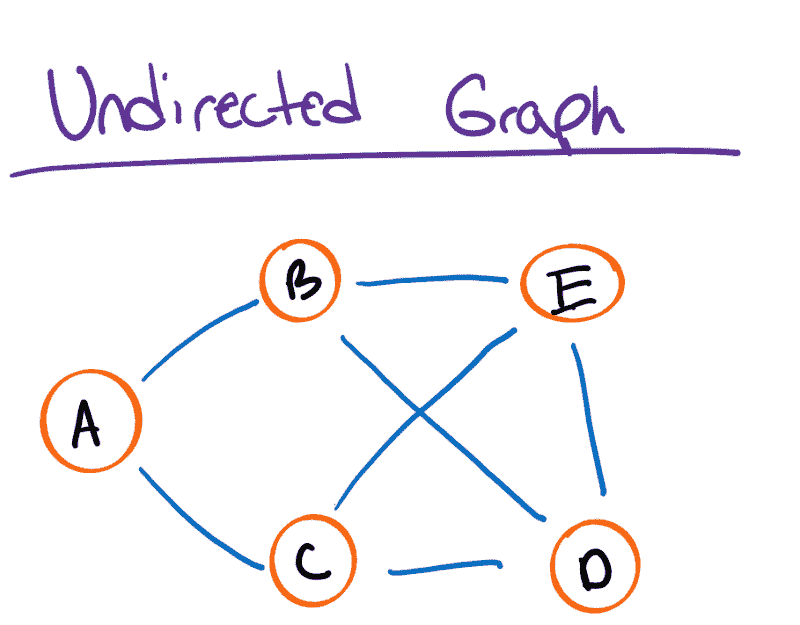
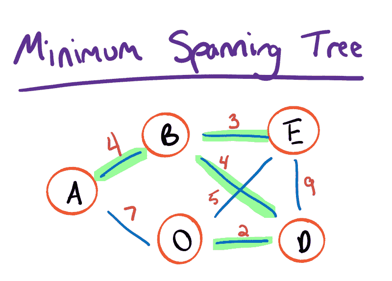
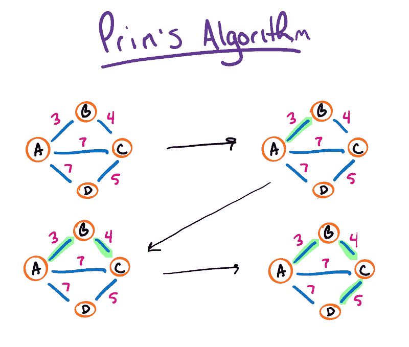
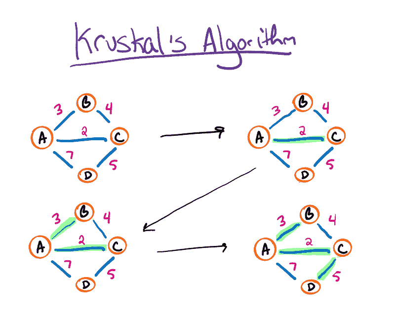

# 最小生成树算法

> 原文：<https://dev.to/renegadecoder94/minimum-spanning-tree-algorithms-3154>

离我的资格考试只有 10 天了，我决定离开课本，重新开始写作。毕竟，如果我能解释这些概念，我应该能通过测试，对吗？嗯，今天我有兴趣讲述我的算法课程中的一个概念:最小生成树。

## 最小生成树概述

在我们谈论最小生成树之前，我们需要谈论一下**图**。特别是无向图，即其边没有特定方向的图。换句话说，它是一个边在两个方向上连接两个节点的图:

如果我们要以一种特殊的方式遍历一个无向图，我们可以构造一棵称为生成树的树。更具体地说，**生成树**是一个图的子集，它包含所有没有任何圈的顶点。作为附加标准，生成树必须覆盖最少数量的边:

然而，如果我们要给我们的无向图添加边权重，为最小边数优化我们的树可能不会给我们一个最小生成树。特别地，**最小生成树**是一个无向加权图的子集，它包含所有没有任何圈的顶点。同样，生成的树必须具有尽可能最小的总边成本:

最后一点:最小生成树可能不是唯一的。换句话说，对于一个给定的图，可能有多个最小生成树。例如，如果 edge 的成本为 4，我们可以选择 ED 或 BD 来完成我们的树。

说完这些，让我们来谈谈本文接下来的内容。特别是，我们将看看两种构造最小生成树的算法:Prim 的和 Kruskal 的。

## 最小生成树算法

如前所述，本文的目标是研究两种主要的最小生成树算法。这两种算法都采用贪婪的方法来处理最小生成树问题，但它们的处理方式略有不同。

### 普里姆算法

构建最小生成树的一种方法是选择一个起始节点，并不断向树中添加最便宜的相邻边(避免循环),直到每个节点都已连接。本质上，这正是 **Prim 的算法**的工作方式。

在这个例子中，我们从一个开始，不断扩展我们的树，直到我们连接了所有的节点。在这种情况下，我们先选择 AB，然后选择 BC，最后选择 CD。最后，我们得到一棵最小生成树，代价是 12。

当然，我们可以总是从任何其他节点开始，以相同的树结束。例如，我们可以从 D 开始，这将在另一个方向上构造树(DC -> CB -> BA)。

可以想象，这是一个非常简单的贪婪算法，它总是构造一个最小生成树。当然，需要做一些决策来避免产生循环。也就是说，只要新边不连接当前树中的两个节点，就不会有任何问题。

### 克鲁斯卡尔算法

构建最小生成树的另一种方法是在所有可用边中不断选择最小的可用边，以避免循环，直到每个节点都已连接。自然，这就是克鲁斯卡尔的算法的工作方式。

在本例中，我们首先选择最小的边，在本例中为 AC。为了识别这种联系，我们把 A 和 C 放在一个集合中。然后，我们找到下一个最小的边 AB。在这种情况下，B 不在包含 A 的集合中，所以我们可以安全地添加它。

此时，我们遇到了一个问题。如果我们选择 BC，我们将创建一个循环，因为 B 和 C 已经通过 a 连接。由于 B 和 C 在同一个集合中，我们可以安全地跳过该边。

最后，我们考虑下一个最小的边 CD。由于 D 没有以某种方式连接到 C，我们可以将它添加到包含 A、B 和 C 的集合中。由于我们的集合现在包含所有四个顶点，我们可以停止。

不幸的是，这个例子可能不是最好的，因为如果我们从 A 或 c 开始，Prim 的算法会类似地运行。当然，绘制这些例子需要时间，所以我建议在维基百科上查看一下 [Prim 的](https://en.wikipedia.org/wiki/Prim%27s_algorithm)和 [Kruskal 的](https://en.wikipedia.org/wiki/Kruskal%27s_algorithm)算法。每一页都有一个漂亮的动画来展示不同之处。

就个人而言，我发现这个算法更难掌握，因为我发现避免循环的标准不太明显。也就是说，正如我在各种教科书中看到的那样，解决方案通常依赖于维护代表不同树的节点集合。然后，如果两个节点在不同的树中，该算法只选择这两个节点。否则，在节点之间绘制一条边会形成一个循环。

## 想了解更多？

事实证明，这就是我对最小生成树的全部了解。如果你喜欢这篇文章，并且想看到更多类似的文章，[考虑成为会员](https://www.patreon.com/TheRenegadeCoder)。会员资格让这些文章免费，所以如果你今天从这篇文章中获得了任何价值，想想其他可能也是如此的人。

如果你现在不能支持这个网站，你可以随时[跳到邮件列表](https://newsletter.therenegadecoder.com/)，这样你就可以继续在收件箱里收到最新的文章。

当你在这里的时候，看看下面的一些文章:

*   [使用逻辑时钟的分布式互斥](https://therenegadecoder.com/code/distributed-mutual-exclusion-using-logical-clocks/)
*   [了解 RSA 加密背后的数论](https://therenegadecoder.com/code/understanding-the-number-theory-behind-rsa-encryption/)
*   [语句和表达式的区别](https://therenegadecoder.com/code/the-difference-between-statements-and-expressions/)

嗯，我现在就知道这么多了！谢谢你过来。

帖子[最小生成树算法](https://therenegadecoder.com/code/minimum-spanning-tree-algorithms/)最先出现在[这个叛逆的程序员](https://therenegadecoder.com)上。