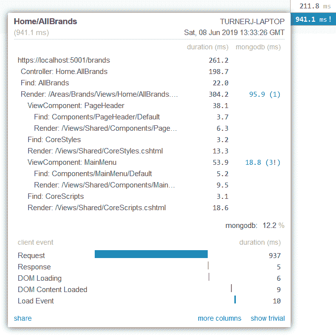
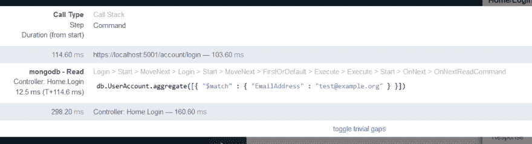

# 微型分析器❤蒙戈 DB

> 原文：<https://dev.to/turnersoftware/miniprofiler-mongodb-4bc1>

如果你熟悉。你可能听说过一个很棒的项目，叫做 [MiniProfiler](https://miniprofiler.com/) ,由 Stack Overflow 的牛逼人士制作。

## [MiniProfiler](https://github.com/MiniProfiler)/[dot net](https://github.com/MiniProfiler/dotnet)

### 一个简单而有效的 ASP.NET(和核心)网站的迷你分析器

<article class="markdown-body entry-content container-lg" itemprop="text">

## 的微型探查器。网(和。网络核心)

欢迎使用 MiniProfiler。NET，ASP.NET，ASP.NET 核心，ASP.NET MVC 和一般所有这些词的组合。的微型事件探查器文档。NET 位于`/docs`，可通过 GitHub 页面访问:[miniprofiler.com/dotnet](https://miniprofiler.com/dotnet/)。可以在 miniprofiler.com 的[找到跨平台微型分析器的一般信息。它是](https://miniprofiler.com/)[的一部分。NET Foundation](https://www.dotnetfoundation.org/) ，并在他们的[行为准则](https://www.dotnetfoundation.org/code-of-conduct)下运作。

 

MiniProfiler 的当前主要版本是 v4。

#### 便捷的链接

*   证明文件
    *   [ASP.NET 入门(*非*)。净核心)](https://miniprofiler.com/dotnet/AspDotNet)
    *   [ASP.NET 核心入门](https://miniprofiler.com/dotnet/AspDotNetCore)
    *   [操作指南简介代码](https://miniprofiler.com/dotnet/HowTo/ProfileCode)
    *   [获取数据包](https://miniprofiler.com/dotnet/NuGet)
    *   [如何从 MiniProfiler V3 升级](https://miniprofiler.com/dotnet/HowTo/UpgradeFromV3)
*   样品
    *   [ASP.NET 岩心样本 App](https://github.com/MiniProfiler/dotnet/tree/main/samples/Samples.AspNetCore3)
    *   [ASP.NET MVC 5 示例应用](https://github.com/MiniProfiler/dotnet/tree/main/samples/Samples.Mvc5)
    *   [控制台应用程序](https://github.com/MiniProfiler/dotnet/tree/main/samples/Samples.Console)

#### 建筑物

若要在 Visual Studio 中生成 MiniProfiler 解决方案，您需要:

*   Visual Studio 2019 16.3+(或。NET Core 3.x SDK)
*   [Web 编译器](https://marketplace.visualstudio.com/items?itemName=MadsKristensen.WebCompiler)扩展
    *   注意:如果通过`build.cmd`或`build.ps1`构建，则不需要扩展…

</article>

[View on GitHub](https://github.com/MiniProfiler/dotnet)

如果您不熟悉，您可能已经从名称中推断出它与分析代码有关——您不会错的！

MiniProfiler 并不是为分析每个方法调用而设计的——但是它是为分析您特别想知道的调用而设计的。这些包括数据库调用、控制器或视图。您可以选择通过 MiniProfiler 的 API 来分析任何其他代码。

有些人喜欢它，有些人讨厌它，但不管怎样，我在我的项目中使用它，我喜欢它。我不喜欢 MongoDB 的 C#驱动程序，所以作为我的一个正在进行的项目，我为 MongoDB C#驱动程序构建了自己的包装器，名为 [MongoFramework](https://github.com/TurnerSoftware/MongoFramework) 。我曾经在这里写过关于这个库的[，所以除了说它使得处理 MongoDB 类似于处理实体框架之外，我就不再赘述了。](https://dev.to/turnersoftware/mongo-what-now-34lg)

然而，MongoFramework 是 MiniProfiler 和 MongoDB 相遇的地方。你看，MiniProfiler 有用于分析 EF6 和 EF Core 的官方包，但实际上并不支持 MongoDB 查询的分析。因为我已经编写了一个官方 MongoDB 驱动程序的包装器，所以我已经可以扩展自己的集成来支持概要分析了。

MongoFramework 使用了一个诊断层，其灵感来源于 MiniProfiler 如何实际连接到 EF 核心。这个诊断层是针对 MongoFramework 的每个连接的，并且作为一个接口，可以很容易地被任何其他诊断工具替换。每次实体读/写以及创建索引时都会调用诊断层。

所以如果你:

*   正在建立一个项目。网
*   通过 MongoFramework 使用 MongoDB 实现持久性
*   正在使用或想要使用微型事件探查器

那么这可能正是你所寻找的！在 [NuGet](https://www.nuget.org/packages/MongoFramework.Profiling.MiniProfiler/) 上查看。

## [Turner software](https://github.com/TurnerSoftware)/[MongoFramework](https://github.com/TurnerSoftware/MongoFramework)

### MongoDB 的类似“实体框架”的接口

<article class="markdown-body entry-content container-lg" itemprop="text">

# MongoFramework

MongoDB 的类似“实体框架”的接口

[T11】](https://www.codacy.com/app/Turnerj/MongoFramework)

## 概观

MongoFramework 试图将实体框架的一些优秀特性引入 MongoDB 的世界。

一些主要功能包括:

*   通过属性为集合、id 和属性进行实体映射
*   通过属性(包括文本和地理空间)进行索引
*   实体变更跟踪
*   变更集支持(允许同时运行多个数据库更新)
*   差异更新(只有*将*更改为要写入的实体)
*   实体桶(将小文档聚集在一起，[提高索引性能](https://www.mongodb.com/blog/post/building-with-patterns-the-bucket-pattern)
*   运行时类型发现(序列化和反序列化，无需指定每个“已知”类型)

MongoFramework 目前构建在官方 MongoDB C#驱动之上。

## 扩展ˌ扩张

这些扩展是增强 MongoFramework 功能的官方包，将它与其他系统和工具集成在一起。

### MongoFramework。剖析。微型剖析器

支持分析数据库读写，将数据推送到[微型分析器](https://github.com/MiniProfiler/dotnet/)。

## 证明文件

### 核心实体映射

实体及其属性的核心映射…

</article>

[View on GitHub](https://github.com/TurnerSoftware/MongoFramework)