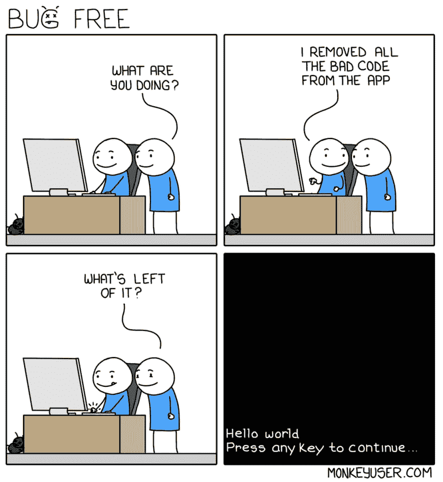

# 缺失的功能不是“错误”

> 原文：<https://dev.to/bryce/missing-features-are-not-bugs-11i7>

> monkey user@ ismonkeyuserBug Free([monkeyuser.com/2019/bug-free](https://t.co/qe9KPrFQY1))2019 年 4 月 30 日上午 06:03

“调试”是当今开发生态系统中经常被误用的术语。它最初是一个动词，当时格蕾丝·赫柏不得不从电脑中取出一只蛾子来修理电脑。但是现在人们用它来描述任何事情，从意想不到的错误到(技术上没有错误的)代码问题。

不要误解我的意思，“有问题的”代码在野外存在。竞争条件、不安全的错误处理、缺乏跨浏览器支持等等。但是区分这样的实现问题和基于不完整特性规范的错误假设是很重要的。称好的代码为“buggy”会让写代码的人觉得他们做得不好。

很难衡量一个规范合适的粒度级别——避开了过多信息和过多假设之间的界限。前者是不实际的，但是后者要求开发者戴上他们的产品帽子，决定事情应该如何工作。如果那个开发者做了错误的假设，那没关系！这不是错误的代码，这只是意味着他们对某件事的解释没有和其他人的一致。

所以下次你做这种“调试”的时候，试着称之为“重新校准”——开发者会感激的！😇